## Overview

The Build Insights QNA System revolutionizes how maritime organizations access and utilize their operational data. Our platform automatically transforms complex vessel data into clear, actionable insights through an intelligent question-answer framework that delivers real-time analytics across your entire fleet.

<Frame caption="Figure 1: A high-level overview of an AI-driven QNA system for maritime applications.">
  
</Frame>

## System Architecture

```mermaid
graph TB
    subgraph "📊 Data Sources"
        A1[Fleet Management<br/>Systems]:::source
        A2[Vessel Operations<br/>Data]:::source
    end
    
    subgraph "🧠 Intelligence Engine"
        B1[QNA Creation<br/>System]:::engine
        B2[Dashboard<br/>Generator]:::engine
    end
    
    subgraph "📱 User Experience"
        C1[Interactive<br/>Dashboards]:::output
        C2[Real-time<br/>Insights]:::output
    end
    
    A1 --> B1
    A2 --> B2
    
    B1 --> C1
    B2 --> C2
    
    classDef source fill:#e3f2fd,stroke:#1976d2,stroke-width:2px
    classDef engine fill:#f3e5f5,stroke:#7b1fa2,stroke-width:2px
    classDef output fill:#e8f5e8,stroke:#388e3c,stroke-width:2px
```



<div className="grid grid-cols-1 md:grid-cols-2 gap-4 mt-6">
  <div className="bg-gray-50 p-4 rounded-xl border">
    <h4 className="text-gray-800 font-semibold mb-2">🔄 Seamless Integration</h4>
    <p className="text-gray-600 text-sm">Connects with existing fleet management systems and data sources</p>
  </div>
  <div className="bg-gray-50 p-4 rounded-xl border">
    <h4 className="text-gray-800 font-semibold mb-2">🤖 Intelligent Automation</h4>
    <p className="text-gray-600 text-sm">Automatically generates insights and dashboards from your data</p>
  </div>
  <div className="bg-gray-50 p-4 rounded-xl border">
    <h4 className="text-gray-800 font-semibold mb-2">☁️ Cloud-Ready</h4>
    <p className="text-gray-600 text-sm">Secure cloud deployment with global accessibility</p>
  </div>
  <div className="bg-gray-50 p-4 rounded-xl border">
    <h4 className="text-gray-800 font-semibold mb-2">🚢 Vessel-Specific</h4>
    <p className="text-gray-600 text-sm">Customized dashboards for each vessel in your fleet</p>
  </div>
</div>

## How It Works

### Step 1: Data Integration & Organization

<div className="bg-gray-50 p-6 rounded-xl mb-6 border">
  <h4 className="text-gray-800 font-semibold mb-3">📝 Smart Data Organization</h4>
  <p className="text-gray-600">Our system automatically organizes your maritime data into structured question-answer formats, creating a foundation for intelligent insights.</p>
</div>

**What Happens:**
- Automatic categorization of vessel data and operational metrics
- Intelligent question structuring based on your business needs
- Hierarchical organization for easy navigation and access

### Step 2: Vessel Intelligence Processing

```mermaid
graph TB
    subgraph "🚢 Fleet Data Processing"
        A1[Active Vessel<br/>Identification]:::process
        A2[Performance<br/>Data Analysis]:::process
        A3[Operational<br/>Metrics Review]:::process
    end
    
    subgraph "📊 Intelligence Creation"
        B1[Custom Dashboard<br/>Generation]:::create
        B2[Real-time<br/>Analytics Setup]:::create
        B3[Interactive<br/>Visualization]:::create
    end
    
    subgraph "🎯 Deployment"
        C1[Cloud<br/>Publishing]:::deploy
        C2[Mobile<br/>Optimization]:::deploy
        C3[Global<br/>Access Setup]:::deploy
    end
    
    A1 --> B1
    A2 --> B2
    A3 --> B3
    
    B1 --> C1
    B2 --> C2
    B3 --> C3
    
    classDef process fill:#e3f2fd,stroke:#1976d2,stroke-width:2px
    classDef create fill:#fff3e0,stroke:#f57c00,stroke-width:2px
    classDef deploy fill:#e8f5e8,stroke:#388e3c,stroke-width:2px
```



### Step 3: Interactive Dashboard Creation

<div className="bg-gray-50 p-6 rounded-xl mb-6 border">
  <h4 className="text-gray-800 font-semibold mb-3">🎨 Professional Dashboard Design</h4>
  <p className="text-gray-600">Each vessel gets a custom, professional dashboard with modern design principles and responsive layouts that work on any device.</p>
</div>

**Dashboard Features:**
- **Modern Design**: Clean, professional interface with intuitive navigation
- **Responsive Layout**: Optimized for desktop, tablet, and mobile devices
- **Real-time Updates**: Live data integration with automatic refresh capabilities
- **Interactive Elements**: Charts, graphs, and data visualizations you can interact with

**Sample Dashboard Structure:**

```html
<!-- Example of clean, professional dashboard layout -->
<div class="dashboard-container">
  <header class="vessel-header">
    <h1>Vessel Performance Dashboard</h1>
    <div class="vessel-info">IMO: [Vessel ID]</div>
  </header>
  
  <main class="analytics-content">
    <section class="key-metrics">
      <!-- Interactive charts and KPIs -->
    </section>
    
    <section class="performance-insights">
      <!-- Real-time analytics and trends -->
    </section>
  </main>
</div>
```

### Step 4: Cloud Deployment & Access

<div className="bg-gray-50 p-6 rounded-xl mb-6 border">
  <h4 className="text-gray-800 font-semibold mb-3">☁️ Global Accessibility</h4>
  <p className="text-gray-600">Your dashboards and insights are securely deployed to the cloud, providing instant access from anywhere in the world with enterprise-grade security.</p>
</div>

**Deployment Benefits:**

<div className="grid grid-cols-1 md:grid-cols-2 gap-4 mb-6">
  <div className="bg-gray-50 p-4 rounded-xl border">
    <h5 className="text-gray-800 font-semibold">🌐 Global Access</h5>
    <ul className="text-gray-600 text-sm mt-2 space-y-1">
      • Access from any device, anywhere
      <li>• Secure web-based interface</li>
      <li>• No software installation required</li>
      <li>• Automatic updates and maintenance</li>
    </ul>
  </div>
  <div className="bg-gray-50 p-4 rounded-xl border">
    <h5 className="text-gray-800 font-semibold">🔒 Enterprise Security</h5>
    <ul className="text-gray-600 text-sm mt-2 space-y-1">
      • Bank-level encryption
      <li>• Secure access controls</li>
      <li>• Regular security updates</li>
      <li>• Compliance with maritime standards</li>
    </ul>
  </div>
</div>

## Key Features & Benefits

### Automated Intelligence Creation

<div className="bg-gray-50 p-4 rounded-xl mb-4 border">
  <h5 className="text-gray-800 font-semibold mb-2">🤖 What Gets Automated:</h5>
  <ul className="text-gray-600 text-sm space-y-1">
    <li>• <strong>Data Processing:</strong> Automatic analysis of vessel performance data</li>
    <li>• <strong>Dashboard Creation:</strong> Custom dashboards generated for each vessel</li>
    <li>• <strong>Insight Generation:</strong> AI-powered analysis and recommendations</li>
    <li>• <strong>Report Updates:</strong> Real-time data refresh and report generation</li>
  </ul>
</div>

### Multi-Vessel Fleet Management

```mermaid
graph LR
    subgraph "🚢 Your Fleet"
        A1[Vessel A<br/>Dashboard]:::vessel
        A2[Vessel B<br/>Dashboard]:::vessel
        A3[Vessel C<br/>Dashboard]:::vessel
        A4[More Vessels...]:::vessel
    end
    
    subgraph "📊 Centralized Insights"
        B1[Fleet Overview<br/>Analytics]:::central
        B2[Performance<br/>Comparisons]:::central
        B3[Operational<br/>Intelligence]:::central
    end
    
    A1 --> B1
    A2 --> B1
    A3 --> B2
    A4 --> B3
    
    classDef vessel fill:#e8eaf6,stroke:#3f51b5,stroke-width:2px
    classDef central fill:#e8f5e8,stroke:#388e3c,stroke-width:2px
```



### Professional User Experience

<div className="grid grid-cols-1 md:grid-cols-3 gap-6">
  <div className="bg-gray-50 p-6 rounded-xl border">
    <h4 className="text-gray-800 font-semibold mb-3">📱 Modern Interface</h4>
    <ul className="text-gray-600 text-sm space-y-2">
      <li>• Clean, intuitive design</li>
      <li>• Mobile-responsive layouts</li>
      <li>• Fast loading times</li>
      <li>• Easy navigation</li>
    </ul>
  </div>
  
  <div className="bg-gray-50 p-6 rounded-xl border">
    <h4 className="text-gray-800 font-semibold mb-3">📊 Rich Analytics</h4>
    <ul className="text-gray-600 text-sm space-y-2">
      <li>• Interactive charts and graphs</li>
      <li>• Real-time data updates</li>
      <li>• Customizable views</li>
      <li>• Export capabilities</li>
    </ul>
  </div>
  
  <div className="bg-gray-50 p-6 rounded-xl border">
    <h4 className="text-gray-800 font-semibold mb-3">🔧 Easy Management</h4>
    <ul className="text-gray-600 text-sm space-y-2">
      <li>• Automated updates</li>
      <li>• Version control</li>
      <li>• Quality assurance</li>
      <li>• 24/7 availability</li>
    </ul>
  </div>
</div>

## Implementation Process

### Phase 1: Setup & Integration
- **Data Source Connection**: Link your existing systems and data sources
- **Initial Configuration**: Set up vessel profiles and data structures
- **Quality Validation**: Ensure data accuracy and completeness

### Phase 2: Dashboard Development
- **Custom Design**: Create vessel-specific dashboards based on your requirements
- **Testing & Validation**: Comprehensive testing to ensure reliability
- **User Acceptance**: Review and approval process with your team

### Phase 3: Deployment & Training
- **Cloud Deployment**: Secure setup on cloud infrastructure
- **User Training**: Comprehensive training for your team
- **Go-Live Support**: Full support during launch and initial operation

## Why Choose Our QNA System?

<div className="grid grid-cols-1 md:grid-cols-2 gap-6">
  <div className="bg-gray-50 p-6 rounded-xl border">
    <h4 className="text-gray-800 font-semibold mb-3">🎯 Business Benefits</h4>
    <ul className="text-gray-600 text-sm space-y-2">
      <li>• Faster decision-making with instant insights</li>
      <li>• Improved operational efficiency</li>
      <li>• Better fleet performance monitoring</li>
      <li>• Reduced manual reporting time</li>
    </ul>
  </div>
  
  <div className="bg-gray-50 p-6 rounded-xl border">
    <h4 className="text-gray-800 font-semibold mb-3">⚡ Technical Advantages</h4>
    <ul className="text-gray-600 text-sm space-y-2">
      <li>• Seamless integration with existing systems</li>
      <li>• Scalable architecture for fleet growth</li>
      <li>• Automated maintenance and updates</li>
      <li>• Enterprise-grade security and compliance</li>
    </ul>
  </div>
</div>

## Sample Use Cases

### Fleet Performance Monitoring
"Get real-time insights into vessel performance across your entire fleet with automated dashboards that highlight key metrics, trends, and areas for improvement."

### Operational Efficiency Analysis
"Identify optimization opportunities through intelligent analysis of operational data, helping you reduce costs and improve efficiency."

### Compliance Tracking
"Stay on top of regulatory requirements with automated compliance monitoring and reporting capabilities."

### Predictive Insights
"Leverage AI-powered analytics to predict maintenance needs, optimize routes, and prevent operational issues before they occur."
