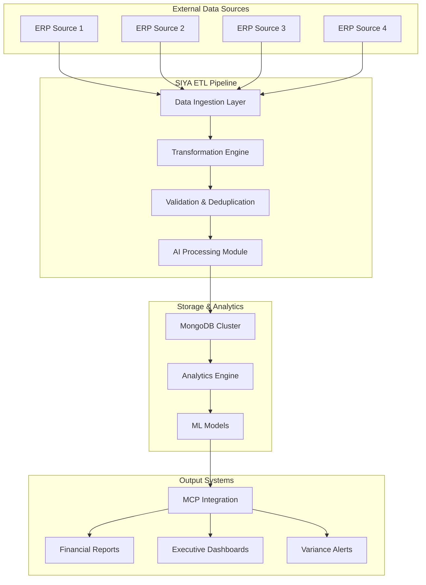

The maritime vessel financial analysis system provides comprehensive budget oversight through:
1. **Multi-dimensional Analysis**: Budget variance, expenditure tracking, and committed cost monitoring
2. **Mathematical Precision**: Accurate calculations with proper temporal adjustments
3. **AI-Enhanced Insights**: Intelligent variance analysis with natural language explanations
4. **Interactive Reporting**: Drill-down capabilities and configurable visualizations
5. **Scalable Architecture**: Production-ready deployment supporting large vessel fleets

## Data sources we use
- **Budget Allocations**: Monthly budget data across expense categories (OPEX, Non-Budget, Dry-Dock, Pre-Delivery)
- **Expense Transactions**: Actual financial transactions with posting dates and account classifications
- **Committed Costs**: Purchase orders and future financial obligations
- **Period Definitions**: Reporting periods and operational day calculations
- **Fund Receipts**: Capital inflows and budget allocations

---

## Financial modules assessed
The system comprises four specialized analysis modules:
- **Budget Variance Analysis**: Core financial variance calculations with fund status tracking
- **Expenditure Overview**: Detailed tabular reporting with interactive drill-down capabilities
- **Committed Cost Analysis**: Purchase order tracking and commitment monitoring
- **AI-Powered Monthly Variance**: Intelligent variance insights with GPT-based explanations

---

## System Architecture

The SIYA financial analytics platform follows a comprehensive ETL architecture that processes data from multiple ERP sources through intelligent transformation and analysis layers:

### Architecture Components

**External Data Sources**
- Multiple ERP systems providing vessel financial data
- Real-time and batch data feeds
- Standardized data formats and APIs

**SIYA ETL Pipeline**
- **Data Ingestion Layer**: Handles multiple data source connections and formats
- **Transformation Engine**: Applies mathematical calculations and business rules
- **Validation & Deduplication**: Ensures data quality and removes duplicates
- **AI Processing Module**: Leverages machine learning for intelligent insights

**Storage & Analytics**
- **MongoDB Cluster**: Scalable document database for financial data
- **Analytics Engine**: Real-time processing and calculation engine
- **ML Models**: AI models for variance prediction and anomaly detection

**Output Systems**
- **MCP Integration**: Model Context Protocol for seamless data access
- **Financial Reports**: Automated report generation and distribution
- **Executive Dashboards**: Interactive visualizations and KPIs
- **Variance Alerts**: Proactive notifications for budget deviations

---

## Mathematical calculations

### Prorata Budget Allocation
For time-sensitive expense categories (CREW WAGES, LUBE OIL CONSUMPTION, MANAGEMENT FEES), the system implements proportional budget allocation:

$$\text{Adjusted Amount} = \frac{\text{Budget Amount}}{\text{Standard Period}} \times \text{Actual Period}$$

Where:
- **Budget Amount**: Original allocated budget for the category
- **Standard Period**: Standard time period (typically 30 days)  
- **Actual Period**: Current elapsed days in the reporting period

### Year-to-Date Budget Normalization
Budget amounts are adjusted for partial reporting periods using two methods:

**Standard YTD Calculation:**
$$\text{Normalized Budget} = \frac{\text{Monthly Budget}}{\bar{d}} \times d_{current}$$

Where $\bar{d} = 30.416667$ (average days per month: $\frac{365}{12}$)

**Period-Based YTD Calculation:**
$$\text{Normalized Budget} = \frac{\text{Monthly Budget}}{\text{Period Days}} \times d_{current}$$

### Variance Analysis
The core variance calculations used across all modules:

**Absolute Variance:**
$$V_{abs} = B - A$$

**Percentage Variance:**
$$V_{\%} = \frac{B - A}{B} \times 100$$

**Committed Cost Variance:**
$$V_{cc} = B - (A + C)$$

$$V_{cc\%} = \frac{B - (A + C)}{B} \times 100$$

Where:
- $B$ = Budget amount
- $A$ = Actual expenses  
- $C$ = Committed costs (future obligations)

### Daily Rate Analysis
For operational efficiency assessment:

$$R_{daily} = \frac{A}{D_{ops}}$$

$$R_{cc} = \frac{A + C}{D_{ops}}$$

$$R_{budget} = \frac{B}{D_{ops} + 1}$$

Where $D_{ops}$ = Number of operational days

### Fund Balance Reconciliation
The system tracks fund status across multiple categories:

$$\text{Balance} = \sum_{i=1}^{n} F_i - \sum_{j=1}^{m} E_j$$

Where:
- $F_i$ = Individual fund receipts
- $E_j$ = Individual expenses

**Surplus/Deficit Classification:**
$$
\text{Status} = \begin{cases}
\text{Surplus} & \text{if Balance} > 0 \\
\text{Deficit} & \text{if Balance} < 0 \\
\text{Balanced} & \text{if Balance} = 0
\end{cases}
$$

---

## AI-Enhanced Analysis

### Fuzzy String Matching
For expense consolidation and duplicate detection:

$$\text{Similarity Score} = \frac{\text{Matching Characters}}{\text{Total Characters}} \times 100$$

### Commitment Percentage Calculation
For committed cost analysis:

$$C_{\%} = \frac{C}{B_{OPEX}} \times 100$$

Where $C$ = Total committed costs and $B_{OPEX}$ = OPEX budget allocation

---

## What is displayed in each module

### Budget Variance Analysis Module
- **YTD Budget vs Actual**: Comparison of year-to-date budget against actual expenses
- **Fund Status**: Surplus/deficit analysis across fund categories
- **Daily Rate Metrics**: Per-day OPEX calculations and budget comparisons
- **Variance Percentages**: Detailed percentage variance analysis

### Expenditure Overview Module
- **Interactive Tables**: Drill-down capabilities with monthly expense breakdowns
- **Category Analysis**: Hierarchical expense categorization and sorting
- **Period Comparisons**: Month-over-month expense tracking
- **Prorata Indicators**: Identification of prorata-calculated expenses

### Committed Cost Analysis Module
- **Purchase Order Tracking**: Detailed PO information with supplier data
- **Temporal Analysis**: Current vs previous month commitment comparison
- **Budget Impact**: Percentage of OPEX budget committed
- **Category Breakdown**: OPEX, Non-Budget, Dry-Dock, and Pre-Delivery commitments

### AI-Powered Monthly Variance Module
- **Intelligent Narratives**: GPT-generated explanations of variance causes
- **Top Expense Analysis**: Automated identification of significant expenses
- **Monthly Summaries**: AI-powered monthly variance explanations
- **Trend Analysis**: Historical variance pattern recognition

---

## Expense categorization
The system uses hierarchical expense grouping:

| Group | Categories | Description |
|:------|:-----------|:------------|
| **OPEX** | CREW WAGES, CREW EXPENSES, VICTUALLING EXPENSES, STORES, SPARES, LUBE OIL CONSUMPTION, REPAIRS & MAINTENANCE, MANAGEMENT FEES, MISCELLANEOUS, ADMINISTRATIVE EXPENSES | Operational expenses |
| **NB** | INSURANCE, NON-BUDGETED EXPENSES, P&I/H&M EXPENSES, VOYAGE/CHARTERERS EXPENSES, CAPITAL EXPENDITURE, EXTRA ORDINARY ITEMS, VESSEL UPGRADING COSTS, LAY-UP COSTS | Non-budgeted items |
| **DD** | DRYDOCKING EXPENSES | Dry-docking specific expenses |
| **PD** | PRE-DELIVERY EXPENSES | Pre-delivery expenses |

---

## Performance indicators and color coding

| Status | Variance Range | Color | Action Required |
|:-------|:---------------|:------|:----------------|
| **Within Budget** | $\pm 5\%$ | Green | Continue monitoring |
| **Attention Required** | $> \pm 5\%$ and $\leq \pm 10\%$ | Yellow | Review and plan checks |
| **Action Required** | $> \pm 10\%$ | Red | Immediate investigation needed |

---

## Interactive features
- **Drill-down Tables**: Click-through capability for detailed expense analysis
- **Period Selection**: Configurable time ranges for trend analysis
- **Category Filtering**: Focus on specific expense categories
- **Export Options**: Multiple format support (CSV, JSON, PDF reports)

---

## AI insights generation
The system leverages OpenAI GPT-4 for intelligent analysis:
- **Variance Explanations**: Natural language explanations of budget deviations
- **Trend Analysis**: Identification of expense patterns and anomalies  
- **Actionable Recommendations**: Specific suggestions for cost management
- **Monthly Summaries**: Automated generation of financial performance summaries

---

## Data quality and validation
- **Prorata Identification**: Automatic flagging of prorata-calculated expenses
- **Duplicate Detection**: Fuzzy matching to identify and consolidate similar expenses
- **Data Completeness**: Validation of required fields and data integrity
- **Period Alignment**: Ensures proper temporal alignment of budget and expense data

---

## Report generation
The system generates comprehensive reports including:
- **Executive Summaries**: High-level financial performance overview
- **Detailed Variance Analysis**: Category-wise budget vs actual comparisons
- **Fund Status Reports**: Multi-dimensional fund balance analysis
- **Committed Cost Summaries**: Future obligation tracking and impact analysis

---

## Example calculation: Budget variance analysis

Consider a vessel with the following monthly data:
- **Budget Amount**: $100,000
- **Actual Expenses**: $115,000  
- **Committed Costs**: $25,000
- **Operational Days**: 30

### Variance Calculations
$$V_{abs} = 100,000 - 115,000 = -15,000 \text{ USD}$$

$$V_{\%} = \frac{100,000 - 115,000}{100,000} \times 100 = -15\%$$

$$V_{cc} = 100,000 - (115,000 + 25,000) = -40,000 \text{ USD}$$

$$R_{daily} = \frac{115,000}{30} = 3,833 \text{ USD/day}$$

**Status**: Red (exceeds ±10% threshold) - Immediate investigation required

---

## Best practices for interpretation
- **Consider Multiple Dimensions**: Analyze budget variance alongside committed costs and fund status
- **Temporal Context**: Review trends over multiple periods rather than single-point analysis  
- **Category-Specific Analysis**: Different expense categories have different variance tolerances
- **Operational Context**: Consider vessel operational status and market conditions
- **Proactive Monitoring**: Use AI insights for early identification of potential issues

---

