## 🧭 System Architecture


---

## 🗂️ Defect Module Categories

The SYIA Defect System handles different modules organized into three main categories:

```mermaid
flowchart TD
    subgraph MAIN ["SYIA Defect Modules"]
        direction TB
        
        subgraph INSP ["🔍 Inspection"]
            direction TB
            I1["VIR<br/>"]
            I1 --> I2["PSC<br/>"]
            I2 --> I3["SIRE<br/>"]
            I3 --> I4["CDI<br/>"]
            I4 --> I5["External Audit<br/>"]
            I5 --> I6["Internal Audit<br/>"]
            I6 --> I7["Terminal<br/>"]
            I7 --> I8["Charterer's Inspection"]
            I8 --> I9["Owner's Inspections"]
            I9 --> I10["SCMM"]
        end
        
        subgraph REP ["📝 Report"]
            direction TB
            R1["HMX<br/>"]
            R1 --> R2["ADI<br/>"]
            R2 --> R3["Near Miss<br/>"]
        end
        
        subgraph OTHER ["📦 Other Defects"]
            direction TB
            O1["Summary<br/>Defect Aggregation"]
            O1 --> O2["CoC<br/>Certificates"]
            O2 --> O3["Excel<br/>Integration"]
        end
    end
    
    class MAIN mainBox
    class INSP inspBox
    class REP repBox
    class OTHER otherBox
    class I1,I2,I3,I4,I5,I6,I7,I8,I9,I10 inspNodes
    class R1,R2,R3 repNodes
    class O1,O2,O3 otherNodes
```



## 🗂️ Symbols & Sets
- $\mathcal{V}$ = set of active vessels, indexed by IMO number.  
- $r$ = defect record.  
- $y = \text{year}(\text{reportedDate})$ = reporting year.  
- $t_0$ = current run date at midnight.  
- $\mathcal{S}_{ignore} = \{\text{"closed"},\text{"inactive"},\text{"draft"},\text{"invalid"},\text{"rejected"},\text{"cancelled"}\}$ = ignored statuses.

## 🔄 Common Processing Logic

### 1. Data Retrieval & Cleaning
- Query MongoDB collections for inspection and report defects.
- Restrict to active vessels ($status = ACTIVE$).
- Normalize keys (case folding, unify field names).
- Parse dates: `reportedDate`, `targetDate`, `closingDate`, nested `findingsTargetDate`, `correctiveAction.targetDate`.
- Lowercase all statuses.
- Replace parse failures (`NaT`) with `None`.
- Standardize nested JSON structures (`findings`, `correctiveAction`).

### 2. Overdue Detection
For any candidate date $d$ with status $s$:

$$
\operatorname{Overdue}(d,s) := (d \neq \text{NaT} \land d < t_0 \land s \notin \mathcal{S}_{ignore} \land s \neq "closed").
$$

Applied at three levels:
- Parent record (`targetDate`).
- Findings (`findingsTargetDate`).
- Corrective Actions (`CA.targetDate`).

### 3. Parent Status Promotion

$$
status \gets
\begin{cases}
\text{"open"}, & \text{if parent = closed and any finding = open} \\
\text{"overdue"}, & \text{if any finding/CA is overdue} \\
status, & \text{otherwise}.
\end{cases}
$$

### 4. Status → Color Mapping
```python
status_colors = {
  "closed": "green",
  "open": "blue",
  "review in progress": "orange",
  "overdue": "red",
  "cancelled": "gray",
  "inactive": "lightgray",
  "rejected": "cyan"
  # ... extended variants handled
}
```

---

## 📊 Aggregations

### Yearly Bar Data
For each year $y$:
- Total defects: $T_y = |\{ r : year(r)=y \}|$
- Open defects: $O_y = |\{ r : year(r)=y \land status \notin \mathcal{S}_{ignore} \}|$

Output series: $\{(y,T_y)\}, \{(y,O_y)\}$.

<Frame caption="Sample Defects Chart">

</Frame>

### Summary Counts
Let $C_s$ = count of rows by status. After filtering ignored:
- $status\_counts = \{ s : C_s \mid s \notin \mathcal{S}_{ignore} \}$
- $Pending = |\{ r : status \notin \mathcal{S}_{ignore} \}|$

<Frame caption="Sample Output Table">

</Frame>

---

## 🧮 Common Output Structures
- **Tabular rows**: `[Report Date, Reference No (link), Status, Description, Target Date, Closing Date, Closing Note, Source]`
- **Charts**: Yearly bar plots (Total vs Open).
- **Summary JSON**: status counts, pending counts, chart data.
- **Lineitems**: nested findings + corrective actions with overdue annotations.

---

## ⚙️ Algorithm
1. Load environment + set $t_0$.
2. Fetch active vessels.
3. Retrieve raw defect data (inspection/report collections).
4. Normalize fields, lowercase status, parse datetimes.
5. Build findings + corrective actions arrays.
6. Apply overdue detection + parent status promotion.
7. Aggregate yearly bars and status counts.
8. Format outputs (tables, charts, summaries).
9. Assign colors with `status_colors`.
10. Upsert into MongoDB component collections.

---

## ✅ Robust Engineering
- **Idempotent upserts** (`update_one(..., upsert=True)`).
- **Consistent normalization**: statuses always lowercase, dates coerced.
- **Error handling**: try/except per vessel; log errors without halting pipeline.
- **Deterministic sort order**: `(reportedDate desc, status_color, targetDate, referenceNo)`.
- **Test mode override** for fixed $t_0$ values.

---

## 📊 Worked Example
Suppose a record has:
- Parent status = `open`, `targetDate=None`.
- One finding with `findingStatus=open`, `findingsTargetDate=t_0-1 day`.

Then:
- $Overdue(findingsTargetDate,open) = True$
- Finding → `overdue`.
- Parent → `overdue`.
- Assigned color = red.

---


