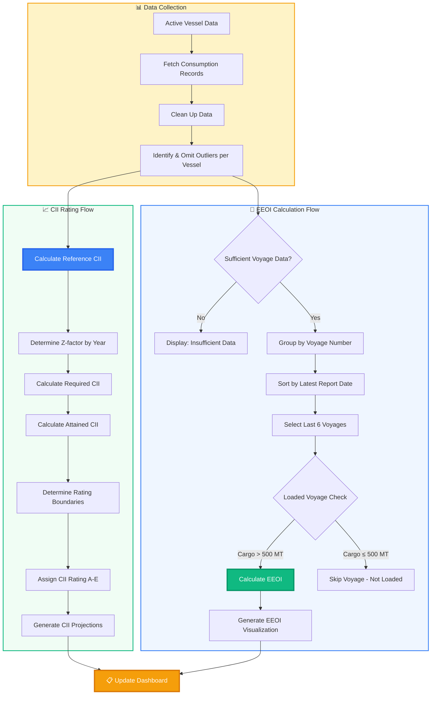

<Frame>
  
</Frame>
export const Alert = ({ type = 'info', children }) => (
  <div style={{
    padding: '1rem',
    borderRadius: '6px',
    marginBottom: '1rem',
    backgroundColor: type === 'warning' ? '#fff3cd' : 
                     type === 'error' ? '#f8d7da' : 
                     type === 'success' ? '#d1edff' : '#e3f2fd',
    borderLeft: `4px solid ${
      type === 'warning' ? '#856404' : 
      type === 'error' ? '#721c24' : 
      type === 'success' ? '#155724' : '#1976d2'
    }`
  }}>
    <strong>{type.toUpperCase()}:</strong> {children}
  </div>
);

export const Callout = ({ type = 'note', title, children }) => {
  const configs = {
    note: { bg: '#e3f2fd', border: '#1976d2', icon: '📝' },
    tip: { bg: '#f3e5f5', border: '#7b1fa2', icon: '💡' },
    warning: { bg: '#fff3e0', border: '#f57c00', icon: '⚠️' },
    success: { bg: '#e8f5e8', border: '#2e7d32', icon: '✅' }
  };
  
  const config = configs[type] || configs.note;
  
  return (
    <div style={{
      backgroundColor: config.bg,
      border: `1px solid ${config.border}`,
      borderLeft: `4px solid ${config.border}`,
      borderRadius: '6px',
      padding: '1rem',
      margin: '1rem 0'
    }}>
      <div style={{ 
        fontWeight: 'bold', 
        marginBottom: '0.5rem',
        display: 'flex',
        alignItems: 'center',
        gap: '0.5rem'
      }}>
        <span>{config.icon}</span>
        {title || type.toUpperCase()}
      </div>
      {children}
    </div>
  );
};

<Callout type="note" title="The Challenge">
Managing vessel efficiency and staying ahead of evolving IMO regulations is a significant operational challenge. This module transforms complex fuel consumption, voyage, and event data into a clear, actionable dashboard, giving you a real-time command center for your fleet's environmental performance.
</Callout>

---

### **How It Works: From Data to Decision**


---

## Module Components

export const ModuleComponents = () => (
  <div style={{
    display: 'flex',
    justifyContent: 'space-between',
    gap: '20px',
    margin: '20px 0'
  }}>
    {[
      {
        title: "EEOI Analysis",
        color: "#3b82f6",
        features: ["Voyage-by-voyage analysis", "Fuel consumption tracking", "Transport work calculation", "Efficiency benchmarking"]
      },
      {
        title: "CII Rating System", 
        color: "#10b981",
        features: ["Real-time CII calculation", "A-E rating classification", "Multi-year projections", "Boundary visualization"]
      }
    ].map((component, index) => (
      <div key={index} style={{
        border: `1px solid ${component.color}`,
        borderRadius: '12px',
        padding: '24px',
        boxShadow: '0 2px 8px rgba(0,0,0,0.1)',
        flex: 1
      }}>
        <h3 style={{
          color: component.color,
          marginBottom: '12px',
          marginTop: '2px',
          fontSize: '1.3rem'
        }}>
          Component {index + 1}: {component.title}
        </h3>
        <div style={{
          borderTop: `1px solid ${component.color}`,
          paddingTop: '16px'
        }}>
          <h4 style={{ marginBottom: '8px', fontSize: '1rem' }}>Key Features:</h4>
          <ul style={{ margin: 0, paddingLeft: '20px' }}>
            {component.features.map((feature, idx) => (
              <li key={idx} style={{ 
                marginBottom: '4px',
                lineHeight: '1.4'
              }}>
                {feature}
              </li>
            ))}
          </ul>
        </div>
      </div>
    ))}
  </div>
);

<ModuleComponents />

---

## Data Sources & Integration

export const DataSourcesCards = () => (
  <div style={{
    display: 'grid',
    gridTemplateColumns: 'repeat(auto-fit, minmax(400px, 1fr))',
    gap: '24px',
    margin: '20px 0'
  }}>
    <div style={{
      border: '1px solid #e2e8f0',
      borderRadius: '12px',
      padding: '24px',
      boxShadow: '0 2px 8px rgba(0,0,0,0.1)'
    }}>
      <h4 style={{ 
        marginBottom: '16px', 
        fontSize: '1.2rem',
        borderBottom: '2px solid #3b82f6',
        paddingBottom: '8px',
        marginTop: '2px'
      }}>
        Primary Data Sources
      </h4>
      <ul style={{ margin: 0, paddingLeft: '20px' }}>
        <li style={{ marginBottom: '12px', lineHeight: '1.5' }}>
          <strong>ERP Systems</strong> - Vessel voyage and operational data
        </li>
        <li style={{ marginBottom: '12px', lineHeight: '1.5' }}>
          <strong>Vessel Consumption Logs</strong> - Fuel consumption by grade and type
        </li>
        <li style={{ marginBottom: '12px', lineHeight: '1.5' }}>
          <strong>Vessel Events Database</strong> - Sea, harbor steaming, anchorage, and port activities
        </li>
        <li style={{ marginBottom: '12px', lineHeight: '1.5' }}>
          <strong>Vessel Particulars</strong> - Technical specifications and deadweight tonnage
        </li>
        <li style={{ marginBottom: '12px', lineHeight: '1.5' }}>
          <strong>IMO DCS Data</strong> - International Maritime Organization Data Collection System
        </li>
      </ul>
    </div>
  </div>
);

<DataSourcesCards />

---

## Core Algorithms & Calculations

This section provides a detailed mathematical and practical breakdown of the key performance indicators used for emissions monitoring, focusing on the core principles behind each calculation.

### EEOI (Energy Efficiency Operational Indicator) Calculation

The EEOI is a crucial metric standardized by the IMO to measure the operational energy efficiency of a vessel. It provides a real-world assessment of a ship's performance by relating CO₂ emissions to the actual "transport work" performed.

**Mathematical Formulation:**

$ \text{EEOI} = \frac{\sum_{i,j} (FC_{ij} \times CF_j)}{m_{\text{cargo}} \times D} $

This formula quantifies the vessel's efficiency by calculating the total CO₂ emissions generated from all fuel types during a specific voyage and normalizing it by the useful work done. The concept of "transport work" (cargo mass multiplied by distance) is central here, as it ensures that the metric reflects how efficiently a vessel is transporting its cargo. A lower EEOI value signifies higher efficiency, meaning less CO₂ is emitted for every tonne of cargo moved one nautical mile.

**Where:**
-   `i`: Voyage number
-   `j`: Fuel type
-   `FCᵢⱼ`: Mass of fuel of type `j` consumed during voyage `i` (in tonnes)
-   `CFⱼ`: Carbon Factor for fuel type `j`, representing the mass of CO₂ emitted per mass of fuel consumed (t-CO₂/t-Fuel)
-   `m_cargo`: Cargo mass carried during the voyage (in tonnes), representing the payload.
-   `D`: Distance travelled over the ground during the voyage (in nautical miles)

**Code Implementation:**

```python
def calculate_eeoi(df_vessel, mass):
    # Group daily consumption and distance data
    df_grouped = df_vessel.groupby("true_date").agg({
        "Obs distance (NM)": "sum", 
        "Total Consumption HSFO": "sum",
        "Total Consumption ULSFO": "sum", 
        # ... other fuel types
    }).reset_index()
    
    # Calculate cumulative values
    df_grouped['total_distance'] = df_grouped['Obs distance (NM)'].cumsum()
    
    # Apply fuel-specific CO2 conversion factors
    df_grouped['cum_total_CO2_emission'] = (
        df_grouped['cum_HSFO']*3.114 + 
        df_grouped['cum_ULSFO']*3.151 + 
        # ... other factors
    )
    
    # Calculate EEOI, converting emissions to grams
    eeoi = (df_grouped['cum_total_CO2_emission'].iloc[-1] * 1000000 / 
            (df_grouped['total_distance'].iloc[-1] * mass))
    
    return eeoi
```

### CII (Carbon Intensity Indicator) Calculation

The CII is a regulatory framework designed to drive continuous improvement in the operational carbon intensity of vessels. It compares a ship's actual performance against a legally mandated target, resulting in an annual rating from A to E.

**Attained CII Formulation:**

$ \text{CII}_{\text{attained}} = \frac{M}{W \times D} $

This formula calculates the vessel's actual, or "attained," carbon intensity. It represents the real-world CO₂ emissions per unit of transport capacity over a calendar year. Unlike EEOI, which uses actual cargo mass, CII uses the vessel's deadweight tonnage (DWT) as a proxy for its transport capacity, providing a standardized measure across different operational conditions.

**Where:**
-   `M`: Total mass of CO₂ emitted in a calendar year (in grams)
-   `W`: Vessel's deadweight tonnage (DWT), a measure of its maximum carrying capacity.
-   `D`: Total distance travelled in a calendar year (in nautical miles)

**Required CII Formulation:**

$ \text{CII}_{\text{required}} = \left( \frac{100 - Z}{100} \right) \times \text{CII}_{\text{ref}} $

This formula defines the regulatory benchmark that a vessel must meet. It establishes an annual carbon intensity target by applying a reduction factor, `Z`, to a reference CII value. The Z-factor increases over time, meaning the `Required CII` becomes progressively stricter each year, compelling owners to continuously improve their vessel's operational efficiency to maintain compliance.

**Where:**
-   `Z`: The annual reduction factor (as a percentage), mandated by the IMO to drive decarbonization.
-   `CII_ref`: The reference CII value, established for a specific vessel type and size based on historical data.

**CII Rating Boundaries:**

The final A-E rating is not based on a single pass/fail threshold but on a graded scale defined by four performance boundaries. These boundaries are calculated as specific percentages of the `Required CII`, creating five distinct performance levels.

-   **Superior Boundary (A/B):** `d₁ = ((100 - C₁) / 100) × CII_required`
-   **Lower Boundary (B/C):** `d₂ = ((100 - C₂) / 100) × CII_required`
-   **Upper Boundary (C/D):** `d₃ = ((100 - C₃) / 100) × CII_required`
-   **Inferior Boundary (D/E):** `d₄ = ((100 - C₄) / 100) × CII_required`

The `Cₙ` values are specific, pre-defined percentage thresholds established by the IMO. Each `Cₙ` value corresponds to a different performance rating level and is used to create the upper and lower bounds for the A, B, C, D, and E ratings. For example, an `Attained CII` that is below the calculated boundary `d₁` achieves the highest rating, 'A'.

**CII Rating Logic:**

The final rating is determined by comparing the `Attained CII` to these four calculated boundaries.

```python
def calculate_cii_rating(cii_attained, superior_boundary, lower_boundary, 
                        upper_boundary, inferior_boundary):
    if cii_attained <= superior_boundary:
        return 'A'
    elif cii_attained <= lower_boundary:
        return 'B'
    elif cii_attained <= upper_boundary:
        return 'C'
    elif cii_attained <= inferior_boundary:
        return 'D'
    else:
        return 'E'
```

---

## Dashboard Features & Interactions

### EEOI Dashboard Features
- **Voyage Selection Filter:** Last 6 completed voyages
- **Interactive Bar Charts:** EEOI values per voyage
- **Export Functionality:** Data export for further analysis

<Frame caption="Calculated EEOI for Vessel's Voyages">
  
</Frame>

### CII Rating Dashboard Features  
- **Year-to-Date Tracking:** Live Current year performance monitoring
- **Multi-year Projections:** 2024-2027 rating forecasts
- **Boundary Visualization:** Performance thresholds display
- **Comparative Analysis:** Historical rating trends

<Frame caption="Live Year-to-Date CII rating for an active vessel.">
  
</Frame>

<Frame caption="Projected CII ratings for future years based on IMODCS verified data and current performance.">
  
</Frame>

#### Drill-down: Factors Influencing CII
The module allows for a deeper analysis of the specific factors from a vessel's profile that are impacting its CII rating. This helps in identifying key areas for operational improvement.

<Frame caption="Detailed breakdown of vessel profile components and their effect on the overall CII score.">
  
</Frame>

## Data Quality & Limitations

<Callout type="warning" title=" ">
  ### Data Quality Assurance
  - **Automated validation** of consumption log entries
  - **Cross-reference checks** between ERP systems
  - **Outlier detection** for unrealistic consumption values
  - **Completeness verification** before calculation processing

  ### Known Limitations
  - **Data dependency** on accurate ERP system reporting
  - **Historical data gaps** may affect trend analysis accuracy
</Callout>

---
