<video
  controls
  autoPlay
  muted
  loop
  playsInline
  className="w-full aspect-video rounded-xl"
  src="/assets/ETA_Live_Dashboard.mp4"
></video>

export const Callout = ({ type = 'note', title, children }) => {
  const configs = {
    note: { bg: '#e3f2fd', border: '#1976d2', icon: '📝' },
    tip: { bg: '#f3e5f5', border: '#7b1fa2', icon: '💡' },
    warning: { bg: '#fff3e0', border: '#f57c00', icon: '⚠️' },
    success: { bg: '#e8f5e8', border: '#2e7d32', icon: '✅' }
  };
  
  const config = configs[type] || configs.note;
  
  return (
    <div style={{
      backgroundColor: config.bg,
      border: `1px solid ${config.border}`,
      borderLeft: `4px solid ${config.border}`,
      borderRadius: '6px',
      padding: '1rem',
      margin: '1rem 0'
    }}>
      <div style={{ 
        fontWeight: 'bold', 
        marginBottom: '0.5rem',
        display: 'flex',
        alignItems: 'center',
        gap: '0.5rem'
      }}>
        <span>{config.icon}</span>
        {title || type.toUpperCase()}
      </div>
      {children}
    </div>
  );
};

<Callout type="note" title="The Challenge">
Inaccurate ETAs are a primary source of operational friction in the maritime industry, leading to increased costs, scheduling conflicts, and inefficient port operations. This module addresses this by moving beyond simple calculations to a data-driven prediction model that accounts for real-world, dynamic variables.
</Callout>

---

### Data Flow & Processing

The ETA prediction model relies on a robust, four-stage data pipeline to ensure accuracy and reliability, transforming raw inputs into actionable insights.

```mermaid
graph TD
    subgraph DI["🌐 Data Ingestion"]
        A[External APIs] --> B[Navtor Routing API]
        A --> C[Stormglass Weather API]
        B --> D[Route Data]
        C --> E[Weather Data]
        D --> F[Raw Data Storage]
        E --> F
    end
    
    F --> G[Email Monitoring]
    
    subgraph DP["📧 Data Processing"]
        G --> H[Noon Report Parsing]
        H --> I[Data Extraction]
        I --> J[Standardization & Enrichment]
        J --> K[Time-Based Validation]
        K --> L[Cleaned Dataset]
    end
    
    L --> M{Sufficient Data?}
    
    subgraph EC["⏱️ ETA Calculation"]
        M -->|Yes| N[Speed-Distance Model]
        M -->|No| O[Display: Insufficient Data]
        N --> P[Live ETA Calculation]
        P --> Q[Geolocation Processing]
        Q --> R[Voyage Status Creation]
        R --> S[Final Dashboard Payload]
    end
    
    S --> T[📊 Update Dashboard]
    O --> T
    
    style N fill:#3b82f6,color:#fff,stroke:#2563eb,stroke-width:3px
    style P fill:#10b981,color:#fff,stroke:#059669,stroke-width:3px
    style T fill:#f59e0b,color:#fff,stroke:#d97706,stroke-width:3px
    style DI fill:#fef3c7,stroke:#f59e0b,stroke-width:2px
    style DP fill:#f0fdf4,stroke:#10b981,stroke-width:2px
    style EC fill:#eff6ff,stroke:#3b82f6,stroke-width:2px
```



---

## Core Algorithms & Calculations

The ETA prediction model is built on a comprehensive data pipeline that transforms raw, diverse inputs into a refined, reliable forecast. This process involves five key stages, from initial data collection to the final continuous calculation.

### 1. Data Ingestion: Weather & Route Polling


The process begins by polling external APIs for essential voyage context. The system is designed to periodically query Navtor for detailed routing information and Stormglass for real-time and forecasted weather conditions along the vessel's planned route.

**Algorithm Logic:**
-   Establish secure connections to Navtor and Stormglass APIs.
-   Request route data for a specific vessel and voyage.
-   Request weather parameters (wind speed, wave height, currents) for the specific geographical points along the route.
-   Store the raw, unstructured JSON responses for processing.

### 2. Data Extraction: Email & Noon Report Parsing


A significant portion of operational data arrives in unstructured formats, such as noon report emails. The system uses a sophisticated parsing engine to extract critical information from this text.

**Algorithm Logic:**
-   Monitor a designated inbox for incoming noon report emails.
-   Use regular expressions (regex) and keyword matching to identify and isolate key data points (e.g., "SOG:", "Remaining Dist:", "ETA:").
-   Extract values for vessel speed, remaining distance, fuel consumption, and the reported ETA.
-   Temporarily store this extracted, key-value data for the next stage.

```python
import re

def parse_noon_report_email(email_body):
    # Use regex to find key-value pairs in the email text
    # Note: These are simplified patterns for illustration
    sog_pattern = re.compile(r"SOG:\s*([\d\.]+)\s*knots")
    eta_pattern = re.compile(r"ETA:\s*(\d{4}-\d{2}-\d{2}\s*\d{2}:\d{2})")
    
    sog_match = sog_pattern.search(email_body)
    eta_match = eta_pattern.search(email_body)
    
    extracted_data = {
        "SOG": sog_match.group(1) if sog_match else None,
        "ETA": eta_match.group(1) if eta_match else None,
        # ... other extracted fields
    }
    
    return extracted_data
```

**Alternative Method: GPT-Based Parsing**

For more complex or less structured reports, a Large Language Model (LLM) is be used for more robust and flexible data extraction.

```python
import openai

def parse_with_gpt(email_body):
    # Prepare a prompt that instructs the model to extract key information
    prompt = f"""
    Extract the following entities from this noon report:
    - Speed Over Ground (SOG) in knots
    - Estimated Time of Arrival (ETA) in YYYY-MM-DD HH:MM format
    
    Report: "{email_body}"
    
    Return the result as a JSON object.
    """
    
    # Call the OpenAI API (or any other LLM provider)
    response = openai.Completion.create(
      engine="text-davinci-003",
      prompt=prompt,
      max_tokens=100
    )
    
    # The model's response will be a JSON string that can be parsed
    extracted_data_json = response.choices[0].text
    return json.loads(extracted_data_json)
```

### 3. Data Standardization & Enrichment


Once data is extracted, it must be converted into a standardized, structured format. This stage involves cleaning the data, converting units, and enriching it with information from other sources.

**Code Implementation:**

```python
def standardize_report_data(extracted_data):
    # Convert speed from knots to a standard float
    standardized_speed = float(extracted_data.get("SOG"))
    
    # Standardize date and time formats to UTC
    reported_eta_str = extracted_data.get("ETA")
    standardized_eta = convert_to_utc(reported_eta_str)
    
    # Enrich with data from other sources
    vessel_dwt = get_vessel_particulars(vessel_id)
    
    # Create a clean, structured data object
    structured_report = {
        "speed_knots": standardized_speed,
        "eta_utc": standardized_eta,
        "vessel_dwt": vessel_dwt,
        # ... other fields
    }
    return structured_report
```

### 4. Data Validation: Time-Based Correction


A key source of ETA error stems from the timing of noon report submissions. Reports filed after midday can be incorrectly timestamped to the following day. The system applies a specific logical check to correct this.

**Algorithm Logic:**

The algorithm checks the timestamp of each incoming noon report. If the report's time is after 12:00 PM (noon), but the associated date has been advanced to the next day, the algorithm corrects the date back to the actual day of submission.

**Code Implementation:**

```python
def correct_noon_report_date(report):
    # Check if the report time is post-meridian (after 12:00 PM)
    is_after_noon = report.time > '12:00:00'
    
    # Check if the date has been incorrectly advanced
    date_is_advanced = report.date > actual_submission_date
    
    if is_after_noon and date_is_advanced:
        # Revert the date to the correct day
        report.date = actual_submission_date
        
    return report
```

### 6. Voyage Status & Geolocation Processing


After the primary ETA is calculated, the data is further enriched with voyage status and geolocation information to provide a complete operational picture on the dashboard.

**Geolocation Mapping:**

This function maps the vessel's current location to a standardized geographical region for easier tracking and filtering.

**Code Implementation:**
```python
def map_location(latitude, longitude):
    # This function would contain logic to map coordinates to defined regions
    # Example:
    if 30.0 < latitude < 60.0 and -30.0 < longitude < 0.0:
        return "North Atlantic"
    elif 25.0 < latitude < 45.0 and 35.0 < longitude < 65.0:
        return "Arabian Sea"
    else:
        return "Unknown Region"
```

**Voyage Status Creation:**

The system generates a dynamic, human-readable status for each voyage based on its current operational data.

**Code Implementation:**
```python
def create_voyage_status(voyage_data):
    # This function would create a status string based on vessel activity
    # Example:
    if voyage_data.get('speed_knots') > 1:
        status = f"En route to {voyage_data.get('destination_port')}"
    else:
        status = f"Alongside at {voyage_data.get('current_port')}"
    
    return status
```

**Final Data Processing:**

This function orchestrates the final data processing steps, bringing together all the calculated and enriched data points into a final, dashboard-ready object.

**Code Implementation:**
```python
def process_eta_data(voyage_id):
    # This function would be the main orchestrator for a single voyage
    # 1. Fetch the latest validated report data
    report_data = get_validated_report(voyage_id)
    
    # 2. Calculate the live ETA
    live_eta = calculate_live_eta(report_data)
    
    # 3. Map the location
    geo_location = map_location(report_data.get('lat'), report_data.get('lon'))
    
    # 4. Create a human-readable status
    voyage_status = create_voyage_status(report_data)
    
    # 5. Assemble the final data object for the dashboard
    dashboard_payload = {
        "voyage_id": voyage_id,
        "live_eta_utc": live_eta,
        "location_region": geo_location,
        "current_status": voyage_status,
        "last_updated": get_current_utc_time()
    }
    
    return dashboard_payload
```


