## System Architecture & Data Flow

## Laboratory Integration Network

Our module integrates with six leading marine fuel testing laboratories through different data channels:

| Laboratory | Integration Method | Data Format | Processing Type |
|------------|-------------------|-------------|-----------------|
| **Viswa Labs** | API Integration | JSON | Real-time API calls |
| **Tribocare** | API Integration | JSON | Real-time API calls |
| **FOBAS** | API Integration | JSON | Real-time API calls |
| **VPS Marine** | Snowflake Database | Structured Data | Database queries |
| **Bureau Veritas (BV)** | Email Attachments | XML + Report | XML file extraction |
| **Maritec** | Email Attachments | XML + Report | XML file extraction |

## Process Workflow: Step-by-Step Implementation

### Phase 1: Data Acquisition & Integration

**Objective**: Establish comprehensive fuel oil data collection from multiple laboratory sources using different integration methods

#### Step 1: API-Based Data Collection

**The Challenge**: Traditional batch processing approaches failed to handle the dynamic nature of laboratory data updates, leading to data inconsistencies and processing gaps.

**Our Revolutionary Solution**: We engineered an intelligent cyclic data synchronization system that maintains perfect data integrity across all API-based laboratories.

```mermaid
flowchart TD
    A[Initial API Request<br/>Historical Date Range] --> B[Data Processing<br/>& Validation]
    B --> C[Database Storage<br/>with Timestamps]
    C --> D[Query Latest Date<br/>from Database]
    D --> E[Calculate New Range<br/>Latest Date → Current]
    E --> F[API Request<br/>Incremental Data]
    F --> G[Process New Data<br/>& Validate]
    G --> H[Update Database<br/>with New Records]
    H --> I{More Data<br/>Available?}
    I -->|Yes| D
    I -->|No| J[Cycle Complete<br/>Await Next Run]
    J --> D
    
    classDef processNode fill:#e8f5e8,stroke:#2e7d32,stroke-width:2px,color:#000
    classDef decisionNode fill:#fff3e0,stroke:#f57c00,stroke-width:2px,color:#000
    classDef dataNode fill:#e3f2fd,stroke:#1565c0,stroke-width:2px,color:#000
    
    class A,F processNode
    class B,G processNode
    class C,H dataNode
    class D,E processNode
    class I decisionNode
    class J processNode
```

**Key Innovation**: This cyclic approach ensures zero data loss while optimizing API calls and maintaining real-time synchronization across all laboratory sources.

#### Step 2: Snowflake Database Integration

**Implementation**: VPS Marine Data Extraction

**Snowflake Integration Features**:
- **Direct Database Connection**: Secure connection to VPS Snowflake instance
- **Scheduled Queries**: Automated data retrieval at regular intervals
- **Data Warehouse Access**: Access to historical and real-time VPS fuel analysis data
- **Query Optimization**: Efficient data extraction with minimal resource usage

#### Step 3: Email-Based Data Processing with XML Extraction

**Implementation**: BV and Maritec Laboratory Data

**Email Processing Workflow**:
- **Email Monitoring**: Continuous monitoring of designated email accounts
- **Attachment Identification**: Automatic detection of emails with attachments
- **Dual File Processing**: 
  - **XML File**: Contains structured data for extraction
  - **Report File**: Actual laboratory report for reference
- **XML Data Extraction**: Automated parsing of XML files to extract fuel analysis data
- **Data Validation**: Verification of extracted data against laboratory standards

### Phase 2: Data Processing & Standardization

**Objective**: Process and standardize data from multiple sources into unified format

#### Step 4: Multi-Source Data Processing

<h4 style={{
  fontSize: '18px',
  fontWeight: 'bold',
  marginBottom: '16px',
  color: '#FFD700',
  display: 'flex',
  alignItems: 'center',
  gap: '8px'
}}>
⚡ API Data Processing
</h4>

JSON parsing for real-time API data with advanced features:

<ul style={{listStyle: 'none', padding: '0'}}>
<li style={{
  padding: '8px 0',
  borderBottom: '1px solid rgba(255,255,255,0.1)',
  display: 'flex',
  alignItems: 'center',
  gap: '8px'
}}>
✓
<strong>Dynamic Page Detection:</strong> Automatically reads total page count from API responses (Tribocare)
</li>
<li style={{
  padding: '8px 0',
  borderBottom: '1px solid rgba(255,255,255,0.1)',
  display: 'flex',
  alignItems: 'center',
  gap: '8px'
}}>
✓
<strong>Comprehensive Iteration:</strong> Systematically processes every page without data loss
</li>
<li style={{
  padding: '8px 0',
  borderBottom: '1px solid rgba(255,255,255,0.1)',
  display: 'flex',
  alignItems: 'center',
  gap: '8px'
}}>
✓
<strong>Memory-Efficient Accumulation:</strong> Optimally manages large datasets during collection
</li>
<li style={{
  padding: '8px 0',
  borderBottom: '1px solid rgba(255,255,255,0.1)',
  display: 'flex',
  alignItems: 'center',
  gap: '8px'
}}>
✓
<strong>Intelligent Job Discovery:</strong> Automatically identifies all relevant job IDs within specified date ranges (FOBAS)
</li>
<li style={{
  padding: '8px 0',
  borderBottom: '1px solid rgba(255,255,255,0.1)',
  display: 'flex',
  alignItems: 'center',
  gap: '8px'
}}>
✓
<strong>Automatic Token Refresh:</strong> Seamlessly handles token expiration with zero data loss
</li>
<li style={{
  padding: '8px 0',
  borderBottom: '1px solid rgba(255,255,255,0.1)',
  display: 'flex',
  alignItems: 'center',
  gap: '8px'
}}>
✓
<strong>Retry Logic:</strong> Implements exponential backoff for maximum reliability
</li>
<li style={{
  padding: '8px 0',
  display: 'flex',
  alignItems: 'center',
  gap: '8px'
}}>
✓
<strong>Parallel Processing:</strong> Optimizes throughput while respecting API rate limits
</li>
</ul>

<h4 style={{
  fontSize: '18px',
  fontWeight: 'bold',
  marginBottom: '16px',
  color: '#87CEEB',
  display: 'flex',
  alignItems: 'center',
  gap: '8px'
}}>
❄️ Snowflake Connector
</h4>

Direct database connectivity for VPS data with enterprise-grade features:

<ul style={{listStyle: 'none', padding: '0'}}>
<li style={{
  padding: '8px 0',
  borderBottom: '1px solid rgba(255,255,255,0.1)',
  display: 'flex',
  alignItems: 'center',
  gap: '8px'
}}>
✓
<strong>High-Performance Queries:</strong> Optimized SQL execution
</li>
<li style={{
  padding: '8px 0',
  borderBottom: '1px solid rgba(255,255,255,0.1)',
  display: 'flex',
  alignItems: 'center',
  gap: '8px'
}}>
✓
<strong>Secure Connections:</strong> Enterprise-level security protocols
</li>
<li style={{
  padding: '8px 0',
  borderBottom: '1px solid rgba(255,255,255,0.1)',
  display: 'flex',
  alignItems: 'center',
  gap: '8px'
}}>
✓
<strong>Automated Scheduling:</strong> Time-based data extraction
</li>
<li style={{
  padding: '8px 0',
  display: 'flex',
  alignItems: 'center',
  gap: '8px'
}}>
✓
<strong>Data Warehouse Integration:</strong> Seamless historical data access
</li>
</ul>

<h4 style={{
  fontSize: '18px',
  fontWeight: 'bold',
  marginBottom: '16px',
  color: '#FFB6C1',
  display: 'flex',
  alignItems: 'center',
  gap: '8px'
}}>
📧 Email Parser
</h4>

IMAP/POP3 protocols for email attachment processing:

<ul style={{listStyle: 'none', padding: '0'}}>
<li style={{
  padding: '8px 0',
  borderBottom: '1px solid rgba(255,255,255,0.1)',
  display: 'flex',
  alignItems: 'center',
  gap: '8px'
}}>
✓
<strong>Real-time Monitoring:</strong> Continuous email surveillance
</li>
<li style={{
  padding: '8px 0',
  borderBottom: '1px solid rgba(255,255,255,0.1)',
  display: 'flex',
  alignItems: 'center',
  gap: '8px'
}}>
✓
<strong>Smart Filtering:</strong> Intelligent attachment detection
</li>
<li style={{
  padding: '8px 0',
  borderBottom: '1px solid rgba(255,255,255,0.1)',
  display: 'flex',
  alignItems: 'center',
  gap: '8px'
}}>
✓
<strong>Multi-account Support:</strong> Simultaneous email monitoring
</li>
<li style={{
  padding: '8px 0',
  display: 'flex',
  alignItems: 'center',
  gap: '8px'
}}>
✓
<strong>Secure Processing:</strong> Encrypted email handling
</li>
</ul>

<h4 style={{
  fontSize: '18px',
  fontWeight: 'bold',
  marginBottom: '16px',
  color: '#98FB98',
  display: 'flex',
  alignItems: 'center',
  gap: '8px'
}}>
📄 XML Parser
</h4>

Advanced XML processing for BV and Maritec data:

<ul style={{listStyle: 'none', padding: '0'}}>
<li style={{
  padding: '8px 0',
  borderBottom: '1px solid rgba(255,255,255,0.1)',
  display: 'flex',
  alignItems: 'center',
  gap: '8px'
}}>
✓
<strong>Schema Validation:</strong> XML structure verification
</li>
<li style={{
  padding: '8px 0',
  borderBottom: '1px solid rgba(255,255,255,0.1)',
  display: 'flex',
  alignItems: 'center',
  gap: '8px'
}}>
✓
<strong>Data Extraction:</strong> Intelligent content parsing
</li>
<li style={{
  padding: '8px 0',
  borderBottom: '1px solid rgba(255,255,255,0.1)',
  display: 'flex',
  alignItems: 'center',
  gap: '8px'
}}>
✓
<strong>Error Handling:</strong> Robust exception management
</li>
<li style={{
  padding: '8px 0',
  display: 'flex',
  alignItems: 'center',
  gap: '8px'
}}>
✓
<strong>Format Standardization:</strong> Unified data output
</li>
</ul>

#### Step 5: Data Validation & Quality Assurance

**Validation Framework**:
- **Schema Validation**: Ensuring data conforms to expected structure
- **Data Type Verification**: Confirming correct data types for all fields
- **Range Checking**: Validating fuel parameters are within acceptable ranges
- **Duplicate Detection**: Identifying and handling duplicate test results
- **Missing Data Handling**: Managing incomplete or missing data points

**Fuel Classification Algorithm**: Advanced fuel classification system that handles all edge cases and data variations with mathematical precision:

$$\text{Fuel Classification Algorithm} = f(\text{BDN Sulfur}, \text{Lab Sulfur})$$

**Classification Logic**:

$$
\text{Fuel Type} =
\begin{cases}
\text{ULSFO/LSMGO} & \text{if } S_{\text{effective}} \leq 0.1\% \\
\text{VLSFO} & \text{if } 0.1\% < S_{\text{effective}} \leq 0.5\% \\
\text{HSFO} & \text{if } 0.5\% < S_{\text{effective}} < 3.6\% \\
\text{Cannot\ be\ calculated} & \text{if } S_{\text{effective}} = \varnothing \\
\text{Unknown} & \text{if } S_{\text{effective}} \geq 3.6\%
\end{cases}
$$

Where:

$$
S_{\text{effective}} =
\begin{cases}
\text{BDN Sulfur} & \text{if available} \\
\text{Lab Sulfur} & \text{otherwise}
\end{cases}
$$

#### Step 6: Data Transformation & Standardization

**Transformation Process**:
- **Unit Standardization**: Converting all measurements to standard units
- **Field Mapping**: Mapping laboratory-specific fields to unified schema
- **Data Enrichment**: Adding metadata and processing timestamps

### Phase 3: Database Storage & Management

**Objective**: Efficiently store processed data in MongoDB with proper indexing and organization

#### Step 7: MongoDB Storage Architecture

**Storage Features**:
- **Indexing Strategy**: Optimized indexes for fast query performance
- **Data Partitioning**: Efficient data organization by vessel and date
- **Backup & Recovery**: Automated backup and disaster recovery procedures

#### Step 8: Data Repository Management

**Repository Features**:
- **Version Control**: Tracking data changes and updates
- **Audit Trail**: Complete logging of all data processing activities
- **Data Lineage**: Tracing data from source to final storage

### Phase 4: Advanced Analytics & Risk Assessment

**Objective**: Implement sophisticated fuel analysis algorithms for risk assessment and compliance monitoring

#### Step 9: CatFine (Aluminium + Silicon) Risk Categorization System

**Implementation Strategy**: Our advanced CatFine analysis system extracts concentration data from the latest bunkering operations and applies multi-tier risk assessment protocols.

**Primary Safety Threshold**: A critical threshold of **15 mg/kg** is implemented as the primary safety benchmark:

$$
\text{Primary Risk Assessment} =
\begin{cases}
\text{Safe Level} & \text{if } \text{CatFine} \leq 15 \ \text{mg/kg} \\
\text{Risky Level} & \text{if } \text{CatFine} > 15 \ \text{mg/kg}
\end{cases}
$$

**Enhanced Multi-Tier Risk Classification**: Our system implements three sophisticated risk bands for comprehensive vessel safety management:

$$
\text{Advanced Risk Categorization} =
\begin{cases}
\text{Safe Level} & \text{if } \text{CatFine} \leq 15 \ \text{mg/kg} \\
\text{Moderately Elevated} & \text{if } 15 < \text{CatFine} \leq 25 \ \text{mg/kg} \\
\text{Elevated Risk} & \text{if } 25 < \text{CatFine} \leq 35 \ \text{mg/kg} \\
\text{Dangerously High} & \text{if } \text{CatFine} > 35 \ \text{mg/kg}
\end{cases}
$$

**Risk Level Descriptions**:
- **Safe Level (≤ 15 mg/kg)**: Vessel operates within optimal safety parameters
- **Moderately Elevated (15-25 mg/kg)**: Minimal risk profile with recommended monitoring protocols
- **Elevated Risk (25-35 mg/kg)**: Requires close monitoring and enhanced fuel treatment procedures  
- **Dangerously High (> 35 mg/kg)**: Critical status requiring immediate intervention and emergency protocols

#### Step 10: Sulfur Compliance Verification System

**Compliance Algorithm**: Our intelligent compliance system performs real-time comparison between laboratory-tested sulfur values and Bunker Delivery Note (BDN) specifications for each vessel in the fleet.

$$
\text{Sulfur Compliance Status} =
\begin{cases}
\text{Compliant} & \text{if } S_{\text{tested}} \leq S_{\text{BDN}} \\
\text{Non-Compliant} & \text{if } S_{\text{tested}} > S_{\text{BDN}} \\
\text{Not Applicable} & \text{if } S_{\text{tested}} = \varnothing \ \text{or } S_{\text{BDN}} = \varnothing
\end{cases}
$$

**Fleet-Level Compliance Assessment**: The system generates comprehensive fleet-wide compliance reports:
- **Individual Vessel Analysis**: Detailed compliance status for each vessel
- **Non-Compliant Vessel Identification**: Automatic flagging and listing of vessels exceeding BDN limits
- **Fleet Compliance Summary**: Overall fleet status with full compliance verification

#### Step 11: Advanced Visualization & Interactive Analytics

**Dual-Plot Visualization System**: Our module generates two sophisticated interactive plots using Plotly for comprehensive fuel analysis visualization:

**CatFine Risk Visualization**:
<Frame caption="CatFine Level in Fuel Oil - as per the Latest Bunker Report of Fleet 1">

</Frame>

**Sulfur Compliance Visualization**:
<Frame caption="Sulfur Content in Fuel Oil - as per the Latest Bunker Report of Fleet 1">

</Frame>

**Visualization Features**:
- **Interactive Interface**: Real-time data exploration with zoom and filter capabilities
- **Multi-Parameter Display**: Simultaneous visualization of BDN and tested values
- **Compliance Indicators**: Visual compliance status with color-coded vertical lines
- **Threshold Markers**: Clear safety threshold indicators for immediate risk assessment
