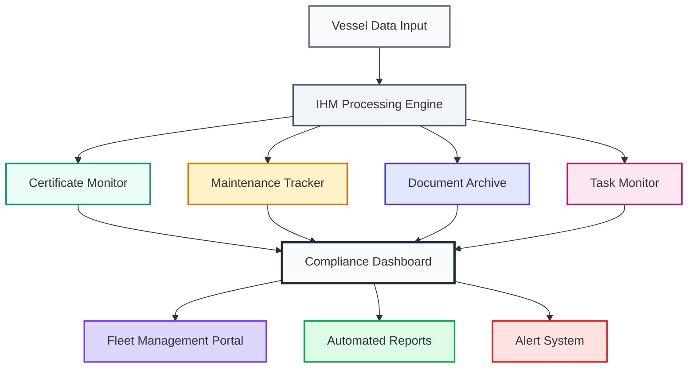
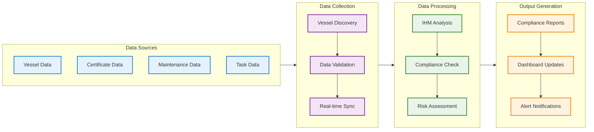
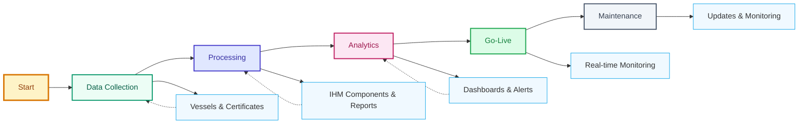

## Maritime Compliance & Risk Management System

The Advanced IHM Management Platform represents a comprehensive digital solution designed to ensure complete regulatory compliance for maritime vessels regarding hazardous materials inventory management.

---


### IHM Regulatory Framework

The **Inventory of Hazardous Materials (IHM)** is a systematically maintained register that catalogs, classifies, and documents all potentially hazardous substances aboard maritime vessels. This critical compliance instrument serves as the cornerstone of international maritime environmental protection protocols.

#### Strategic Objectives

- **Environmental Stewardship** - Advanced marine ecosystem protection protocols
- **International Compliance** - IMO Convention adherence & MARPOL Annex V compliance
- **Occupational Safety Excellence** - Comprehensive crew protection frameworks
- **Global Standardization** - Harmonized international maritime safety protocols
- **Risk Mitigation** - Proactive hazard identification and management systems
- **Scientific Documentation** - Evidence-based material classification and tracking

---

## System Architecture


The IHM Management System operates through four integrated modules that provide comprehensive coverage of all compliance requirements:

1. **Certificate Status Monitor** - Real-time compliance tracking
2. **Maintenance Procedures** - Technical documentation management
3. **Document Archive** - Revision control and audit trail
4. **Task Monitor** - Outstanding requirements tracking

### System Workflow



---

## Module Specifications

### Module 1: Certificate Status Monitor

**Primary Function**: Real-time certificate compliance tracking and validation

The Certificate Status Monitor provides continuous surveillance of all IHM-related certificates across the fleet, ensuring proactive management of compliance requirements.

**Key Features**:
- Certificate status validation (Compliant, Due, Overdue)
- Automated expiry date tracking
- Proactive renewal alert system
- Fleet-wide compliance dashboard

**Technical Implementation**:
```python
def process_certificate_status(certificate_details):
    """
    Process IHM certificate status and generate intelligent alerts
    Real-time analysis of certificate compliance status
    """
    for certificate in certificate_details:
        status = certificate.get("statusForAnswer", "No Data")
        days_to_expiry = certificate.get("dueFromNow", "N/A")
        
        if status == "Overdue":
            return "CRITICAL: Certificate overdue - Immediate action required"
        elif status == "Due":
            return f"ALERT: Certificate expires in {days_to_expiry} days"
        else:
            return "STATUS: Certificate compliant and in order"
```

### Module 2: Maintenance Procedures

**Primary Function**: Technical documentation and procedure management

This module provides centralized access to all IHM maintenance documentation, procedures, and expert technical support resources.

**Key Features**:
- Digital maintenance manual repository
- Direct access to technical documentation
- Expert team coordination
- Biannual review scheduling

**Technical Implementation**:
```python
def extract_maintenance_procedures(maintenance_manual):
    """
    Extract and organize IHM maintenance documentation
    Generate secure access links for technical procedures
    """
    procedures = []
    
    for entry in maintenance_manual:
        pdf_urls = entry.get('pdfUrl', [])
        
        for pdf in pdf_urls:
            procedures.append({
                'fileName': pdf.get('fileName', 'IHM_MAINTENANCE.pdf'),
                'url': pdf.get('url'),
                'type': 'maintenance_procedure',
                'status': 'Available',
                'access_level': 'authorized_personnel'
            })
    
    return procedures
```

### Module 3: Document Archive

**Primary Function**: Comprehensive document lifecycle management

The Document Archive maintains complete revision control and audit trails for all IHM-related documentation, ensuring regulatory compliance and historical tracking.

**Key Features**:
- Initial manual tracking
- Revision history management
- Issue date documentation
- Secure download link generation

**Technical Implementation**:
```python
def track_document_revisions(ihm_records):
    """
    Track IHM document lifecycle and revision history
    Maintain complete audit trail for regulatory compliance
    """
    revision_history = []
    
    for record in ihm_records:
        revision_entry = {
            'type': 'IHM Part 1 Manual',
            'revision_number': record.get('revNo', 0),
            'issue_date': format_date(record.get('initialManualIssueDate')),
            'revision_date': format_date(record.get('revisionDate')),
            'download_url': record.get('fileUrl'),
            'status': 'Active' if record.get('fileUrl') else 'Pending',
            'compliance': 'Verified'
        }
        revision_history.append(revision_entry)
    
    return sorted(revision_history, key=lambda x: x['revision_number'])
```

### Module 4: Task Monitor

**Primary Function**: Outstanding task management and prioritization

The Task Monitor provides comprehensive tracking of all outstanding IHM-related tasks, with intelligent prioritization and automated workflow management.

**Key Features**:
- PO validation tracking
- Urgent task identification
- Task completion metrics
- Portal integration status

**Technical Implementation**:
```python
def monitor_outstanding_tasks(po_tasks):
    """
    Monitor and prioritize outstanding IHM validation tasks
    Real-time task management with intelligent prioritization
    """
    pending_tasks = []
    
    for task in po_tasks:
        task_info = {
            'pr_number': task.get('prNo'),
            'po_number': task.get('poNo'),
            'quantity': task.get('quantity'),
            'status': {'status': 'Pending', 'color': 'red', 'priority': 'high'},
            'po_date': format_date(task.get('poDate')),
            'urgency': 'Immediate' if task.get('quantity', 0) > 5 else 'Standard'
        }
        pending_tasks.append(task_info)
    
    return {
        'total_pending': len(pending_tasks),
        'tasks': pending_tasks,
        'priority': 'Critical' if len(pending_tasks) > 0 else 'Clear',
        'action_required': len(pending_tasks) > 0
    }
```

---

## Platform Benefits

### Compliance Assurance
- **100% Regulatory Compliance**: Automated tracking ensures no certificates expire unnoticed
- **Proactive Alert System**: Advanced warning system for upcoming renewals
- **Complete Audit Trail**: Comprehensive documentation history for regulatory inspections

### Operational Efficiency
- **Centralized Management**: Single platform for all IHM-related activities
- **Automated Workflows**: Reduced manual intervention and human error
- **Real-time Updates**: Instant status updates across the fleet

### Strategic Intelligence
- **Fleet-wide Analytics**: Comprehensive overview of compliance status
- **Trend Analysis**: Historical data for predictive maintenance planning
- **Performance Metrics**: KPIs for continuous improvement

---

## Implementation Process


### Phase 1: Data Collection
```python
def initialize_data_collection():
    """Real-time vessel data synchronization"""
    vessel_data = fetch_active_vessels()
    ihm_certificates = fetch_ihm_data(vessel_data)
    
    validated_data = validate_vessel_data(vessel_data)
    return validated_data, ihm_certificates
```

### Phase 2: Processing Pipeline
```python
def execute_processing_pipeline():
    """High-performance data processing with intelligent analysis"""
    processed_data = process_ihm_components(ihm_certificates)
    compliance_status = generate_compliance_reports(processed_data)
    
    insights = generate_predictive_insights(compliance_status)
    return processed_data, compliance_status, insights
```

### Phase 3: Reporting & Analytics
```python
def generate_executive_reports():
    """Interactive dashboards with real-time updates"""
    dashboard_components = create_interactive_tables(compliance_status)
    fleet_summary = generate_fleet_overview(dashboard_components)
    
    send_compliance_alerts(fleet_summary)
    return dashboard_components, fleet_summary
```

### Implementation Process Flowchart




---


### Security Framework
- **Encrypted Connections**: Secure data transmission protocols
- **Access Control**: Role-based permission management
- **Audit Logging**: Complete activity tracking and monitoring
- **Backup Systems**: Redundant data protection mechanisms

---

## Support & Maintenance

### Technical Support
- **24/7 Availability**: Round-the-clock technical assistance
- **Expert Team**: Specialized maritime compliance specialists
- **Comprehensive Documentation**: User guides and technical references


### System Updates
- **Regular Updates**: Continuous feature enhancements
- **Regulatory Compliance**: Automatic updates for new regulations
- **Issue Resolution**: Rapid response to technical issues
- **Performance Optimization**: Ongoing system improvements

---

## Getting Started

### Quick Start Guide

1. **System Access**: Secure authentication and role-based permissions
2. **Fleet Configuration**: Intelligent vessel discovery and setup
3. **Data Integration**: Seamless connection to existing maritime systems
4. **Training**: Interactive tutorials and certification programs
5. **Go Live**: Real-time fleet monitoring and compliance tracking


```

=
