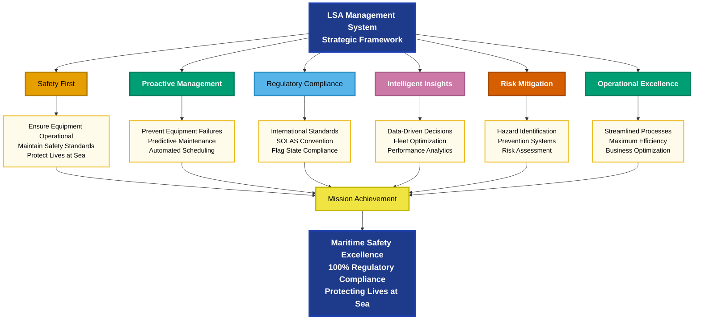
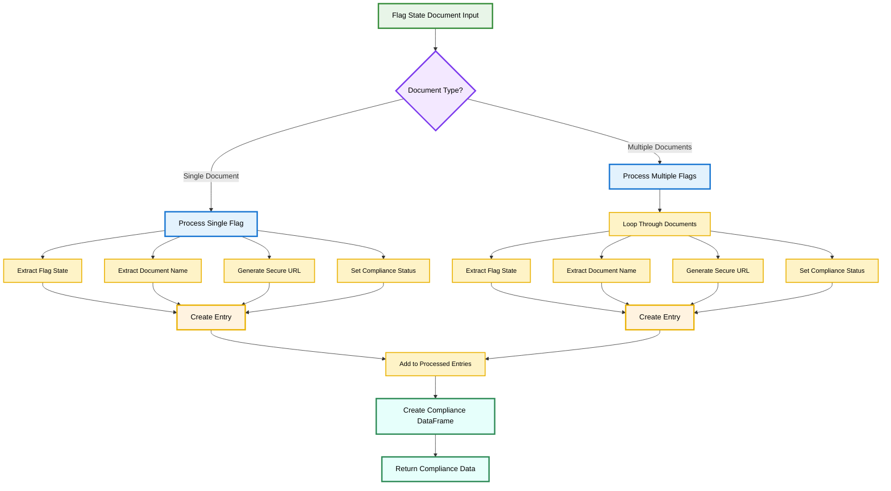
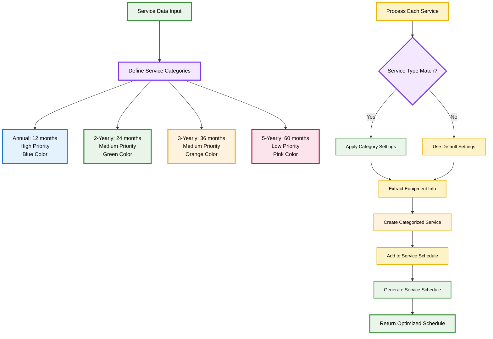
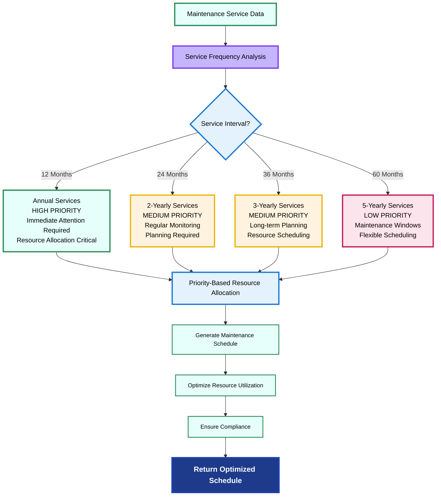

## Maritime Safety Compliance & Risk Management Platform

The Advanced LSA Management System represents a comprehensive digital solution designed to ensure complete regulatory compliance for maritime vessels regarding Life Saving Appliances and Fire Fighting Appliances. This enterprise-grade system transforms complex maritime safety requirements into streamlined, automated processes that protect lives at sea.

---

### Strategic Maritime Safety Framework

The **Life Saving Appliances (LSA) Management System** serves as a comprehensive platform that monitors, manages, and maintains all life-saving and fire-fighting equipment aboard maritime vessels. This critical safety system forms the foundation of international maritime safety protocols and regulatory compliance.

#### Strategic Objectives & Core Mission

---

## System Architecture & Core Tasks

### Task 1: Certificate Status Monitoring

**Primary Function**: Real-time tracking of LSA/FFA certificate status with predictive alerts

The Certificate Status Monitoring system provides intelligent service status calculation based on days until next service due, enabling proactive maintenance planning and regulatory compliance.

#### Mathematical Status Calculation Formula

The system implements a mathematical function that determines equipment status based on days until due. Here's the LaTeX representation:

**Status(d) =**

| Condition | Status |
|-----------|---------|
| d > 0 | OVERDUE |
| -10 ≤ d ≤ 0 | DUE_10 |
| -30 ≤ d < -10 | DUE_30 |
| -60 ≤ d < -30 | DUE_60 |
| -90 ≤ d < -60 | DUE_90 |
| d < -90 | IN_ORDER |

Where:

- $d$ = Days until due (negative values indicate days remaining, positive values indicate overdue)
- $\text{Status}(d)$ = The calculated status for equipment with $d$ days until due

**Color Mapping Function:**

**Color(d) =**

| Condition | Color |
|-----------|-------|
| d > 0 | Red |
| -90 ≤ d ≤ 0 | Orange |
| d < -90 | Green |

This mathematical framework ensures consistent, automated status determination across all equipment in the LSA management system.

#### Key Capabilities

- **Predictive Alert System**: Advanced warning system for upcoming services
- **Color-Coded Status**: Visual indicators for immediate recognition
- **Priority-Based Messaging**: Contextual alerts based on urgency
- **Equipment Lifecycle Tracking**: Complete service history management
- **Automated Compliance Monitoring**: Real-time regulatory adherence checking

---

### Task 2: Flag State Compliance Management

**Primary Function**: Automated flag-specific LSA/FFA requirement tracking with document management

The Flag State Compliance system manages vessel-specific regulatory requirements based on flag state regulations, providing automated document access and compliance verification.

#### Key Features

- **Multi-Flag Support**: Comprehensive coverage of global flag states
- **Automated Document Management**: Secure access to regulatory circulars
- **Real-Time Updates**: Automatic regulatory change notifications
- **Embedded Document Viewer**: Direct access to compliance documentation
- **Compliance Verification**: Automated checking against flag requirements

---

### Task 3: Comprehensive Service History Tracking

**Primary Function**: Complete equipment lifecycle management with predictive analytics

The Service History Tracking system maintains detailed records of all LSA equipment services, enabling predictive maintenance and cost optimization.

#### Service Categorization Process Flow

#### Advanced Capabilities

- **Predictive Maintenance**: AI-driven service scheduling optimization
- **Cost Analysis**: Budget planning and expense forecasting
- **Performance Trending**: Equipment reliability analysis
- **Resource Planning**: Maintenance crew and parts optimization
- **Compliance Reporting**: Automated regulatory documentation

---

## Technical Specifications

### Status Classification Matrix

| Status         | Color Code | Days Until Due | Priority  | Action Required              |
| -------------- | ---------- | -------------- | --------- | ---------------------------- |
| Overdue        | Red        | > 0            | Critical  | Immediate action required    |
| Due in 10 days | Orange     | -10 to 0       | Immediate | Schedule service immediately |
| Due in 30 days | Orange     | -30 to -10     | Urgent    | Plan service scheduling      |
| Due in 60 days | Orange     | -60 to -30     | Plan      | Monitor and prepare          |
| Due in 90 days | Orange     | -90 to -60     | Monitor   | Long-term planning           |
| In Order       | Green      | < -90          | Compliant | No action required           |
| No Data        | Black      | N/A            | Unknown   | Data verification needed     |
| Data Error     | Violet     | Invalid        | Critical  | Data correction required     |

---

## Advanced Features

### Interactive Dashboard Capabilities

The system provides comprehensive interactive dashboards with:

- **Real-time Equipment Status**: Live monitoring of all LSA/FFA equipment
- **Predictive Analytics**: AI-driven maintenance forecasting
- **Compliance Tracking**: Automated regulatory adherence monitoring
- **Cost Optimization**: Budget planning and expense analysis
- **Performance Metrics**: Equipment reliability and efficiency tracking
- **Mobile Accessibility**: Full functionality across all devices

---

### Regulatory Compliance

The LSA Management System maintains compliance with:

- **SOLAS Convention** - Safety of Life at Sea requirements
- **MLC Convention** - Maritime Labour Convention standards
- **ISM Code** - International Safety Management requirements
- **Flag State Regulations** - Country-specific compliance requirements
- **Classification Society Rules** - Marine standards and certifications
- **Port State Control** - International inspection requirements

---

### 24/7 Technical Support

- **Expert Assistance**: Round-the-clock support from maritime safety specialists
- **Emergency Response**: Immediate support for critical safety issues
- **Remote Diagnostics**: Advanced troubleshooting and system optimization
- **Regular Maintenance**: Proactive system monitoring and updates

---

### Quick Start Guide

1. **System Configuration**: Vessel registry and equipment inventory setup
2. **Data Integration**: Connection with existing maritime systems
3. **User Training**: Comprehensive education on system capabilities
4. **Go-Live Activation**: Real-time monitoring across fleet operations
5. **Continuous Optimization**: Ongoing enhancement and feature development

---

