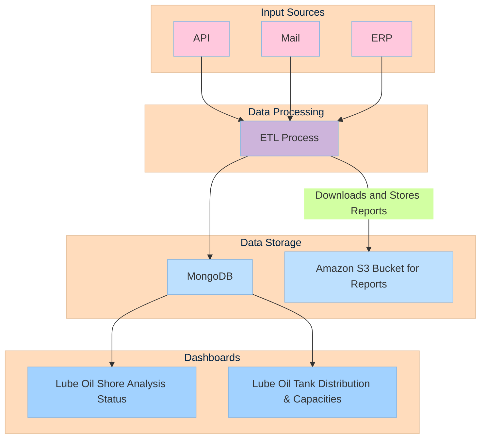
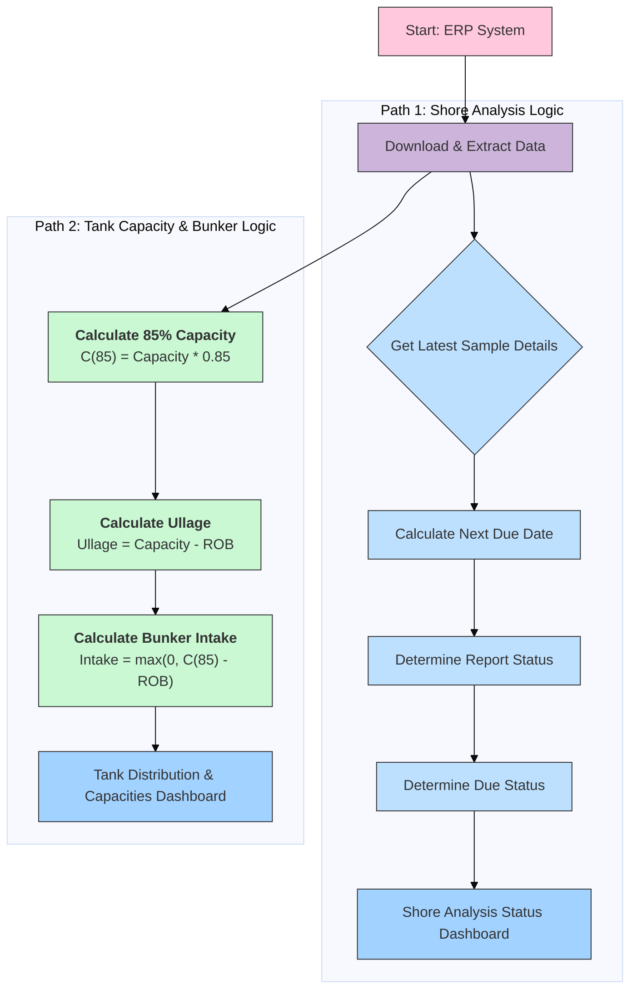

<Frame caption="">

</Frame>

## 1. Lube Oil Overview

This module provides a comprehensive, high-level overview of the entire lube oil analysis process, covering the **Lube Oil Shore Analysis status of all machineries and the Lube Oil Tank Distribution and Capacity.** These dashboards are specifically designed to keep track of lube oil quality and inventory, enabling proactive maintenance and optimizing bunker operations.

The lube oil dashboard gives users the ability to **follow up on when to submit the next samples for each piece of machinery, check the status of the last submitted samples,** and access all corresponding reports.

The flowchart below illustrates the data pipeline, showing how data is ingested from various sources, processed, stored, and ultimately presented in the dashboards.

---

## 2. Data Sources

The Lube Oil Management Module integrates data from multiple sources to provide a single, unified view:

*   **Database**: Contains all vessel information and the overall lube oil dataset.
*   **Laboratory Results**: Lube oil analysis reports are sourced directly from Castrol, Chevron, Gulf, Shell, and other certified labs.
*   **Consumption Log API**: Provides real-time consumption and Remaining on Board (ROB) data.
*   **S3 Storage**: Securely stores all downloaded lube oil reports for easy access.

### Automated Report Processing

A key feature of our platform is its ability to intelligently process PDF lab reports received via email or API, eliminating the need for manual data entry.

<Frame caption="Lube Oil Sample Report.">

</Frame>
 

Our system uses the following automated process:

*   **Intelligent Document Recognition**: It automatically identifies and reads incoming lab reports. If a single report contains results for multiple machineries, it is intelligently split machinery-wise before the next step.
*   **Automated Data Extraction**: It extracts the required data with the given structure of necessary data from the PDF such as machinery name, IMO, sample number, vessel name, report status, report date, and sample details.
*   **Data Storage and Archiving**: Finally, the extracted data will be saved to the database, and the report is being uploaded to S3 machinery-wise for easy access.

---

## 3. Features & Logic

The flowchart below details the core data processing logic. After data is extracted, parallel workflows are executed to generate the final dashboard outputs.

---

### Explanation of the Logic

The process begins by **downloading and extracting data** from all incoming reports from the ERP system. From there, the logic splits into two parallel paths:

#### Path 1: Shore Analysis Logic
This path focuses on determining the health of the machinery based on the latest lab reports.

1.  **Initial Data Processing**: The system begins by processing all available lube oil analysis data for the vessel. This data is grouped by `machineryName` to consolidate all reports for each specific piece of machinery.

2.  **Isolate Latest Report**: For each machinery group, the system identifies the most recent lab report based on the `sampleDate`. This ensures the dashboard always displays the most current status.

3.  **Core Calculations for Each Machinery**: For every latest report, the system performs a series of calculations to determine its status:
    *   **Next Due Date**: It establishes the deadline for the next sample by adding a predefined frequency (e.g., 90 days for 3 months, 180 days for 6 months) to the `sampleDate` of the current report.
    *   **Report Status Categorization**: The status provided in the lab report is categorized for immediate visual assessment on the dashboard.
    *   **Due Status Calculation**: Using the `Next Due Date`, a time-sensitive status is calculated to guide user action.

| Condition | Status |
| :--- | :--- |
| If `Next Due` is **more than 30 days** away | IN ORDER |
| If `Next Due` is **within 30 days** | DUE |
| If `Next Due` has **already passed** | OVERDUE |

---

#### Path 2: Tank Capacity & Bunker Logic
This path focuses on inventory management and provides actionable recommendations for bunkering, using data from the vessel's consumption logs.

1.  **Initial Data Processing**: The system begins by processing the latest consumption log data for the vessel. This log contains a detailed list of all lube oil tanks, their total `capacity`, and their `currentRob` (Remaining on Board).

2.  **Core Calculations for Each Tank**: For every individual tank, the system performs a series of calculations to assess its current state and needs:
    *   **Optimal Capacity ($C_{85}$)**: The target stock level is calculated as 85% of the tank's total capacity.
        $$
        C_{85} = C_{\text{total}} \times 0.85
        $$
    *   **Ullage**: The current available space in the tank.
        $$
        \text{Ullage} = C_{\text{total}} - R_{\text{current}}
        $$
    *   **Bunker Intake ($B_{85}$)**: The precise amount of oil to bunker to reach the 85% target.
        $$
        B_{85} = \max(0, C_{85} - R_{\text{current}})
        $$

3.  **Aggregation by Lube Oil Grade**: While per-tank data is useful for on-board management, purchasing decisions are made by oil grade. The system therefore aggregates the `Bunker Intake` values for all tanks of the same grade (e.g., all 'AECC' tanks) to provide a total required quantity for each type of oil.

4.  **Multi-Level Dashboard Output**: The final, processed data is presented in multiple ways to serve different needs:
    *   **A visual bar chart** showing the `currentRob` vs. `capacity` for each individual tank.
    *   **A summary table** showing the total recommended `Bunker Intake` for each lube oil grade, perfect for procurement.
    *   **A detailed data table** with a full breakdown of all metrics for every tank.
---

## 4. Key Takeaways

This module turns complex data into confident decisions, empowering you to:

*   **Instantly Track** the health of all machinery with an at-a-glance shore analysis status.
*   **Proactively Manage** maintenance schedules by tracking sample due dates to prevent failures.
*   **Optimize Inventory** with data-driven recommendations for bunker intake, reducing waste and cutting costs.
*   **Drive Peak Performance** across the fleet with a single, unified view of your entire lube oil operation.
