The SYIA PMS Intelligence Platform revolutionizes maritime maintenance management by integrating advanced data analytics, machine learning algorithms, and real-time monitoring capabilities. Our comprehensive system transforms traditional maintenance workflows into intelligent, predictive operations that optimize fleet performance and reduce operational costs.

## Data Architecture & Integration Flow

### Primary Data Integration Pipeline

The SYIA PMS platform follows a robust data integration architecture that ensures secure, reliable, and real-time access to critical maintenance information.

```mermaid
flowchart TD
    A[📊 ERP Software System] --> B[🔄 Data Extraction Layer]
    B --> C[🗄️ Raw Data Database]
    C --> D[💻 Python ETL Pipeline]
    D --> E[🛡️ Secured MongoDB Storage]
    E --> F[🤖 AI Analytics Engine]
    F --> G[📈 PMS Intelligence Platform]
    
    G --> H1[📊 Real-time Dashboards]
    G --> H2[🔔 Predictive Alerts]
    G --> H3[📋 Maintenance Reports]
    G --> H4[🎯 Performance Analytics]
    
    style A fill:#3498db,stroke:#2980b9,color:#fff
    style F fill:#9b59b6,stroke:#8e44ad,color:#fff
    style G fill:#3498db,stroke:#2980b9,color:#fff
```

**Key Integration Points:**

- **ERP Systems**: Direct integration with maritime ERP and legacy PMS systems
- **Data Security**: Enterprise-grade encryption and secure data transmission
- **Real-time Processing**: Continuous data synchronization with minimal latency
- **Scalable Architecture**: Cloud-native design supporting fleet expansion

## ETL Processing Architecture

### Comprehensive Data Transformation Pipeline

Our advanced ETL pipeline processes complex maintenance data through multiple stages of validation, transformation, and enrichment to deliver actionable insights.

### Key Capabilities

  

    <h4 style={{color: '#3498db', marginTop: '0'}}>🔧 Main Engine Analytics</h4>
    
Real-time monitoring of main engine running hours, maintenance schedules, and performance metrics with predictive maintenance alerts.

  

  
  

    <h4 style={{color: '#3498db', marginTop: '0'}}>⚡ Auxiliary Engine Management</h4>
    
Comprehensive tracking of auxiliary engine operations, maintenance intervals, and efficiency optimization across the fleet.

  

  
  

    <h4 style={{color: '#3498db', marginTop: '0'}}>🌊 Purifier System Control</h4>
    
Advanced monitoring of purifier operations, cleaning cycles, and maintenance requirements with automated scheduling.

  

  
  

    <h4 style={{color: '#3498db', marginTop: '0'}}>💨 Compressor Analytics</h4>
    
Intelligent tracking of compressor performance, running hours, and maintenance needs with efficiency analysis.

  

## Core PMS Modules

### 1. Machinery Monitoring & Analytics

**Comprehensive Equipment Intelligence:**
- Real-time operational status monitoring across all critical machinery systems
- Predictive maintenance scheduling based on equipment performance patterns
- Advanced performance analytics with trend identification and forecasting
- Automated alerting system for critical parameter deviations and maintenance requirements

### 2. Equipment-Specific Intelligence

  

    <h4 style={{color: '#3498db', marginTop: '0'}}>🔧 Operational Excellence</h4>
    <ul style={{fontSize: '14px', lineHeight: '1.6'}}>
      <li>Automated performance optimization</li>
      <li>Intelligent maintenance scheduling</li>
      <li>Resource allocation efficiency</li>
      <li>Cost-effective operations management</li>
    </ul>
  

  
  

    <h4 style={{color: '#3498db', marginTop: '0'}}>📊 Performance Analytics</h4>
    <ul style={{fontSize: '14px', lineHeight: '1.6'}}>
      <li>Real-time monitoring and diagnostics</li>
      <li>Predictive failure analysis</li>
      <li>Energy consumption optimization</li>
      <li>Preventive maintenance strategies</li>
    </ul>
  

### 3. Critical Spare Parts Management

Our intelligent inventory management system ensures optimal spare parts availability while minimizing carrying costs:

- **Predictive Ordering**: AI algorithms forecast spare parts requirements based on usage patterns
- **Stock Optimization**: Dynamic inventory levels based on vessel routes and maintenance schedules
- **Supplier Integration**: Automated procurement workflows with preferred suppliers
- **Cost Analysis**: Comprehensive tracking of spare parts costs and usage efficiency

### 4. Maintenance Job Orchestration

**Job Summary Dashboard:**
- Centralized view of all maintenance activities across the fleet
- Resource allocation and scheduling optimization
- Progress tracking with real-time status updates
- Performance metrics and completion analytics

**Maintenance Overview Intelligence:**
- Fleet-wide maintenance status monitoring
- Overdue item identification and prioritization
- Maintenance cost analysis and budgeting
- Regulatory compliance tracking

## AI-Powered Analytics & Insights

**Machine Learning Capabilities:**

- **Pattern Recognition**: Advanced algorithms identify maintenance patterns and predict future requirements
- **Anomaly Detection**: Real-time monitoring detects unusual equipment behavior before failures occur
- **Optimization Algorithms**: AI-driven scheduling optimizes maintenance windows and resource allocation
- **Performance Forecasting**: Predictive models estimate equipment lifespan and replacement timing

### Key Performance Indicators

**Operational Metrics:**
- Equipment availability and uptime percentages
- Maintenance cost per vessel and per equipment type
- Mean time between failures (MTBF) analysis
- Resource utilization and efficiency rates

**Predictive Insights:**
- Maintenance schedule optimization recommendations
- Cost reduction opportunities identification
- Risk assessment for critical equipment
- Performance improvement suggestions

## Integration Benefits

### Operational Excellence

- **Reduced Downtime**: Predictive maintenance reduces unplanned equipment failures.
- **Cost Optimization**: Intelligent scheduling and inventory management optimize maintenance costs
- **Compliance Assurance**: Automated tracking ensures regulatory compliance and certification requirements
- **Resource Efficiency**: Optimized parts allocation improve operational efficiency

### Strategic Advantages

- **Data-Driven Decisions**: Comprehensive analytics support strategic fleet management decisions
- **Scalable Platform**: Cloud-native architecture supports fleet expansion and growth
- **Competitive Edge**: Advanced AI capabilities provide significant operational advantages
- **Risk Mitigation**: Proactive maintenance reduces operational risks and insurance costs
