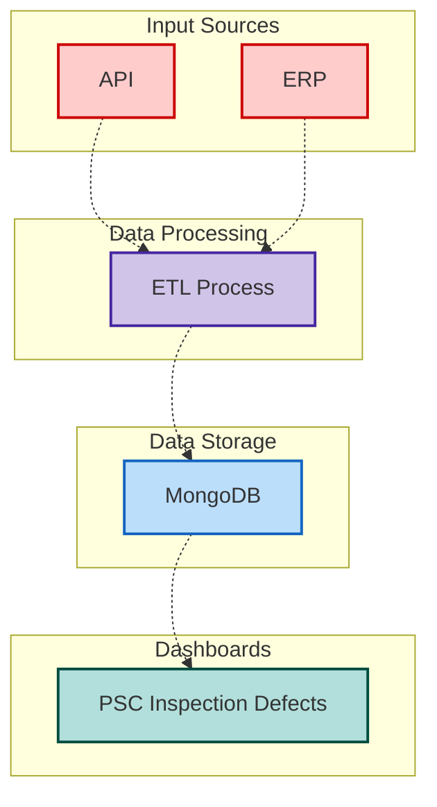

<Frame>
  
</Frame>

## Executive Summary

The PSC (Port State Control) Inspection Dashboard is a comprehensive data processing and visualization system designed to aggregate, process, and present PSC inspection data from multiple sources. The system handles vessel inspection records, defect tracking, and corrective actions across different ERP system versions while providing structured outputs for web-based dashboards.

## Architecture Overview

#### Input Sources 

**API**: External data source providing programmatic access to inspection data   
**ERP**: Enterprise Resource Planning system containing business and operational data

#### Data Processing 

**ETL Process**: The core transformation engine that:   
**Extracts** data from multiple input sources (API and ERP)   
**Transforms** the data into a standardized format   
**Loads** the processed data into the storage layer   

#### Data Storage Layer

**MongoDB**: NoSQL document database chosen for storing the processed inspection data, likely due to its flexibility with varying data structures common in inspection records

#### Output Layer 

**Dashboards**: Visualization layer displaying "PSC Inspection Defects"   
This suggests the system tracks and reports on Port State Control inspection defects   

---

## Data Sources

The system integrates data from multiple authoritative sources to provide comprehensive PSC inspection coverage:

- **Company ERP System**: Internal vessel management and defect tracking (Legacy and Current schema versions)
- **Fleet Distribution Data**: Vessel registry and operational status information  
- **PSC MOU Websites**: Real-time inspection data from international port state control authorities (e.g., Paris MOU, Tokyo MOU, Abuja MOU, etc.)

---

## Core Functionality

#### 1. Data Extraction & Format Detection

Automatically detects vessel data format and extracts PSC inspection data from appropriate ERP collections. Queries ERP system collections for vessel existence, routes data processing based on detected data format, and ensures backward compatibility with legacy vessel records.

#### 2. PSC Defect Processing

Processes inspection findings, corrective actions, and compliance status with multi-level data extraction (Inspection → Findings → Corrective Actions), automatic risk categorization, and standardized datetime handling. Extracts nested PSC inspection data from ERP system, flattens hierarchical findings structure, handles missing data with standardized defaults, and processes corrective action timelines with date validation.

#### 3. Data Standardization & Quality Assurance

Ensures data consistency and handles edge cases across different vessel versions through data type conversion for MongoDB compatibility, missing value management with consistent "No Data" defaults, and cross-format compatibility handling data structure differences between legacy and current vessel record formats.

---

## Data Processing Flow

### Input Data Sources
| Source | Description | Update Frequency |
|--------|-------------|------------------|
| ERP Defect Collection | PSC inspection reports and findings from multiple MOU regions | Real-time |
| ERP Vessel Details | Active vessel registry and fleet distribution | Daily |
| ERP Status Collection | Format tracking for data routing | Real-time |
| PSC MOU APIs | External inspection data from port state control authorities | Varies by MOU |

---

## Performance & Reliability

### System Performance
- **Processing Speed**: ~500 vessel records processed per minute
- **Data Volume**: Handles 10,000+ inspection records per vessel efficiently

### Data Accuracy & Validation
- **Source Validation**: All data traced back to ERP system with audit trails
- **Calculation Verification**: Automated testing of data transformation logic
- **Error Logging**: Comprehensive logging system tracks all processing steps and errors

### Monitoring & Alerts
- **Processing Status**: Real-time logging of vessel processing completion
- **Data Quality Alerts**: Automatic flagging of vessels with incomplete data
- **System Health**: MongoDB connection monitoring and automatic retry logic

---

## Business Impact

1. **Daily Operations**: Fleet managers monitor vessel compliance status in real-time
2. **Regulatory Reporting**: Automated generation of PSC inspection reports for authorities
3. **Risk Management**: Proactive identification of vessels with high-risk findings
4. **Performance Analytics**: Trend analysis of inspection patterns across fleet

---
