SYIA's Purchase Management System transforms how maritime companies manage their procurement operations by consolidating data from multiple disparate systems into a single, intelligent platform. Instead of navigating through various ERP systems, forwarder portals, and financial platforms, fleet managers gain unified visibility across their entire procurement ecosystem with AI-powered insights that drive smarter decision-making.

---

## System Overview

### Core Capability

Transform fragmented procurement data from multiple systems into unified, actionable intelligence that enables proactive fleet management and strategic procurement decisions.

The system integrates with existing maritime ERP systems, forwarder management platforms, financial processing systems, and currency management tools to create a comprehensive procurement command center. This eliminates the need for manual data compilation and provides real-time visibility across the entire supply chain.

### Key Integration Points

**Enterprise Systems Integration**
- Maritime ERP platforms across multiple company entities
- Financial processing and invoice management systems
- Currency exchange rate management with real-time updates
- Account classification and budget tracking systems

**Logistics Network Integration**
- Multiple forwarder and logistics provider APIs
- Real-time shipment tracking and status updates
- Warehouse location and inventory management
- Dangerous goods classification and compliance tracking

**Data Processing Capabilities**
- Automated data harmonization across different system schemas
- Real-time currency conversion with historical rate interpolation
- Intelligent deduplication and data quality management
- Advanced status mapping and workflow state tracking

---

## Intelligent Data Processing Flow

The system follows a sophisticated 8-stage data processing pipeline that ensures data accuracy, completeness, and real-time availability:

```mermaid
graph TB
    subgraph INIT ["🚀 System Initialization"]
        A1[Database Connections<br/>& Configuration]:::init
        A2[Active Fleet Discovery<br/>& Validation]:::init
        A3[Company Entity<br/>Mapping]:::init
    end
    
    subgraph EXTRACT ["📥 Multi-Source Data Extraction"]
        B1[Purchase Requisition<br/>Data Collection]:::extract
        B2[Purchase Order<br/>Processing]:::extract
        B3[Forwarder Network<br/>Data Retrieval]:::extract
        B4[Financial System<br/>Integration]:::extract
    end
    
    subgraph PROCESS ["⚙️ Data Processing & Harmonization"]
        C1[Schema Standardization<br/>& Field Mapping]:::process
        C2[Currency Normalization<br/>& Rate Application]:::process
        C3[Status Code Translation<br/>& Workflow Mapping]:::process
        C4[Data Quality Validation<br/>& Error Handling]:::process
    end
    
    subgraph INTEGRATE ["🔄 Data Integration & Enrichment"]
        D1[Cross-System Data<br/>Correlation]:::integrate
        D2[Nested Document<br/>Structure Creation]:::integrate
        D3[AI-Powered Data<br/>Enhancement]:::integrate
        D4[Real-time Status<br/>Synchronization]:::integrate
    end
    
    subgraph DELIVER ["📊 Intelligence Delivery"]
        E1[Unified Purchase<br/>Overview Generation]:::deliver
        E2[Advanced Analytics<br/>& Insights Creation]:::deliver
        E3[Real-time Dashboard<br/>Updates]:::deliver
        E4[Automated Reporting<br/>& Alerts]:::deliver
    end
    
    A1 --> A2 --> A3
    A3 --> B1
    A3 --> B2
    A3 --> B3
    A3 --> B4
    
    B1 --> C1
    B2 --> C2
    B3 --> C3
    B4 --> C4
    
    C1 --> D1
    C2 --> D2
    C3 --> D3
    C4 --> D4
    
    D1 --> E1
    D2 --> E2
    D3 --> E3
    D4 --> E4
    
    classDef init fill:#e3f2fd,stroke:#1976d2,stroke-width:2px
    classDef extract fill:#fff3e0,stroke:#f57c00,stroke-width:2px
    classDef process fill:#f3e5f5,stroke:#9c27b0,stroke-width:2px
    classDef integrate fill:#e8f5e8,stroke:#4caf50,stroke-width:2px
    classDef deliver fill:#e0f2f1,stroke:#00695c,stroke-width:2px
```

### Processing Intelligence Features

  

    <h4 style={{color: '#1976d2', marginBottom: '12px',marginTop: '0px'}}>🔄 Automated Harmonization</h4>
    

      Intelligently maps data fields across different system schemas, ensuring consistent data structure regardless of source system variations.
    

  

  
  

    <h4 style={{color: '#1976d2', marginBottom: '12px',marginTop: '0px'}}>💱 Dynamic Currency Management</h4>
    

      Real-time currency conversion with historical rate interpolation, providing accurate USD equivalents for all procurement values.
    

  

  
  

    <h4 style={{color: '#1976d2', marginBottom: '12px',marginTop: '0px'}}>🎯 Intelligent Deduplication</h4>
    

      Advanced algorithms identify and resolve duplicate records using timestamp precedence and data quality scoring.
    

  

---

## Core System Capabilities

### 1. Comprehensive Purchase Overview Intelligence

Real-time dashboard providing comprehensive visibility across all vessels, purchase types, and procurement stages with AI-generated insights and predictive analytics.

**Key Features:**
- **Multi-Vessel Purchase Monitoring**: Real-time tracking of purchase activities across entire fleet
- **Cross-Fleet Procurement Analytics**: Comparative analysis and benchmarking between vessels
- **Supplier Performance Intelligence**: Comprehensive vendor evaluation and risk assessment
- **Budget Optimization Insights**: AI-powered recommendations for cost reduction and efficiency

**Smart Categorization & Analysis:**
- **Purchase Requisition Management**: Complete PR lifecycle tracking with approval workflows
- **Purchase Order Intelligence**: Advanced PO monitoring with delivery predictions
- **Invoice Processing Automation**: Intelligent matching and discrepancy detection
- **Direct Purchase Optimization**: Streamlined processing for direct procurement activities

### 2. Long-Pending Purchase Order Management

Advanced analytics identify and manage long-pending purchase orders with intelligent root cause analysis and automated priority recommendations.

**Analytical Capabilities:**
- **Time-Based Intelligence**: Automated identification of orders exceeding predefined thresholds
- **Financial Impact Assessment**: Real-time calculation of cost implications and cash flow effects
- **Root Cause Analysis**: Multi-dimensional analysis identifying bottlenecks and delays
- **Actionable Priority Lists**: AI-generated recommendations for immediate action items

**Advanced Features:**
- **Predictive Delay Detection**: Machine learning algorithms predict potential delays before they occur
- **Supplier Performance Correlation**: Analysis linking delays to specific vendor performance patterns
- **Process Optimization Recommendations**: Data-driven suggestions for workflow improvements
- **Automated Alert Systems**: Proactive notifications for critical procurement milestones

### 3. Integrated Forwarder & Logistics Intelligence

Comprehensive integration with multiple forwarder networks providing real-time shipment tracking, cargo classification, and delivery optimization.

**Integration Capabilities:**
- **Multi-Forwarder Network**: Seamless integration with diverse logistics providers
- **Real-Time Shipment Tracking**: Live visibility from warehouse to vessel delivery
- **Intelligent Cargo Classification**: Automated categorization of normal and dangerous goods
- **Warehouse Optimization**: Analytics-driven location and distribution efficiency

**Advanced Logistics Features:**
- **Delivery Performance Analytics**: Comprehensive analysis of forwarder performance metrics
- **Route Optimization Intelligence**: AI-powered recommendations for cost and time efficiency
- **Cargo Handling Compliance**: Automated monitoring of dangerous goods regulations
- **Predictive Delivery Scheduling**: Machine learning models for accurate delivery predictions

---

## Advanced AI Capabilities

    <h4 style={{color: '#1976d2', marginBottom: '8px',marginTop: '0px'}}>Pattern Recognition</h4>
    
Identifies procurement trends, seasonal patterns, and optimization opportunities across fleet operations.

  

  

    <h4 style={{color: '#1976d2', marginBottom: '8px',marginTop: '0px'}}>Predictive Analytics</h4>
    
Machine learning algorithms predict optimal procurement timing, quantities, and potential supply chain disruptions.

  

  

    <h4 style={{color: '#1976d2', marginBottom: '8px',marginTop: '0px'}}>Anomaly Detection</h4>
    
Automatically flags unusual patterns that may indicate problems, opportunities, or compliance issues.

  

### Natural Language Intelligence
The system provides intuitive query capabilities allowing users to ask complex questions in plain English:

- *"Show me all purchase orders ready for delivery this week across my fleet"*
- *"Which suppliers have the best performance ratings for critical components?"*
- *"What's the total procurement value for dangerous goods shipments this quarter?"*
- *"Identify vessels with the highest pending purchase order values"*

---

## Technical Excellence & Reliability

### Robust System Architecture

  

    <h4 style={{color: '#1976d2', marginBottom: '8px',marginTop: '0px'}}>🔄 High Availability</h4>
    
Advanced retry logic with intelligent error recovery ensures system uptime and data consistency.

  

  
  

    <h4 style={{color: '#1976d2', marginBottom: '8px',marginTop: '0px'}}>⚡ Performance Optimization</h4>
    
Intelligent batch processing and memory management handle large datasets with sub-second response times.

  

  
  

    <h4 style={{color: '#1976d2', marginBottom: '8px',marginTop: '0px'}}>🛡️ Data Integrity</h4>
    
Comprehensive validation rules and quality assurance processes ensure accurate, consistent data across all sources.

  

### Enterprise-Grade Security
- **End-to-end encryption** for all data transmissions
- **Role-based access control** with granular permissions
- **Audit trail logging** for complete transaction visibility
- **Compliance monitoring** for maritime industry regulations

---

## Business Impact & Value

### Operational Excellence

Transform procurement operations from reactive firefighting to proactive strategic management with data-driven decision making

**Strategic Advantages:**
- **Unified Data Visibility**: Eliminate information silos across procurement systems
- **Proactive Risk Management**: Early identification of supply chain disruptions and bottlenecks
- **Optimized Supplier Relationships**: Data-driven vendor performance evaluation and management
- **Enhanced Operational Efficiency**: Streamlined workflows and automated routine processes

**Competitive Differentiation:**
- **Real-time Intelligence**: Instant access to critical procurement metrics and KPIs
- **Predictive Insights**: Machine learning-powered forecasting for strategic planning
- **Cross-Fleet Optimization**: Leverage economies of scale across entire vessel portfolio
- **Continuous Improvement**: AI-driven recommendations for process optimization

---

## Conclusion

SYIA's Purchase Management System represents the future of maritime procurement intelligence—where artificial intelligence meets operational excellence. By consolidating multiple systems into a single, intelligent platform, we eliminate the complexity of managing disparate data sources while providing unprecedented visibility and control over procurement operations.

Transform your maritime procurement from fragmented data management to unified intelligence. Experience real-time visibility, predictive insights, and AI-powered optimization that drives operational excellence and competitive advantage in the dynamic maritime industry.
