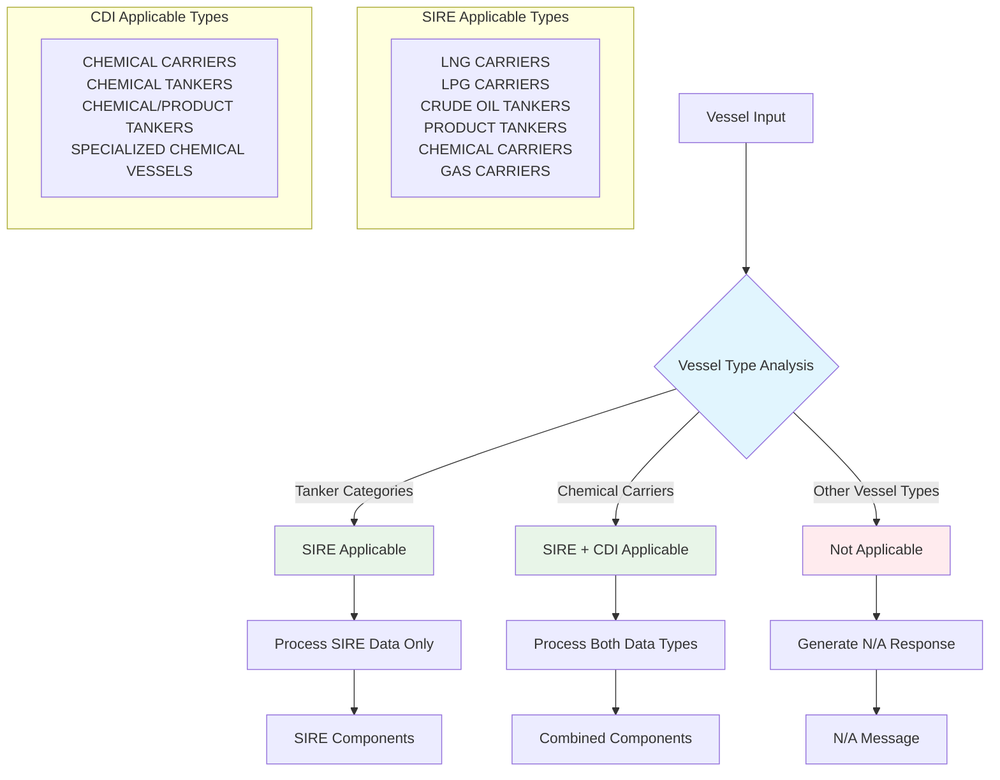

<Frame>

</Frame>

*SIRE CDI System Overview - Complete workflow from CDI API Data and OCIMF Web Scraping through Backend Storage, Siya Analytics to Output delivery*

## What is SIRE and CDI?

**SIRE (Ship Inspection Report Programme)** 

SIRE is the world's leading vessel inspection database operated by OCIMF (Oil Companies International Marine Forum). SIRE provides comprehensive inspection reports for tankers, gas carriers, and offshore vessels, serving as the industry standard for vetting inspections. Major oil companies and charterers rely on SIRE data to assess vessel quality, safety standards, and operational capabilities before chartering decisions.

*SIRE Platform Interface - Vessel details showing inspection records, certificates, crew matrix, and PSC inspections with comprehensive tracking capabilities*

**CDI (Chemical Distribution Institute)** 

CDI (Chemical Distribution Institute) maintains specialized inspection standards for chemical carriers, focusing on the unique safety requirements of chemical transportation with extended validity periods and specialized compliance frameworks.

*CDI Platform Interface - Ships and Reports database showing vessel inspection records with search filters, operator details, and inspection tracking capabilities*

## Platform Overview

Our platform **automatically aggregates, analyzes, and visualizes** vessel inspection data from OCIMF and CDI APIs, transforming complex regulatory data into actionable business intelligence for fleet operators, enabling optimized safety performance, regulatory compliance, and strategic decision-making.

*Figure: SIRE CDI Implementation Overview - Streamlined architecture showing authentication, processing, and output systems*

Alternative Data Integration View

*Alternative Figure: SIRE CDI Data Integration Overview - High-level view of data sources, processing, and outputs*

## System Architecture

*SIRE CDI Maritime Inspection Intelligence Platform - Enhanced workflow showing Data Sources (OCIMF & CDI), AI-Powered Processing Engine, and Business Intelligence Dashboard*

## Key Features

  

    <h3 style={{color: '#1565c0', marginBottom: '1rem', fontSize: '1.2rem'}}>🔄 Real-Time Data Sync</h3>
    
Continuous monitoring of OCIMF and CDI databases with intelligent API integration and automated error handling.

  

  
  

    <h3 style={{color: '#7b1fa2', marginBottom: '1rem', fontSize: '1.2rem'}}>📊 Interactive Analytics</h3>
    
Highcharts visualizations with drill-down capabilities - click chapters to view detailed VIQ references and observations.

  

  
  

    <h3 style={{color: '#2e7d32', marginBottom: '1rem', fontSize: '1.2rem'}}>🚢 Fleet Management</h3>
    
Comprehensive fleet-wide analysis with SIRE/CDI comparison tables and validity tracking across all vessels.

  

  
  

    <h3 style={{color: '#ef6c00', marginBottom: '1rem', fontSize: '1.2rem'}}>✅ Compliance Tracking</h3>
    
Automated validity tracking - SIRE (180 days) and CDI (365 days) with proactive overdue notifications.

  

## Analysis Capabilities

*Figure 5: Historical SIRE Observations Analysis - OCIMF website data showing observations across various chapters with drillable sub-chapters and detailed inspection records*

*Figure 6: SIRE Inspection Records - Latest available data from OCIMF website showing inspection details, locations, and historical observations by category*

### Fleet SIRE Analysis
- Fleet-wide SIRE performance analytics
- Statistical summaries by inspection chapter
- Interactive drilldown charts with observation trends
- Comparative performance benchmarking

### Individual SIRE History
- Complete inspection timeline
- Multi-state processing (Published/Pending/Unprocessed)
- Validity period calculations with renewal alerts
- Direct links to official inspection reports

### Individual CDI Analysis
- CDI-specific observation tracking for chemical carriers
- 365-day validity period management
- Chapter-based performance analytics
- Specialized chemical handling compliance

### Fleet Comparison Dashboard
**Interactive Combined Fleet Analysis**
- Real-time interactive dashboard with filtering
- Toggle between SIRE and CDI inspection views
- Advanced filtering by compliance status (Overdue, Due Soon, Valid)
- Search functionality with live results
- Color-coded status indicators (Red: Overdue, Yellow: Due Soon, Green: Valid)
- Responsive design with list and detailed cards view
- Direct integration with S3-hosted dashboard components

### Vessel Type Classification

## Compliance Calculations

### SIRE Validity Logic:

**Days Remaining** = (Last Inspection Date + 180 days) - Current Date

**Status** = $\begin{cases}
\text{Valid} & \text{if Days Remaining} > 30 \\
\text{Due Soon} & \text{if } 0 \leq \text{Days Remaining} \leq 30 \\
\text{Overdue} & \text{if Days Remaining} < 0 \\
\text{Not Available} & \text{if no inspection data}
\end{cases}$

**Where:**
- SIRE inspection validity period = 180 days from inspection date
- Valid: More than 30 days remaining before expiry
- Due Soon: Between 0-30 days remaining before expiry  
- Overdue: Past the 180-day validity period

### CDI Validity Logic:

**Days Remaining** = (Last Inspection Date + 365 days) - Current Date

**Status** = $\begin{cases}
\text{Valid} & \text{if Days Remaining} > 60 \\
\text{Due Soon} & \text{if } 0 \leq \text{Days Remaining} \leq 60 \\
\text{Overdue} & \text{if Days Remaining} < 0 \\
\text{Not Available} & \text{if no inspection data}
\end{cases}$

**Where:**

**Where:**
- CDI inspection validity period = 365 days from inspection date
- Valid: More than 60 days remaining before expiry
- Due Soon: Between 0-60 days remaining before expiry
- Overdue: Past the 365-day validity period

