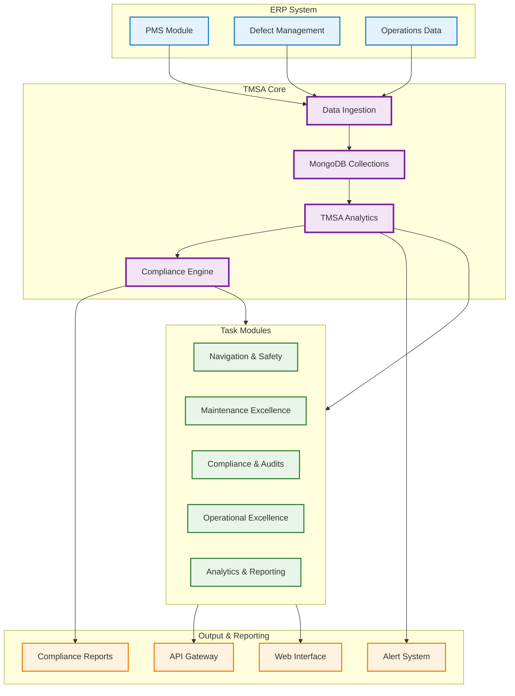
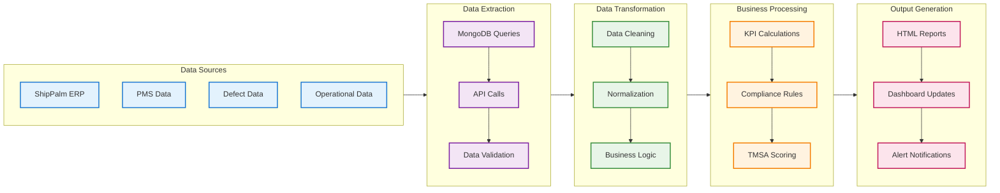

## System Overview
Advanced maritime fleet management platform integrating with ShipPalm ERP for comprehensive tanker operations and OCIMF TMSA 3rd Edition compliance.

---

## Core System Architecture

---

## Data Processing Pipeline

---

## Task Management System

```mermaid
flowchart TD
    %% Main Categories
    subgraph Navigation ["Navigation & Safety"]
        T1[Task 1: Machinery Hours]
        T2[Task 2: Navigation Systems]
        T3[Task 3: Safety Equipment]
    end
    
    subgraph Maintenance ["Maintenance Excellence"]
        T4[Task 4: Cargo Systems]
        T5[Task 5: Ballast Management]
        T6[Task 6: Maintenance Planning]
        T7[Task 7: Spare Parts]
        T8[Task 8: Technical Forms]
    end
    
    subgraph Compliance ["Compliance & Audits"]
        T9[Task 9: Incident Investigation]
        T10[Task 10: PSC Inspections]
        T11[Task 11: SIRE Compliance]
        T12[Task 12: Certificate Management]
        T13[Task 13: External Audits]
        T14[Task 14: Internal Audits]
        T15[Task 15: Industry Benchmarking]
    end
    
    subgraph Operations ["Operational Excellence"]
        T16[Task 16: Performance Monitoring]
        T17[Task 17: KPI Tracking]
        T18[Task 18: Risk Assessment]
        T19[Task 19: Emergency Response]
    end
    
    subgraph Analytics ["Analytics & Reporting"]
        T20[Task 20: Data Analysis]
        T21[Task 21: AI Analytics Engine]
        T22[Task 22: Report Generation]
        T23[Task 23: Trend Analysis]
        T24[Task 24: Executive Dashboards]
        T25[Task 25: Compliance Reporting]
    end
    
    %% Data Flow
    Navigation --> Maintenance
    Maintenance --> Compliance
    Compliance --> Operations
    Operations --> Analytics
    
    %% Styling
    classDef nav fill:#e8f5e8,stroke:#2e7d32,stroke-width:2px
    classDef maint fill:#fff3e0,stroke:#f57c00,stroke-width:2px
    classDef comp fill:#fce4ec,stroke:#c2185b,stroke-width:2px
    classDef ops fill:#e3f2fd,stroke:#1976d2,stroke-width:2px
    classDef analytics fill:#f3e5f5,stroke:#7b1fa2,stroke-width:2px
    
    class T1,T2,T3 nav
    class T4,T5,T6,T7,T8 maint
    class T9,T10,T11,T12,T13,T14,T15 comp
    class T16,T17,T18,T19 ops
    class T20,T21,T22,T23,T24,T25 analytics
```

---

## System Components

### 1.ERP Integration
- **Dual Schema Support**: more compatibility
- **PMS Module**: Planned maintenance system data
- **Defect Management**: Incident tracking and resolution
- **Operations Data**: Real-time vessel performance

### 2. TMSA Core
- **Data Ingestion**: Centralized data collection
- **MongoDB Storage**: Optimized document database
- **TMSA Analytics**: Compliance element processing
- **KPI Engine**: Performance metric calculations
- **Compliance Engine**: Regulatory requirement tracking

### 3. Task Management System
- **Task Modules**: Comprehensive coverage
- **Category Organization**: Logical grouping by function
- **Workflow Integration**: Seamless task progression
- **Performance Tracking**: Continuous monitoring

---

## Process Flow

### 1. Data Collection
- **ERP Integration**: ERP data extraction
- **Maintenance Data**: PMS scheduling and execution records
- **Defect Tracking**: Incident and corrective action data
- **Operational Metrics**: Vessel performance and status data

### 2. Data Processing
- **Ingestion**: Centralized data collection and validation
- **Processing**: Business logic application and KPI calculations
- **Storage**: MongoDB document storage with optimized indexing

### 3. Analytics Generation
- **TMSA Analytics**: Compliance element tracking and scoring
- **KPI Monitoring**: Real-time performance metrics
- **Compliance Reports**: Regulatory requirement tracking
- **Alert System**: Critical issue notifications

### 4. Output Delivery
- **Performance Dashboards**: Real-time operational insights
- **Executive Reports**: Compliance and performance summaries
- **Critical Alerts**: Immediate issue notifications

---

## Technical Features

- **Batch Processing**: Efficient bulk data operations
- **Real-time Updates**: Continuous data synchronization
- **Error Handling**: Robust error management
- **Performance Optimization**: Indexed database queries
- **Scalable Architecture**: Support for multiple vessels
- **Multi-version Support**: multiple ERP compatibility

---

## Key Benefits

- **Centralized Management**: Single source of truth
- **Real-time Monitoring**: Continuous compliance tracking
- **Scalable Architecture**: Support for multiple vessels
- **Regulatory Compliance**: OCIMF TMSA 3rd Edition
- **Performance Optimization**: Efficient data processing
- **User Experience**: Intuitive interface design

---

*This comprehensive TMSA architecture provides complete maritime fleet management capabilities with integrated compliance tracking, real-time monitoring, and automated reporting for optimal operational excellence.*
