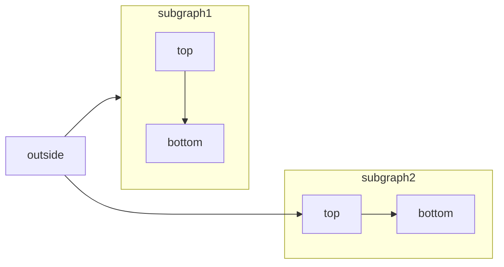
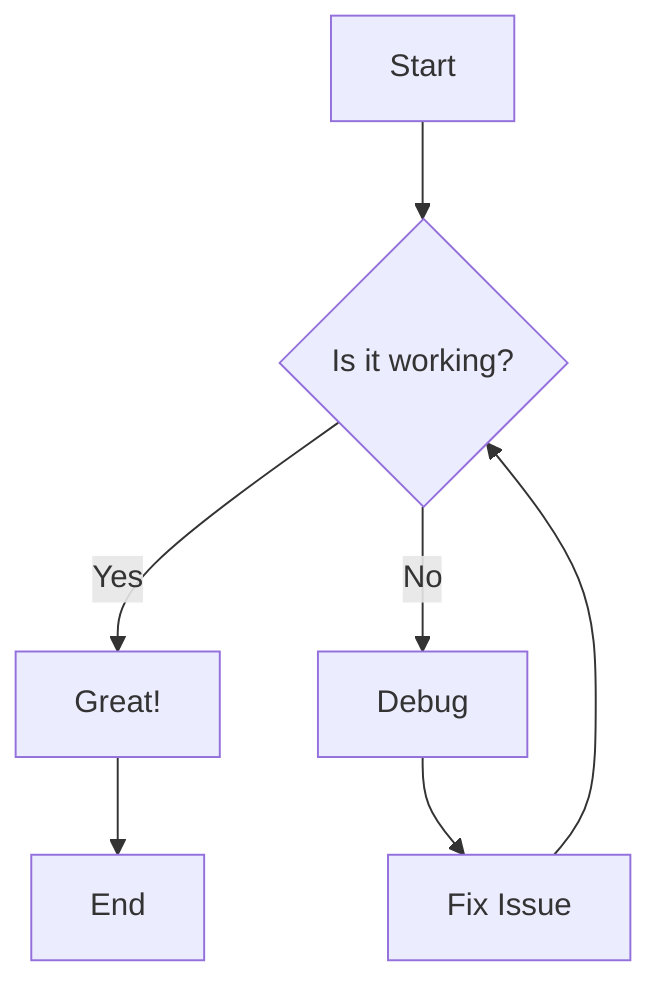
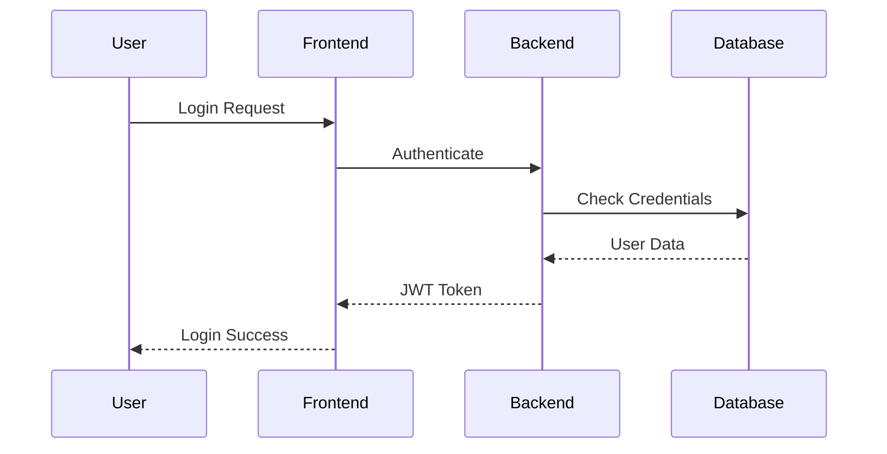
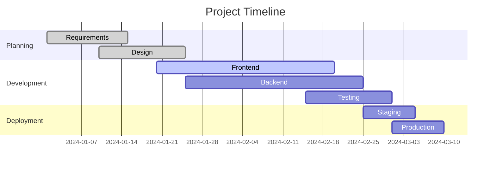
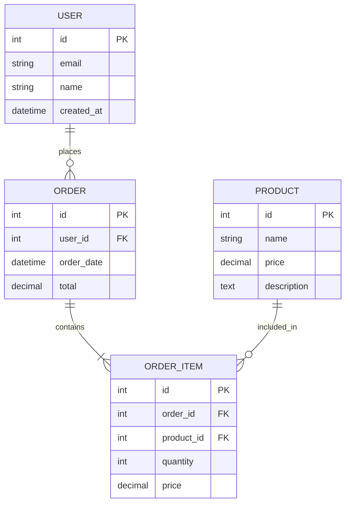
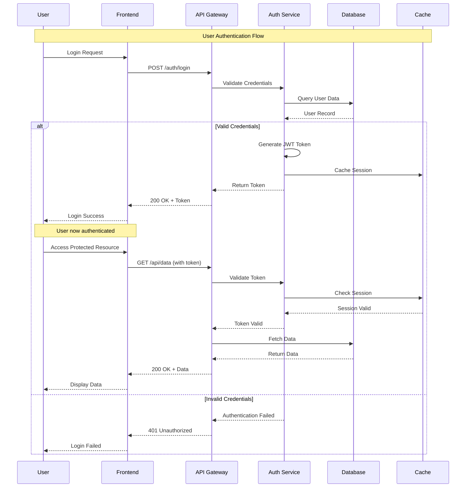
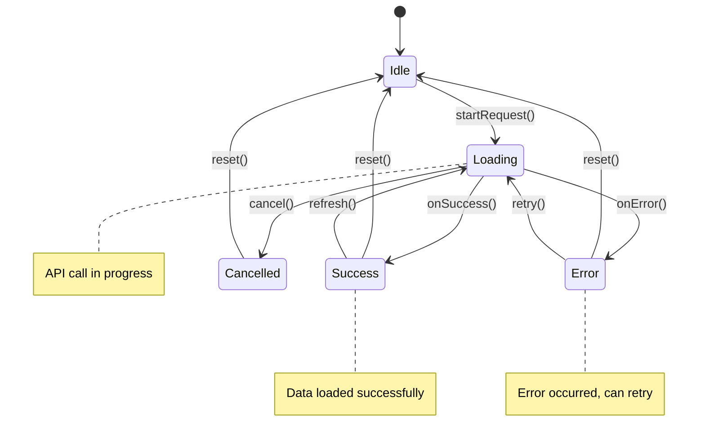
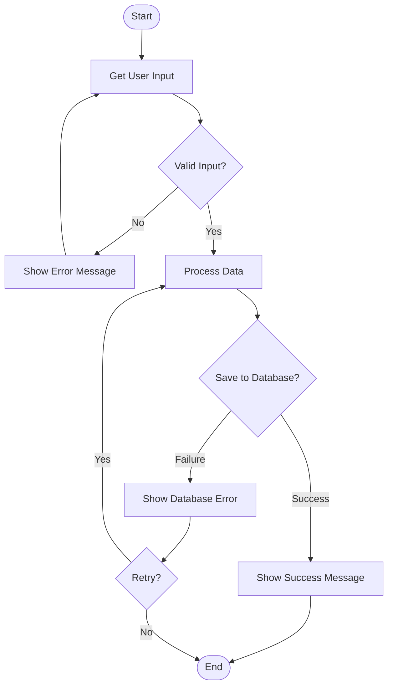

# Complete MDX Tutorial Guide

MDX is a powerful format that lets you write JSX in your Markdown documents. This tutorial covers everything you need to know!

## Table of Contents
- [Basic Markdown Elements](#basic-markdown-elements)
- [JSX Components](#jsx-components)
- [Code Examples](#code-examples)
- [Interactive Elements](#interactive-elements)
- [Advanced Features](#advanced-features)

---

## Basic Markdown Elements

### Headings
# Heading 1
## Heading 2
### Heading 3
#### Heading 4
##### Heading 5
###### Heading 6

### Text Formatting
**Bold text** and *italic text* and ***bold italic text***

~~Strikethrough text~~

`Inline code` and regular text.

### Lists

#### Unordered Lists
- Item 1
- Item 2
  - Nested item 2.1
  - Nested item 2.2
- Item 3

#### Ordered Lists
1. First item
2. Second item
   1. Nested item 2.1
   2. Nested item 2.2
3. Third item

#### Task Lists
- [x] Completed task
- [ ] Incomplete task
- [ ] Another incomplete task

### Links and Images
[Visit MDX Documentation](https://mdxjs.com/)


# Frames

> Use the Frame component to wrap images or other components in a container.

Frames are very helpful if you want to center an image.

<Frame>
  
</Frame>

  ```jsx Frame Without Caption
  <Frame>
  
</Frame>
```

## Captions

You can add additional context to an image using the optional `caption` prop.

<Frame caption="Yosemite National Park is visited by over 3.5 million people every year">
  
</Frame>

  ```jsx Frame With Caption
<Frame caption="Caption Text">
  
</Frame>
```
## Props

<ResponseField name="caption" type="string">
  Optional caption text to show centered under your component.
</ResponseField>


### Blockquotes
> This is a blockquote
> 
> It can span multiple lines
> 
> > And can be nested too

### Horizontal Rules
---

### Tables
| Feature | Markdown | MDX |
|---------|----------|-----|
| Headers | ✅ | ✅ |
| Lists | ✅ | ✅ |
| JSX | ❌ | ✅ |
| Components | ❌ | ✅ |

---

## Code Examples

### Inline Code
Use `const` for constants and `let` for variables.

### Code Blocks

#### JavaScript
```javascript
function greet(name) {
  return `Hello, ${name}!`;
}

const message = greet("MDX");
console.log(message);
```

#### Python
```python
def fibonacci(n):
    if n <= 1:
        return n
    return fibonacci(n-1) + fibonacci(n-2)

result = fibonacci(10)
print(f"Fibonacci of 10 is: {result}")
```

#### HTML
```html
<!DOCTYPE html>
<html lang="en">
<head>
    <meta charset="UTF-8">
    <title>MDX Tutorial</title>
</head>
<body>
    <h1>Welcome to MDX!</h1>
</body>
</html>
```

#### CSS
```css
.highlight {
  background-color: #f0f8ff;
  padding: 1rem;
  border-radius: 8px;
  border-left: 4px solid #007acc;
}

.code-block {
  font-family: 'Courier New', monospace;
  background-color: #2d3748;
  color: #e2e8f0;
  padding: 1rem;
  border-radius: 6px;
  overflow-x: auto;
}
```

#### JSON
```json
{
  "name": "mdx-tutorial",
  "version": "1.0.0",
  "description": "A comprehensive MDX tutorial",
  "keywords": ["mdx", "markdown", "jsx", "tutorial"],
  "author": "Your Name"
}
```

---

# Mermaid

> Display diagrams using Mermaid

[Mermaid](/App%20Insights/Defects%20Overview) lets you build flowcharts, sequence diagrams, Gantt charts, and other diagrams using text and code.

For a complete list of supported diagram types and syntax, see the [Mermaid documentation](https://mermaid.js.org/intro/).




#### Code snippet for Mermaid diagram
```jsx Mermaid
```mermaid
 flowchart LR
    subgraph subgraph1
        direction TB
        top1[top] --> bottom1[bottom]
    end
    subgraph subgraph2
        direction TB
        top2[top] --> bottom2[bottom]
    end
    %% ^ These subgraphs are identical, except for the links to them:

    %% Link *to* subgraph1: subgraph1 direction is maintained
    outside --> subgraph1
    %% Link *within* subgraph2:
    %% subgraph2 inherits the direction of the top-level graph (LR)
    outside ---> top2

    ```
## Syntax

To create a Mermaid diagram, write your diagram definition inside a Mermaid code block.

````mdx
```mermaid
// Your mermaid diagram code here
```
````

#### Flowchart


#### Sequence Diagram


#### Gantt Chart


#### Entity Relationship Diagram



#### UML Sequence Diagram (Advanced)


#### UML State Diagram


#### UML Activity Diagram


## JSX Components in MDX

### Simple JSX Elements

<div style={{
  backgroundColor: '#f0f8ff',
  padding: '1rem',
  borderRadius: '8px',
  border: '1px solid #007acc'
}}>
  This is a JSX div with inline styles!
</div>

<button 
  style={{
    backgroundColor: '#007acc',
    color: 'white',
    padding: '0.5rem 1rem',
    border: 'none',
    borderRadius: '4px',
    cursor: 'pointer'
  }}
  onClick={() => alert('Hello from MDX!')}
>
  Click me!
</button>

### Custom Components

export const Alert = ({ type = 'info', children }) => (
  <div style={{
    padding: '1rem',
    borderRadius: '6px',
    marginBottom: '1rem',
    backgroundColor: type === 'warning' ? '#fff3cd' : 
                     type === 'error' ? '#f8d7da' : 
                     type === 'success' ? '#d1edff' : '#e3f2fd',
    borderLeft: `4px solid ${
      type === 'warning' ? '#856404' : 
      type === 'error' ? '#721c24' : 
      type === 'success' ? '#155724' : '#1976d2'
    }`
  }}>
    <strong>{type.toUpperCase()}:</strong> {children}
  </div>
);

<Alert type="info">
  This is an info alert created with a custom JSX component!
</Alert>

<Alert type="warning">
  This is a warning alert. Be careful!
</Alert>

<Alert type="error">
  This is an error alert. Something went wrong!
</Alert>

<Alert type="success">
  This is a success alert. Great job!
</Alert>

### Interactive Counter Component

export const Counter = () => {
  const [count, setCount] = React.useState(0);
  
  return (
    <div style={{
      padding: '1rem',
      border: '1px solid #ddd',
      borderRadius: '8px',
      textAlign: 'center',
      margin: '1rem 0'
    }}>
      <h3>Interactive Counter</h3>
      <p style={{ fontSize: '2rem', margin: '1rem 0' }}>{count}</p>
      <button 
        onClick={() => setCount(count + 1)}
        style={{
          backgroundColor: '#28a745',
          color: 'white',
          padding: '0.5rem 1rem',
          border: 'none',
          borderRadius: '4px',
          marginRight: '0.5rem',
          cursor: 'pointer'
        }}
      >
        +
      </button>
      <button 
        onClick={() => setCount(count - 1)}
        style={{
          backgroundColor: '#dc3545',
          color: 'white',
          padding: '0.5rem 1rem',
          border: 'none',
          borderRadius: '4px',
          marginLeft: '0.5rem',
          cursor: 'pointer'
        }}
      >
        -
      </button>
    </div>
  );
};

<Counter />

---

## Advanced MDX Features

### Code with Syntax Highlighting and Line Numbers

```jsx showLineNumbers
import React, { useState, useEffect } from 'react';

const TodoApp = () => {
  const [todos, setTodos] = useState([]);
  const [input, setInput] = useState('');

  const addTodo = () => {
    if (input.trim()) {
      setTodos([...todos, { 
        id: Date.now(), 
        text: input, 
        completed: false 
      }]);
      setInput('');
    }
  };

  const toggleTodo = (id) => {
    setTodos(todos.map(todo => 
      todo.id === id 
        ? { ...todo, completed: !todo.completed }
        : todo
    ));
  };

  return (
    <div className="todo-app">
      <h2>Todo List</h2>
      <input 
        value={input}
        onChange={(e) => setInput(e.target.value)}
        placeholder="Add a new todo..."
      />
      <button onClick={addTodo}>Add</button>
      <ul>
        {todos.map(todo => (
          <li key={todo.id}>
            <span 
              style={{ 
                textDecoration: todo.completed ? 'line-through' : 'none' 
              }}
              onClick={() => toggleTodo(todo.id)}
            >
              {todo.text}
            </span>
          </li>
        ))}
      </ul>
    </div>
  );
};

export default TodoApp;
```

### Data Visualization Component

export const ProgressBar = ({ value, max = 100, color = '#007acc' }) => {
  const percentage = (value / max) * 100;
  
  return (
    <div style={{ margin: '1rem 0' }}>
      <div style={{
        width: '100%',
        backgroundColor: '#e0e0e0',
        borderRadius: '10px',
        overflow: 'hidden',
        height: '20px'
      }}>
        <div style={{
          width: `${percentage}%`,
          backgroundColor: color,
          height: '100%',
          transition: 'width 0.3s ease',
          display: 'flex',
          alignItems: 'center',
          justifyContent: 'center',
          color: 'white',
          fontSize: '12px',
          fontWeight: 'bold'
        }}>
          {Math.round(percentage)}%
        </div>
      </div>
    </div>
  );
};

### Progress Examples

<ProgressBar value={25} max={100} color="#28a745" />
<ProgressBar value={50} max={100} color="#ffc107" />
<ProgressBar value={75} max={100} color="#fd7e14" />
<ProgressBar value={90} max={100} color="#dc3545" />

### Card Component

export const Card = ({ title, children, footer }) => (
  <div style={{
    border: '1px solid #ddd',
    borderRadius: '8px',
    padding: '1rem',
    margin: '1rem 0',
    boxShadow: '0 2px 4px rgba(0,0,0,0.1)'
  }}>
    {title && (
      <h3 style={{ 
        marginTop: 0, 
        color: '#333',
        borderBottom: '1px solid #eee',
        paddingBottom: '0.5rem'
      }}>
        {title}
      </h3>
    )}
    <div style={{ margin: '1rem 0' }}>
      {children}
    </div>
    {footer && (
      <div style={{
        borderTop: '1px solid #eee',
        paddingTop: '0.5rem',
        fontSize: '0.9rem',
        color: '#666'
      }}>
        {footer}
      </div>
    )}
  </div>
);

<Card 
  title="MDX Features" 
  footer="Last updated: Today"
>
  MDX combines the simplicity of Markdown with the power of React components. You can:
  
  - Write markdown naturally
  - Embed JSX components
  - Create interactive elements
  - Use props and state
  - Import and export components
</Card>

### Tabs Component

export const Tabs = ({ children }) => {
  const [activeTab, setActiveTab] = React.useState(0);
  
  return (
    <div style={{ margin: '1rem 0' }}>
      <div style={{
        display: 'flex',
        borderBottom: '1px solid #ddd'
      }}>
        {React.Children.map(children, (child, index) => (
          <button
            key={index}
            onClick={() => setActiveTab(index)}
            style={{
              padding: '0.5rem 1rem',
              border: 'none',
              backgroundColor: activeTab === index ? '#007acc' : '#f8f9fa',
              color: activeTab === index ? 'white' : '#333',
              cursor: 'pointer',
              borderBottom: activeTab === index ? '2px solid #007acc' : 'none'
            }}
          >
            {child.props.label}
          </button>
        ))}
      </div>
      <div style={{ padding: '1rem' }}>
        {React.Children.toArray(children)[activeTab]}
      </div>
    </div>
  );
};

export const Tab = ({ label, children }) => <div>{children}</div>;

<Tabs>
  <Tab label="HTML">
    ```html
    <div class="container">
      <h1>Hello World</h1>
      <p>This is HTML content</p>
    </div>
    ```
  </Tab>
  <Tab label="CSS">
    ```css
    .container {
      max-width: 800px;
      margin: 0 auto;
      padding: 2rem;
    }
    ```
  </Tab>
  <Tab label="JavaScript">
    ```javascript
    const greeting = (name) => {
      return `Hello, ${name}!`;
    };
    
    console.log(greeting('World'));
    ```
  </Tab>
</Tabs>

---

## Math and Formulas

### Inline Math
The quadratic formula is $x = \frac{-b \pm \sqrt{b^2-4ac}}{2a}$.

### Block Math
$$
\int_{-\infty}^{\infty} e^{-x^2} dx = \sqrt{\pi}
$$

---

## Callouts and Admonitions

export const Callout = ({ type = 'note', title, children }) => {
  const configs = {
    note: { bg: '#e3f2fd', border: '#1976d2', icon: '📝' },
    tip: { bg: '#f3e5f5', border: '#7b1fa2', icon: '💡' },
    warning: { bg: '#fff3e0', border: '#f57c00', icon: '⚠️' },
    danger: { bg: '#ffebee', border: '#d32f2f', icon: '🚨' }
  };
  
  const config = configs[type] || configs.note;
  
  return (
    <div style={{
      backgroundColor: config.bg,
      border: `1px solid ${config.border}`,
      borderLeft: `4px solid ${config.border}`,
      borderRadius: '6px',
      padding: '1rem',
      margin: '1rem 0'
    }}>
      <div style={{ 
        fontWeight: 'bold', 
        marginBottom: '0.5rem',
        display: 'flex',
        alignItems: 'center',
        gap: '0.5rem'
      }}>
        <span>{config.icon}</span>
        {title || type.toUpperCase()}
      </div>
      {children}
    </div>
  );
};

<Callout type="note" title="Pro Tip">
  MDX files are processed at build time, so you can use any JavaScript features available in your build environment.
</Callout>

<Callout type="warning" title="Important">
  Remember to import React if you're using hooks like useState or useEffect in your MDX components.
</Callout>

<Callout type="danger" title="Security Warning">
  Be careful when using dangerouslySetInnerHTML or executing user-provided code in MDX.
</Callout>

---

## Import and Export Examples

```jsx
// You can import components from other files
import { MyComponent } from './components/MyComponent';
import { utils } from './utils';

// You can also import npm packages
import { format } from 'date-fns';
```

```jsx
// Export components for use in other MDX files
export { Alert, Card, Tabs, Tab, Counter };

// Export data
export const metadata = {
  title: 'Complete MDX Tutorial',
  author: 'Your Name',
  date: '2024-01-01'
};
```

---

## Frontmatter Example

```yaml
---
title: "Complete MDX Tutorial Guide"
description: "A comprehensive guide to MDX with examples"
author: "Your Name"
date: "2024-01-01"
tags: ["mdx", "markdown", "react", "tutorial"]
category: "documentation"
published: true
---
```

---

## Best Practices

### 1. Component Organization
- Keep components small and focused
- Use meaningful prop names
- Provide default values for optional props

### 2. Styling Approaches
- Use CSS-in-JS for component-specific styles
- Consider CSS modules for larger applications
- Maintain consistent design patterns

### 3. Performance Tips
- Lazy load heavy components
- Use React.memo for expensive renders
- Optimize images and assets

### 4. Accessibility
- Include proper ARIA labels
- Ensure keyboard navigation works
- Use semantic HTML elements

---

## Conclusion

This MDX tutorial demonstrates:

✅ **Basic Markdown**: Headers, lists, links, images, tables

✅ **Code Blocks**: Syntax highlighting, multiple languages

✅ **JSX Components**: Custom components with props and state

✅ **Interactive Elements**: Buttons, forms, counters

✅ **Advanced Features**: Tabs, cards, progress bars, callouts

✅ **Math Support**: Inline and block mathematical expressions

✅ **Import/Export**: Component reusability

✅ **Best Practices**: Performance, accessibility, organization

MDX is incredibly powerful for creating rich, interactive documentation, tutorials, and content. Experiment with these examples and create your own custom components!

---

## Additional Resources

- [MDX Official Documentation](https://mdxjs.com/)
- [React Documentation](https://react.dev/)
- [Markdown Guide](https://www.markdownguide.org/)
- [JSX Documentation](https://react.dev/learn/writing-markup-with-jsx)

---
