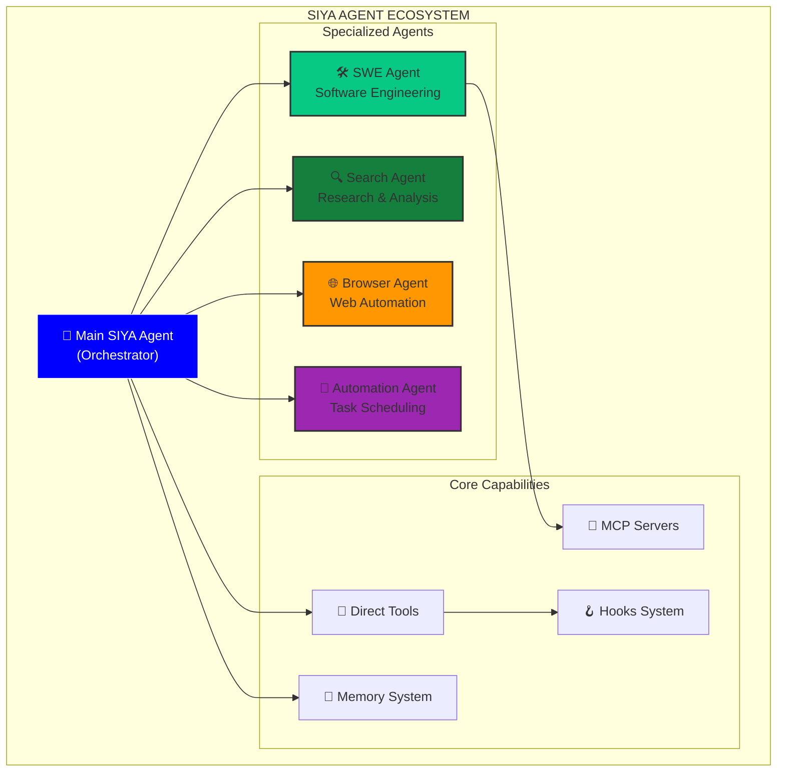
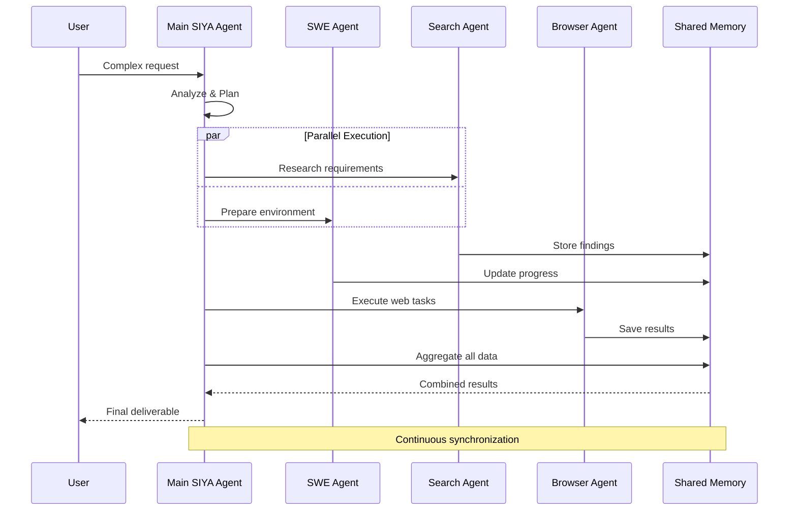

<Card title="Intelligent Multi-Agent Orchestration" icon="network-wired" color="#0000FF">
  Siya employs a sophisticated multi-agent architecture that adapts based on your chosen execution mode. At the core is the main Siya agent, which either directly handles tasks using tools and sub-agents (Chat Mode) or orchestrates specialized agent modules (Task Mode).
</Card>

## Agent System Overview

<Frame caption="Siya's agent ecosystem provides specialized expertise for every type of task">

</Frame>

## Core Agent Types

<Tabs>
  <Tab title="Main SIYA Agent">
    <Card title="The Orchestrator" icon="crown" color="#0000FF">
      The central intelligence that coordinates all operations and makes high-level decisions
    </Card>
    
    <AccordionGroup>
      <Accordion title="Primary Responsibilities" icon="clipboard-list" defaultOpen>
        <Steps>
          <Step title="Request Analysis">
            Understands user intent and determines the best approach
          </Step>
          <Step title="Resource Allocation">
            Decides which tools or sub-agents to employ
          </Step>
          <Step title="Coordination">
            Manages communication between different components
          </Step>
          <Step title="Quality Assurance">
            Ensures outputs meet requirements and standards
          </Step>
        </Steps>
      </Accordion>
      
      <Accordion title="Decision Making Process" icon="brain">
        ```mermaid
        flowchart LR
            Input["User Input"] --> Analysis["Intent Analysis"]
            Analysis --> Complexity{Complexity?}
            
            Complexity -->|Simple| Direct["Direct Tool Use"]
            Complexity -->|Complex| Delegate["Delegate to Sub-Agent"]
            Complexity -->|Multi-Domain| Multiple["Multiple Agents"]
            
            Direct --> Execute["Execute & Return"]
            Delegate --> Monitor["Monitor Progress"]
            Multiple --> Coordinate["Coordinate Agents"]
            
            Execute --> Result["Final Result"]
            Monitor --> Result
            Coordinate --> Result
        ```
      </Accordion>
      
      <Accordion title="Capabilities Matrix" icon="grid">
        <Table>
          <tr>
            <th>Capability</th>
            <th>Chat Mode</th>
            <th>Task Mode</th>
          </tr>
          <tr>
            <td>Direct Tool Access</td>
            <td>✅ Full Access</td>
            <td>❌ Delegates Only</td>
          </tr>
          <tr>
            <td>Sub-Agent Spawning</td>
            <td>✅ On-Demand</td>
            <td>✅ Pre-Planned</td>
          </tr>
          <tr>
            <td>User Interaction</td>
            <td>✅ Continuous</td>
            <td>⚡ Minimal</td>
          </tr>
          <tr>
            <td>Planning Depth</td>
            <td>🔄 Adaptive</td>
            <td>📊 Comprehensive</td>
          </tr>
        </Table>
      </Accordion>
    </AccordionGroup>
  </Tab>
  
  <Tab title="SWE Agent">
    <Card title="Software Engineering Specialist" icon="code" color="#07C983">
      Your dedicated software development partner with deep technical expertise
    </Card>
    
    <Columns cols={2}>
      <Card title="Core Competencies" icon="tools">
        - Architecture design
        - Code generation
        - Testing & debugging
        - Performance optimization
        - Security analysis
        - Documentation
      </Card>
      
      <Card title="Unique Features" icon="star">
        - MCP server access
        - Build system integration
        - Multi-language support
        - Git operations
        - CI/CD pipeline setup
        - Code review capabilities
      </Card>
    </Columns>
    
    <AccordionGroup>
      <Accordion title="Technical Capabilities" icon="microchip">
        <Tabs>
          <Tab title="Languages">
            <Columns cols={3}>
              <div>
                **Frontend**
                - JavaScript/TypeScript
                - React/Vue/Angular
                - HTML/CSS
                - WebAssembly
              </div>
              <div>
                **Backend**
                - Python
                - Node.js
                - Java/Kotlin
                - Go
                - Rust
                - C/C++
              </div>
              <div>
                **Specialized**
                - SQL/NoSQL
                - GraphQL
                - Shell scripting
                - Configuration files
                - Docker/K8s
              </div>
            </Columns>
          </Tab>
          
          <Tab title="Frameworks">
            Comprehensive knowledge of modern frameworks:
            - **Web**: Express, Django, Spring Boot, FastAPI
            - **Mobile**: React Native, Flutter, SwiftUI
            - **Data**: Pandas, NumPy, TensorFlow, PyTorch
            - **Testing**: Jest, Pytest, JUnit, Selenium
            - **DevOps**: Terraform, Ansible, GitHub Actions
          </Tab>
          
          <Tab title="Tools">
            <Steps>
              <Step title="Development">
                VSCode, IntelliJ, Vim configurations
              </Step>
              <Step title="Version Control">
                Git, GitHub, GitLab, Bitbucket
              </Step>
              <Step title="Build Systems">
                Webpack, Gradle, Maven, Make
              </Step>
              <Step title="Containers">
                Docker, Kubernetes, Helm
              </Step>
            </Steps>
          </Tab>
        </Tabs>
      </Accordion>
      
      <Accordion title="MCP Integration" icon="plug">
        <Info>
          The SWE Agent has exclusive access to MCP servers in Task Mode, enabling powerful integrations
        </Info>
        
        <Columns cols={2}>
          <Card title="Database Access" icon="database">
            - PostgreSQL operations
            - MongoDB queries
            - Redis caching
            - Elasticsearch indexing
          </Card>
          
          <Card title="External Services" icon="cloud">
            - API integrations
            - Cloud services
            - Third-party tools
            - Custom protocols
          </Card>
        </Columns>
      </Accordion>
      
      <Accordion title="Workflow Examples" icon="sitemap">
        ```mermaid
        sequenceDiagram
            participant U as User
            participant M as Main Agent
            participant S as SWE Agent
            participant MCP as MCP Server
            participant G as Git
            
            U->>M: "Create a REST API"
            M->>S: Delegate task
            S->>S: Design architecture
            S->>S: Generate code
            S->>MCP: Set up database
            MCP-->>S: DB configured
            S->>S: Write tests
            S->>G: Commit changes
            S-->>M: Task complete
            M-->>U: API ready with docs
        ```
      </Accordion>
    </AccordionGroup>
  </Tab>
  
  <Tab title="Search Agent">
    <Card title="Research & Intelligence Specialist" icon="search" color="#15803D">
      Advanced research capabilities with multi-source synthesis and fact verification
    </Card>
    
    <Steps titleSize="h3">
      <Step title="Multi-Source Research" icon="globe">
        Searches across web, databases, and documentation simultaneously
      </Step>
      <Step title="Information Synthesis" icon="merge">
        Combines findings from multiple sources into coherent insights
      </Step>
      <Step title="Fact Verification" icon="check-double">
        Cross-references information for accuracy and reliability
      </Step>
      <Step title="Citation Management" icon="quote-right">
        Provides proper sources and references for all findings
      </Step>
    </Steps>
    
    <AccordionGroup>
      <Accordion title="Research Capabilities" icon="microscope">
        <Columns cols={2}>
          <div>
            **Technical Research**
            - API documentation
            - Library comparisons
            - Best practices
            - Performance benchmarks
            - Security advisories
            - Version compatibility
          </div>
          <div>
            **General Research**
            - Market analysis
            - Competitive intelligence
            - Trend identification
            - Statistical data
            - Academic papers
            - Industry reports
          </div>
        </Columns>
      </Accordion>
      
      <Accordion title="Search Strategies" icon="strategy">
        <Tabs>
          <Tab title="Breadth-First">
            <Card title="Wide Coverage" icon="expand">
              Explores multiple sources quickly for comprehensive overview
            </Card>
            
            **Best for:**
            - Initial exploration
            - Trend analysis
            - Comparative studies
            - Market research
          </Tab>
          
          <Tab title="Depth-First">
            <Card title="Deep Dive" icon="arrow-down">
              Focuses intensely on specific sources for detailed information
            </Card>
            
            **Best for:**
            - Technical specifications
            - Academic research
            - Root cause analysis
            - Expert knowledge
          </Tab>
          
          <Tab title="Iterative">
            <Card title="Refined Search" icon="sync">
              Progressively narrows focus based on initial findings
            </Card>
            
            **Best for:**
            - Complex topics
            - Evolving requirements
            - Precision needs
            - Quality over quantity
          </Tab>
        </Tabs>
      </Accordion>
      
      <Accordion title="Output Formats" icon="file-export">
        <Columns cols={3}>
          <Card title="Reports" icon="file-alt">
            - Executive summaries
            - Detailed analyses
            - Comparison tables
            - Recommendation lists
          </Card>
          
          <Card title="Data" icon="table">
            - Structured datasets
            - Statistical summaries
            - Trend graphs
            - Raw findings
          </Card>
          
          <Card title="References" icon="bookmark">
            - Annotated bibliographies
            - Source rankings
            - Citation formats
            - Reading lists
          </Card>
        </Columns>
      </Accordion>
    </AccordionGroup>
  </Tab>
  
  <Tab title="Browser Agent">
    <Card title="Web Automation Expert" icon="globe" color="#FF9800">
      Visual AI that interacts with websites like a human, handling complex web workflows
    </Card>
    
    <Warning>
      The Browser Agent uses computer vision to interact with web pages, making it capable of handling dynamic content and visual challenges that traditional automation tools cannot.
    </Warning>
    
    <AccordionGroup>
      <Accordion title="Core Capabilities" icon="window-maximize" defaultOpen>
        <Columns cols={2}>
          <div>
            **Visual Understanding**
            - Page layout analysis
            - Button/link recognition
            - Form field detection
            - Dynamic content tracking
            - Image/text extraction
            - Color/style awareness
          </div>
          <div>
            **Interaction Skills**
            - Click precision
            - Text input
            - Dropdown navigation
            - File uploads
            - Drag and drop
            - Scroll control
          </div>
        </Columns>
      </Accordion>
      
      <Accordion title="Advanced Features" icon="rocket">
        <Steps>
          <Step title="Multi-Step Workflows">
            Handles complex sequences like checkout processes, form wizards, and multi-page operations
          </Step>
          <Step title="Adaptive Navigation">
            Adjusts to different site layouts and unexpected changes
          </Step>
          <Step title="Session Management">
            Maintains cookies, authentication, and state across interactions
          </Step>
          <Step title="Error Recovery">
            Handles popups, loading delays, and unexpected interface changes
          </Step>
        </Steps>
      </Accordion>
      
      <Accordion title="Use Case Examples" icon="tasks">
        <Tabs>
          <Tab title="E-Commerce">
            ```mermaid
            graph LR
                A[Search Product] --> B[Add to Cart]
                B --> C[Checkout]
                C --> D[Fill Shipping]
                D --> E[Payment Info]
                E --> F[Confirm Order]
                F --> G[Get Confirmation]
                
                style A fill:#FF9800,stroke:#333
                style G fill:#4CAF50,stroke:#333
            ```
            
            - Product searches
            - Price comparisons
            - Inventory checks
            - Order placement
            - Tracking updates
          </Tab>
          
          <Tab title="Data Extraction">
            <Card title="Scraping Capabilities" icon="download">
              - Table data extraction
              - Pagination handling
              - Dynamic content capture
              - Image downloading
              - PDF generation
            </Card>
          </Tab>
          
          <Tab title="Form Automation">
            <Steps>
              <Step title="Application Forms">
                Job applications, registrations, surveys
              </Step>
              <Step title="Data Entry">
                Bulk form filling from spreadsheets
              </Step>
              <Step title="Verification">
                CAPTCHA handling, email confirmation
              </Step>
            </Steps>
          </Tab>
        </Tabs>
      </Accordion>
      
      <Accordion title="Technical Architecture" icon="sitemap">
        <Frame caption="Browser Agent uses headless browser with computer vision for intelligent interaction">
          
        </Frame>
        
        <Note>
          The Browser Agent maintains its own browser context, separate from your system browser, ensuring privacy and isolation.
        </Note>
      </Accordion>
    </AccordionGroup>
  </Tab>
  
  <Tab title="Automation Agent">
    <Card title="Workflow Automation Specialist" icon="robot" color="#9C27B0">
      Creates and manages automated workflows, scheduled tasks, and system integrations
    </Card>
    
    <Columns cols={2}>
      <Card title="Scheduling Power" icon="clock">
        - Cron-like scheduling
        - One-time delays
        - Recurring patterns
        - Business hours aware
        - Timezone handling
        - Holiday calendars
      </Card>
      
      <Card title="Workflow Creation" icon="sitemap">
        - Multi-step processes
        - Conditional logic
        - Error handling
        - Parallel execution
        - State management
        - Result aggregation
      </Card>
    </Columns>
    
    <AccordionGroup>
      <Accordion title="Scheduling Patterns" icon="calendar">
        <CodeGroup>
          ```text Recurring
          "Every day at 9 AM"
          "Weekly on Mondays"
          "First Friday of month"
          "Every 2 hours"
          "Weekdays at 5 PM"
          ```
          
          ```text One-Time
          "Tomorrow at 3 PM"
          "In 30 minutes"
          "Next Monday"
          "December 25 at noon"
          "After market close"
          ```
          
          ```text Complex
          "Every MWF at 10 AM"
          "Hourly between 9-5"
          "Last day of quarter"
          "When file changes"
          "On system startup"
          ```
        </CodeGroup>
      </Accordion>
      
      <Accordion title="Automation Types" icon="cogs">
        <Tabs>
          <Tab title="Data Processing">
            <Steps>
              <Step title="Collection">
                Gather data from multiple sources
              </Step>
              <Step title="Transformation">
                Clean, format, and enrich data
              </Step>
              <Step title="Analysis">
                Generate insights and metrics
              </Step>
              <Step title="Distribution">
                Send reports to stakeholders
              </Step>
            </Steps>
          </Tab>
          
          <Tab title="System Maintenance">
            - Log rotation
            - Backup creation
            - Cache clearing
            - Health checks
            - Resource monitoring
            - Alert generation
          </Tab>
          
          <Tab title="Integration Workflows">
            <Columns cols={2}>
              <div>
                **Source Systems**
                - Databases
                - APIs
                - File systems
                - Email
                - Webhooks
              </div>
              <div>
                **Target Actions**
                - Notifications
                - Data updates
                - Report generation
                - Task creation
                - System commands
              </div>
            </Columns>
          </Tab>
        </Tabs>
      </Accordion>
      
      <Accordion title="Workflow Builder" icon="tools">
        ```mermaid
        flowchart TD
            Trigger["⏰ Trigger<br/>(Schedule/Event)"] --> Check{Conditions<br/>Met?}
            
            Check -->|Yes| Action1["📊 Fetch Data"]
            Check -->|No| Wait["⏳ Wait/Skip"]
            
            Action1 --> Process["⚙️ Process"]
            Process --> Validate{Valid?}
            
            Validate -->|Yes| Notify["📧 Notify"]
            Validate -->|No| Error["❌ Error Handler"]
            
            Notify --> Log["📝 Log Results"]
            Error --> Log
            
            Log --> Next["🔄 Next Execution"]
            
            style Trigger fill:#9C27B0,stroke:#fff,color:#fff
            style Notify fill:#4CAF50,stroke:#333
        ```
      </Accordion>
      
      <Accordion title="Integration Examples" icon="plug">
        <Columns cols={3}>
          <Card title="DevOps" icon="code-branch">
            - Deploy on commit
            - Test suite runs
            - Performance monitoring
            - Incident response
          </Card>
          
          <Card title="Business" icon="briefcase">
            - Sales reports
            - Invoice processing
            - Customer follow-ups
            - Inventory alerts
          </Card>
          
          <Card title="Personal" icon="user">
            - Email summaries
            - Task reminders
            - Data backups
            - Health tracking
          </Card>
        </Columns>
      </Accordion>
    </AccordionGroup>
  </Tab>
</Tabs>

## Agent Communication Patterns

<Card title="How Agents Work Together" icon="handshake" color="#0000FF">
  Agents communicate through well-defined protocols, ensuring efficient collaboration and data sharing
</Card>

<Frame caption="Agent communication flows adapt based on task complexity and mode">

</Frame>

## Agent Selection Logic

<AccordionGroup>
  <Accordion title="Automatic Agent Selection" icon="magic" defaultOpen>
    <Info>
      Siya automatically selects the most appropriate agent(s) based on task analysis
    </Info>
    
    <Table>
      <tr>
        <th>Task Type</th>
        <th>Primary Agent</th>
        <th>Supporting Agents</th>
      </tr>
      <tr>
        <td>Build a web app</td>
        <td>SWE Agent</td>
        <td>Search (for docs)</td>
      </tr>
      <tr>
        <td>Market research</td>
        <td>Search Agent</td>
        <td>Browser (for data)</td>
      </tr>
      <tr>
        <td>Form submission</td>
        <td>Browser Agent</td>
        <td>-</td>
      </tr>
      <tr>
        <td>Daily reports</td>
        <td>Automation Agent</td>
        <td>Search, SWE</td>
      </tr>
      <tr>
        <td>Debug code</td>
        <td>SWE Agent</td>
        <td>Search (for errors)</td>
      </tr>
    </Table>
  </Accordion>
  
  <Accordion title="Manual Agent Control" icon="hand-pointer">
    <Tip>
      You can explicitly request specific agents in Chat Mode
    </Tip>
    
    <CodeGroup>
      ```text SWE Request
      "Use the SWE agent to refactor this code"
      ```
      
      ```text Search Request
      "Have the search agent find the latest React best practices"
      ```
      
      ```text Browser Request
      "Use the browser agent to fill out this form"
      ```
      
      ```text Multiple Agents
      "Use search agent for research and SWE agent for implementation"
      ```
    </CodeGroup>
  </Accordion>
</AccordionGroup>

## Performance & Optimization

<Columns cols={2}>
  <Card title="Parallel Processing" icon="layer-group">
    Agents can work simultaneously on independent tasks, dramatically reducing total execution time
  </Card>
  
  <Card title="Resource Management" icon="gauge">
    Intelligent resource allocation ensures optimal performance without system overload
  </Card>
</Columns>

<AccordionGroup>
  <Accordion title="Performance Metrics" icon="chart-line">
    <Tabs>
      <Tab title="Speed Benchmarks">
        <Table>
          <tr>
            <th>Operation</th>
            <th>Single Agent</th>
            <th>Multi-Agent</th>
            <th>Improvement</th>
          </tr>
          <tr>
            <td>Full-stack app</td>
            <td>45 min</td>
            <td>15 min</td>
            <td>3x faster</td>
          </tr>
          <tr>
            <td>Research report</td>
            <td>30 min</td>
            <td>8 min</td>
            <td>3.75x faster</td>
          </tr>
          <tr>
            <td>Data pipeline</td>
            <td>60 min</td>
            <td>20 min</td>
            <td>3x faster</td>
          </tr>
        </Table>
      </Tab>
      
      <Tab title="Resource Usage">
        <Columns cols={2}>
          <div>
            **CPU Usage**
            - Main Agent: 5-10%
            - SWE Agent: 10-20%
            - Search Agent: 5-15%
            - Browser Agent: 15-25%
            - Automation: 5-10%
          </div>
          <div>
            **Memory Usage**
            - Base system: 500MB
            - Per agent: 200-400MB
            - Shared memory: 1GB
            - Peak usage: 3-4GB
          </div>
        </Columns>
      </Tab>
    </Tabs>
  </Accordion>
  
  <Accordion title="Optimization Tips" icon="rocket">
    <Steps>
      <Step title="Use Task Mode for Complex Projects">
        Pre-planned execution is more efficient than interactive guidance
      </Step>
      <Step title="Batch Similar Operations">
        Group related tasks for better resource utilization
      </Step>
      <Step title="Clear Context Regularly">
        Reset conversation when switching to unrelated tasks
      </Step>
      <Step title="Choose Appropriate Models">
        Use lighter models for simple tasks, powerful ones for complex work
      </Step>
    </Steps>
  </Accordion>
</AccordionGroup>

## Agent Capabilities Matrix

<Card title="Comprehensive Capability Overview" icon="grid" color="#0000FF">
  Understanding what each agent can do helps you leverage Siya's full potential
</Card>

<Table>
  <tr>
    <th>Capability</th>
    <th>Main</th>
    <th>SWE</th>
    <th>Search</th>
    <th>Browser</th>
    <th>Auto</th>
  </tr>
  <tr>
    <td>File Operations</td>
    <td>✅</td>
    <td>✅</td>
    <td>❌</td>
    <td>⬇️</td>
    <td>✅</td>
  </tr>
  <tr>
    <td>Code Generation</td>
    <td>✅</td>
    <td>✅</td>
    <td>❌</td>
    <td>❌</td>
    <td>❌</td>
  </tr>
  <tr>
    <td>Web Research</td>
    <td>✅</td>
    <td>📚</td>
    <td>✅</td>
    <td>✅</td>
    <td>❌</td>
  </tr>
  <tr>
    <td>API Calls</td>
    <td>✅</td>
    <td>✅</td>
    <td>✅</td>
    <td>❌</td>
    <td>✅</td>
  </tr>
  <tr>
    <td>Visual Interaction</td>
    <td>❌</td>
    <td>❌</td>
    <td>❌</td>
    <td>✅</td>
    <td>❌</td>
  </tr>
  <tr>
    <td>Scheduling</td>
    <td>📅</td>
    <td>❌</td>
    <td>❌</td>
    <td>❌</td>
    <td>✅</td>
  </tr>
  <tr>
    <td>MCP Access</td>
    <td>❌</td>
    <td>✅</td>
    <td>❌</td>
    <td>❌</td>
    <td>❌</td>
  </tr>
</Table>

<Note>
  ✅ Full capability | 📚 Limited capability | ⬇️ Download only | 📅 Basic only | ❌ Not available
</Note>

## Best Practices

<Columns cols={2}>
  <Card title="Agent Selection" icon="users" color="#07C983">
    - Let Siya choose automatically when unsure
    - Use specific agents for specialized tasks
    - Combine agents for complex projects
    - Consider mode implications
  </Card>
  
  <Card title="Performance" icon="gauge" color="#15803D">
    - Batch similar operations together
    - Use parallel execution when possible
    - Clear memory between major tasks
    - Monitor resource usage
  </Card>
</Columns>

## Advanced Agent Features

<AccordionGroup>
  <Accordion title="Agent Persistence" icon="save">
    <Info>
      Agent state and context can be preserved across sessions in certain scenarios
    </Info>
    
    - **Chat Mode**: Conversation history maintained
    - **Task Mode**: Execution logs preserved
    - **Automation**: Schedules persist indefinitely
    - **Workspace**: Files and data remain available
  </Accordion>
  
  <Accordion title="Custom Agent Configuration" icon="sliders">
    ```json
    {
      "agents": {
        "swe": {
          "timeout": 300,
          "maxRetries": 3,
          "preferredLanguages": ["python", "typescript"],
          "gitAutoCommit": false
        },
        "search": {
          "maxResults": 20,
          "searchDepth": 3,
          "verifyFacts": true
        },
        "browser": {
          "headless": true,
          "viewport": "1920x1080",
          "waitTimeout": 30
        }
      }
    }
    ```
  </Accordion>
  
  <Accordion title="Agent Extensions" icon="puzzle">
    <Card title="Coming Soon" icon="clock">
      - Custom agent creation
      - Third-party agent integration
      - Agent marketplace
      - Specialized domain agents
    </Card>
  </Accordion>
</AccordionGroup>

## Real-World Examples

<Tabs>
  <Tab title="Full-Stack Development">
    <Frame caption="Building a complete web application with multiple agents">
      ```mermaid
      gantt
          title Full-Stack App Development Timeline
          dateFormat HH:mm
          section Research
          Market Research     :done, search1, 00:00, 15m
          Tech Stack Research :done, search2, 00:05, 10m
          
          section Development
          Backend API        :active, swe1, 00:15, 30m
          Frontend UI        :active, swe2, 00:20, 25m
          Database Setup     :active, swe3, 00:15, 20m
          
          section Testing
          Unit Tests         :browser1, 00:45, 15m
          Integration Tests  :browser2, 00:50, 20m
          
          section Deployment
          CI/CD Setup        :auto1, 01:00, 15m
          Monitoring         :auto2, 01:10, 10m
      ```
    </Frame>
  </Tab>
  
  <Tab title="Data Analysis Pipeline">
    <Steps>
      <Step title="Data Collection" icon="download">
        **Search Agent** gathers data sources and **Browser Agent** extracts from websites
      </Step>
      <Step title="Processing" icon="cogs">
        **SWE Agent** writes processing scripts and handles transformations
      </Step>
      <Step title="Analysis" icon="chart-line">
        **SWE Agent** performs statistical analysis and generates visualizations
      </Step>
      <Step title="Automation" icon="sync">
        **Automation Agent** schedules daily runs and report distribution
      </Step>
    </Steps>
  </Tab>
  
  <Tab title="Research Project">
    <Card title="Multi-Agent Research Workflow" icon="microscope">
      A comprehensive research project leveraging all agents
    </Card>
    
    <Columns cols={2}>
      <div>
        **Phase 1: Discovery**
        - Search Agent explores topics
        - Browser Agent accesses papers
        - 20+ sources analyzed
      </div>
      <div>
        **Phase 2: Synthesis**
        - SWE Agent processes data
        - Creates visualizations
        - Generates citations
      </div>
      <div>
        **Phase 3: Validation**
        - Search Agent fact-checks
        - Browser Agent verifies sources
        - Cross-references findings
      </div>
      <div>
        **Phase 4: Delivery**
        - SWE Agent formats report
        - Automation Agent schedules updates
        - Delivers to stakeholders
      </div>
    </Columns>
  </Tab>
</Tabs>

## Troubleshooting

<AccordionGroup>
  <Accordion title="Common Issues" icon="exclamation-triangle">
    <Table>
      <tr>
        <th>Issue</th>
        <th>Cause</th>
        <th>Solution</th>
      </tr>
      <tr>
        <td>Agent timeout</td>
        <td>Complex task</td>
        <td>Break into smaller subtasks</td>
      </tr>
      <tr>
        <td>Memory overflow</td>
        <td>Large context</td>
        <td>Clear conversation history</td>
      </tr>
      <tr>
        <td>Slow performance</td>
        <td>Multiple agents</td>
        <td>Use Task Mode for efficiency</td>
      </tr>
      <tr>
        <td>Wrong agent selected</td>
        <td>Ambiguous request</td>
        <td>Specify agent explicitly</td>
      </tr>
    </Table>
  </Accordion>
  
  <Accordion title="Getting Help" icon="question-circle">
    <Steps>
      <Step title="Check Agent Status">
        View current agent activity in the status bar
      </Step>
      <Step title="Review Logs">
        Access detailed execution logs for debugging
      </Step>
      <Step title="Ask Siya">
        "Why did you choose that agent?" gets explanations
      </Step>
      <Step title="Contact Support">
        Email dev@siya.com for persistent issues
      </Step>
    </Steps>
  </Accordion>
</AccordionGroup>

## Summary

<Card title="Master the Multi-Agent System" icon="graduation-cap" color="#0000FF">
  Siya's agent system provides specialized expertise for every task. Understanding each agent's strengths and how they work together unlocks incredible productivity gains. Start with automatic selection and gradually learn to orchestrate agents for maximum efficiency.
</Card>

<Columns cols={2}>
  <Card title="Next: Tools & Capabilities" icon="toolbox" href="/siya-superagent/tools-capabilities">
    Explore the specific tools available to agents
  </Card>
  
  <Card title="Try Agent Orchestration" icon="play" href="/siya-superagent/desktop-application">
    Open Siya and experiment with different agents
  </Card>
</Columns>

---

*Specialized agents. Coordinated intelligence. Unlimited possibilities.*