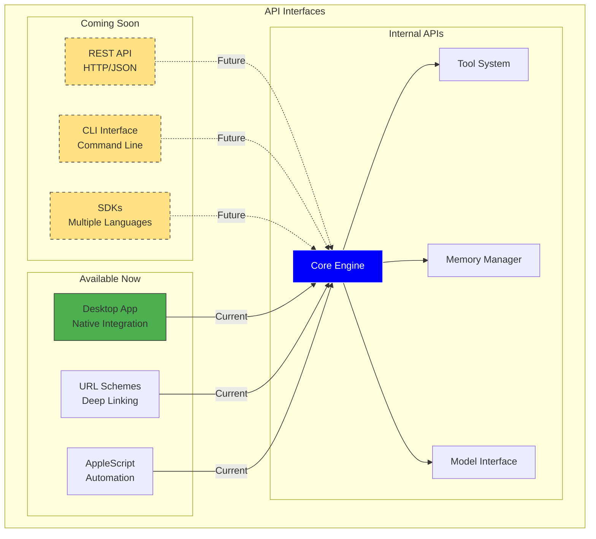

<Card title="Build on Siya's Foundation" icon="code" color="#0000FF">
  Comprehensive API documentation for integrating Siya into your applications, workflows, and tools. Whether you're building extensions, automating tasks, or creating custom integrations, this reference provides everything you need.
</Card>

<Note>
  The Siya API is currently in development. CLI and REST API access coming soon!
</Note>

## API Overview

<Frame caption="Siya's API architecture enables powerful integrations">

</Frame>

## Desktop Integration APIs

<Card title="Available Now: Desktop Automation" icon="desktop" color="#4CAF50">
  Integrate with Siya Desktop using native macOS technologies
</Card>

<Tabs>
  <Tab title="URL Schemes">
    <Card title="Deep Linking Protocol" icon="link" color="#9C27B0">
      Control Siya through URL schemes from any application
    </Card>
    
    <AccordionGroup>
      <Accordion title="URL Scheme Reference" icon="book" defaultOpen>
        <Table>
          <tr>
            <th>Action</th>
            <th>URL Format</th>
            <th>Description</th>
          </tr>
          <tr>
            <td>Open Chat</td>
            <td>`siya://chat`</td>
            <td>Open Siya main window</td>
          </tr>
          <tr>
            <td>New Chat with Prompt</td>
            <td>`siya://chat?prompt=URL_ENCODED_TEXT`</td>
            <td>Start chat with prompt</td>
          </tr>
          <tr>
            <td>Open Project</td>
            <td>`siya://project?path=/path/to/project`</td>
            <td>Open specific project</td>
          </tr>
          <tr>
            <td>Execute Command</td>
            <td>`siya://command?action=ACTION_NAME`</td>
            <td>Run Siya command</td>
          </tr>
          <tr>
            <td>Switch Model</td>
            <td>`siya://model?name=claude-opus-4`</td>
            <td>Change active model</td>
          </tr>
        </Table>
      </Accordion>
      
      <Accordion title="Examples" icon="code">
        <CodeGroup>
          ```swift Swift
          // Open Siya with a prompt
          let url = URL(string: "siya://chat?prompt=Help%20me%20debug%20this%20Swift%20code")!
          NSWorkspace.shared.open(url)
          ```
          
          ```javascript JavaScript
          // From Electron app
          const { shell } = require('electron');
          shell.openExternal('siya://chat?prompt=Generate%20unit%20tests');
          ```
          
          ```bash Terminal
          # Open from command line
          open "siya://project?path=$PWD"
          
          # With prompt
          open "siya://chat?prompt=Explain%20this%20error"
          ```
          
          ```html HTML
          <!-- From web page -->
          <a href="siya://chat?prompt=Help%20with%20React">
            Ask Siya
          </a>
          ```
        </CodeGroup>
      </Accordion>
      
      <Accordion title="URL Parameters" icon="sliders">
        <Table>
          <tr>
            <th>Parameter</th>
            <th>Type</th>
            <th>Description</th>
            <th>Example</th>
          </tr>
          <tr>
            <td>`prompt`</td>
            <td>string</td>
            <td>URL-encoded text</td>
            <td>`Hello%20Siya`</td>
          </tr>
          <tr>
            <td>`path`</td>
            <td>string</td>
            <td>File system path</td>
            <td>`/Users/me/project`</td>
          </tr>
          <tr>
            <td>`action`</td>
            <td>string</td>
            <td>Command name</td>
            <td>`clear-memory`</td>
          </tr>
          <tr>
            <td>`model`</td>
            <td>string</td>
            <td>Model identifier</td>
            <td>`gpt-5`</td>
          </tr>
          <tr>
            <td>`window`</td>
            <td>string</td>
            <td>Window mode</td>
            <td>`floating`</td>
          </tr>
        </Table>
      </Accordion>
    </AccordionGroup>
  </Tab>
  
  <Tab title="AppleScript">
    <Card title="AppleScript Automation" icon="apple" color="#000000">
      Full automation support through AppleScript
    </Card>
    
    <AccordionGroup>
      <Accordion title="Basic Commands" icon="terminal" defaultOpen>
        <CodeGroup>
          ```applescript Activation
          -- Activate Siya
          tell application "Siya"
              activate
          end tell
          
          -- Bring to front
          tell application "Siya"
              activate
              set frontmost to true
          end tell
          ```
          
          ```applescript Chat Operations
          -- Start new chat
          tell application "Siya"
              new chat
          end tell
          
          -- Send prompt
          tell application "Siya"
              new chat with prompt "Generate a Python function"
          end tell
          
          -- Get response
          tell application "Siya"
              set response to last response
          end tell
          ```
          
          ```applescript Project Management
          -- Open project
          tell application "Siya"
              open project at path "/Users/me/myproject"
          end tell
          
          -- List projects
          tell application "Siya"
              set projectList to projects
          end tell
          ```
        </CodeGroup>
      </Accordion>
      
      <Accordion title="Advanced Automation" icon="robot">
        <CodeGroup>
          ```applescript Complex Workflow
          -- Complete automation example
          tell application "Siya"
              activate
              
              -- Start new chat
              new chat
              
              -- Send complex prompt
              set myPrompt to "Analyze this code and suggest improvements"
              send prompt myPrompt
              
              -- Wait for completion
              repeat while is processing
                  delay 0.5
              end repeat
              
              -- Get and process response
              set aiResponse to last response
              
              -- Save to file
              save conversation to file "~/Desktop/analysis.md"
              
              -- Clear for next task
              clear memory
          end tell
          ```
          
          ```applescript Integration Example
          -- Integrate with other apps
          tell application "Finder"
              set selectedFiles to selection
          end tell
          
          tell application "Siya"
              activate
              new chat
              
              repeat with aFile in selectedFiles
                  set filePath to POSIX path of (aFile as alias)
                  send prompt "Analyze this file: " & filePath
              end repeat
          end tell
          ```
        </CodeGroup>
      </Accordion>
      
      <Accordion title="AppleScript Dictionary" icon="book">
        <Table>
          <tr>
            <th>Command</th>
            <th>Parameters</th>
            <th>Returns</th>
            <th>Description</th>
          </tr>
          <tr>
            <td>`activate`</td>
            <td>none</td>
            <td>void</td>
            <td>Bring Siya to front</td>
          </tr>
          <tr>
            <td>`new chat`</td>
            <td>prompt (optional)</td>
            <td>chat object</td>
            <td>Start new conversation</td>
          </tr>
          <tr>
            <td>`send prompt`</td>
            <td>text</td>
            <td>void</td>
            <td>Send message to Siya</td>
          </tr>
          <tr>
            <td>`last response`</td>
            <td>none</td>
            <td>text</td>
            <td>Get latest AI response</td>
          </tr>
          <tr>
            <td>`clear memory`</td>
            <td>none</td>
            <td>void</td>
            <td>Clear current context</td>
          </tr>
          <tr>
            <td>`is processing`</td>
            <td>none</td>
            <td>boolean</td>
            <td>Check if busy</td>
          </tr>
        </Table>
      </Accordion>
    </AccordionGroup>
  </Tab>
  
  <Tab title="Shortcuts Integration">
    <Card title="Apple Shortcuts" icon="bolt" color="#0000FF">
      Create powerful automations with Shortcuts app
    </Card>
    
    <Steps>
      <Step title="Create Shortcut">
        Open Shortcuts app and create new shortcut
      </Step>
      <Step title="Add Siya Action">
        Search for "Siya" in actions or use URL scheme
      </Step>
      <Step title="Configure Action">
        Set prompt, model, or other parameters
      </Step>
      <Step title="Test & Save">
        Run shortcut and save for reuse
      </Step>
    </Steps>
    
    <AccordionGroup>
      <Accordion title="Example Shortcuts" icon="examples" defaultOpen>
        <Columns cols={2}>
          <Card title="Code Review" icon="search">
            ```text
            1. Get clipboard
            2. Open URL: siya://chat?prompt=Review%20this%20code%3A%20{clipboard}
            3. Wait 2 seconds
            4. Copy Siya response
            ```
          </Card>
          
          <Card title="Daily Standup" icon="calendar">
            ```text
            1. Get current date
            2. Open URL: siya://chat?prompt=Generate%20standup%20for%20{date}
            3. Save response to Notes
            ```
          </Card>
        </Columns>
      </Accordion>
      
      <Accordion title="Shortcut Actions" icon="list">
        <Table>
          <tr>
            <th>Action</th>
            <th>Input</th>
            <th>Output</th>
          </tr>
          <tr>
            <td>Ask Siya</td>
            <td>Text prompt</td>
            <td>AI response</td>
          </tr>
          <tr>
            <td>Open Project</td>
            <td>Folder path</td>
            <td>Opens in Siya</td>
          </tr>
          <tr>
            <td>Process File</td>
            <td>File</td>
            <td>Analysis result</td>
          </tr>
          <tr>
            <td>Clear Context</td>
            <td>None</td>
            <td>Success status</td>
          </tr>
        </Table>
      </Accordion>
    </AccordionGroup>
  </Tab>
</Tabs>

## Coming Soon: REST API

<Card title="RESTful API Interface" icon="globe" color="#FFE082">
  Full-featured REST API for programmatic access (Coming Soon)
</Card>

<Warning>
  The REST API is currently in development. Expected release: Q1 2025
</Warning>

<Tabs>
  <Tab title="API Design Preview">
    <Frame caption="Planned REST API architecture">
      ```mermaid
      graph LR
          Client[API Client] --> Gateway[API Gateway]
          
          subgraph "API Endpoints"
              Chat[/chat]
              Models[/models]
              Projects[/projects]
              Tools[/tools]
              Memory[/memory]
          end
          
          Gateway --> Auth[Authentication]
          Auth --> RateLimit[Rate Limiting]
          RateLimit --> Chat & Models & Projects & Tools & Memory
          
          Chat --> Core[Siya Core]
          Models --> Core
          Projects --> Core
          Tools --> Core
          Memory --> Core
          
          style Gateway fill:#FFE082,stroke:#333
          style Core fill:#0000FF,stroke:#fff,color:#fff
      ```
    </Frame>
    
    <AccordionGroup>
      <Accordion title="Planned Endpoints" icon="sitemap" defaultOpen>
        <CodeGroup>
          ```yaml Authentication
          POST   /auth/login
          POST   /auth/refresh
          POST   /auth/logout
          GET    /auth/status
          ```
          
          ```yaml Chat Operations
          POST   /chat/completions
          GET    /chat/history
          GET    /chat/{id}
          DELETE /chat/{id}
          POST   /chat/{id}/continue
          ```
          
          ```yaml Model Management
          GET    /models
          GET    /models/{id}
          POST   /models/select
          GET    /models/current
          ```
          
          ```yaml Project Operations
          GET    /projects
          POST   /projects
          GET    /projects/{id}
          PUT    /projects/{id}
          DELETE /projects/{id}
          ```
        </CodeGroup>
      </Accordion>
      
      <Accordion title="Request/Response Format" icon="code">
        <CodeGroup>
          ```json Chat Request
          {
            "model": "claude-opus-4",
            "messages": [
              {
                "role": "user",
                "content": "Help me optimize this function"
              }
            ],
            "temperature": 0.7,
            "max_tokens": 4000,
            "tools": ["code_analysis", "testing"],
            "stream": false
          }
          ```
          
          ```json Chat Response
          {
            "id": "chat_abc123",
            "object": "chat.completion",
            "created": 1699000000,
            "model": "claude-opus-4",
            "choices": [
              {
                "index": 0,
                "message": {
                  "role": "assistant",
                  "content": "I'll help you optimize..."
                },
                "finish_reason": "stop"
              }
            ],
            "usage": {
              "prompt_tokens": 150,
              "completion_tokens": 500,
              "total_tokens": 650
            }
          }
          ```
        </CodeGroup>
      </Accordion>
    </AccordionGroup>
  </Tab>
  
  <Tab title="Authentication">
    <Card title="Secure API Access" icon="key" color="#4CAF50">
      Multiple authentication methods for different use cases
    </Card>
    
    <AccordionGroup>
      <Accordion title="API Key Authentication" icon="key" defaultOpen>
        ```bash
        # Header authentication
        curl -X POST https://api.siya.com/v1/chat/completions \
          -H "Authorization: Bearer YOUR_API_KEY" \
          -H "Content-Type: application/json" \
          -d '{"prompt": "Hello Siya"}'
        ```
        
        <Steps>
          <Step title="Generate API Key">
            Create keys in Siya Dashboard
          </Step>
          <Step title="Set Permissions">
            Configure scope and rate limits
          </Step>
          <Step title="Use in Requests">
            Include in Authorization header
          </Step>
        </Steps>
      </Accordion>
      
      <Accordion title="OAuth 2.0" icon="shield">
        ```javascript
        // OAuth flow example
        const auth = new SiyaAuth({
          clientId: 'YOUR_CLIENT_ID',
          clientSecret: 'YOUR_CLIENT_SECRET',
          redirectUri: 'https://yourapp.com/callback'
        });
        
        // Get authorization URL
        const authUrl = auth.getAuthorizationUrl({
          scope: ['chat', 'projects', 'models'],
          state: 'random_state'
        });
        
        // Exchange code for token
        const token = await auth.exchangeCode(code);
        ```
      </Accordion>
    </AccordionGroup>
  </Tab>
  
  <Tab title="SDKs">
    <Card title="Official SDKs" icon="package" color="#9C27B0">
      Native SDKs for popular languages (Coming Soon)
    </Card>
    
    <Columns cols={3}>
      <Card title="JavaScript/TypeScript" icon="js">
        ```bash
        npm install @siya/sdk
        ```
        
        ```javascript
        import { Siya } from '@siya/sdk';
        
        const siya = new Siya({
          apiKey: process.env.SIYA_API_KEY
        });
        
        const response = await siya.chat.create({
          model: 'claude-opus-4',
          messages: [...]
        });
        ```
      </Card>
      
      <Card title="Python" icon="python">
        ```bash
        pip install siya-sdk
        ```
        
        ```python
        from siya import Siya
        
        client = Siya(
            api_key=os.environ["SIYA_API_KEY"]
        )
        
        response = client.chat.create(
            model="claude-opus-4",
            messages=[...]
        )
        ```
      </Card>
      
      <Card title="Go" icon="golang">
        ```bash
        go get github.com/siya/siya-go
        ```
        
        ```go
        import "github.com/siya/siya-go"
        
        client := siya.NewClient(
            siya.WithAPIKey(apiKey),
        )
        
        resp, err := client.Chat.Create(ctx, &siya.ChatRequest{
            Model: "claude-opus-4",
            Messages: messages,
        })
        ```
      </Card>
    </Columns>
  </Tab>
</Tabs>

## Coming Soon: CLI

<Card title="Command Line Interface" icon="terminal" color="#4CAF50">
  Powerful CLI for terminal workflows (Coming Soon)
</Card>

<Warning>
  The CLI is currently in development. Expected release: Q1 2025
</Warning>

<Tabs>
  <Tab title="CLI Preview">
    <CodeGroup>
      ```bash Installation
      # Install via Homebrew (macOS)
      brew install siya-cli
      
      # Install via npm
      npm install -g @siya/cli
      
      # Install via curl
      curl -fsSL https://siya.com/install.sh | sh
      ```
      
      ```bash Basic Usage
      # Start interactive session
      siya chat
      
      # One-shot prompt
      siya ask "Explain this error: ..."
      
      # Analyze file
      siya analyze main.py
      
      # Generate code
      siya generate "REST API for user management"
      ```
      
      ```bash Advanced Features
      # Use specific model
      siya chat --model claude-opus-4
      
      # Project context
      siya --project /path/to/project chat
      
      # Pipe input
      cat error.log | siya debug
      
      # Save output
      siya generate "test suite" > tests.py
      ```
    </CodeGroup>
  </Tab>
  
  <Tab title="Planned Commands">
    <Table>
      <tr>
        <th>Command</th>
        <th>Description</th>
        <th>Example</th>
      </tr>
      <tr>
        <td>`chat`</td>
        <td>Interactive chat session</td>
        <td>`siya chat`</td>
      </tr>
      <tr>
        <td>`ask`</td>
        <td>One-shot question</td>
        <td>`siya ask "How do I..."`</td>
      </tr>
      <tr>
        <td>`analyze`</td>
        <td>Analyze code files</td>
        <td>`siya analyze src/`</td>
      </tr>
      <tr>
        <td>`generate`</td>
        <td>Generate code</td>
        <td>`siya generate "API endpoint"`</td>
      </tr>
      <tr>
        <td>`debug`</td>
        <td>Debug errors</td>
        <td>`siya debug error.log`</td>
      </tr>
      <tr>
        <td>`test`</td>
        <td>Generate tests</td>
        <td>`siya test main.py`</td>
      </tr>
      <tr>
        <td>`config`</td>
        <td>Manage settings</td>
        <td>`siya config set model gpt-5`</td>
      </tr>
    </Table>
  </Tab>
  
  <Tab title="CLI Configuration">
    <CodeGroup>
      ```yaml ~/.siya/cli-config.yaml
      # Default configuration
      defaults:
        model: claude-sonnet-4
        temperature: 0.7
        max_tokens: 4000
      
      # Project overrides
      projects:
        - path: ~/work/frontend
          model: claude-opus-4
          context: 
            - src/
            - package.json
        
        - path: ~/work/backend
          model: deepseek-coder
          context:
            - api/
            - requirements.txt
      
      # Aliases
      aliases:
        review: "analyze --detailed --suggest-improvements"
        quick: "ask --model gemini-flash"
      ```
      
      ```bash Environment Variables
      # API Configuration
      export SIYA_API_KEY="your-api-key"
      export SIYA_API_URL="https://api.siya.com"
      
      # Default Settings
      export SIYA_MODEL="claude-opus-4"
      export SIYA_PROJECT="$PWD"
      
      # CLI Behavior
      export SIYA_COLOR="auto"
      export SIYA_FORMAT="markdown"
      ```
    </CodeGroup>
  </Tab>
</Tabs>

## Integration Examples

<Card title="Real-World Integration Patterns" icon="puzzle-piece" color="#9C27B0">
  Examples of how to integrate Siya into your workflow
</Card>

<Tabs>
  <Tab title="IDE Integration">
    <AccordionGroup>
      <Accordion title="VS Code Extension" icon="code" defaultOpen>
        ```javascript
        // VS Code extension example
        const vscode = require('vscode');
        
        function activate(context) {
            // Register command
            let disposable = vscode.commands.registerCommand(
                'siya.askQuestion',
                async () => {
                    // Get selected text
                    const editor = vscode.window.activeTextEditor;
                    const selection = editor.selection;
                    const text = editor.document.getText(selection);
                    
                    // Open Siya with context
                    const prompt = encodeURIComponent(
                        `Explain this code:\n${text}`
                    );
                    vscode.env.openExternal(
                        vscode.Uri.parse(`siya://chat?prompt=${prompt}`)
                    );
                }
            );
            
            context.subscriptions.push(disposable);
        }
        ```
      </Accordion>
      
      <Accordion title="JetBrains Plugin" icon="jet">
        ```kotlin
        // IntelliJ IDEA plugin example
        class SiyaAction : AnAction() {
            override fun actionPerformed(e: AnActionEvent) {
                val editor = e.getData(CommonDataKeys.EDITOR)
                val selectedText = editor?.selectionModel?.selectedText
                
                if (selectedText != null) {
                    val prompt = URLEncoder.encode(
                        "Review this code: $selectedText",
                        "UTF-8"
                    )
                    Desktop.getDesktop().browse(
                        URI("siya://chat?prompt=$prompt")
                    )
                }
            }
        }
        ```
      </Accordion>
    </AccordionGroup>
  </Tab>
  
  <Tab title="CI/CD Integration">
    <CodeGroup>
      ```yaml GitHub Actions
      name: Code Review with Siya
      
      on:
        pull_request:
          types: [opened, synchronize]
      
      jobs:
        review:
          runs-on: ubuntu-latest
          steps:
            - uses: actions/checkout@v3
            
            - name: Siya Code Review
              uses: siya/code-review-action@v1
              with:
                api-key: ${{ secrets.SIYA_API_KEY }}
                model: claude-opus-4
                focus-areas:
                  - security
                  - performance
                  - best-practices
            
            - name: Comment PR
              uses: actions/github-script@v6
              with:
                script: |
                  github.rest.issues.createComment({
                    issue_number: context.issue.number,
                    owner: context.repo.owner,
                    repo: context.repo.repo,
                    body: process.env.SIYA_REVIEW
                  })
      ```
      
      ```groovy Jenkins Pipeline
      pipeline {
          agent any
          
          stages {
              stage('Code Analysis') {
                  steps {
                      script {
                          def siyaResponse = sh(
                              script: """
                                  siya analyze src/ \
                                    --model claude-opus-4 \
                                    --output json
                              """,
                              returnStdout: true
                          )
                          
                          def analysis = readJSON text: siyaResponse
                          
                          if (analysis.issues.critical > 0) {
                              error "Critical issues found"
                          }
                      }
                  }
              }
          }
      }
      ```
    </CodeGroup>
  </Tab>
  
  <Tab title="Automation Scripts">
    <CodeGroup>
      ```python Python Automation
      import subprocess
      import urllib.parse
      
      class SiyaAutomation:
          def __init__(self):
              self.base_url = "siya://"
          
          def ask_siya(self, prompt):
              """Send prompt to Siya and get response"""
              encoded = urllib.parse.quote(prompt)
              url = f"{self.base_url}chat?prompt={encoded}"
              
              # Open Siya with prompt
              subprocess.run(["open", url])
          
          def analyze_project(self, path):
              """Open project in Siya"""
              url = f"{self.base_url}project?path={path}"
              subprocess.run(["open", url])
          
          def batch_review(self, files):
              """Review multiple files"""
              for file in files:
                  with open(file, 'r') as f:
                      content = f.read()
                  
                  prompt = f"Review this {file}: {content[:1000]}"
                  self.ask_siya(prompt)
      ```
      
      ```javascript Node.js Automation
      const { exec } = require('child_process');
      const path = require('path');
      
      class SiyaIntegration {
          constructor() {
              this.baseUrl = 'siya://';
          }
          
          async sendPrompt(prompt) {
              const encoded = encodeURIComponent(prompt);
              const url = `${this.baseUrl}chat?prompt=${encoded}`;
              
              return new Promise((resolve, reject) => {
                  exec(`open "${url}"`, (error) => {
                      if (error) reject(error);
                      else resolve();
                  });
              });
          }
          
          async reviewCode(filePath) {
              const content = await fs.readFile(filePath, 'utf8');
              const prompt = `Review this code from ${path.basename(filePath)}:\n${content}`;
              await this.sendPrompt(prompt);
          }
          
          async generateTests(sourceFile) {
              const prompt = `Generate comprehensive tests for ${sourceFile}`;
              await this.sendPrompt(prompt);
          }
      }
      ```
    </CodeGroup>
  </Tab>
</Tabs>

## Webhooks & Events

<Card title="Event-Driven Integration" icon="broadcast-tower" color="#FF9800">
  Subscribe to Siya events for real-time integration (Coming Soon)
</Card>

<Tabs>
  <Tab title="Webhook Configuration">
    ```json
    {
      "webhooks": {
        "endpoints": [
          {
            "url": "https://api.company.com/siya-webhook",
            "events": ["task.completed", "error.occurred"],
            "secret": "webhook_secret_key"
          }
        ],
        "retry": {
          "attempts": 3,
          "backoff": "exponential"
        }
      }
    }
    ```
  </Tab>
  
  <Tab title="Event Types">
    <Table>
      <tr>
        <th>Event</th>
        <th>Payload</th>
        <th>Description</th>
      </tr>
      <tr>
        <td>`task.started`</td>
        <td>Task details</td>
        <td>Task execution begins</td>
      </tr>
      <tr>
        <td>`task.completed`</td>
        <td>Task result</td>
        <td>Task finishes successfully</td>
      </tr>
      <tr>
        <td>`task.failed`</td>
        <td>Error details</td>
        <td>Task encounters error</td>
      </tr>
      <tr>
        <td>`model.switched`</td>
        <td>Model info</td>
        <td>Active model changes</td>
      </tr>
      <tr>
        <td>`memory.checkpoint`</td>
        <td>Checkpoint ID</td>
        <td>Memory saved</td>
      </tr>
    </Table>
  </Tab>
</Tabs>

## Rate Limits & Quotas

<Card title="API Usage Limits" icon="gauge" color="#F44336">
  Understand rate limits and quotas for API usage
</Card>

<Table>
  <tr>
    <th>Tier</th>
    <th>Requests/Min</th>
    <th>Requests/Day</th>
    <th>Concurrent</th>
    <th>Context Size</th>
  </tr>
  <tr>
    <td>Free</td>
    <td>10</td>
    <td>1,000</td>
    <td>1</td>
    <td>32K</td>
  </tr>
  <tr>
    <td>Pro</td>
    <td>60</td>
    <td>10,000</td>
    <td>5</td>
    <td>200K</td>
  </tr>
  <tr>
    <td>Team</td>
    <td>300</td>
    <td>100,000</td>
    <td>20</td>
    <td>1M</td>
  </tr>
  <tr>
    <td>Enterprise</td>
    <td>Custom</td>
    <td>Unlimited</td>
    <td>Custom</td>
    <td>Custom</td>
  </tr>
</Table>

## Error Handling

<Card title="Robust Error Handling" icon="exclamation-triangle" color="#FF9800">
  Handle API errors gracefully
</Card>

<CodeGroup>
  ```javascript JavaScript
  try {
      const response = await siya.chat.create({
          model: 'claude-opus-4',
          messages: messages
      });
  } catch (error) {
      if (error.status === 429) {
          // Rate limit exceeded
          const retryAfter = error.headers['retry-after'];
          await sleep(retryAfter * 1000);
          // Retry request
      } else if (error.status === 401) {
          // Authentication failed
          await refreshToken();
      } else if (error.status >= 500) {
          // Server error - implement exponential backoff
          await retryWithBackoff(request);
      }
  }
  ```
  
  ```python Python
  from siya.errors import RateLimitError, AuthenticationError
  
  try:
      response = client.chat.create(
          model="claude-opus-4",
          messages=messages
      )
  except RateLimitError as e:
      # Wait and retry
      time.sleep(e.retry_after)
      response = client.chat.create(...)
  except AuthenticationError:
      # Refresh authentication
      client.refresh_auth()
  except Exception as e:
      # Log and handle gracefully
      logger.error(f"Siya API error: {e}")
  ```
</CodeGroup>

## Best Practices

<Card title="API Integration Best Practices" icon="medal" color="#FFD700">
  Follow these guidelines for robust integrations
</Card>

<AccordionGroup>
  <Accordion title="Security" icon="shield" defaultOpen>
    <Columns cols={2}>
      <Card title="Do's" icon="check" color="#4CAF50">
        - Store API keys securely
        - Use environment variables
        - Implement request signing
        - Validate webhooks
        - Use HTTPS always
        - Rotate keys regularly
      </Card>
      
      <Card title="Don'ts" icon="times" color="#F44336">
        - Hardcode credentials
        - Log sensitive data
        - Share API keys
        - Ignore SSL errors
        - Skip authentication
        - Trust user input
      </Card>
    </Columns>
  </Accordion>
  
  <Accordion title="Performance" icon="gauge">
    <Steps>
      <Step title="Implement Caching">
        Cache responses when appropriate
      </Step>
      <Step title="Use Batch Operations">
        Group related requests together
      </Step>
      <Step title="Handle Rate Limits">
        Implement proper backoff strategies
      </Step>
      <Step title="Optimize Payloads">
        Send only necessary data
      </Step>
    </Steps>
  </Accordion>
  
  <Accordion title="Reliability" icon="shield-check">
    - Implement retry logic with exponential backoff
    - Handle timeouts gracefully
    - Log all API interactions
    - Monitor API health
    - Have fallback strategies
  </Accordion>
</AccordionGroup>

## Summary

<Card title="Build Amazing Integrations" icon="trophy" color="#FFD700">
  Siya's API ecosystem provides powerful integration capabilities, from simple URL schemes available today to the comprehensive REST API and CLI coming soon. Whether you're automating workflows, building extensions, or creating custom integrations, Siya's APIs give you the flexibility and power you need.
</Card>

<Columns cols={2}>
  <Card title="Get Started Today" icon="rocket" href="/siya-superagent/desktop-application">
    Start with Desktop integration
  </Card>
  
  <Card title="Stay Updated" icon="bell" href="https://siya.com/developers">
    Join the developer newsletter
  </Card>
</Columns>

---

*Build on Siya. Extend your capabilities. Create the future.*