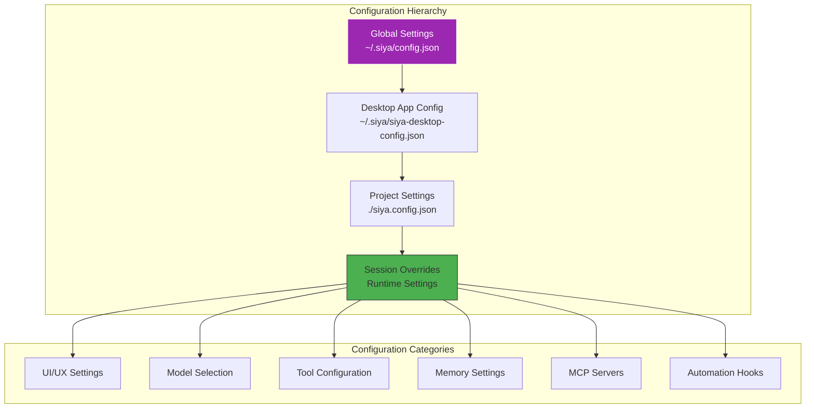
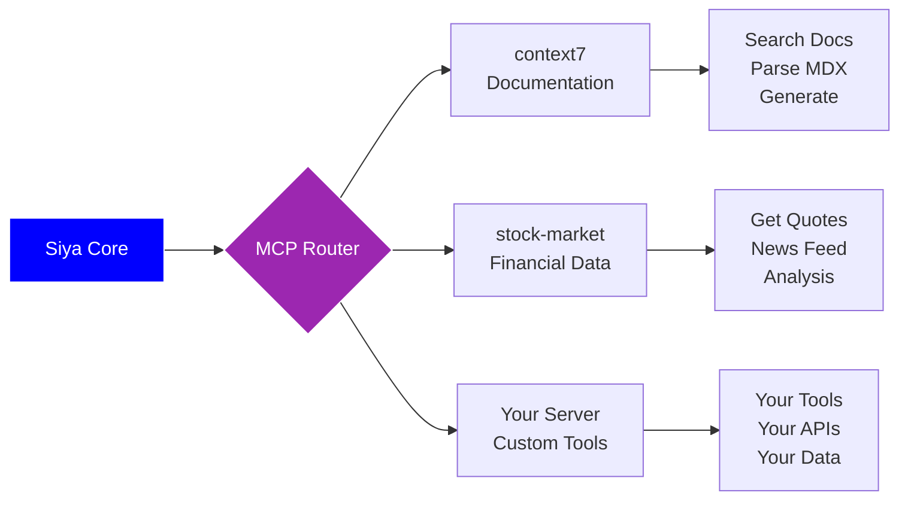
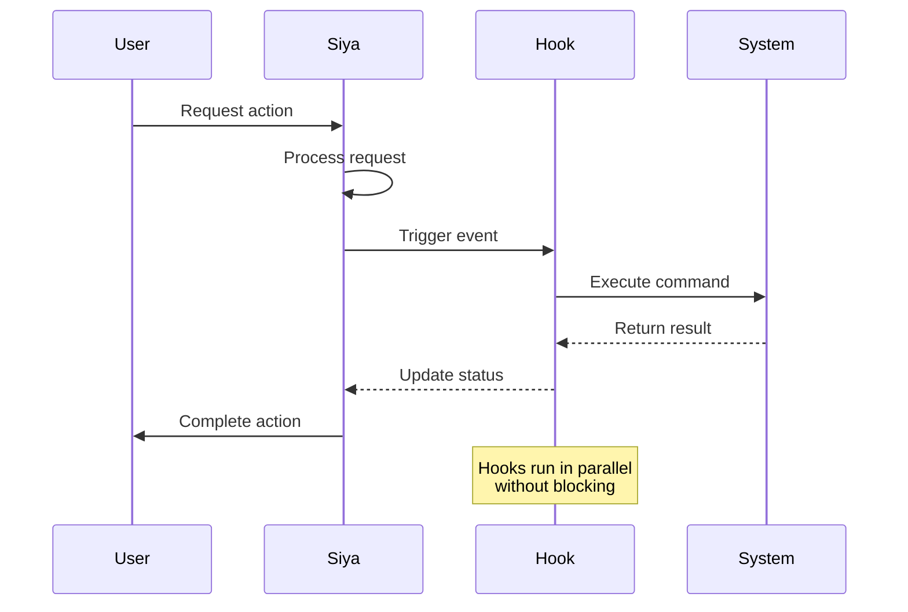

<Card title="Your Siya, Your Way" icon="palette" color="#9C27B0">
  Siya is highly customizable, allowing you to tailor every aspect of the experience to your needs. From UI preferences to model selection, tool configurations to custom workflows - make Siya work exactly how you want it to.
</Card>

## Configuration Overview

<Frame caption="Siya's hierarchical configuration system provides flexibility at every level">

</Frame>

## Configuration Files

<Tabs>
  <Tab title="Global Config">
    <Card title="~/.siya/config.json" icon="globe" color="#9C27B0">
      System-wide settings that apply to all Siya instances
    </Card>
    
    ```json
    {
      "defaultModel": "claude-opus-4",
      "theme": "dark",
      "editor": {
        "fontSize": 14,
        "fontFamily": "JetBrains Mono",
        "tabSize": 2,
        "wordWrap": true
      },
      "notifications": {
        "sound": true,
        "desktop": true,
        "email": false
      },
      "telemetry": {
        "enabled": false,
        "level": "errors"
      },
      "experimental": {
        "betaFeatures": true,
        "debugMode": false
      }
    }
    ```
    
    <AccordionGroup>
      <Accordion title="Setting Categories" icon="folder-tree" defaultOpen>
        <Columns cols={2}>
          <Card title="Core Settings" icon="cog">
            - Default model selection
            - UI theme preferences
            - Language settings
            - Timezone configuration
          </Card>
          
          <Card title="Developer Settings" icon="code">
            - Editor preferences
            - Code formatting
            - Syntax highlighting
            - Debug options
          </Card>
        </Columns>
        
        <Columns cols={2}>
          <Card title="Privacy Settings" icon="shield">
            - Telemetry control
            - Data retention
            - Logging levels
            - Analytics opt-out
          </Card>
          
          <Card title="Advanced Settings" icon="flask">
            - Experimental features
            - Beta access
            - Performance tuning
            - Custom endpoints
          </Card>
        </Columns>
      </Accordion>
    </AccordionGroup>
  </Tab>
  
  <Tab title="Desktop Config">
    <Card title="~/.siya/siya-desktop-config.json" icon="desktop" color="#4CAF50">
      Desktop application specific settings including MCP servers
    </Card>
    
    ```json
    {
      "window": {
        "width": 1200,
        "height": 800,
        "alwaysOnTop": false,
        "transparency": 0.95
      },
      "shortcuts": {
        "toggleWindow": "Cmd+Shift+S",
        "newChat": "Cmd+N",
        "clearMemory": "Cmd+K",
        "openSettings": "Cmd+,"
      },
      "mcpServers": {
        "context7": {
          "command": "npx",
          "args": ["context7"],
          "autoStart": true
        },
        "stock-market": {
          "command": "node",
          "args": ["/path/to/stock-mcp/index.js"],
          "env": {
            "API_KEY": "your-api-key"
          }
        }
      },
      "startup": {
        "launchAtLogin": true,
        "minimizeToTray": true,
        "checkUpdates": true
      }
    }
    ```
    
    <Info>
      Desktop configuration is automatically watched - changes take effect immediately without restart
    </Info>
  </Tab>
  
  <Tab title="Project Config">
    <Card title="./siya.config.json" icon="folder" color="#FF9800">
      Project-specific settings that override global defaults
    </Card>
    
    ```json
    {
      "project": {
        "name": "My Awesome App",
        "type": "web",
        "framework": "react",
        "language": "typescript"
      },
      "conventions": {
        "componentStyle": "functional",
        "stateManagement": "zustand",
        "styling": "tailwind",
        "testing": "vitest"
      },
      "tools": {
        "linter": "npm run lint",
        "typecheck": "npm run typecheck",
        "test": "npm test",
        "build": "npm run build"
      },
      "siya": {
        "autoRunChecks": true,
        "suggestTests": true,
        "enforceTypes": true,
        "documentCode": false
      }
    }
    ```
    
    <Tip>
      Create a `siya.config.json` in your project root to maintain consistent behavior across team members
    </Tip>
  </Tab>
  
  <Tab title="SIYA.md">
    <Card title="Project Context File" icon="book" color="#0000FF">
      Natural language project documentation for Siya's understanding
    </Card>
    
    ```markdown
    # Project Context for Siya
    
    ## Overview
    This is an e-commerce platform built with Next.js and Supabase.
    
    ## Architecture
    - Frontend: Next.js 14 with App Router
    - Backend: Supabase (PostgreSQL + Auth)
    - Styling: Tailwind CSS with custom design system
    - State: Zustand for client state
    
    ## Conventions
    - Use functional components with TypeScript
    - Follow Airbnb style guide
    - Test with Vitest and React Testing Library
    - Commit messages: conventional commits
    
    ## Important Context
    - The checkout flow has custom business logic in `lib/checkout.ts`
    - We use a custom authentication wrapper in `components/auth`
    - Database migrations are in `supabase/migrations`
    
    ## Common Tasks
    - Run `npm run dev` to start development
    - Run `npm run db:push` to apply migrations
    - Run `npm run test:e2e` before deploying
    ```
    
    <Note>
      SIYA.md provides human-readable context that helps Siya understand your project better
    </Note>
  </Tab>
</Tabs>

## Model Configuration

<Card title="Choose Your AI Model" icon="brain" color="#0000FF">
  Select from cutting-edge AI models or run locally with complete privacy
</Card>

<Tabs>
  <Tab title="Cloud Models">
    <AccordionGroup>
      <Accordion title="Available Models" icon="cloud" defaultOpen>
        <Columns cols={2}>
          <Card title="Claude Models" icon="robot" color="#9C27B0">
            **Claude Opus 4**
            - Most capable model
            - Best for complex tasks
            - Superior reasoning
            
            **Claude Sonnet 4**
            - Balanced performance
            - Faster responses
            - Cost-effective
          </Card>
          
          <Card title="OpenAI Models" icon="openai" color="#74AA9C">
            **GPT-5**
            - Latest generation
            - Multimodal capable
            - Extended context
            
            **GPT-4 Turbo**
            - Production ready
            - Reliable performance
            - Good value
          </Card>
        </Columns>
        
        <Columns cols={2}>
          <Card title="Google Models" icon="google" color="#4285F4">
            **Gemini 2.5 Pro**
            - Massive context window
            - Multimodal native
            - Fast inference
            
            **Gemini 2.5 Flash**
            - Lightning fast
            - Cost optimized
            - Good for simple tasks
          </Card>
          
          <Card title="Specialized Models" icon="star" color="#FFD700">
            **DeepSeek Coder**
            - Code specialized
            - Technical tasks
            - Open weights
            
            **Qwen 2.5**
            - Multilingual
            - Strong reasoning
            - Efficient
          </Card>
        </Columns>
      </Accordion>
      
      <Accordion title="Model Selection Strategy" icon="strategy">
        ```mermaid
        flowchart TD
            Task[Analyze Task] --> Complex{Complex?}
            
            Complex -->|Yes| Size{Large Context?}
            Complex -->|No| Speed{Speed Critical?}
            
            Size -->|Yes| Gemini[Gemini 2.5 Pro]
            Size -->|No| Opus[Claude Opus 4]
            
            Speed -->|Yes| Flash[Gemini Flash]
            Speed -->|No| Sonnet[Claude Sonnet 4]
            
            Opus --> Features{Special Needs?}
            Features -->|Coding| DeepSeek[DeepSeek Coder]
            Features -->|General| UseOpus[Use Selected]
            
            style Opus fill:#9C27B0,stroke:#fff,color:#fff
            style Gemini fill:#4285F4,stroke:#fff,color:#fff
        ```
      </Accordion>
      
      <Accordion title="API Configuration" icon="key">
        <CodeGroup>
          ```bash Environment Variables
          # Claude API
          export ANTHROPIC_API_KEY="sk-ant-..."
          
          # OpenAI API
          export OPENAI_API_KEY="sk-..."
          
          # Google API
          export GOOGLE_API_KEY="AIza..."
          
          # Custom Endpoints
          export LLM_GATEWAY_URL="https://your-gateway.com"
          ```
          
          ```json Configuration File
          {
            "models": {
              "providers": {
                "anthropic": {
                  "apiKey": "${ANTHROPIC_API_KEY}",
                  "baseURL": "https://api.anthropic.com",
                  "defaultModel": "claude-opus-4"
                },
                "openai": {
                  "apiKey": "${OPENAI_API_KEY}",
                  "organization": "org-...",
                  "defaultModel": "gpt-5"
                }
              }
            }
          }
          ```
        </CodeGroup>
      </Accordion>
    </AccordionGroup>
  </Tab>
  
  <Tab title="Local Models">
    <Card title="Run Models Locally" icon="server" color="#4CAF50">
      Complete privacy and control with local model execution
    </Card>
    
    <Steps>
      <Step title="Download Model">
        Choose and download a llamafile from supported models
      </Step>
      <Step title="Place in Directory">
        Move the file to `~/.siya/local-models/`
      </Step>
      <Step title="Make Executable">
        Run `chmod +x model-name.llamafile`
      </Step>
      <Step title="Select in Siya">
        Choose the local model from Siya's model selector
      </Step>
    </Steps>
    
    <AccordionGroup>
      <Accordion title="Supported Local Models" icon="download" defaultOpen>
        <Table>
          <tr>
            <th>Model</th>
            <th>Size</th>
            <th>Capabilities</th>
            <th>Requirements</th>
          </tr>
          <tr>
            <td>Qwen 2.5 Coder 32B</td>
            <td>19GB</td>
            <td>Excellent coding</td>
            <td>32GB RAM</td>
          </tr>
          <tr>
            <td>DeepSeek Coder 33B</td>
            <td>18GB</td>
            <td>Code specialist</td>
            <td>32GB RAM</td>
          </tr>
          <tr>
            <td>Llama 3.3 70B</td>
            <td>40GB</td>
            <td>General purpose</td>
            <td>64GB RAM</td>
          </tr>
          <tr>
            <td>Mistral 7B</td>
            <td>4GB</td>
            <td>Fast, efficient</td>
            <td>8GB RAM</td>
          </tr>
        </Table>
      </Accordion>
      
      <Accordion title="Performance Optimization" icon="gauge">
        <Columns cols={2}>
          <Card title="Hardware Acceleration" icon="microchip">
            ```bash
            # Enable GPU acceleration
            export CUDA_VISIBLE_DEVICES=0
            export LLAMAFILE_GPU=1
            
            # Metal acceleration (macOS)
            export LLAMAFILE_USE_METAL=1
            ```
          </Card>
          
          <Card title="Memory Settings" icon="memory">
            ```bash
            # Adjust context size
            export LLAMAFILE_CTX=8192
            
            # Set thread count
            export LLAMAFILE_THREADS=8
            ```
          </Card>
        </Columns>
      </Accordion>
    </AccordionGroup>
  </Tab>
</Tabs>

## Tool Configuration

<Card title="Power Up Your Tools" icon="tools" color="#07C983">
  Configure tools to match your development workflow perfectly
</Card>

<AccordionGroup>
  <Accordion title="File System Tools" icon="folder" defaultOpen>
    ```json
    {
      "tools": {
        "fileSystem": {
          "defaultPermissions": "conservative",
          "autoBackup": true,
          "excludePatterns": [
            "node_modules/**",
            ".git/**",
            "*.log",
            "dist/**"
          ],
          "watchPatterns": [
            "src/**/*.{ts,tsx,js,jsx}",
            "*.config.{js,ts}"
          ],
          "encoding": "utf-8",
          "lineEndings": "auto"
        }
      }
    }
    ```
    
    <Columns cols={3}>
      <Card title="Safety Features" icon="shield">
        - Automatic backups
        - Permission checks
        - Destructive warnings
        - Undo capability
      </Card>
      
      <Card title="Performance" icon="rocket">
        - Smart caching
        - Batch operations
        - Async I/O
        - Memory mapping
      </Card>
      
      <Card title="Integration" icon="plug">
        - Git awareness
        - Build tool hooks
        - IDE sync
        - File watchers
      </Card>
    </Columns>
  </Accordion>
  
  <Accordion title="Code Analysis Tools" icon="code">
    ```json
    {
      "tools": {
        "codeAnalysis": {
          "ast": {
            "enabled": true,
            "languages": ["typescript", "javascript", "python"],
            "maxFileSize": "10MB"
          },
          "linting": {
            "autoFix": false,
            "showSuggestions": true,
            "severity": "warning"
          },
          "typeChecking": {
            "strict": true,
            "incremental": true,
            "skipLibCheck": false
          }
        }
      }
    }
    ```
    
    <Info>
      Code analysis tools help Siya understand your codebase structure and maintain quality
    </Info>
  </Accordion>
  
  <Accordion title="Search Tools" icon="search">
    <Tabs>
      <Tab title="Grep Configuration">
        ```json
        {
          "tools": {
            "grep": {
              "engine": "ripgrep",
              "defaultFlags": ["--smart-case", "--hidden"],
              "ignoreFile": ".gitignore",
              "maxResults": 1000,
              "contextLines": 2
            }
          }
        }
        ```
      </Tab>
      
      <Tab title="Semantic Search">
        ```json
        {
          "tools": {
            "semanticSearch": {
              "enabled": true,
              "indexing": {
                "automatic": true,
                "schedule": "on-change",
                "languages": ["all"]
              },
              "embedding": {
                "model": "text-embedding-3-large",
                "dimensions": 1536
              }
            }
          }
        }
        ```
      </Tab>
    </Tabs>
  </Accordion>
  
  <Accordion title="Execution Tools" icon="terminal">
    ```json
    {
      "tools": {
        "execution": {
          "shell": "/bin/zsh",
          "timeout": 120000,
          "sandbox": {
            "enabled": true,
            "networking": false,
            "filesystem": "read-only"
          },
          "environment": {
            "NODE_ENV": "development",
            "PYTHONPATH": "./src"
          }
        }
      }
    }
    ```
    
    <Warning>
      Sandbox mode restricts network and filesystem access for safety
    </Warning>
  </Accordion>
</AccordionGroup>

## MCP Server Configuration

<Card title="Extend with MCP Servers" icon="plug" color="#0000FF">
  Connect specialized tools and services through Model Context Protocol
</Card>

<Frame caption="MCP servers extend Siya's capabilities with domain-specific tools">

</Frame>

<Tabs>
  <Tab title="Quick Setup">
    <Steps>
      <Step title="Ask Siya">
        Simply tell Siya: "Configure the stock-market MCP server"
      </Step>
      <Step title="Automatic Configuration">
        Siya will handle the installation and configuration
      </Step>
      <Step title="Start Using">
        The server's tools are immediately available
      </Step>
    </Steps>
    
    <Info>
      Siya can configure any MCP server from a GitHub URL or npm package name
    </Info>
  </Tab>
  
  <Tab title="Manual Setup">
    <CodeGroup>
      ```json Basic Configuration
      {
        "mcpServers": {
          "myServer": {
            "command": "node",
            "args": ["./mcp-server/index.js"]
          }
        }
      }
      ```
      
      ```json Advanced Configuration
      {
        "mcpServers": {
          "myServer": {
            "command": "npx",
            "args": ["@mycompany/mcp-server", "--port", "3000"],
            "env": {
              "API_KEY": "${MY_API_KEY}",
              "LOG_LEVEL": "debug"
            },
            "autoStart": true,
            "restartOnFailure": true,
            "healthCheck": {
              "interval": 30000,
              "timeout": 5000
            }
          }
        }
      }
      ```
    </CodeGroup>
  </Tab>
  
  <Tab title="Available Servers">
    <AccordionGroup>
      <Accordion title="Official Servers" icon="check-circle" defaultOpen>
        <Columns cols={2}>
          <Card title="context7" icon="book">
            Documentation parsing and generation
            - Search documentation
            - Parse MDX/Markdown
            - Generate docs
            - Extract examples
          </Card>
          
          <Card title="stock-market" icon="chart-line">
            Financial data and analysis
            - Real-time quotes
            - Market news
            - Technical analysis
            - Portfolio tracking
          </Card>
        </Columns>
      </Accordion>
      
      <Accordion title="Community Servers" icon="users">
        <Table>
          <tr>
            <th>Server</th>
            <th>Description</th>
            <th>Install Command</th>
          </tr>
          <tr>
            <td>Database Manager</td>
            <td>SQL operations, migrations</td>
            <td>`npm install mcp-database`</td>
          </tr>
          <tr>
            <td>AWS Toolkit</td>
            <td>AWS service integration</td>
            <td>`npm install mcp-aws`</td>
          </tr>
          <tr>
            <td>API Testing</td>
            <td>REST/GraphQL testing</td>
            <td>`npm install mcp-api-test`</td>
          </tr>
        </Table>
      </Accordion>
    </AccordionGroup>
  </Tab>
</Tabs>

## Hooks Configuration

<Card title="Automate Your Workflow" icon="robot" color="#4CAF50">
  Create powerful automations that trigger on Siya's actions
</Card>

<Frame caption="Hooks enable event-driven automation within Siya">

</Frame>

<Tabs>
  <Tab title="Creating Hooks">
    <Steps>
      <Step title="Natural Language">
        Tell Siya: "Create a hook that runs tests whenever I modify a test file"
      </Step>
      <Step title="Siya Generates">
        Siya creates the appropriate hook configuration
      </Step>
      <Step title="Automatic Activation">
        Hook starts working immediately
      </Step>
    </Steps>
    
    <CodeGroup>
      ```json Example Hook
      {
        "hooks": [
          {
            "name": "Auto-test on change",
            "event": "file:modified",
            "pattern": "**/*.test.{js,ts}",
            "command": "npm test -- ${file}",
            "enabled": true
          }
        ]
      }
      ```
      
      ```json Complex Hook
      {
        "hooks": [
          {
            "name": "Deploy on main",
            "event": "git:push",
            "condition": "branch === 'main'",
            "commands": [
              "npm run build",
              "npm run test",
              "npm run deploy"
            ],
            "notifications": {
              "success": "desktop",
              "failure": "desktop,email"
            }
          }
        ]
      }
      ```
    </CodeGroup>
  </Tab>
  
  <Tab title="Hook Events">
    <AccordionGroup>
      <Accordion title="File Events" icon="file" defaultOpen>
        <Table>
          <tr>
            <th>Event</th>
            <th>Trigger</th>
            <th>Variables</th>
          </tr>
          <tr>
            <td>`file:created`</td>
            <td>New file created</td>
            <td>`${file}`, `${dir}`</td>
          </tr>
          <tr>
            <td>`file:modified`</td>
            <td>File content changed</td>
            <td>`${file}`, `${changes}`</td>
          </tr>
          <tr>
            <td>`file:deleted`</td>
            <td>File removed</td>
            <td>`${file}`</td>
          </tr>
          <tr>
            <td>`file:renamed`</td>
            <td>File renamed/moved</td>
            <td>`${oldFile}`, `${newFile}`</td>
          </tr>
        </Table>
      </Accordion>
      
      <Accordion title="Git Events" icon="code-branch">
        <Columns cols={2}>
          <Card title="Commit Events" icon="check">
            - `git:commit` - After commit
            - `git:push` - After push
            - `git:pull` - After pull
            - `git:merge` - After merge
          </Card>
          
          <Card title="Branch Events" icon="code-branch">
            - `git:branch:create` - New branch
            - `git:branch:switch` - Change branch
            - `git:branch:delete` - Remove branch
          </Card>
        </Columns>
      </Accordion>
      
      <Accordion title="Siya Events" icon="robot">
        <Table>
          <tr>
            <th>Event</th>
            <th>Description</th>
            <th>Use Case</th>
          </tr>
          <tr>
            <td>`siya:task:start`</td>
            <td>Task begins</td>
            <td>Start timer, notify team</td>
          </tr>
          <tr>
            <td>`siya:task:complete`</td>
            <td>Task finishes</td>
            <td>Run tests, update docs</td>
          </tr>
          <tr>
            <td>`siya:error`</td>
            <td>Error occurs</td>
            <td>Log, alert, rollback</td>
          </tr>
          <tr>
            <td>`siya:memory:compact`</td>
            <td>Memory compacted</td>
            <td>Save checkpoint</td>
          </tr>
        </Table>
      </Accordion>
    </AccordionGroup>
  </Tab>
  
  <Tab title="Hook Examples">
    <AccordionGroup>
      <Accordion title="Development Hooks" icon="code" defaultOpen>
        ```json
        {
          "hooks": [
            {
              "name": "Format on save",
              "event": "file:modified",
              "pattern": "**/*.{js,ts,jsx,tsx}",
              "command": "prettier --write ${file}"
            },
            {
              "name": "Lint on save",
              "event": "file:modified",
              "pattern": "src/**/*.{js,ts}",
              "command": "eslint --fix ${file}"
            },
            {
              "name": "Type check",
              "event": "file:modified",
              "pattern": "**/*.{ts,tsx}",
              "command": "tsc --noEmit",
              "debounce": 1000
            }
          ]
        }
        ```
      </Accordion>
      
      <Accordion title="CI/CD Hooks" icon="rocket">
        ```json
        {
          "hooks": [
            {
              "name": "Pre-commit checks",
              "event": "git:commit",
              "commands": [
                "npm run lint",
                "npm run typecheck",
                "npm test"
              ],
              "blocking": true
            },
            {
              "name": "Deploy staging",
              "event": "git:push",
              "condition": "branch.startsWith('feature/')",
              "command": "npm run deploy:staging"
            }
          ]
        }
        ```
      </Accordion>
      
      <Accordion title="Notification Hooks" icon="bell">
        ```json
        {
          "hooks": [
            {
              "name": "Task completion",
              "event": "siya:task:complete",
              "command": "osascript -e 'display notification \"${task}\" with title \"Task Completed\"'"
            },
            {
              "name": "Error alert",
              "event": "siya:error",
              "condition": "error.severity === 'high'",
              "command": "curl -X POST https://api.slack.com/webhook -d '{\"text\":\"Error: ${error.message}\"}'",
              "environment": {
                "SLACK_WEBHOOK": "${SLACK_WEBHOOK_URL}"
              }
            }
          ]
        }
        ```
      </Accordion>
    </AccordionGroup>
  </Tab>
</Tabs>

## Advanced Configuration

<Card title="Fine-Tune Every Detail" icon="microscope" color="#9C27B0">
  Advanced settings for power users who want complete control
</Card>

<AccordionGroup>
  <Accordion title="Performance Tuning" icon="gauge" defaultOpen>
    <Tabs>
      <Tab title="Memory Optimization">
        ```json
        {
          "performance": {
            "memory": {
              "maxHeapSize": "4096MB",
              "gcInterval": 300000,
              "cacheSize": "1GB",
              "compressionLevel": 6
            }
          }
        }
        ```
        
        <Columns cols={2}>
          <Card title="Heap Settings" icon="memory">
            - Initial: 512MB
            - Maximum: 4GB
            - Growth: Adaptive
            - GC: Incremental
          </Card>
          
          <Card title="Cache Strategy" icon="database">
            - LRU eviction
            - TTL: 1 hour
            - Compression: zstd
            - Persistence: optional
          </Card>
        </Columns>
      </Tab>
      
      <Tab title="Network Settings">
        ```json
        {
          "network": {
            "timeout": 30000,
            "retries": 3,
            "proxy": {
              "http": "http://proxy.company.com:8080",
              "https": "https://proxy.company.com:8080",
              "bypass": ["localhost", "*.internal.com"]
            },
            "ssl": {
              "rejectUnauthorized": true,
              "ca": "/path/to/ca.pem"
            }
          }
        }
        ```
      </Tab>
      
      <Tab title="Concurrency">
        ```json
        {
          "concurrency": {
            "maxParallelTasks": 4,
            "fileOperations": 10,
            "networkRequests": 5,
            "shellCommands": 2,
            "queueStrategy": "priority"
          }
        }
        ```
        
        <Info>
          Adjust concurrency based on your system resources
        </Info>
      </Tab>
    </Tabs>
  </Accordion>
  
  <Accordion title="Security Settings" icon="shield">
    <Columns cols={2}>
      <Card title="Access Control" icon="lock">
        ```json
        {
          "security": {
            "fileAccess": {
              "whitelist": ["~/projects", "/tmp"],
              "blacklist": ["~/.ssh", "/etc"],
              "readOnly": ["~/Documents"]
            }
          }
        }
        ```
      </Card>
      
      <Card title="Secrets Management" icon="key">
        ```json
        {
          "security": {
            "secrets": {
              "provider": "keychain",
              "encryption": "aes-256-gcm",
              "autoLock": 300
            }
          }
        }
        ```
      </Card>
    </Columns>
    
    <Warning>
      Never commit sensitive configuration to version control
    </Warning>
  </Accordion>
  
  <Accordion title="Logging & Debugging" icon="bug">
    ```json
    {
      "logging": {
        "level": "info",
        "outputs": ["console", "file"],
        "file": {
          "path": "~/.siya/logs",
          "maxSize": "100MB",
          "maxFiles": 5,
          "compress": true
        },
        "filters": {
          "exclude": ["password", "token", "key"],
          "include": ["error", "warning"]
        }
      },
      "debugging": {
        "enabled": false,
        "verboseTools": ["bash", "mcp"],
        "traceRequests": false,
        "profileMemory": false
      }
    }
    ```
    
    <Tip>
      Enable debugging temporarily with: `siya --debug`
    </Tip>
  </Accordion>
</AccordionGroup>

## Configuration Best Practices

<Card title="Configuration Excellence" icon="star" color="#FFD700">
  Follow these practices for maintainable and effective configurations
</Card>

<Steps>
  <Step title="Layer Appropriately">
    Use global for preferences, project for code style, session for experiments
  </Step>
  <Step title="Version Control">
    Commit project configs, exclude personal preferences and secrets
  </Step>
  <Step title="Document Settings">
    Add comments explaining non-obvious configuration choices
  </Step>
  <Step title="Regular Review">
    Periodically review and clean up unused configurations
  </Step>
  <Step title="Team Alignment">
    Share project configurations to ensure consistency
  </Step>
</Steps>

## Troubleshooting Configuration

<AccordionGroup>
  <Accordion title="Common Issues" icon="exclamation-triangle">
    <Table>
      <tr>
        <th>Issue</th>
        <th>Cause</th>
        <th>Solution</th>
      </tr>
      <tr>
        <td>Settings not applying</td>
        <td>Wrong file location</td>
        <td>Check config hierarchy</td>
      </tr>
      <tr>
        <td>MCP server fails</td>
        <td>Missing dependencies</td>
        <td>Run server manually to debug</td>
      </tr>
      <tr>
        <td>Hooks not triggering</td>
        <td>Pattern mismatch</td>
        <td>Test patterns with glob tool</td>
      </tr>
      <tr>
        <td>Performance issues</td>
        <td>Suboptimal settings</td>
        <td>Review performance configs</td>
      </tr>
    </Table>
  </Accordion>
  
  <Accordion title="Reset Configuration" icon="refresh">
    <CodeGroup>
      ```bash Reset to Defaults
      # Backup current config
      cp ~/.siya/config.json ~/.siya/config.backup.json
      
      # Reset to defaults
      rm ~/.siya/config.json
      
      # Siya will recreate with defaults
      siya
      ```
      
      ```bash Validate Configuration
      # Check syntax
      siya config validate
      
      # Show effective config
      siya config show --effective
      
      # Test specific setting
      siya config get tools.fileSystem.autoBackup
      ```
    </CodeGroup>
  </Accordion>
</AccordionGroup>

## Summary

<Card title="Configuration Mastery Achieved" icon="trophy" color="#FFD700">
  You now have complete control over Siya's behavior. From simple preferences to complex automations, every aspect can be tailored to your workflow. Use configurations wisely to create a development environment that feels like a natural extension of your thought process.
</Card>

<Columns cols={2}>
  <Card title="Next: MCP Integration" icon="plug" href="/siya-superagent/mcp-integration">
    Extend Siya with powerful MCP servers
  </Card>
  
  <Card title="Explore Hooks" icon="robot" href="/siya-superagent/hooks-automation">
    Create powerful workflow automations
  </Card>
</Columns>

---

*Configure once. Work efficiently forever.*