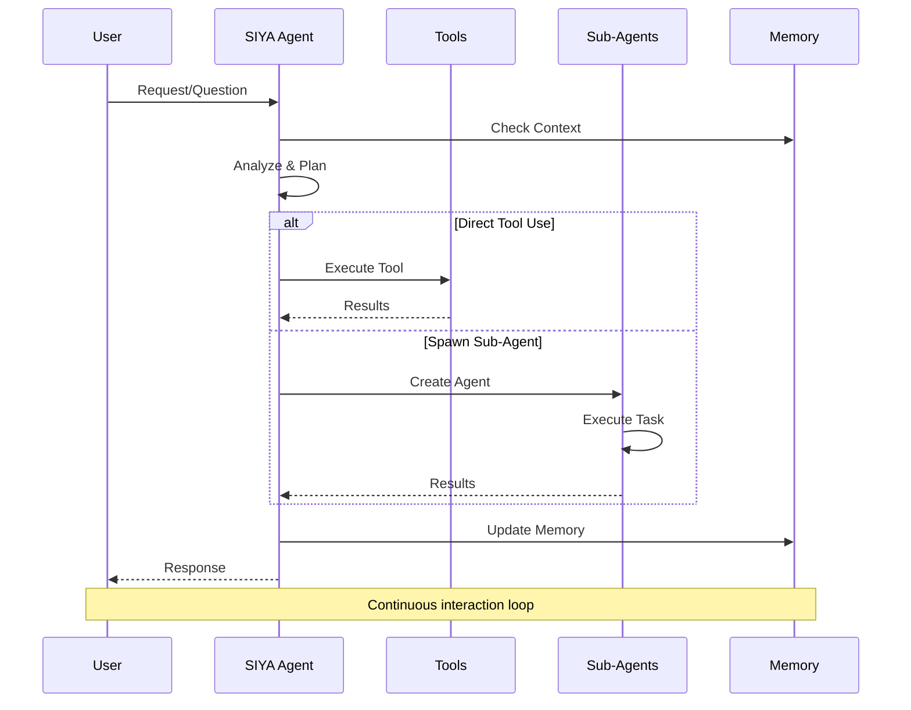
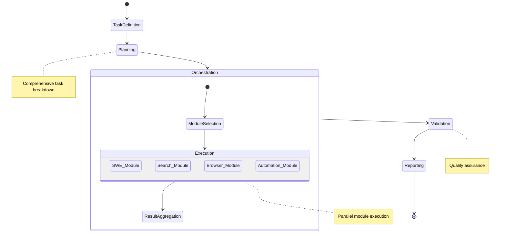
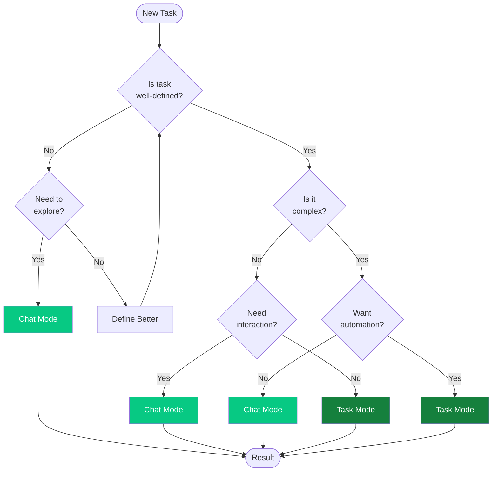

<Card title="Adaptive AI Architecture" icon="brain" color="#0000FF">
  Siya's revolutionary dual-mode system adapts to your working style. Choose interactive Chat Mode for exploration and learning, or autonomous Task Mode for production work and automation.
</Card>

## Mode Comparison

<Columns cols={2}>
  <Card title="Chat Mode" icon="message" color="#07C983">
    **Interactive AI Assistant**
    - Real-time conversation
    - Direct tool access
    - Spawnable sub-agents
    - Immediate feedback
    - Perfect for exploration
  </Card>
  
  <Card title="Task Mode" icon="play" color="#15803D">
    **Autonomous AI Worker**
    - Set and forget execution
    - Orchestrated modules
    - Comprehensive planning
    - Batch processing
    - Perfect for production
  </Card>
</Columns>

## Chat Mode Deep Dive

<Frame caption="Chat Mode provides an interactive experience with direct control over tools and agents">

</Frame>

### How Chat Mode Works

<Steps titleSize="h3">
  <Step title="Interactive Dialogue" icon="message">
    You communicate directly with Siya through natural conversation. Ask questions, give commands, or request assistance - just like chatting with a knowledgeable colleague.
  </Step>
  
  <Step title="Real-time Processing" icon="bolt">
    Siya processes your request immediately, selecting the appropriate tools or agents needed. You see the thinking process and can guide decisions.
  </Step>
  
  <Step title="Dynamic Adaptation" icon="shuffle">
    Based on your feedback, Siya adjusts its approach. You can redirect, refine, or expand tasks as you learn more about the problem.
  </Step>
  
  <Step title="Continuous Learning" icon="brain">
    The conversation context builds over time, allowing Siya to understand your preferences and provide increasingly relevant assistance.
  </Step>
</Steps>

### Chat Mode Features

<AccordionGroup>
  <Accordion title="Direct Tool Access" icon="tools" defaultOpen>
    <Columns cols={2}>
      <div>
        **Available Tools:**
        - File operations (read, write, edit)
        - Code execution and testing
        - Web searching and browsing
        - Data analysis and visualization
        - System commands
        - API interactions
      </div>
      <div>
        **Tool Benefits:**
        - Immediate execution
        - Visible progress
        - Error handling
        - Result verification
        - Interactive refinement
      </div>
    </Columns>
  </Accordion>
  
  <Accordion title="Spawnable Sub-Agents" icon="users">
    <Tabs>
      <Tab title="SWE Agent">
        **Software Engineering Agent**
        - Complex code generation
        - Architecture design
        - Debugging assistance
        - Code review and refactoring
        - MCP server access
      </Tab>
      
      <Tab title="Search Agent">
        **Research & Search Agent**
        - Multi-source research
        - Information synthesis
        - Fact verification
        - Trend analysis
        - Citation management
      </Tab>
      
      <Tab title="Browser Agent">
        **Web Automation Agent**
        - Visual web interaction
        - Form filling
        - Data extraction
        - Screenshot capture
        - Multi-step workflows
      </Tab>
      
      <Tab title="Automation Agent">
        **Task Automation Agent**
        - Schedule recurring tasks
        - Create workflows
        - Set up monitoring
        - Configure notifications
        - Batch operations
      </Tab>
    </Tabs>
  </Accordion>
  
  <Accordion title="Memory Management" icon="memory">
    <Card title="Auto-Compacting Memory" icon="compress">
      Siya intelligently manages conversation context:
      - Preserves important information
      - Removes redundant data
      - Maintains relevant history
      - Optimizes token usage
    </Card>
  </Accordion>
</AccordionGroup>

### When to Use Chat Mode

<Columns cols={3}>
  <Card title="Learning & Exploration" icon="compass">
    - Understanding new concepts
    - Exploring possibilities
    - Iterative problem-solving
    - Getting explanations
  </Card>
  
  <Card title="Development & Testing" icon="flask">
    - Prototyping ideas
    - Debugging code
    - Testing approaches
    - Refining solutions
  </Card>
  
  <Card title="Interactive Tasks" icon="hand-pointer">
    - Step-by-step guidance
    - Real-time decisions
    - Course corrections
    - Collaborative work
  </Card>
</Columns>

## Task Mode Deep Dive

<Frame caption="Task Mode enables autonomous execution through intelligent orchestration">

</Frame>

### How Task Mode Works

<Steps titleSize="h3">
  <Step title="Task Definition" icon="clipboard">
    You provide a clear description of what needs to be accomplished. Siya analyzes the requirements and creates a comprehensive plan.
  </Step>
  
  <Step title="Autonomous Planning" icon="sitemap">
    The orchestrator breaks down the task into logical steps, identifies required capabilities, and determines the optimal execution sequence.
  </Step>
  
  <Step title="Module Orchestration" icon="network-wired">
    Specialized agent modules work in coordination. Each module handles its domain expertise while the orchestrator manages dependencies and flow.
  </Step>
  
  <Step title="Results Delivery" icon="chart-line">
    Upon completion, you receive comprehensive results, reports, and any generated artifacts - all without needing to guide the process.
  </Step>
</Steps>

### Task Mode Features

<AccordionGroup>
  <Accordion title="Planning Module" icon="project-diagram" defaultOpen>
    The brain of Task Mode that creates execution strategies:
    
    <Steps>
      <Step title="Requirement Analysis">
        Understands task objectives and constraints
      </Step>
      <Step title="Dependency Mapping">
        Identifies task relationships and order
      </Step>
      <Step title="Resource Allocation">
        Assigns appropriate modules to subtasks
      </Step>
      <Step title="Timeline Creation">
        Establishes execution schedule
      </Step>
    </Steps>
  </Accordion>
  
  <Accordion title="Agent Modules" icon="cube">
    <Columns cols={2}>
      <Card title="SWE Module" icon="code">
        - Full codebase access
        - MCP server integration
        - Build and test execution
        - Documentation generation
      </Card>
      
      <Card title="Search Module" icon="search">
        - Parallel research
        - Source verification
        - Data aggregation
        - Report compilation
      </Card>
      
      <Card title="Browser Module" icon="globe">
        - Headless automation
        - Multi-site operations
        - Data extraction
        - Screenshot documentation
      </Card>
      
      <Card title="Automation Module" icon="robot">
        - Workflow creation
        - Schedule management
        - Event handling
        - System integration
      </Card>
    </Columns>
  </Accordion>
  
  <Accordion title="Execution Features" icon="play">
    <Columns cols={3}>
      <div>
        **Parallel Processing**
        - Multiple modules simultaneously
        - Efficient resource usage
        - Faster completion
      </div>
      
      <div>
        **Error Handling**
        - Automatic retry logic
        - Fallback strategies
        - Graceful degradation
      </div>
      
      <div>
        **Progress Tracking**
        - Real-time status
        - Milestone updates
        - Completion estimates
      </div>
    </Columns>
  </Accordion>
</AccordionGroup>

### When to Use Task Mode

<Columns cols={3}>
  <Card title="Production Work" icon="industry">
    - Deploying features
    - Running test suites
    - Building applications
    - Processing data
  </Card>
  
  <Card title="Complex Projects" icon="project-diagram">
    - Multi-step operations
    - Cross-domain tasks
    - Large-scale changes
    - System migrations
  </Card>
  
  <Card title="Automation" icon="cogs">
    - Repetitive tasks
    - Scheduled operations
    - Batch processing
    - Workflow creation
  </Card>
</Columns>

## Mode Selection Guide

<Card title="Choosing the Right Mode" icon="route" color="#9C27B0">
  Select the mode that matches your task requirements and working style
</Card>

<Tabs>
  <Tab title="Decision Matrix">
    <Table>
      <tr>
        <th>Criteria</th>
        <th>Chat Mode</th>
        <th>Task Mode</th>
      </tr>
      <tr>
        <td>Task Clarity</td>
        <td>Exploratory/Undefined</td>
        <td>Well-defined/Clear</td>
      </tr>
      <tr>
        <td>Interaction Level</td>
        <td>High/Continuous</td>
        <td>Low/Set-and-forget</td>
      </tr>
      <tr>
        <td>Feedback Timing</td>
        <td>Real-time</td>
        <td>On completion</td>
      </tr>
      <tr>
        <td>Decision Making</td>
        <td>Interactive/Guided</td>
        <td>Autonomous</td>
      </tr>
      <tr>
        <td>Best For</td>
        <td>Learning & Development</td>
        <td>Production & Automation</td>
      </tr>
    </Table>
  </Tab>
  
  <Tab title="Use Case Examples">
    <Columns cols={2}>
      <div>
        **Chat Mode Examples:**
        - "Help me understand this error"
        - "Let's explore different approaches"
        - "Show me how to implement X"
        - "What's the best way to..."
        - "Debug this code with me"
      </div>
      
      <div>
        **Task Mode Examples:**
        - "Build a REST API for user management"
        - "Analyze all CSV files and create reports"
        - "Refactor the entire codebase"
        - "Set up CI/CD pipeline"
        - "Migrate database to new schema"
      </div>
    </Columns>
  </Tab>
</Tabs>

## Switching Between Modes

<Note>
  You can start in one mode and switch to another based on your needs. Siya preserves context when switching.
</Note>

<Steps>
  <Step title="Starting in Chat Mode">
    Default mode when you begin a conversation. Simply type your request.
  </Step>
  
  <Step title="Switching to Task Mode">
    Use action-oriented language: "Create...", "Build...", "Implement...", "Analyze..."
  </Step>
  
  <Step title="Returning to Chat Mode">
    Ask questions or request clarification to re-engage interactive mode.
  </Step>
  
  <Step title="Mode Indicators">
    Watch for visual cues in the interface showing current mode.
  </Step>
</Steps>

## Advanced Mode Features

<AccordionGroup>
  <Accordion title="Hybrid Workflows" icon="merge">
    Combine modes for optimal results:
    
    1. Start in Chat Mode to explore and understand
    2. Switch to Task Mode for implementation
    3. Return to Chat Mode for review and refinement
    
    <Tip>
      This approach leverages the strengths of both modes for complex projects.
    </Tip>
  </Accordion>
  
  <Accordion title="Mode-Specific Optimizations" icon="gauge">
    <Columns cols={2}>
      <div>
        **Chat Mode Optimizations:**
        - Faster response times
        - Lower token usage
        - Interactive refinement
        - Context preservation
      </div>
      
      <div>
        **Task Mode Optimizations:**
        - Parallel execution
        - Batch processing
        - Resource efficiency
        - Comprehensive logging
      </div>
    </Columns>
  </Accordion>
  
  <Accordion title="Custom Mode Configuration" icon="sliders">
    Configure mode behavior in settings:
    
    ```json
    {
      "modes": {
        "chat": {
          "memoryLimit": 50000,
          "responseStyle": "conversational",
          "toolTimeout": 30
        },
        "task": {
          "planningDepth": 3,
          "parallelism": 4,
          "autoReport": true
        }
      }
    }
    ```
  </Accordion>
</AccordionGroup>

## Best Practices

<Columns cols={2}>
  <Card title="Chat Mode Best Practices" icon="message" color="#07C983">
    - Be conversational and iterative
    - Provide feedback on results
    - Ask clarifying questions
    - Guide the process actively
    - Save important outputs
  </Card>
  
  <Card title="Task Mode Best Practices" icon="play" color="#15803D">
    - Define clear objectives
    - Include success criteria
    - Specify constraints upfront
    - Allow sufficient time
    - Review final reports
  </Card>
</Columns>

## Performance Considerations

<Info>
  Mode selection impacts performance and resource usage. Choose based on your task requirements and system capabilities.
</Info>

<Tabs>
  <Tab title="Resource Usage">
    <Columns cols={2}>
      <Card title="Chat Mode" icon="gauge">
        - Lower memory usage
        - Distributed over time
        - Interactive token management
        - Immediate resource release
      </Card>
      
      <Card title="Task Mode" icon="server">
        - Higher peak usage
        - Concentrated execution
        - Batch token processing
        - Resources held until completion
      </Card>
    </Columns>
  </Tab>
  
  <Tab title="Optimization Tips">
    <Steps>
      <Step title="For Chat Mode">
        Keep conversations focused and use sub-agents for heavy tasks
      </Step>
      <Step title="For Task Mode">
        Break very large tasks into smaller autonomous chunks
      </Step>
      <Step title="For Both Modes">
        Clear workspace regularly and use appropriate AI models
      </Step>
    </Steps>
  </Tab>
</Tabs>

## Mode Selection Flowchart



## Summary

<Card title="Master Both Modes" icon="graduation-cap" color="#0000FF">
  Understanding when and how to use each mode is key to maximizing Siya's potential. Start with the mode that feels natural for your task, and don't hesitate to switch as your needs evolve.
</Card>

<Columns cols={2}>
  <Card title="Next: Agent System" icon="users" href="/siya-superagent/agent-system">
    Learn about Siya's specialized agents and their capabilities
  </Card>
  
  <Card title="Try It Now" icon="play" href="/siya-superagent/desktop-application">
    Open Siya and experiment with both modes
  </Card>
</Columns>

---

*Choose your mode. Define your style. Let Siya adapt to you.*