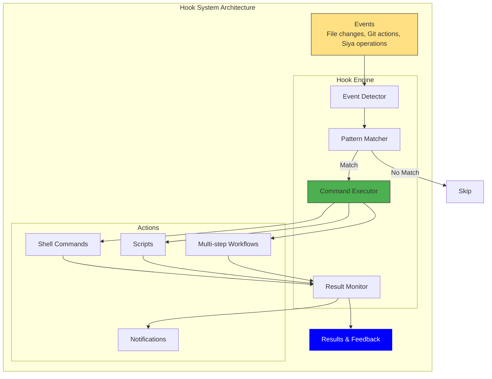

<Card title="Transform Siya into Your Personal Automation Engine" icon="magic" color="#4CAF50">
  Hooks are Siya's automation superpower - creating intelligent, event-driven workflows that respond to your actions in real-time. From auto-formatting code to deploying applications, hooks turn repetitive tasks into seamless, background magic.
</Card>

## Understanding Hooks

<Frame caption="Hooks create an intelligent automation layer that responds to events in your workflow">

</Frame>

<Columns cols={3}>
  <Card title="Event-Driven" icon="bolt">
    Respond instantly to file changes, git operations, or Siya actions
  </Card>
  
  <Card title="Intelligent" icon="brain">
    Pattern matching and conditional logic for smart automation
  </Card>
  
  <Card title="Non-Blocking" icon="rocket">
    Hooks run in parallel without interrupting your workflow
  </Card>
</Columns>

## Creating Hooks

<Card title="Multiple Ways to Create Powerful Automations" icon="plus" color="#9C27B0">
  Choose the method that fits your style - from natural language to precise configuration
</Card>

<Tabs>
  <Tab title="Natural Language">
    <Card title="Just Tell Siya What You Want" icon="message" color="#4CAF50">
      The easiest way - describe your automation in plain English
    </Card>
    
    <Steps>
      <Step title="Describe Your Need">
        Tell Siya what you want to automate
      </Step>
      <Step title="Siya Creates Hook">
        Siya generates the appropriate hook configuration
      </Step>
      <Step title="Instant Activation">
        Hook starts working immediately
      </Step>
    </Steps>
    
    <CodeGroup>
      ```text Simple Request
      "Run tests whenever I save a test file"
      ```
      
      ```text Complex Automation
      "When I push to main branch, run all tests, build the project, 
      and deploy to staging if everything passes"
      ```
      
      ```text Notification Hook
      "Send me a desktop notification when any long-running 
      task completes or fails"
      ```
      
      ```text Development Hook
      "Format and lint any JavaScript file I modify, but only 
      in the src directory"
      ```
    </CodeGroup>
    
    <Info>
      Siya understands context and creates appropriate patterns and commands
    </Info>
  </Tab>
  
  <Tab title="Configuration File">
    <Card title="Define Hooks in Configuration" icon="file-code" color="#0000FF">
      Precise control through JSON configuration
    </Card>
    
    <CodeGroup>
      ```json Basic Hook
      {
        "hooks": [
          {
            "name": "Auto-format on save",
            "event": "file:modified",
            "pattern": "**/*.{js,ts,jsx,tsx}",
            "command": "prettier --write ${file}",
            "enabled": true
          }
        ]
      }
      ```
      
      ```json Advanced Hook
      {
        "hooks": [
          {
            "name": "Smart test runner",
            "event": "file:modified",
            "pattern": "src/**/*.{js,ts}",
            "condition": "!file.includes('.test.')",
            "commands": [
              "jest --findRelatedTests ${file}",
              "npm run lint:file -- ${file}"
            ],
            "parallel": true,
            "continueOnError": false,
            "timeout": 30000,
            "debounce": 1000
          }
        ]
      }
      ```
      
      ```json Multi-Event Hook
      {
        "hooks": [
          {
            "name": "Project guardian",
            "events": ["file:modified", "file:created"],
            "patterns": {
              "include": ["src/**/*", "tests/**/*"],
              "exclude": ["**/*.log", "**/tmp/**"]
            },
            "command": "npm run validate",
            "notifications": {
              "start": false,
              "success": false,
              "failure": true
            }
          }
        ]
      }
      ```
    </CodeGroup>
    
    <Tip>
      Hooks configuration can be in global, project, or session config files
    </Tip>
  </Tab>
  
  <Tab title="Interactive Builder">
    <Card title="Build Hooks Interactively" icon="sliders" color="#9C27B0">
      Step-by-step hook creation with Siya's guidance
    </Card>
    
    ```text
    User: "Help me create a hook"
    
    Siya: I'll help you create a custom hook. Let me ask a few questions:
    
    1. What event should trigger this hook?
       - File change (save, create, delete)
       - Git operation (commit, push, merge)
       - Siya action (task complete, error)
       - Time-based (scheduled)
    
    User: "File change"
    
    Siya: 2. Which files should this monitor?
       - All files
       - Specific extensions (e.g., *.js, *.py)
       - Specific directories
       - Custom pattern
    
    User: "TypeScript files in src folder"
    
    Siya: 3. What should happen when triggered?
       - Run tests
       - Format/lint code
       - Build/compile
       - Custom command
    
    User: "Run type checking"
    
    Siya: Great! I'll create this hook for you:
    [Creates and activates the hook]
    ```
    
    <Info>
      Interactive mode helps you discover all available options
    </Info>
  </Tab>
</Tabs>

## Hook Events

<Card title="Rich Event System for Every Scenario" icon="bolt" color="#FFE082">
  Hooks can respond to a wide variety of events in your development workflow
</Card>

<Tabs>
  <Tab title="File Events">
    <Frame caption="File system events trigger hooks for automatic file processing">
      ```mermaid
      stateDiagram-v2
          [*] --> Watching: File System Monitor Active
          
          Watching --> Created: New File
          Watching --> Modified: File Saved
          Watching --> Deleted: File Removed
          Watching --> Renamed: File Moved
          
          Created --> CheckPattern: Match Pattern?
          Modified --> CheckPattern
          Deleted --> CheckPattern
          Renamed --> CheckPattern
          
          CheckPattern --> Execute: Pattern Matches
          CheckPattern --> Skip: No Match
          
          Execute --> RunHook: Execute Commands
          Skip --> Watching
          
          RunHook --> Success: Command Success
          RunHook --> Failure: Command Failed
          
          Success --> Notify: Optional Notification
          Failure --> Notify
          
          Notify --> Watching
      ```
    </Frame>
    
    <AccordionGroup>
      <Accordion title="Available File Events" icon="file" defaultOpen>
        <Table>
          <tr>
            <th>Event</th>
            <th>Trigger</th>
            <th>Variables</th>
            <th>Example Use</th>
          </tr>
          <tr>
            <td>`file:created`</td>
            <td>New file created</td>
            <td>`${file}`, `${dir}`, `${ext}`</td>
            <td>Auto-add headers</td>
          </tr>
          <tr>
            <td>`file:modified`</td>
            <td>File saved</td>
            <td>`${file}`, `${content}`, `${diff}`</td>
            <td>Format on save</td>
          </tr>
          <tr>
            <td>`file:deleted`</td>
            <td>File removed</td>
            <td>`${file}`, `${dir}`</td>
            <td>Clean up related</td>
          </tr>
          <tr>
            <td>`file:renamed`</td>
            <td>File moved/renamed</td>
            <td>`${oldFile}`, `${newFile}`</td>
            <td>Update imports</td>
          </tr>
          <tr>
            <td>`file:batch`</td>
            <td>Multiple files changed</td>
            <td>`${files}`, `${count}`</td>
            <td>Bulk operations</td>
          </tr>
        </Table>
      </Accordion>
      
      <Accordion title="Pattern Matching" icon="filter">
        <CodeGroup>
          ```json Glob Patterns
          {
            "pattern": "src/**/*.ts",  // All TypeScript in src
            "pattern": "*.{js,jsx}",   // JS and JSX files
            "pattern": "!**/*.test.*", // Exclude test files
            "pattern": "docs/*.md"     // Markdown in docs
          }
          ```
          
          ```json Advanced Patterns
          {
            "patterns": {
              "include": [
                "src/**/*.{ts,tsx}",
                "lib/**/*.js"
              ],
              "exclude": [
                "**/node_modules/**",
                "**/*.min.js",
                "**/dist/**"
              ]
            }
          }
          ```
        </CodeGroup>
      </Accordion>
    </AccordionGroup>
  </Tab>
  
  <Tab title="Git Events">
    <Card title="Version Control Automation" icon="code-branch" color="#F44336">
      Automate your Git workflow with intelligent hooks
    </Card>
    
    <AccordionGroup>
      <Accordion title="Commit & Push Events" icon="check" defaultOpen>
        <Columns cols={2}>
          <Card title="Pre-Operation" icon="shield">
            **Before Actions**
            - `git:pre-commit` - Validate before commit
            - `git:pre-push` - Check before pushing
            - `git:pre-merge` - Test before merging
            
            These can block operations if they fail
          </Card>
          
          <Card title="Post-Operation" icon="check-circle">
            **After Actions**
            - `git:commit` - After successful commit
            - `git:push` - After push completes
            - `git:merge` - After merge done
            
            Used for notifications and follow-up
          </Card>
        </Columns>
        
        <CodeGroup>
          ```json Pre-commit Validation
          {
            "name": "Commit quality check",
            "event": "git:pre-commit",
            "commands": [
              "npm run lint",
              "npm run typecheck",
              "npm test -- --coverage"
            ],
            "blocking": true,
            "timeout": 60000
          }
          ```
          
          ```json Post-push Deployment
          {
            "name": "Auto-deploy on push",
            "event": "git:push",
            "condition": "branch === 'main'",
            "command": "npm run deploy:production",
            "notifications": {
              "success": "desktop",
              "failure": "desktop,email"
            }
          }
          ```
        </CodeGroup>
      </Accordion>
      
      <Accordion title="Branch Events" icon="code-branch">
        <Table>
          <tr>
            <th>Event</th>
            <th>Variables</th>
            <th>Use Cases</th>
          </tr>
          <tr>
            <td>`git:branch:create`</td>
            <td>`${branch}`, `${from}`</td>
            <td>Setup branch environment</td>
          </tr>
          <tr>
            <td>`git:branch:switch`</td>
            <td>`${oldBranch}`, `${newBranch}`</td>
            <td>Load branch config</td>
          </tr>
          <tr>
            <td>`git:branch:delete`</td>
            <td>`${branch}`, `${merged}`</td>
            <td>Cleanup resources</td>
          </tr>
          <tr>
            <td>`git:tag`</td>
            <td>`${tag}`, `${commit}`</td>
            <td>Create release</td>
          </tr>
        </Table>
      </Accordion>
    </AccordionGroup>
  </Tab>
  
  <Tab title="Siya Events">
    <Card title="Siya Operation Hooks" icon="robot" color="#9C27B0">
      Respond to Siya's actions and task lifecycle
    </Card>
    
    <Frame caption="Hook into Siya's task execution lifecycle">
      ```mermaid
      graph LR
          Start[Task Start] --> Running[Task Running]
          Running --> Complete[Task Complete]
          Running --> Error[Task Error]
          
          Start --> HookStart{Hook: task:start}
          Complete --> HookComplete{Hook: task:complete}
          Error --> HookError{Hook: task:error}
          
          HookStart --> Log[Log Start Time]
          HookComplete --> Report[Generate Report]
          HookError --> Alert[Send Alert]
          
          subgraph "Memory Events"
              Compact[Memory Compact] --> HookCompact{Hook: memory:compact}
              HookCompact --> Backup[Backup State]
          end
          
          style Start fill:#4CAF50,stroke:#333
          style Error fill:#F44336,stroke:#333
          style Complete fill:#0000FF,stroke:#fff,color:#fff
      ```
    </Frame>
    
    <AccordionGroup>
      <Accordion title="Task Lifecycle" icon="tasks" defaultOpen>
        <Table>
          <tr>
            <th>Event</th>
            <th>Trigger</th>
            <th>Variables</th>
          </tr>
          <tr>
            <td>`siya:task:start`</td>
            <td>Task begins execution</td>
            <td>`${taskId}`, `${taskName}`, `${mode}`</td>
          </tr>
          <tr>
            <td>`siya:task:complete`</td>
            <td>Task finishes successfully</td>
            <td>`${taskId}`, `${duration}`, `${result}`</td>
          </tr>
          <tr>
            <td>`siya:task:error`</td>
            <td>Task encounters error</td>
            <td>`${taskId}`, `${error}`, `${stack}`</td>
          </tr>
          <tr>
            <td>`siya:subtask:spawn`</td>
            <td>Sub-agent created</td>
            <td>`${agentType}`, `${parentTask}`</td>
          </tr>
        </Table>
      </Accordion>
      
      <Accordion title="System Events" icon="cog">
        <Columns cols={2}>
          <Card title="Memory Events" icon="memory">
            - `siya:memory:compact` - Memory compacted
            - `siya:memory:checkpoint` - Checkpoint created
            - `siya:memory:restore` - Memory restored
            - `siya:memory:threshold` - Limit approached
          </Card>
          
          <Card title="Tool Events" icon="wrench">
            - `siya:tool:execute` - Tool invoked
            - `siya:tool:success` - Tool completed
            - `siya:tool:failure` - Tool failed
            - `siya:tool:timeout` - Tool timed out
          </Card>
        </Columns>
      </Accordion>
    </AccordionGroup>
  </Tab>
  
  <Tab title="Custom Events">
    <Card title="Create Your Own Events" icon="star" color="#FFD700">
      Define custom events for specialized workflows
    </Card>
    
    <Steps>
      <Step title="Define Event">
        Register custom event with Siya
      </Step>
      <Step title="Emit Event">
        Trigger from your code or scripts
      </Step>
      <Step title="Hook Response">
        Hooks respond to your custom event
      </Step>
    </Steps>
    
    <CodeGroup>
      ```javascript Emit Custom Event
      // In your application code
      fetch('http://localhost:3000/siya/event', {
        method: 'POST',
        body: JSON.stringify({
          event: 'app:build:complete',
          data: {
            version: '1.2.3',
            duration: 45000,
            status: 'success'
          }
        })
      });
      ```
      
      ```json Hook Configuration
      {
        "name": "Deploy on build",
        "event": "app:build:complete",
        "condition": "data.status === 'success'",
        "command": "npm run deploy -- --version ${data.version}",
        "notifications": {
          "success": "slack",
          "failure": "email"
        }
      }
      ```
    </CodeGroup>
  </Tab>
</Tabs>

## Hook Configuration

<Card title="Fine-Tune Every Aspect of Your Automations" icon="sliders" color="#0000FF">
  Comprehensive configuration options for precise control
</Card>

<AccordionGroup>
  <Accordion title="Core Properties" icon="cog" defaultOpen>
    <Table>
      <tr>
        <th>Property</th>
        <th>Type</th>
        <th>Description</th>
        <th>Example</th>
      </tr>
      <tr>
        <td>`name`</td>
        <td>string</td>
        <td>Hook identifier</td>
        <td>`"Auto-format code"`</td>
      </tr>
      <tr>
        <td>`event`</td>
        <td>string/array</td>
        <td>Triggering event(s)</td>
        <td>`"file:modified"`</td>
      </tr>
      <tr>
        <td>`pattern`</td>
        <td>string/object</td>
        <td>File pattern matching</td>
        <td>`"**/*.js"`</td>
      </tr>
      <tr>
        <td>`command`</td>
        <td>string/array</td>
        <td>Command(s) to execute</td>
        <td>`"prettier --write ${file}"`</td>
      </tr>
      <tr>
        <td>`enabled`</td>
        <td>boolean</td>
        <td>Hook active state</td>
        <td>`true`</td>
      </tr>
      <tr>
        <td>`condition`</td>
        <td>string</td>
        <td>JavaScript condition</td>
        <td>`"file.size < 1000000"`</td>
      </tr>
    </Table>
  </Accordion>
  
  <Accordion title="Advanced Options" icon="flask">
    <Tabs>
      <Tab title="Execution Control">
        ```json
        {
          "name": "Smart executor",
          "event": "file:modified",
          "pattern": "**/*.ts",
          "command": "npm run process -- ${file}",
          
          // Execution options
          "parallel": true,           // Run commands in parallel
          "continueOnError": true,    // Don't stop on failure
          "timeout": 30000,          // 30 second timeout
          "retries": 2,              // Retry failed commands
          "retryDelay": 1000,        // Wait between retries
          "shell": "/bin/zsh",       // Specific shell
          "cwd": "${projectRoot}",   // Working directory
          "env": {                   // Environment variables
            "NODE_ENV": "test",
            "DEBUG": "true"
          }
        }
        ```
      </Tab>
      
      <Tab title="Debouncing & Throttling">
        ```json
        {
          "name": "Debounced compiler",
          "event": "file:modified",
          "pattern": "src/**/*.ts",
          
          // Prevent rapid firing
          "debounce": 2000,        // Wait 2s after last event
          "throttle": 5000,        // Max once per 5s
          "accumulate": true,      // Batch multiple events
          "maxAccumulated": 10     // Process max 10 at once
        }
        ```
        
        <Info>
          Debouncing prevents hooks from firing too frequently during rapid changes
        </Info>
      </Tab>
      
      <Tab title="Conditional Logic">
        ```javascript
        {
          "name": "Conditional deployment",
          "event": "git:push",
          
          // Complex conditions
          "condition": `
            branch === 'main' && 
            !commit.message.includes('[skip-deploy]') &&
            time.getHours() >= 9 && 
            time.getHours() <= 17
          `,
          
          // Multiple condition checks
          "conditions": {
            "all": [  // All must be true
              "branch === 'main'",
              "tests.passed === true"
            ],
            "any": [  // At least one true
              "user === 'admin'",
              "override === true"
            ],
            "none": [ // None can be true
              "errors.length > 0",
              "isHoliday === true"
            ]
          }
        }
        ```
      </Tab>
    </Tabs>
  </Accordion>
  
  <Accordion title="Notifications" icon="bell">
    <Columns cols={2}>
      <Card title="Notification Channels" icon="bullhorn">
        ```json
        {
          "notifications": {
            "channels": {
              "desktop": true,
              "sound": true,
              "email": "dev@company.com",
              "slack": "#dev-alerts",
              "webhook": "https://api.company.com/hooks"
            },
            "events": {
              "start": false,    // Don't notify on start
              "success": true,   // Notify on success
              "failure": true,   // Always notify failures
              "timeout": true    // Notify on timeout
            }
          }
        }
        ```
      </Card>
      
      <Card title="Custom Messages" icon="message">
        ```json
        {
          "notifications": {
            "templates": {
              "success": "✅ ${name} completed in ${duration}ms",
              "failure": "❌ ${name} failed: ${error}",
              "timeout": "⏱️ ${name} timed out after ${timeout}ms"
            },
            "includeOutput": true,
            "maxOutputLength": 500
          }
        }
        ```
      </Card>
    </Columns>
  </Accordion>
</AccordionGroup>

## Hook Examples

<Card title="Real-World Automation Patterns" icon="lightbulb" color="#4CAF50">
  Production-ready hook configurations for common scenarios
</Card>

<Tabs>
  <Tab title="Development Hooks">
    <AccordionGroup>
      <Accordion title="Code Quality Automation" icon="medal" defaultOpen>
        ```json
        {
          "hooks": [
            {
              "name": "Format on save",
              "event": "file:modified",
              "pattern": "src/**/*.{js,ts,jsx,tsx}",
              "command": "prettier --write ${file}",
              "enabled": true
            },
            {
              "name": "Lint and fix",
              "event": "file:modified",
              "pattern": "**/*.{js,ts}",
              "commands": [
                "eslint --fix ${file}",
                "tsc --noEmit --skipLibCheck"
              ],
              "continueOnError": true,
              "debounce": 1000
            },
            {
              "name": "Update imports",
              "event": "file:renamed",
              "pattern": "src/**/*.{ts,tsx}",
              "command": "node scripts/update-imports.js ${oldFile} ${newFile}"
            }
          ]
        }
        ```
      </Accordion>
      
      <Accordion title="Test Automation" icon="flask">
        ```json
        {
          "hooks": [
            {
              "name": "Test affected",
              "event": "file:modified",
              "pattern": "src/**/*.{js,ts}",
              "condition": "!file.includes('.test.')",
              "command": "jest --findRelatedTests ${file} --coverage",
              "notifications": {
                "failure": "desktop"
              }
            },
            {
              "name": "E2E on feature complete",
              "event": "git:push",
              "condition": "branch.startsWith('feature/')",
              "commands": [
                "npm run build",
                "npm run test:e2e -- --headless"
              ],
              "timeout": 300000
            }
          ]
        }
        ```
      </Accordion>
      
      <Accordion title="Documentation Generation" icon="book">
        ```json
        {
          "hooks": [
            {
              "name": "Generate API docs",
              "event": "file:modified",
              "pattern": "src/api/**/*.ts",
              "command": "typedoc --entryPoints ${file} --out docs/api",
              "debounce": 5000
            },
            {
              "name": "Update README",
              "event": "siya:task:complete",
              "condition": "task.includes('feature')",
              "command": "node scripts/update-readme.js"
            }
          ]
        }
        ```
      </Accordion>
    </AccordionGroup>
  </Tab>
  
  <Tab title="CI/CD Hooks">
    <AccordionGroup>
      <Accordion title="Build Pipeline" icon="industry" defaultOpen>
        ```json
        {
          "hooks": [
            {
              "name": "Pre-commit checks",
              "event": "git:pre-commit",
              "commands": [
                "npm run lint",
                "npm run typecheck",
                "npm run test -- --coverage"
              ],
              "blocking": true,
              "parallel": true,
              "timeout": 120000
            },
            {
              "name": "Build on merge",
              "event": "git:merge",
              "condition": "targetBranch === 'main'",
              "commands": [
                "npm run clean",
                "npm run build:production",
                "npm run test:integration"
              ]
            }
          ]
        }
        ```
      </Accordion>
      
      <Accordion title="Deployment Automation" icon="rocket">
        ```json
        {
          "hooks": [
            {
              "name": "Deploy to staging",
              "event": "git:push",
              "condition": "branch === 'develop'",
              "commands": [
                "npm run build:staging",
                "npm run deploy:staging",
                "curl -X POST https://api.company.com/notify/deploy"
              ],
              "env": {
                "DEPLOY_ENV": "staging",
                "SKIP_TESTS": "false"
              },
              "notifications": {
                "success": "slack:#deployments",
                "failure": "email:ops@company.com"
              }
            },
            {
              "name": "Production release",
              "event": "git:tag",
              "condition": "tag.match(/^v\\d+\\.\\d+\\.\\d+$/)",
              "commands": [
                "npm run build:production",
                "npm run test:smoke",
                "npm run deploy:production",
                "npm run notify:customers"
              ],
              "requireConfirmation": true
            }
          ]
        }
        ```
      </Accordion>
    </AccordionGroup>
  </Tab>
  
  <Tab title="Monitoring Hooks">
    <AccordionGroup>
      <Accordion title="Performance Monitoring" icon="gauge" defaultOpen>
        ```json
        {
          "hooks": [
            {
              "name": "Bundle size check",
              "event": "file:modified",
              "pattern": "src/**/*.{js,ts,jsx,tsx}",
              "command": "npm run analyze:bundle",
              "condition": "process.env.CI === 'true'",
              "notifications": {
                "custom": {
                  "condition": "output.includes('WARNING: Bundle size')",
                  "message": "Bundle size increased significantly!"
                }
              }
            },
            {
              "name": "Memory usage alert",
              "event": "siya:memory:threshold",
              "condition": "usage > 0.8",
              "command": "echo 'High memory usage: ${usage}' >> memory-alerts.log",
              "notifications": {
                "desktop": true,
                "sound": true
              }
            }
          ]
        }
        ```
      </Accordion>
      
      <Accordion title="Error Tracking" icon="bug">
        ```json
        {
          "hooks": [
            {
              "name": "Log errors",
              "event": "siya:error",
              "command": "node scripts/log-error.js '${error}' '${stack}'",
              "notifications": {
                "failure": false  // Don't notify about logging failures
              }
            },
            {
              "name": "Critical error response",
              "event": "siya:error",
              "condition": "error.severity === 'critical'",
              "commands": [
                "npm run diagnostics",
                "git stash",
                "git checkout main"
              ],
              "notifications": {
                "email": "emergency@company.com",
                "sms": "+1234567890"
              }
            }
          ]
        }
        ```
      </Accordion>
    </AccordionGroup>
  </Tab>
  
  <Tab title="Workflow Hooks">
    <AccordionGroup>
      <Accordion title="Project Management" icon="project-diagram" defaultOpen>
        ```json
        {
          "hooks": [
            {
              "name": "Update task tracker",
              "event": "siya:task:complete",
              "condition": "task.type === 'feature'",
              "command": "jira-cli update ${task.ticketId} --status 'Done'",
              "env": {
                "JIRA_TOKEN": "${JIRA_API_TOKEN}"
              }
            },
            {
              "name": "Time tracking",
              "event": "siya:task:start",
              "command": "toggl start '${task.name}' --project 'Development'",
              "notifications": {
                "start": false
              }
            },
            {
              "name": "Daily standup prep",
              "event": "schedule:daily",
              "time": "09:00",
              "command": "node scripts/generate-standup-notes.js",
              "notifications": {
                "success": "desktop"
              }
            }
          ]
        }
        ```
      </Accordion>
      
      <Accordion title="Backup & Recovery" icon="save">
        ```json
        {
          "hooks": [
            {
              "name": "Auto-backup",
              "event": "siya:memory:checkpoint",
              "command": "cp -r .siya/memory .siya/backups/memory-$(date +%Y%m%d-%H%M%S)",
              "maxBackups": 10
            },
            {
              "name": "Project snapshot",
              "event": "git:commit",
              "condition": "commit.message.includes('[snapshot]')",
              "commands": [
                "tar -czf backups/snapshot-$(date +%Y%m%d).tar.gz --exclude=node_modules .",
                "aws s3 cp backups/snapshot-*.tar.gz s3://backups/"
              ]
            }
          ]
        }
        ```
      </Accordion>
    </AccordionGroup>
  </Tab>
</Tabs>

## Hook Management

<Card title="Monitor and Control Your Automation Fleet" icon="control" color="#9C27B0">
  Tools and commands for managing your hooks effectively
</Card>

<AccordionGroup>
  <Accordion title="Hook Commands" icon="terminal" defaultOpen>
    <CodeGroup>
      ```text List Hooks
      "Show all my hooks"
      "List active hooks"
      "What hooks are running?"
      ```
      
      ```text Control Hooks
      "Disable the format-on-save hook"
      "Enable all test hooks"
      "Pause deployment hooks"
      ```
      
      ```text Debug Hooks
      "Show hook execution history"
      "Debug the failing lint hook"
      "Show logs for build hooks"
      ```
      
      ```text Create/Modify
      "Create a hook that..."
      "Update the test hook to..."
      "Delete the old backup hook"
      ```
    </CodeGroup>
    
    <Info>
      Siya provides natural language control over all hook operations
    </Info>
  </Accordion>
  
  <Accordion title="Hook Monitoring" icon="gauge">
    <Frame caption="Real-time hook execution monitoring">
      ```mermaid
      graph TB
          subgraph "Hook Dashboard"
              Status[Hook Status Monitor]
              
              subgraph "Metrics"
                  Active[Active Hooks: 12]
                  Executed[Executed Today: 156]
                  Failed[Failed: 3]
                  AvgTime[Avg Time: 2.3s]
              end
              
              subgraph "Recent Executions"
                  R1[✅ format-on-save - 0.5s]
                  R2[✅ run-tests - 15.2s]
                  R3[❌ deploy-staging - timeout]
                  R4[✅ lint-check - 1.1s]
              end
              
              subgraph "Performance"
                  Chart[Execution Time Chart]
                  Trends[Success Rate Trends]
              end
          end
          
          Status --> Active & Executed & Failed & AvgTime
          Status --> R1 & R2 & R3 & R4
          Status --> Chart & Trends
          
          style Active fill:#4CAF50,stroke:#333
          style Failed fill:#F44336,stroke:#333
      ```
    </Frame>
    
    <Tip>
      Ask "Show hook dashboard" for a real-time view of your automations
    </Tip>
  </Accordion>
  
  <Accordion title="Troubleshooting" icon="wrench">
    <Table>
      <tr>
        <th>Issue</th>
        <th>Symptoms</th>
        <th>Solution</th>
      </tr>
      <tr>
        <td>Hook not firing</td>
        <td>Expected automation doesn't run</td>
        <td>Check pattern match, verify enabled</td>
      </tr>
      <tr>
        <td>Too many executions</td>
        <td>Hook fires repeatedly</td>
        <td>Add debouncing, check conditions</td>
      </tr>
      <tr>
        <td>Command fails</td>
        <td>Hook reports errors</td>
        <td>Test command manually, check PATH</td>
      </tr>
      <tr>
        <td>Performance impact</td>
        <td>System slows down</td>
        <td>Reduce parallel hooks, add throttling</td>
      </tr>
      <tr>
        <td>Notification spam</td>
        <td>Too many alerts</td>
        <td>Adjust notification settings</td>
      </tr>
    </Table>
    
    <Warning>
      Use `"dryRun": true` to test hooks without executing commands
    </Warning>
  </Accordion>
</AccordionGroup>

## Advanced Hook Patterns

<Card title="Master-Level Automation Techniques" icon="graduation-cap" color="#FFD700">
  Sophisticated patterns for complex automation scenarios
</Card>

<Tabs>
  <Tab title="Chain Reactions">
    <Frame caption="Create cascading automations with hook chains">
      ```mermaid
      graph LR
          FileChange[File Modified] --> Hook1{Format Hook}
          Hook1 --> Format[Prettier]
          Format --> Hook2{Lint Hook}
          Hook2 --> Lint[ESLint]
          Lint --> Hook3{Test Hook}
          Hook3 --> Test[Jest]
          Test --> Hook4{Commit Hook}
          Hook4 --> Commit[Git Commit]
          
          Hook1 -.->|Emit| E1[format:complete]
          Hook2 -.->|Emit| E2[lint:complete]
          Hook3 -.->|Emit| E3[test:complete]
          
          style FileChange fill:#FFE082,stroke:#333
          style Commit fill:#4CAF50,stroke:#333
      ```
    </Frame>
    
    ```json
    {
      "hooks": [
        {
          "name": "Format chain start",
          "event": "file:modified",
          "pattern": "**/*.js",
          "command": "prettier --write ${file}",
          "emitOnSuccess": "format:complete"
        },
        {
          "name": "Lint after format",
          "event": "format:complete",
          "command": "eslint --fix ${file}",
          "emitOnSuccess": "lint:complete"
        },
        {
          "name": "Test after lint",
          "event": "lint:complete",
          "command": "jest --findRelatedTests ${file}",
          "emitOnSuccess": "test:complete"
        }
      ]
    }
    ```
  </Tab>
  
  <Tab title="State Machines">
    ```json
    {
      "hooks": [
        {
          "name": "Deployment state machine",
          "events": ["deploy:*"],
          "stateMachine": {
            "initial": "idle",
            "states": {
              "idle": {
                "on": { "deploy:start": "building" }
              },
              "building": {
                "entry": "npm run build",
                "on": {
                  "build:success": "testing",
                  "build:failure": "failed"
                }
              },
              "testing": {
                "entry": "npm run test:e2e",
                "on": {
                  "test:success": "deploying",
                  "test:failure": "failed"
                }
              },
              "deploying": {
                "entry": "npm run deploy",
                "on": {
                  "deploy:success": "complete",
                  "deploy:failure": "rollback"
                }
              },
              "rollback": {
                "entry": "npm run rollback",
                "on": { "rollback:complete": "failed" }
              },
              "complete": {
                "entry": "npm run notify:success"
              },
              "failed": {
                "entry": "npm run notify:failure"
              }
            }
          }
        }
      ]
    }
    ```
  </Tab>
  
  <Tab title="Dynamic Hooks">
    <Card title="Self-Modifying Automations" icon="dna">
      Hooks that adapt based on conditions
    </Card>
    
    ```javascript
    {
      "hooks": [
        {
          "name": "Adaptive test runner",
          "event": "file:modified",
          "pattern": "**/*.js",
          "command": "node scripts/smart-test.js ${file}",
          "dynamicConfig": {
            "script": `
              // Analyze file changes
              const complexity = analyzeComplexity(file);
              const history = getTestHistory(file);
              
              // Adjust hook behavior
              if (complexity > 10 || history.failures > 2) {
                return {
                  command: [
                    "npm run test:unit -- ${file}",
                    "npm run test:integration -- ${file}",
                    "npm run test:e2e -- ${file}"
                  ],
                  timeout: 300000,
                  notifications: { failure: "email" }
                };
              } else {
                return {
                  command: "npm run test:unit -- ${file}",
                  timeout: 60000
                };
              }
            `
          }
        }
      ]
    }
    ```
  </Tab>
</Tabs>

## Hook Security

<Card title="Secure Automation Practices" icon="shield" color="#F44336">
  Keep your automations safe and controlled
</Card>

<AccordionGroup>
  <Accordion title="Security Best Practices" icon="lock" defaultOpen>
    <Columns cols={2}>
      <Card title="Do's" icon="check" color="#4CAF50">
        - Validate all inputs
        - Use environment variables for secrets
        - Limit command scope
        - Regular security audits
        - Principle of least privilege
        - Log all executions
      </Card>
      
      <Card title="Don'ts" icon="times" color="#F44336">
        - Hardcode credentials
        - Execute untrusted input
        - Disable security features
        - Grant excessive permissions
        - Skip validation
        - Ignore security warnings
      </Card>
    </Columns>
  </Accordion>
  
  <Accordion title="Permission Model" icon="key">
    ```json
    {
      "hookSecurity": {
        "defaultPermissions": "restricted",
        "allowedCommands": [
          "npm", "yarn", "git", "prettier", "eslint"
        ],
        "blockedPatterns": [
          "**/secrets/**",
          "**/*.key",
          "**/*.pem"
        ],
        "requireConfirmation": [
          "rm -rf",
          "deploy:production",
          "database:migrate"
        ],
        "sandboxMode": {
          "enabled": true,
          "allowNetwork": false,
          "allowFileWrite": ["./tmp", "./dist"]
        }
      }
    }
    ```
  </Accordion>
</AccordionGroup>

## Future of Hooks

<Card title="The Evolution of Intelligent Automation" icon="rocket" color="#9C27B0">
  Exciting developments coming to Siya's hook system
</Card>

<Columns cols={2}>
  <Card title="Coming Soon" icon="clock" color="#0000FF">
    **Enhanced Capabilities**
    - Visual hook builder
    - Hook marketplace
    - AI-powered hook suggestions
    - Cross-project hook sharing
    
    **Advanced Features**
    - Distributed execution
    - Hook versioning
    - A/B testing for hooks
    - Performance analytics
  </Card>
  
  <Card title="Experimental" icon="flask" color="#9C27B0">
    **Next-Gen Automation**
    - Predictive triggering
    - Self-healing hooks
    - Natural language conditions
    - Voice-activated hooks
    
    **Integration Expansion**
    - Cloud platform hooks
    - IoT device triggers
    - Calendar integration
    - Biometric triggers
  </Card>
</Columns>

## Summary

<Card title="Automation Mastery Unlocked" icon="trophy" color="#FFD700">
  Hooks transform Siya from an AI assistant into a complete automation platform. By responding intelligently to events in your workflow, hooks eliminate repetitive tasks and enforce best practices automatically. Whether you're formatting code, running tests, or deploying applications, hooks work tirelessly in the background to keep your development process smooth and efficient.
</Card>

<Columns cols={2}>
  <Card title="Next: Advanced Topics" icon="graduation-cap" href="/siya-superagent/advanced-topics">
    Master advanced Siya techniques
  </Card>
  
  <Card title="Hook Library" icon="book" href="https://github.com/siya/hook-library">
    Browse community hook examples
  </Card>
</Columns>

---

*Automate everything. Focus on what matters.*