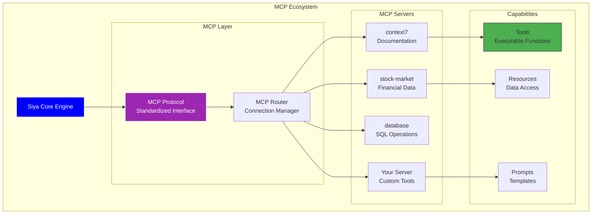

<Card title="Infinite Extensibility Through MCP" icon="infinity" color="#9C27B0">
  Model Context Protocol (MCP) transforms Siya from a powerful AI assistant into an infinitely extensible platform. Connect any tool, service, or API through standardized protocol servers, giving Siya superpowers tailored to your specific needs.
</Card>

## What is MCP?

<Frame caption="MCP creates a bridge between Siya and specialized tools through a standardized protocol">

</Frame>

<Columns cols={3}>
  <Card title="Universal Protocol" icon="globe">
    Standardized communication between AI and tools
  </Card>
  
  <Card title="Hot-Swappable" icon="plug">
    Add or remove capabilities without restarting
  </Card>
  
  <Card title="Language Agnostic" icon="code">
    Build servers in any programming language
  </Card>
</Columns>

## MCP Architecture

<Tabs>
  <Tab title="Protocol Overview">
    <Card title="How MCP Works" icon="diagram-project" color="#9C27B0">
      MCP uses JSON-RPC 2.0 over stdio for lightweight, efficient communication
    </Card>
    
    <AccordionGroup>
      <Accordion title="Communication Flow" icon="arrows-alt" defaultOpen>
        ```mermaid
        sequenceDiagram
            participant User
            participant Siya
            participant MCP Router
            participant MCP Server
            participant External Service
            
            User->>Siya: "Get stock price for AAPL"
            Siya->>MCP Router: Route to stock-market server
            MCP Router->>MCP Server: Call getStockPrice tool
            MCP Server->>External Service: Fetch market data
            External Service-->>MCP Server: Return price data
            MCP Server-->>MCP Router: Format response
            MCP Router-->>Siya: Deliver result
            Siya->>User: "AAPL is trading at $195.83"
            
            Note over MCP Server: Handles authentication,<br/>rate limiting, caching
        ```
      </Accordion>
      
      <Accordion title="Message Format" icon="envelope">
        <CodeGroup>
          ```json Request
          {
            "jsonrpc": "2.0",
            "method": "tools/call",
            "params": {
              "name": "getStockPrice",
              "arguments": {
                "symbol": "AAPL"
              }
            },
            "id": 1
          }
          ```
          
          ```json Response
          {
            "jsonrpc": "2.0",
            "result": {
              "content": [
                {
                  "type": "text",
                  "text": "AAPL: $195.83 (+1.2%)"
                }
              ]
            },
            "id": 1
          }
          ```
        </CodeGroup>
      </Accordion>
      
      <Accordion title="Capability Types" icon="tools">
        <Columns cols={3}>
          <Card title="Tools" icon="wrench" color="#4CAF50">
            **Executable Functions**
            - Perform actions
            - Process data
            - Integrate APIs
            - Return results
            
            Example: `searchDocs()`, `executeQuery()`
          </Card>
          
          <Card title="Resources" icon="database" color="#0000FF">
            **Data Access**
            - Read files
            - Access databases
            - Fetch content
            - Stream data
            
            Example: `docs://api-reference`, `db://users`
          </Card>
          
          <Card title="Prompts" icon="message" color="#FF9800">
            **Templates**
            - Reusable prompts
            - Dynamic variables
            - Context injection
            - Workflow templates
            
            Example: `generateTests`, `reviewCode`
          </Card>
        </Columns>
      </Accordion>
    </AccordionGroup>
  </Tab>
  
  <Tab title="Server Lifecycle">
    <Frame caption="MCP servers are managed automatically by Siya">
      ```mermaid
      stateDiagram-v2
          [*] --> Configured: User adds server
          Configured --> Starting: Siya initiates
          Starting --> Handshake: Process spawned
          Handshake --> Ready: Capabilities exchanged
          Ready --> Active: Serving requests
          
          Active --> Active: Handle requests
          Active --> Error: Server error
          Error --> Restarting: Auto-recovery
          Restarting --> Handshake
          
          Active --> Stopping: User removes
          Stopping --> [*]
          
          note right of Ready
              Server announces:
              - Available tools
              - Resources
              - Prompts
              - Metadata
          end note
          
          note right of Error
              Automatic restart
              with exponential
              backoff
          end note
      ```
    </Frame>
    
    <Info>
      Siya automatically manages server lifecycle, including health checks and restarts
    </Info>
  </Tab>
  
  <Tab title="Security Model">
    <Card title="Secure by Design" icon="shield" color="#4CAF50">
      MCP includes multiple security layers to protect your system
    </Card>
    
    <AccordionGroup>
      <Accordion title="Sandboxing" icon="box" defaultOpen>
        <Columns cols={2}>
          <Card title="Process Isolation" icon="shield-alt">
            - Separate process space
            - Limited system access
            - Resource quotas
            - Memory limits
          </Card>
          
          <Card title="Permission Model" icon="key">
            - Capability-based
            - Explicit grants
            - Revocable access
            - Audit logging
          </Card>
        </Columns>
      </Accordion>
      
      <Accordion title="Communication Security" icon="lock">
        ```mermaid
        graph LR
            subgraph "Security Layers"
                Auth[Authentication<br/>Server Identity]
                Encrypt[Encryption<br/>TLS Optional]
                Valid[Validation<br/>Schema Checking]
                Sandbox[Sandboxing<br/>Process Isolation]
            end
            
            Request[Request] --> Auth
            Auth --> Encrypt
            Encrypt --> Valid
            Valid --> Sandbox
            Sandbox --> Server[MCP Server]
            
            style Auth fill:#4CAF50,stroke:#333
            style Sandbox fill:#FF9800,stroke:#333
        ```
      </Accordion>
    </AccordionGroup>
  </Tab>
</Tabs>

## Setting Up MCP Servers

<Card title="Multiple Ways to Add MCP Servers" icon="plus" color="#4CAF50">
  Choose the method that works best for your workflow
</Card>

<Tabs>
  <Tab title="Automatic Setup">
    <Card title="Let Siya Do the Work" icon="magic" color="#9C27B0">
      The easiest way - just tell Siya what you need
    </Card>
    
    <Steps>
      <Step title="Request Installation">
        Tell Siya: "Install the stock-market MCP server" or provide a GitHub URL
      </Step>
      <Step title="Automatic Configuration">
        Siya handles:
        - Package installation
        - Dependency resolution
        - Configuration setup
        - Server startup
      </Step>
      <Step title="Ready to Use">
        Server tools are immediately available in your conversation
      </Step>
    </Steps>
    
    <CodeGroup>
      ```text Simple Request
      "Configure the context7 MCP server for documentation"
      ```
      
      ```text GitHub URL
      "Install this MCP server: https://github.com/company/mcp-custom-tools"
      ```
      
      ```text NPM Package
      "Set up the @company/mcp-analytics server"
      ```
    </CodeGroup>
    
    <Tip>
      Siya can also search for MCP servers: "Find MCP servers for AWS integration"
    </Tip>
  </Tab>
  
  <Tab title="Manual Configuration">
    <Card title="Direct Configuration Control" icon="sliders" color="#0000FF">
      For advanced setups or custom servers
    </Card>
    
    <Steps>
      <Step title="Edit Configuration">
        Open `~/.siya/siya-desktop-config.json`
      </Step>
      <Step title="Add Server Entry">
        Add your server configuration to the `mcpServers` section
      </Step>
      <Step title="Save File">
        Siya automatically detects changes and starts the server
      </Step>
    </Steps>
    
    <CodeGroup>
      ```json Basic Server
      {
        "mcpServers": {
          "myServer": {
            "command": "node",
            "args": ["/path/to/server.js"]
          }
        }
      }
      ```
      
      ```json NPM Server
      {
        "mcpServers": {
          "npmServer": {
            "command": "npx",
            "args": ["@company/mcp-server", "--port", "3000"]
          }
        }
      }
      ```
      
      ```json Docker Server
      {
        "mcpServers": {
          "dockerServer": {
            "command": "docker",
            "args": ["run", "-i", "company/mcp-server:latest"]
          }
        }
      }
      ```
      
      ```json Advanced Configuration
      {
        "mcpServers": {
          "advanced": {
            "command": "python",
            "args": ["-m", "mcp_server", "--config", "prod"],
            "env": {
              "API_KEY": "${COMPANY_API_KEY}",
              "LOG_LEVEL": "info",
              "CACHE_DIR": "/tmp/mcp-cache"
            },
            "cwd": "/opt/mcp-servers",
            "autoStart": true,
            "restartOnFailure": true,
            "maxRestarts": 3,
            "restartDelay": 5000
          }
        }
      }
      ```
    </CodeGroup>
    
    <Warning>
      File watching is enabled - changes are applied immediately without restart
    </Warning>
  </Tab>
  
  <Tab title="Development Setup">
    <Card title="Build Your Own MCP Server" icon="code" color="#07C983">
      Create custom MCP servers for your specific needs
    </Card>
    
    <AccordionGroup>
      <Accordion title="Quick Start Template" icon="rocket" defaultOpen>
        <CodeGroup>
          ```javascript Node.js Server
          import { Server } from '@modelcontextprotocol/sdk/server/index.js';
          import { StdioServerTransport } from '@modelcontextprotocol/sdk/server/stdio.js';
          
          const server = new Server({
            name: 'my-custom-server',
            version: '1.0.0',
          });
          
          // Define a tool
          server.setRequestHandler('tools/list', async () => ({
            tools: [{
              name: 'getCurrentTime',
              description: 'Get the current time',
              inputSchema: {
                type: 'object',
                properties: {
                  timezone: { type: 'string' }
                }
              }
            }]
          }));
          
          // Implement the tool
          server.setRequestHandler('tools/call', async (request) => {
            if (request.params.name === 'getCurrentTime') {
              const tz = request.params.arguments?.timezone || 'UTC';
              return {
                content: [{
                  type: 'text',
                  text: new Date().toLocaleString('en-US', { timeZone: tz })
                }]
              };
            }
          });
          
          // Start server
          const transport = new StdioServerTransport();
          await server.connect(transport);
          ```
          
          ```python Python Server
          import asyncio
          import json
          from mcp.server import Server, StdioServerTransport
          from mcp.server.models import InitializationOptions
          
          # Create server instance
          server = Server("my-custom-server")
          
          @server.list_tools()
          async def handle_list_tools():
              return [
                  {
                      "name": "calculate",
                      "description": "Perform calculations",
                      "inputSchema": {
                          "type": "object",
                          "properties": {
                              "expression": {"type": "string"}
                          },
                          "required": ["expression"]
                      }
                  }
              ]
          
          @server.call_tool()
          async def handle_call_tool(name: str, arguments: dict):
              if name == "calculate":
                  try:
                      result = eval(arguments["expression"])
                      return {"type": "text", "text": str(result)}
                  except Exception as e:
                      return {"type": "text", "text": f"Error: {e}"}
          
          # Run server
          async def main():
              async with StdioServerTransport() as transport:
                  await server.run(transport)
          
          if __name__ == "__main__":
              asyncio.run(main())
          ```
        </CodeGroup>
      </Accordion>
      
      <Accordion title="Testing Your Server" icon="flask">
        <Steps>
          <Step title="Local Testing">
            ```bash
            # Test server directly
            echo '{"jsonrpc":"2.0","method":"tools/list","id":1}' | node server.js
            ```
          </Step>
          <Step title="Add to Siya">
            ```json
            {
              "mcpServers": {
                "dev-server": {
                  "command": "node",
                  "args": ["/path/to/your/server.js"],
                  "env": {
                    "DEBUG": "true"
                  }
                }
              }
            }
            ```
          </Step>
          <Step title="Debug Mode">
            Check logs in `~/.siya/logs/mcp-servers.log`
          </Step>
        </Steps>
      </Accordion>
    </AccordionGroup>
  </Tab>
</Tabs>

## Available MCP Servers

<Card title="Growing Ecosystem of MCP Servers" icon="store" color="#4CAF50">
  Discover servers that extend Siya's capabilities in every direction
</Card>

<Tabs>
  <Tab title="Official Servers">
    <AccordionGroup>
      <Accordion title="context7" icon="book" defaultOpen>
        <Columns cols={2}>
          <div>
            **Documentation Intelligence**
            
            Parse, search, and generate documentation with AI-powered understanding.
            
            **Key Features:**
            - MDX/Markdown parsing
            - Semantic search
            - Auto-generation
            - Example extraction
            - API documentation
          </div>
          
          <Card title="Available Tools" icon="wrench">
            - `searchDocs` - Find relevant documentation
            - `parseMDX` - Extract structured data
            - `generateDocs` - Create documentation
            - `extractExamples` - Get code samples
            - `updateDocs` - Modify existing docs
          </Card>
        </Columns>
        
        <CodeGroup>
          ```text Installation
          "Install the context7 MCP server"
          ```
          
          ```json Configuration
          {
            "mcpServers": {
              "context7": {
                "command": "npx",
                "args": ["context7"]
              }
            }
          }
          ```
        </CodeGroup>
      </Accordion>
      
      <Accordion title="stock-market" icon="chart-line">
        <Columns cols={2}>
          <div>
            **Financial Data Access**
            
            Real-time market data, analysis, and financial information at your fingertips.
            
            **Key Features:**
            - Live stock quotes
            - Market news
            - Technical indicators
            - Company financials
            - Portfolio tracking
          </div>
          
          <Card title="Available Tools" icon="wrench">
            - `getQuote` - Current stock price
            - `getNews` - Market news
            - `analyze` - Technical analysis
            - `getFinancials` - Company data
            - `trackPortfolio` - Monitor holdings
          </Card>
        </Columns>
        
        <Info>
          Requires API key from financial data provider
        </Info>
      </Accordion>
    </AccordionGroup>
  </Tab>
  
  <Tab title="Community Servers">
    <Card title="Community-Built Extensions" icon="users" color="#0000FF">
      Servers created by the Siya community for specific use cases
    </Card>
    
    <Table>
      <tr>
        <th>Server</th>
        <th>Category</th>
        <th>Description</th>
        <th>Key Tools</th>
      </tr>
      <tr>
        <td>**database-manager**</td>
        <td>Database</td>
        <td>SQL operations, migrations, backups</td>
        <td>`query`, `migrate`, `backup`</td>
      </tr>
      <tr>
        <td>**aws-toolkit**</td>
        <td>Cloud</td>
        <td>AWS service management</td>
        <td>`s3`, `lambda`, `ec2`</td>
      </tr>
      <tr>
        <td>**api-tester**</td>
        <td>Testing</td>
        <td>REST/GraphQL testing</td>
        <td>`test`, `mock`, `validate`</td>
      </tr>
      <tr>
        <td>**git-enhanced**</td>
        <td>Version Control</td>
        <td>Advanced Git operations</td>
        <td>`analyze`, `autofix`, `review`</td>
      </tr>
      <tr>
        <td>**docker-compose**</td>
        <td>DevOps</td>
        <td>Container orchestration</td>
        <td>`up`, `logs`, `scale`</td>
      </tr>
      <tr>
        <td>**jira-integration**</td>
        <td>Project Mgmt</td>
        <td>Jira ticket management</td>
        <td>`create`, `update`, `search`</td>
      </tr>
    </Table>
    
    <Tip>
      Browse more servers at: https://github.com/topics/mcp-server
    </Tip>
  </Tab>
  
  <Tab title="Enterprise Servers">
    <Card title="Enterprise-Grade MCP Servers" icon="building" color="#9C27B0">
      Professional servers for business environments
    </Card>
    
    <AccordionGroup>
      <Accordion title="Security & Compliance" icon="shield" defaultOpen>
        <Columns cols={3}>
          <Card title="vault-secrets" icon="key">
            **HashiCorp Vault**
            - Secret management
            - Dynamic credentials
            - Encryption services
            - Audit logging
          </Card>
          
          <Card title="compliance-scanner" icon="clipboard-check">
            **Compliance Tools**
            - GDPR checks
            - SOC2 validation
            - PCI scanning
            - Policy enforcement
          </Card>
          
          <Card title="security-audit" icon="search">
            **Security Analysis**
            - Vulnerability scan
            - Dependency check
            - Code analysis
            - Penetration testing
          </Card>
        </Columns>
      </Accordion>
      
      <Accordion title="Enterprise Integration" icon="plug">
        <Columns cols={2}>
          <Card title="salesforce-connector" icon="cloud">
            **Salesforce Integration**
            - CRM operations
            - Lead management
            - Report generation
            - Workflow automation
          </Card>
          
          <Card title="sap-bridge" icon="database">
            **SAP Integration**
            - ERP connectivity
            - Data synchronization
            - Process automation
            - Report extraction
          </Card>
        </Columns>
      </Accordion>
    </AccordionGroup>
  </Tab>
</Tabs>

## Using MCP Servers

<Card title="Seamless Integration in Your Workflow" icon="play" color="#4CAF50">
  Once configured, MCP servers feel like native Siya capabilities
</Card>

<AccordionGroup>
  <Accordion title="Discovery & Usage" icon="compass" defaultOpen>
    <Steps>
      <Step title="List Available Servers">
        Ask: "What MCP servers are available?"
      </Step>
      <Step title="Explore Capabilities">
        Ask: "What can the stock-market server do?"
      </Step>
      <Step title="Use Tools Naturally">
        Just ask: "Get the current price of AAPL"
      </Step>
    </Steps>
    
    <Frame caption="Siya automatically routes requests to the appropriate MCP server">
      ```mermaid
      graph LR
          User[User Request:<br/>"Check AAPL stock"] --> Siya[Siya Analyzes]
          Siya --> Router{MCP Router}
          
          Router -->|Selects| Stock[stock-market<br/>server]
          Stock -->|Executes| Tool[getQuote tool]
          Tool -->|Returns| Data[Price: $195.83]
          
          Data --> Siya
          Siya --> Response[User Response:<br/>"AAPL is at $195.83<br/>up 1.2% today"]
          
          style User fill:#FFE082,stroke:#333
          style Response fill:#4CAF50,stroke:#333
      ```
    </Frame>
  </Accordion>
  
  <Accordion title="Advanced Usage Patterns" icon="code">
    <Tabs>
      <Tab title="Chaining Tools">
        <Card title="Combine Multiple Servers" icon="link">
          MCP servers can work together for complex workflows
        </Card>
        
        ```text Example Workflow
        User: "Analyze our database performance and create a report"
        
        Siya uses:
        1. database-manager → Query performance metrics
        2. data-analyzer → Process statistics
        3. context7 → Generate markdown report
        4. git-enhanced → Commit report to repo
        ```
        
        <Info>
          Siya automatically orchestrates multi-server workflows
        </Info>
      </Tab>
      
      <Tab title="Conditional Logic">
        ```text Smart Routing
        User: "If the build fails, create a Jira ticket"
        
        Siya:
        1. Runs build command
        2. Detects failure
        3. Uses jira-integration server
        4. Creates detailed ticket with logs
        ```
        
        <Tip>
          MCP servers can be used in conditional workflows and automations
        </Tip>
      </Tab>
      
      <Tab title="Batch Operations">
        <Card title="Efficient Bulk Processing" icon="layer-group">
          Process multiple items efficiently
        </Card>
        
        ```text Example
        User: "Check prices for my watchlist: AAPL, GOOGL, MSFT, AMZN"
        
        Siya optimizes by:
        - Batching requests to stock-market server
        - Parallel processing where possible
        - Formatting results in a table
        ```
      </Tab>
    </Tabs>
  </Accordion>
  
  <Accordion title="Error Handling" icon="exclamation-triangle">
    <Table>
      <tr>
        <th>Error Type</th>
        <th>Automatic Handling</th>
        <th>User Action</th>
      </tr>
      <tr>
        <td>Server not responding</td>
        <td>3 restart attempts</td>
        <td>Check server logs</td>
      </tr>
      <tr>
        <td>Tool not found</td>
        <td>List available tools</td>
        <td>Verify server version</td>
      </tr>
      <tr>
        <td>Invalid arguments</td>
        <td>Show parameter schema</td>
        <td>Correct input format</td>
      </tr>
      <tr>
        <td>Rate limit exceeded</td>
        <td>Automatic retry with backoff</td>
        <td>Wait or upgrade API</td>
      </tr>
    </Table>
    
    <Warning>
      Server errors are logged to `~/.siya/logs/mcp-servers.log`
    </Warning>
  </Accordion>
</AccordionGroup>

## Building Custom MCP Servers

<Card title="Create Your Own MCP Server" icon="hammer" color="#9C27B0">
  Extend Siya with custom capabilities tailored to your needs
</Card>

<Tabs>
  <Tab title="Architecture">
    <Frame caption="MCP server architecture for custom implementations">
      ```mermaid
      graph TB
          subgraph "Your MCP Server"
              Main[Main Process]
              
              subgraph "Handlers"
                  Init[Initialize]
                  List[List Tools]
                  Call[Call Tool]
                  Resources[Resources]
              end
              
              subgraph "Your Logic"
                  API[External APIs]
                  DB[Databases]
                  Files[File System]
                  Compute[Computations]
              end
              
              subgraph "SDK Features"
                  Transport[Transport Layer]
                  Schema[Schema Validation]
                  Error[Error Handling]
                  Log[Logging]
              end
          end
          
          Siya[Siya] <-->|JSON-RPC| Transport
          Transport --> Main
          Main --> Init & List & Call & Resources
          
          Call --> API & DB & Files & Compute
          
          style Main fill:#9C27B0,stroke:#fff,color:#fff
          style Call fill:#4CAF50,stroke:#333
      ```
    </Frame>
  </Tab>
  
  <Tab title="Implementation Guide">
    <Steps>
      <Step title="Setup Project">
        ```bash
        mkdir my-mcp-server
        cd my-mcp-server
        npm init -y
        npm install @modelcontextprotocol/sdk
        ```
      </Step>
      
      <Step title="Define Tools">
        ```javascript
        const tools = [
          {
            name: 'processData',
            description: 'Process data with custom algorithm',
            inputSchema: {
              type: 'object',
              properties: {
                data: { type: 'array' },
                algorithm: { type: 'string' }
              },
              required: ['data']
            }
          }
        ];
        ```
      </Step>
      
      <Step title="Implement Logic">
        ```javascript
        async function processData(data, algorithm = 'default') {
          // Your custom logic here
          const result = await myAlgorithm(data, algorithm);
          return {
            content: [{
              type: 'text',
              text: JSON.stringify(result, null, 2)
            }]
          };
        }
        ```
      </Step>
      
      <Step title="Test & Deploy">
        ```bash
        # Test locally
        node server.js
        
        # Package for distribution
        npm pack
        
        # Or publish to npm
        npm publish
        ```
      </Step>
    </Steps>
  </Tab>
  
  <Tab title="Best Practices">
    <AccordionGroup>
      <Accordion title="Design Principles" icon="compass" defaultOpen>
        <Columns cols={2}>
          <Card title="Do's" icon="check" color="#4CAF50">
            - Single responsibility
            - Clear tool names
            - Comprehensive descriptions
            - Proper error messages
            - Async operations
            - Resource cleanup
          </Card>
          
          <Card title="Don'ts" icon="times" color="#F44336">
            - Blocking operations
            - Global state
            - Hardcoded values
            - Missing validation
            - Poor error handling
            - Memory leaks
          </Card>
        </Columns>
      </Accordion>
      
      <Accordion title="Performance Tips" icon="gauge">
        <Steps>
          <Step title="Cache Frequently Used Data">
            Implement intelligent caching for expensive operations
          </Step>
          <Step title="Stream Large Responses">
            Use streaming for large data transfers
          </Step>
          <Step title="Implement Timeouts">
            Prevent hanging operations with proper timeouts
          </Step>
          <Step title="Resource Pooling">
            Reuse connections and resources efficiently
          </Step>
        </Steps>
      </Accordion>
      
      <Accordion title="Security Considerations" icon="shield">
        <Warning>
          Always validate inputs and sanitize outputs
        </Warning>
        
        ```javascript
        // Good: Input validation
        if (!isValidSymbol(params.symbol)) {
          throw new Error('Invalid stock symbol');
        }
        
        // Good: Rate limiting
        if (rateLimiter.isExceeded(userId)) {
          throw new Error('Rate limit exceeded');
        }
        
        // Good: Sanitize outputs
        return sanitizeHtml(userContent);
        ```
      </Accordion>
    </AccordionGroup>
  </Tab>
</Tabs>

## MCP Server Management

<Card title="Monitor and Manage Your MCP Ecosystem" icon="gauge" color="#0000FF">
  Tools and techniques for maintaining healthy MCP servers
</Card>

<AccordionGroup>
  <Accordion title="Monitoring & Debugging" icon="bug" defaultOpen>
    <Tabs>
      <Tab title="Health Checks">
        ```text Commands
        "Check MCP server status"
        "Show MCP server logs"
        "Test stock-market server connection"
        ```
        
        <Info>
          Siya continuously monitors server health and reports issues
        </Info>
      </Tab>
      
      <Tab title="Log Analysis">
        ```bash
        # View all MCP logs
        tail -f ~/.siya/logs/mcp-servers.log
        
        # Filter specific server
        grep "stock-market" ~/.siya/logs/mcp-servers.log
        
        # Check errors only
        grep "ERROR" ~/.siya/logs/mcp-servers.log
        ```
      </Tab>
      
      <Tab title="Performance Metrics">
        <Card title="Server Metrics" icon="chart-line">
          - Response time
          - Request count
          - Error rate
          - Memory usage
          - CPU utilization
        </Card>
        
        Ask: "Show MCP server performance metrics"
      </Tab>
    </Tabs>
  </Accordion>
  
  <Accordion title="Troubleshooting" icon="wrench">
    <Table>
      <tr>
        <th>Issue</th>
        <th>Diagnosis</th>
        <th>Solution</th>
      </tr>
      <tr>
        <td>Server won't start</td>
        <td>Check logs for errors</td>
        <td>Verify dependencies, check PATH</td>
      </tr>
      <tr>
        <td>Tools not appearing</td>
        <td>List server capabilities</td>
        <td>Restart server, check version</td>
      </tr>
      <tr>
        <td>Slow responses</td>
        <td>Monitor performance</td>
        <td>Check network, optimize queries</td>
      </tr>
      <tr>
        <td>Connection drops</td>
        <td>Review stability logs</td>
        <td>Increase timeout, check resources</td>
      </tr>
    </Table>
  </Accordion>
  
  <Accordion title="Advanced Management" icon="sliders">
    <CodeGroup>
      ```json Load Balancing
      {
        "mcpServers": {
          "api-pool": {
            "command": "mcp-load-balancer",
            "args": ["--servers", "3", "--strategy", "round-robin"],
            "env": {
              "POOL_SIZE": "3",
              "HEALTH_CHECK_INTERVAL": "30000"
            }
          }
        }
      }
      ```
      
      ```json Failover Configuration
      {
        "mcpServers": {
          "primary": {
            "command": "node",
            "args": ["primary-server.js"],
            "fallback": "secondary"
          },
          "secondary": {
            "command": "node",
            "args": ["backup-server.js"],
            "autoStart": false
          }
        }
      }
      ```
    </CodeGroup>
  </Accordion>
</AccordionGroup>

## Future of MCP

<Card title="The Expanding MCP Ecosystem" icon="rocket" color="#9C27B0">
  MCP is rapidly evolving with exciting developments on the horizon
</Card>

<Columns cols={2}>
  <Card title="Coming Soon" icon="clock" color="#0000FF">
    **Platform Features**
    - MCP marketplace
    - One-click installs
    - Server templates
    - Visual builder
    
    **Protocol Enhancements**
    - Bidirectional streaming
    - Event subscriptions
    - State management
    - Federation support
  </Card>
  
  <Card title="Community Growth" icon="users" color="#4CAF50">
    **Ecosystem Expansion**
    - 100+ servers available
    - Enterprise adoption
    - SDK improvements
    - Better tooling
    
    **Integration Partners**
    - Major cloud providers
    - SaaS platforms
    - Development tools
    - AI services
  </Card>
</Columns>

## Summary

<Card title="MCP: Your Gateway to Infinite Possibilities" icon="infinity" color="#9C27B0">
  Model Context Protocol transforms Siya from a powerful AI assistant into a fully extensible platform. Whether you're using existing servers or building your own, MCP provides the bridge between Siya's intelligence and any tool or service you need. The standardized protocol ensures reliability while the growing ecosystem offers solutions for every use case.
</Card>

<Columns cols={2}>
  <Card title="Next: Hooks & Automation" icon="robot" href="/siya-superagent/hooks-automation">
    Automate workflows with intelligent hooks
  </Card>
  
  <Card title="Build Your Server" icon="hammer" href="https://github.com/siya/mcp-sdk">
    Start creating custom MCP servers
  </Card>
</Columns>

---

*Connect anything. Automate everything. Build without limits.*