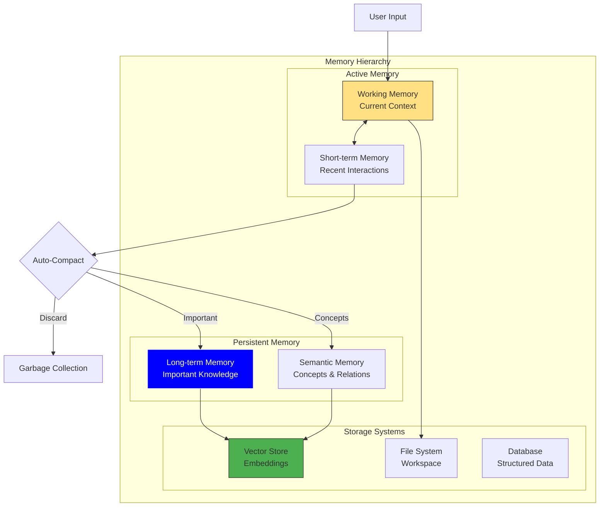

<Card title="Intelligent Context Management" icon="brain" color="#0000FF">
  Siya's memory system is a sophisticated context management solution that maintains relevant information while optimizing performance. Through intelligent auto-compacting and semantic preservation, Siya remembers what matters without getting overwhelmed by details.
</Card>

## Memory Architecture Overview

<Frame caption="Siya's multi-tier memory architecture ensures efficient context management">

</Frame>

## Memory Types

<Tabs>
  <Tab title="Working Memory">
    <Card title="Active Context Buffer" icon="bolt" color="#FFE082">
      The immediate context of your current conversation or task
    </Card>
    
    <AccordionGroup>
      <Accordion title="Characteristics" icon="info-circle" defaultOpen>
        <Columns cols={2}>
          <div>
            **Capacity**
            - ~100K tokens typical
            - ~200K tokens maximum
            - Dynamic allocation
            - Priority-based retention
          </div>
          <div>
            **Contents**
            - Current conversation
            - Active task state
            - Recent tool outputs
            - Immediate context
          </div>
        </Columns>
        
        <Info>
          Working memory is the most actively managed component, constantly optimized for relevance
        </Info>
      </Accordion>
      
      <Accordion title="Management Strategy" icon="sliders">
        ```mermaid
        flowchart LR
            New[New Input] --> Check{Memory Full?}
            Check -->|No| Add[Add to Memory]
            Check -->|Yes| Evaluate[Evaluate Content]
            
            Evaluate --> Priority{Priority?}
            Priority -->|High| Keep[Keep & Compress]
            Priority -->|Medium| Summary[Summarize]
            Priority -->|Low| Remove[Remove]
            
            Keep --> Optimize[Optimize Storage]
            Summary --> Optimize
            Remove --> GC[Garbage Collect]
            
            style New fill:#FFE082,stroke:#333
            style Keep fill:#4CAF50,stroke:#333
            style Remove fill:#F44336,stroke:#333
        ```
      </Accordion>
      
      <Accordion title="Optimization Techniques" icon="rocket">
        <Steps>
          <Step title="Deduplication">
            Remove redundant information and repeated content
          </Step>
          <Step title="Compression">
            Summarize verbose outputs while preserving key information
          </Step>
          <Step title="Prioritization">
            Keep critical information, discard trivial details
          </Step>
          <Step title="Chunking">
            Group related information for efficient retrieval
          </Step>
        </Steps>
      </Accordion>
    </AccordionGroup>
  </Tab>
  
  <Tab title="Short-term Memory">
    <Card title="Recent Interaction Cache" icon="clock" color="#64B5F6">
      Maintains context from recent exchanges and operations
    </Card>
    
    <AccordionGroup>
      <Accordion title="Retention Policy" icon="hourglass" defaultOpen>
        <Table>
          <tr>
            <th>Content Type</th>
            <th>Retention Period</th>
            <th>Priority</th>
          </tr>
          <tr>
            <td>User requests</td>
            <td>Entire session</td>
            <td>High</td>
          </tr>
          <tr>
            <td>Task outcomes</td>
            <td>Until confirmed</td>
            <td>High</td>
          </tr>
          <tr>
            <td>Tool outputs</td>
            <td>5-10 interactions</td>
            <td>Medium</td>
          </tr>
          <tr>
            <td>Error messages</td>
            <td>Until resolved</td>
            <td>High</td>
          </tr>
          <tr>
            <td>Intermediate results</td>
            <td>3-5 interactions</td>
            <td>Low</td>
          </tr>
        </Table>
      </Accordion>
      
      <Accordion title="Transition to Long-term" icon="arrow-right">
        <Frame caption="Intelligent promotion of important information to long-term storage">
          ```mermaid
          graph LR
              STM[Short-term Memory] --> Analyze{Analyze Importance}
              
              Analyze --> Criteria{Meets Criteria?}
              
              Criteria -->|User Marked| Promote[Promote to LTM]
              Criteria -->|Frequently Referenced| Promote
              Criteria -->|Project Critical| Promote
              Criteria -->|Learning Value| Promote
              Criteria -->|Otherwise| Decay[Natural Decay]
              
              Promote --> Index[Semantic Indexing]
              Index --> LTM[Long-term Memory]
              
              Decay --> Remove[Remove after timeout]
              
              style Promote fill:#4CAF50,stroke:#333
              style Decay fill:#FF9800,stroke:#333
          ```
        </Frame>
        
        **Promotion Triggers:**
        - Explicit user marking
        - Multiple references
        - High error cost
        - Novel solutions
        - Configuration data
      </Accordion>
    </AccordionGroup>
  </Tab>
  
  <Tab title="Long-term Memory">
    <Card title="Persistent Knowledge Base" icon="database" color="#0000FF">
      Stores important information across sessions and projects
    </Card>
    
    <AccordionGroup>
      <Accordion title="Storage Categories" icon="folder-tree" defaultOpen>
        <Columns cols={2}>
          <Card title="Project Memory" icon="project-diagram">
            - Code patterns
            - Architecture decisions
            - Configuration settings
            - Custom solutions
            - Error resolutions
          </Card>
          
          <Card title="User Preferences" icon="user-cog">
            - Working style
            - Tool preferences
            - Common requests
            - Language patterns
            - Domain expertise
          </Card>
        </Columns>
        
        <Columns cols={2}>
          <Card title="Technical Knowledge" icon="book">
            - API documentation
            - Code snippets
            - Best practices
            - Library usage
            - Solution patterns
          </Card>
          
          <Card title="Contextual Learning" icon="graduation-cap">
            - Task outcomes
            - Success patterns
            - Failure cases
            - Optimization insights
            - Performance data
          </Card>
        </Columns>
      </Accordion>
      
      <Accordion title="Retrieval System" icon="search">
        <Steps>
          <Step title="Query Analysis">
            Understand what information is needed
          </Step>
          <Step title="Semantic Search">
            Find conceptually related memories
          </Step>
          <Step title="Relevance Ranking">
            Score results by context similarity
          </Step>
          <Step title="Context Integration">
            Seamlessly blend retrieved knowledge
          </Step>
        </Steps>
        
        <Note>
          Long-term memory uses vector embeddings for semantic similarity search
        </Note>
      </Accordion>
    </AccordionGroup>
  </Tab>
  
  <Tab title="Semantic Memory">
    <Card title="Conceptual Understanding" icon="sitemap" color="#9C27B0">
      Stores relationships, patterns, and abstract knowledge
    </Card>
    
    <AccordionGroup>
      <Accordion title="Knowledge Graph" icon="project-diagram" defaultOpen>
        ```mermaid
        graph TD
            subgraph "Concept Network"
                React[React] --> Component[Components]
                React --> Hooks[Hooks]
                React --> State[State Management]
                
                Component --> Props[Props]
                Component --> Lifecycle[Lifecycle]
                
                Hooks --> useState[useState]
                Hooks --> useEffect[useEffect]
                
                State --> Redux[Redux]
                State --> Context[Context API]
                
                Redux --> Actions[Actions]
                Redux --> Reducers[Reducers]
            end
            
            style React fill:#61DAFB,stroke:#333
            style Redux fill:#764ABC,stroke:#333
        ```
        
        **Benefits:**
        - Faster comprehension
        - Better suggestions
        - Contextual awareness
        - Pattern recognition
      </Accordion>
      
      <Accordion title="Relationship Types" icon="link">
        <Columns cols={3}>
          <Card title="Hierarchical" icon="sitemap">
            - Parent-child
            - Category-item
            - General-specific
            - Whole-part
          </Card>
          
          <Card title="Associative" icon="arrows-alt">
            - Related concepts
            - Co-occurrence
            - Cause-effect
            - Similarity
          </Card>
          
          <Card title="Sequential" icon="arrow-right">
            - Process steps
            - Temporal order
            - Dependencies
            - Workflows
          </Card>
        </Columns>
      </Accordion>
    </AccordionGroup>
  </Tab>
</Tabs>

## Auto-Compacting System

<Card title="Intelligent Memory Optimization" icon="compress" color="#07C983">
  The auto-compacting system continuously optimizes memory usage without losing critical information
</Card>

<AccordionGroup>
  <Accordion title="Compaction Process" icon="cogs" defaultOpen>
    <Frame caption="Multi-stage compaction process preserves important information while reducing size">
      ```mermaid
      flowchart TD
          Monitor[Monitor Memory Usage] --> Threshold{Above 70%?}
          
          Threshold -->|No| Continue[Continue Normal Operation]
          Threshold -->|Yes| Analyze[Analyze Content]
          
          Analyze --> Categorize[Categorize Information]
          
          Categorize --> Critical[Critical: Keep Full]
          Categorize --> Important[Important: Summarize]
          Categorize --> Useful[Useful: Extract Key Points]
          Categorize --> Redundant[Redundant: Remove]
          
          Critical --> Restructure[Restructure Memory]
          Important --> Compress[Compress Content]
          Useful --> Extract[Extract Essence]
          Redundant --> Delete[Delete Content]
          
          Compress --> Restructure
          Extract --> Restructure
          Delete --> Restructure
          
          Restructure --> Verify{Quality Check}
          Verify -->|Pass| Update[Update Memory]
          Verify -->|Fail| Rollback[Rollback Changes]
          
          style Monitor fill:#FFE082,stroke:#333
          style Critical fill:#4CAF50,stroke:#333
          style Delete fill:#F44336,stroke:#333
      ```
    </Frame>
  </Accordion>
  
  <Accordion title="Compaction Strategies" icon="strategy">
    <Tabs>
      <Tab title="Content Summarization">
        <Steps>
          <Step title="Identify Verbose Content">
            Find long outputs, detailed logs, repetitive information
          </Step>
          <Step title="Extract Key Information">
            Preserve facts, decisions, outcomes, errors
          </Step>
          <Step title="Generate Summary">
            Create concise representation maintaining meaning
          </Step>
          <Step title="Validate Completeness">
            Ensure no critical information lost
          </Step>
        </Steps>
        
        **Example:**
        ```text
        Original (500 tokens):
        "Ran npm install, which installed 1,247 packages including
        express@4.18.2, body-parser@1.20.1, cors@2.8.5... 
        [full package list]... Installation completed successfully
        with 0 vulnerabilities."
        
        Compressed (50 tokens):
        "Successfully installed project dependencies (1,247 packages)
        including Express, body-parser, CORS. No vulnerabilities."
        ```
      </Tab>
      
      <Tab title="Deduplication">
        <Card title="Remove Redundancies" icon="copy">
          Eliminate repeated information while preserving unique occurrences
        </Card>
        
        <Columns cols={2}>
          <div>
            **Duplicate Types:**
            - Exact copies
            - Near duplicates
            - Semantic equivalents
            - Superseded information
          </div>
          <div>
            **Preservation Rules:**
            - Keep most recent
            - Prefer detailed version
            - Maintain first occurrence
            - Merge partial info
          </div>
        </Columns>
      </Tab>
      
      <Tab title="Selective Retention">
        <Table>
          <tr>
            <th>Information Type</th>
            <th>Retention Priority</th>
            <th>Compaction Method</th>
          </tr>
          <tr>
            <td>User instructions</td>
            <td>🔴 Critical</td>
            <td>Keep verbatim</td>
          </tr>
          <tr>
            <td>Error messages</td>
            <td>🔴 Critical</td>
            <td>Keep with context</td>
          </tr>
          <tr>
            <td>Code output</td>
            <td>🟡 Important</td>
            <td>Keep final version</td>
          </tr>
          <tr>
            <td>Search results</td>
            <td>🟢 Useful</td>
            <td>Summary + links</td>
          </tr>
          <tr>
            <td>Progress updates</td>
            <td>⚪ Low</td>
            <td>Keep final status</td>
          </tr>
        </Table>
      </Tab>
    </Tabs>
  </Accordion>
  
  <Accordion title="Performance Impact" icon="gauge">
    <Columns cols={2}>
      <Card title="Benefits" icon="check" color="#4CAF50">
        - 50-70% memory reduction
        - Faster response times
        - Extended conversations
        - Better context relevance
        - Reduced token costs
      </Card>
      
      <Card title="Trade-offs" icon="balance-scale" color="#FF9800">
        - Slight processing overhead
        - Potential detail loss
        - Compaction pauses
        - Recovery complexity
      </Card>
    </Columns>
    
    <Info>
      Compaction typically takes 100-500ms and happens seamlessly during natural pauses
    </Info>
  </Accordion>
</AccordionGroup>

## Memory Patterns & Strategies

<Card title="Advanced Memory Management Techniques" icon="chess" color="#0000FF">
  Sophisticated patterns for optimal memory utilization across different scenarios
</Card>

<Tabs>
  <Tab title="Conversation Patterns">
    <AccordionGroup>
      <Accordion title="Topic Threading" icon="comments" defaultOpen>
        ```mermaid
        graph TD
            Conv[Conversation Start] --> T1[Topic 1: API Design]
            T1 --> T2[Topic 2: Database Schema]
            T1 --> T3[Topic 3: Authentication]
            
            T2 --> Back1[Return to API Design]
            T3 --> Back2[Return to Database]
            
            Back1 -.->|Restore Context| T1
            Back2 -.->|Restore Context| T2
            
            subgraph "Memory Management"
                Active[Active Topic]
                Suspended[Suspended Topics]
                Archived[Archived Topics]
            end
            
            T1 & T2 & T3 --> Active
            Back1 & Back2 --> Suspended
            
            style Active fill:#4CAF50,stroke:#333
            style Suspended fill:#FF9800,stroke:#333
        ```
        
        **Strategy:**
        - Maintain topic contexts separately
        - Quick context switching
        - Preserve topic-specific details
        - Archive completed topics
      </Accordion>
      
      <Accordion title="Progressive Disclosure" icon="layer-group">
        <Steps>
          <Step title="Initial Context">
            Start with minimal necessary information
          </Step>
          <Step title="Expand as Needed">
            Load additional context based on conversation flow
          </Step>
          <Step title="Prune Irrelevant">
            Remove branches that weren't explored
          </Step>
          <Step title="Consolidate Learning">
            Save important discoveries for future use
          </Step>
        </Steps>
      </Accordion>
    </AccordionGroup>
  </Tab>
  
  <Tab title="Project Patterns">
    <AccordionGroup>
      <Accordion title="Project Context Isolation" icon="folder" defaultOpen>
        <Columns cols={2}>
          <Card title="Project A Memory" icon="folder-open">
            - Tech stack: React, Node.js
            - Conventions: TypeScript
            - Architecture: Microservices
            - Special requirements
          </Card>
          
          <Card title="Project B Memory" icon="folder-open">
            - Tech stack: Vue, Python
            - Conventions: JavaScript
            - Architecture: Monolith
            - Different requirements
          </Card>
        </Columns>
        
        <Warning>
          Siya maintains separate memory contexts to prevent cross-project contamination
        </Warning>
      </Accordion>
      
      <Accordion title="Checkpoint System" icon="save">
        ```mermaid
        timeline
            title Project Memory Checkpoints
            
            Start : Project Initialization
                  : Basic setup complete
            
            Checkpoint 1 : Core Features Done
                        : Memory snapshot saved
            
            Checkpoint 2 : Major Refactoring
                        : Previous state preserved
            
            Checkpoint 3 : Pre-deployment
                        : Final configuration saved
            
            End : Project Completion
                : Full history available
        ```
        
        **Benefits:**
        - Rollback capability
        - Progress tracking
        - Knowledge preservation
        - Error recovery
      </Accordion>
    </AccordionGroup>
  </Tab>
  
  <Tab title="Learning Patterns">
    <AccordionGroup>
      <Accordion title="Pattern Extraction" icon="fingerprint" defaultOpen>
        <Frame caption="Siya learns from repeated patterns and successful solutions">
          ```mermaid
          flowchart LR
              Observe[Observe Actions] --> Detect{Pattern Detected?}
              
              Detect -->|No| Continue[Continue Observing]
              Detect -->|Yes| Analyze[Analyze Pattern]
              
              Analyze --> Success{Successful?}
              
              Success -->|Yes| Store[Store as Template]
              Success -->|No| Learn[Learn from Failure]
              
              Store --> Apply[Apply in Future]
              Learn --> Avoid[Avoid in Future]
              
              Apply --> Improve[Refine Pattern]
              Avoid --> Alternative[Find Alternatives]
              
              style Store fill:#4CAF50,stroke:#333
              style Learn fill:#FF9800,stroke:#333
          ```
        </Frame>
      </Accordion>
      
      <Accordion title="Knowledge Consolidation" icon="compress">
        <Steps>
          <Step title="Identify Common Elements">
            Find repeated concepts across interactions
          </Step>
          <Step title="Abstract Patterns">
            Create generalized understanding
          </Step>
          <Step title="Build Templates">
            Develop reusable solution patterns
          </Step>
          <Step title="Continuous Refinement">
            Update based on new experiences
          </Step>
        </Steps>
        
        **Example Consolidation:**
        - Multiple React component creations → React component template
        - Several API implementations → REST API pattern
        - Various error handlings → Error handling strategy
      </Accordion>
    </AccordionGroup>
  </Tab>
</Tabs>

## Memory Configuration

<Card title="Customize Memory Behavior" icon="sliders" color="#9C27B0">
  Fine-tune memory management to match your needs and preferences
</Card>

<Tabs>
  <Tab title="Basic Settings">
    ```json
    {
      "memory": {
        "maxTokens": 150000,
        "compactionThreshold": 0.7,
        "compactionAggressiveness": "balanced",
        "retentionPolicy": "smart",
        "checkpointFrequency": "auto"
      }
    }
    ```
    
    <AccordionGroup>
      <Accordion title="Configuration Options" icon="cog">
        <Table>
          <tr>
            <th>Setting</th>
            <th>Options</th>
            <th>Description</th>
          </tr>
          <tr>
            <td>maxTokens</td>
            <td>50k-200k</td>
            <td>Maximum memory size</td>
          </tr>
          <tr>
            <td>compactionThreshold</td>
            <td>0.5-0.9</td>
            <td>When to trigger compaction</td>
          </tr>
          <tr>
            <td>compactionAggressiveness</td>
            <td>gentle, balanced, aggressive</td>
            <td>How much to compress</td>
          </tr>
          <tr>
            <td>retentionPolicy</td>
            <td>conservative, smart, minimal</td>
            <td>What to keep</td>
          </tr>
        </Table>
      </Accordion>
    </AccordionGroup>
  </Tab>
  
  <Tab title="Advanced Settings">
    ```json
    {
      "memory": {
        "semanticIndexing": {
          "enabled": true,
          "embeddingModel": "text-embedding-3-large",
          "similarityThreshold": 0.8
        },
        "persistence": {
          "enabled": true,
          "storage": "local",
          "encryption": true,
          "autoSync": true
        },
        "learning": {
          "patternRecognition": true,
          "templateGeneration": true,
          "crossProjectLearning": false
        }
      }
    }
    ```
    
    <Columns cols={3}>
      <Card title="Semantic Features" icon="brain">
        - Embedding generation
        - Similarity search
        - Concept mapping
        - Relationship tracking
      </Card>
      
      <Card title="Persistence" icon="save">
        - Cross-session memory
        - Encrypted storage
        - Cloud sync
        - Backup/restore
      </Card>
      
      <Card title="Learning" icon="graduation-cap">
        - Pattern detection
        - Solution templates
        - Performance optimization
        - User adaptation
      </Card>
    </Columns>
  </Tab>
</Tabs>

## Memory Optimization Tips

<Card title="Get the Most from Siya's Memory" icon="rocket" color="#4CAF50">
  Best practices for optimal memory utilization and performance
</Card>

<AccordionGroup>
  <Accordion title="Do's" icon="check-circle" defaultOpen>
    <Steps>
      <Step title="Clear Context When Switching Projects">
        Start fresh to avoid confusion between different codebases
      </Step>
      <Step title="Use Descriptive Variable Names">
        Helps Siya maintain context with less memory
      </Step>
      <Step title="Summarize Long Outputs">
        Ask Siya to summarize before moving to new topics
      </Step>
      <Step title="Mark Important Information">
        Tell Siya what's critical to remember
      </Step>
      <Step title="Use Checkpoints">
        Create memory snapshots at major milestones
      </Step>
    </Steps>
  </Accordion>
  
  <Accordion title="Don'ts" icon="times-circle">
    <Columns cols={2}>
      <Card title="Avoid" icon="ban" color="#F44336">
        - Extremely long single messages
        - Redundant information dumps
        - Keeping irrelevant context
        - Mixing unrelated projects
      </Card>
      
      <Card title="Instead" icon="lightbulb" color="#4CAF50">
        - Break into logical chunks
        - Provide concise information
        - Clear old conversations
        - Use project isolation
      </Card>
    </Columns>
  </Accordion>
  
  <Accordion title="Performance Monitoring" icon="gauge">
    <Info>
      Monitor memory usage through the status bar or ask "How's your memory doing?"
    </Info>
    
    ```mermaid
    graph LR
        Green[Green: 0-50%<br/>Optimal Performance] 
        Yellow[Yellow: 50-70%<br/>Good Performance]
        Orange[Orange: 70-85%<br/>Compaction Active]
        Red[Red: 85-100%<br/>Performance Impact]
        
        Green -->|Memory Fills| Yellow
        Yellow -->|Continued Use| Orange
        Orange -->|Heavy Load| Red
        
        style Green fill:#4CAF50,stroke:#333
        style Yellow fill:#FFE082,stroke:#333
        style Orange fill:#FF9800,stroke:#333
        style Red fill:#F44336,stroke:#333
    ```
  </Accordion>
</AccordionGroup>

## Memory Troubleshooting

<AccordionGroup>
  <Accordion title="Common Issues" icon="exclamation-triangle">
    <Table>
      <tr>
        <th>Issue</th>
        <th>Symptoms</th>
        <th>Solution</th>
      </tr>
      <tr>
        <td>Context loss</td>
        <td>Siya forgets recent info</td>
        <td>Reduce compaction aggressiveness</td>
      </tr>
      <tr>
        <td>Slow responses</td>
        <td>Delayed replies</td>
        <td>Clear memory or increase limit</td>
      </tr>
      <tr>
        <td>Wrong context</td>
        <td>Mixed project info</td>
        <td>Clear and restart conversation</td>
      </tr>
      <tr>
        <td>Repetitive answers</td>
        <td>Same solutions</td>
        <td>Reset learning patterns</td>
      </tr>
    </Table>
  </Accordion>
  
  <Accordion title="Memory Management Commands" icon="terminal">
    <CodeGroup>
      ```text Status Check
      "What's your current memory usage?"
      "Show me memory statistics"
      ```
      
      ```text Clear Operations
      "Clear conversation memory"
      "Reset project context"
      "Start fresh"
      ```
      
      ```text Optimization
      "Compress current memory"
      "Summarize our conversation"
      "Save important points"
      ```
    </CodeGroup>
  </Accordion>
</AccordionGroup>

## Future Enhancements

<Card title="Coming Soon" icon="clock" color="#0000FF">
  <Columns cols={2}>
    <div>
      **Enhanced Persistence**
      - Cloud memory sync
      - Team shared memory
      - Version control integration
      - Memory templates
    </div>
    <div>
      **Advanced Features**
      - Photographic memory mode
      - Selective amnesia
      - Memory merge tools
      - External memory plugins
    </div>
  </Columns>
</Card>

## Summary

<Card title="Master Memory for Maximum Productivity" icon="graduation-cap" color="#0000FF">
  Siya's memory system is a sophisticated balance of retention and performance. Through intelligent auto-compacting, semantic understanding, and adaptive management, Siya maintains the perfect amount of context for any task. Understanding how memory works helps you work more effectively with Siya, ensuring important information is preserved while maintaining optimal performance.
</Card>

<Columns cols={2}>
  <Card title="Next: Configuration" icon="sliders" href="/siya-superagent/configuration">
    Learn how to customize Siya for your needs
  </Card>
  
  <Card title="Optimize Your Workflow" icon="rocket" href="/siya-superagent/desktop-application">
    Apply memory best practices in Siya
  </Card>
</Columns>

---

*Intelligent memory. Perfect context. Optimal performance.*