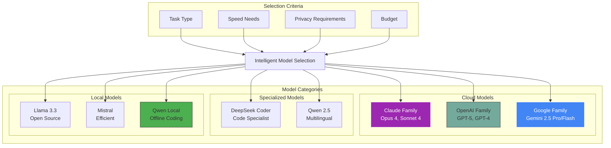
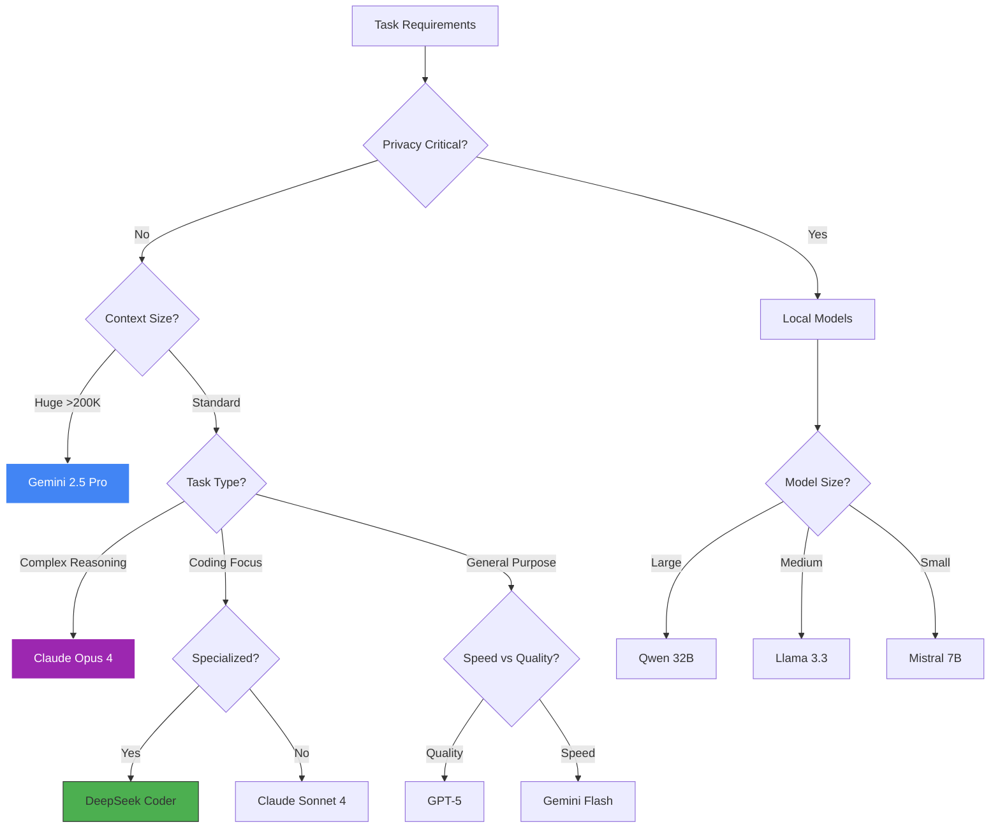

<Card title="The Right Model for Every Task" icon="brain" color="#9C27B0">
  Siya supports a comprehensive range of cutting-edge AI models, from powerful cloud-based options to privacy-focused local models. Understanding each model's strengths helps you choose the perfect one for your specific needs, balancing performance, cost, and capabilities.
</Card>

## Model Overview

<Frame caption="Siya's multi-model ecosystem provides flexibility and choice">

</Frame>

## Cloud Models

<Card title="Cutting-Edge AI at Your Fingertips" icon="cloud" color="#0000FF">
  Access the most powerful AI models through secure API connections
</Card>

<Tabs>
  <Tab title="Claude Models">
    <Card title="Anthropic's Claude Family" icon="robot" color="#9C27B0">
      Industry-leading models known for reasoning, safety, and helpful responses
    </Card>
    
    <AccordionGroup>
      <Accordion title="Claude Opus 4" icon="crown" defaultOpen>
        <Columns cols={2}>
          <div>
            **The Flagship Model**
            
            Claude Opus 4 represents the pinnacle of AI capability, excelling at:
            - Complex reasoning and analysis
            - Architecture design and planning
            - Code generation and debugging
            - Creative problem solving
            - Multi-step task execution
          </div>
          
          <Card title="Specifications" icon="info">
            - **Context**: 200K tokens
            - **Strengths**: Deep reasoning
            - **Speed**: 20-30 tokens/sec
            - **Best for**: Complex tasks
            - **Cost**: Premium tier
          </Card>
        </Columns>
        
        <Frame caption="Claude Opus 4 performance across different tasks">
          ```mermaid
          radar:
            title: Claude Opus 4 Capabilities
            legend:
              - Score (0-100)
            data:
              - label: Coding
                Opus 4: 95
              - label: Reasoning
                Opus 4: 98
              - label: Creativity
                Opus 4: 92
              - label: Speed
                Opus 4: 75
              - label: Context
                Opus 4: 90
              - label: Accuracy
                Opus 4: 96
          ```
        </Frame>
        
        <Tip>
          Choose Opus 4 when accuracy and reasoning depth matter more than speed
        </Tip>
      </Accordion>
      
      <Accordion title="Claude Sonnet 4" icon="music">
        <Columns cols={2}>
          <div>
            **The Balanced Performer**
            
            Sonnet 4 offers an optimal balance of capability and efficiency:
            - Fast response times
            - Excellent code understanding
            - Strong analytical skills
            - Cost-effective for most tasks
            - Great for iterative development
          </div>
          
          <Card title="Specifications" icon="info">
            - **Context**: 200K tokens
            - **Strengths**: Balance
            - **Speed**: 40-50 tokens/sec
            - **Best for**: Daily coding
            - **Cost**: Standard tier
          </Card>
        </Columns>
        
        <Info>
          Sonnet 4 is recommended for 80% of development tasks
        </Info>
      </Accordion>
    </AccordionGroup>
  </Tab>
  
  <Tab title="OpenAI Models">
    <Card title="OpenAI GPT Family" icon="openai" color="#74AA9C">
      Versatile models with broad capabilities and extensive training
    </Card>
    
    <AccordionGroup>
      <Accordion title="GPT-5" icon="star" defaultOpen>
        <Columns cols={2}>
          <div>
            **Next-Generation Intelligence**
            
            GPT-5 brings unprecedented capabilities:
            - Multimodal understanding
            - Advanced code generation
            - System design expertise
            - Natural conversation flow
            - Extensive knowledge base
          </div>
          
          <Card title="Specifications" icon="info">
            - **Context**: 128K tokens
            - **Strengths**: Versatility
            - **Speed**: 30-40 tokens/sec
            - **Best for**: General tasks
            - **Cost**: Premium tier
          </Card>
        </Columns>
        
        <Warning>
          GPT-5 access may be limited based on your API tier
        </Warning>
      </Accordion>
      
      <Accordion title="GPT-4 Turbo" icon="gauge">
        <Columns cols={2}>
          <div>
            **Production-Ready Workhorse**
            
            Optimized for real-world applications:
            - Consistent performance
            - Reliable outputs
            - Good token efficiency
            - Broad language support
            - Stable API
          </div>
          
          <Card title="Specifications" icon="info">
            - **Context**: 128K tokens
            - **Strengths**: Reliability
            - **Speed**: 50-60 tokens/sec
            - **Best for**: Production
            - **Cost**: Standard tier
          </Card>
        </Columns>
      </Accordion>
    </AccordionGroup>
  </Tab>
  
  <Tab title="Google Models">
    <Card title="Google Gemini Family" icon="google" color="#4285F4">
      Massive context windows and multimodal capabilities
    </Card>
    
    <AccordionGroup>
      <Accordion title="Gemini 2.5 Pro" icon="gem" defaultOpen>
        <Columns cols={2}>
          <div>
            **The Context Champion**
            
            Unmatched context window for large-scale analysis:
            - 1M+ token context window
            - Excellent for large codebases
            - Strong multimodal support
            - Fast inference
            - Competitive pricing
          </div>
          
          <Card title="Specifications" icon="info">
            - **Context**: 1M+ tokens
            - **Strengths**: Large context
            - **Speed**: 60-80 tokens/sec
            - **Best for**: Big projects
            - **Cost**: Competitive
          </Card>
        </Columns>
        
        <Frame caption="Context window comparison">
          ```mermaid
          graph LR
              subgraph "Context Windows"
                  Claude[Claude<br/>200K]
                  GPT[GPT-5<br/>128K]
                  Gemini[Gemini<br/>1M+ tokens]
              end
              
              Claude --> Medium[Medium Projects]
              GPT --> Standard[Standard Tasks]
              Gemini --> Large[Large Codebases]
              
              style Gemini fill:#4285F4,stroke:#fff,color:#fff
          ```
        </Frame>
      </Accordion>
      
      <Accordion title="Gemini 2.5 Flash" icon="bolt">
        <Columns cols={2}>
          <div>
            **Lightning Fast Responses**
            
            Optimized for speed without sacrificing quality:
            - Extremely fast inference
            - Lower latency
            - Cost-efficient
            - Good for simple tasks
            - Real-time applications
          </div>
          
          <Card title="Specifications" icon="info">
            - **Context**: 32K tokens
            - **Strengths**: Speed
            - **Speed**: 100+ tokens/sec
            - **Best for**: Quick tasks
            - **Cost**: Budget tier
          </Card>
        </Columns>
      </Accordion>
    </AccordionGroup>
  </Tab>
</Tabs>

## Specialized Models

<Card title="Purpose-Built for Specific Domains" icon="bullseye" color="#4CAF50">
  Models optimized for particular use cases and languages
</Card>

<AccordionGroup>
  <Accordion title="DeepSeek Coder" icon="code" defaultOpen>
    <Columns cols={2}>
      <div>
        **The Code Specialist**
        
        Trained specifically for programming tasks:
        - Superior code completion
        - Bug detection and fixing
        - Code explanation
        - Refactoring suggestions
        - Multi-language support
        
        **Supported Languages:**
        Python, JavaScript, TypeScript, Java, C++, Go, Rust, and more
      </div>
      
      <Card title="Performance Metrics" icon="chart-line">
        ```mermaid
        graph TB
            subgraph "DeepSeek Strengths"
                Code[Code Generation: 95%]
                Debug[Debugging: 92%]
                Explain[Explanation: 88%]
                Refactor[Refactoring: 90%]
            end
            
            style Code fill:#4CAF50,stroke:#333
        ```
      </Card>
    </Columns>
    
    <Tip>
      Use DeepSeek for intensive coding sessions and complex debugging
    </Tip>
  </Accordion>
  
  <Accordion title="Qwen 2.5" icon="globe">
    <Columns cols={2}>
      <div>
        **Multilingual Excellence**
        
        Outstanding performance across languages:
        - Native multilingual training
        - Strong in Asian languages
        - Excellent reasoning
        - Cultural awareness
        - Technical accuracy
        
        **Language Support:**
        English, Chinese, Japanese, Korean, Spanish, French, German, and 50+ more
      </div>
      
      <Card title="Use Cases" icon="lightbulb">
        - International projects
        - Localization tasks
        - Cross-cultural apps
        - Global documentation
        - Multi-region deployment
      </Card>
    </Columns>
  </Accordion>
</AccordionGroup>

## Local Models

<Card title="Privacy-First AI on Your Machine" icon="server" color="#07C983">
  Run powerful models locally without internet connection
</Card>

<Tabs>
  <Tab title="Setup Guide">
    <Steps>
      <Step title="Download Model">
        <Card title="Model Sources" icon="download">
          Download llamafile models from:
          - [Official Llamafile Repo](https://github.com/Mozilla-Ocho/llamafile)
          - [Hugging Face](https://huggingface.co/models)
          - [Direct Links](#available-models)
        </Card>
      </Step>
      
      <Step title="Install Model">
        ```bash
        # Create models directory
        mkdir -p ~/.siya/local-models
        
        # Move downloaded model
        mv ~/Downloads/model.llamafile ~/.siya/local-models/
        
        # Make executable
        chmod +x ~/.siya/local-models/model.llamafile
        ```
      </Step>
      
      <Step title="Configure Siya">
        Model appears automatically in Siya's model selector
      </Step>
      
      <Step title="First Run">
        First run may take time to load model into memory
      </Step>
    </Steps>
    
    <Info>
      Local models require 8-64GB RAM depending on model size
    </Info>
  </Tab>
  
  <Tab title="Available Models">
    <Table>
      <tr>
        <th>Model</th>
        <th>Size</th>
        <th>RAM Required</th>
        <th>Strengths</th>
        <th>Download</th>
      </tr>
      <tr>
        <td>**Qwen 2.5 Coder 32B**</td>
        <td>19GB</td>
        <td>32GB</td>
        <td>Excellent coding, fast</td>
        <td>[Download](#)</td>
      </tr>
      <tr>
        <td>**DeepSeek Coder 33B**</td>
        <td>18GB</td>
        <td>32GB</td>
        <td>Code specialist</td>
        <td>[Download](#)</td>
      </tr>
      <tr>
        <td>**Llama 3.3 70B**</td>
        <td>40GB</td>
        <td>64GB</td>
        <td>General purpose</td>
        <td>[Download](#)</td>
      </tr>
      <tr>
        <td>**Mistral 7B**</td>
        <td>4GB</td>
        <td>8GB</td>
        <td>Fast, efficient</td>
        <td>[Download](#)</td>
      </tr>
      <tr>
        <td>**Phi-3 Mini**</td>
        <td>2.3GB</td>
        <td>4GB</td>
        <td>Lightweight</td>
        <td>[Download](#)</td>
      </tr>
    </Table>
  </Tab>
  
  <Tab title="Performance">
    <Card title="Local Model Performance" icon="gauge" color="#FF9800">
      Performance depends on your hardware configuration
    </Card>
    
    <AccordionGroup>
      <Accordion title="Hardware Requirements" icon="microchip" defaultOpen>
        <Columns cols={2}>
          <Card title="Minimum Specs" icon="desktop">
            - **CPU**: 8-core modern processor
            - **RAM**: 16GB (8GB models)
            - **Storage**: 50GB free
            - **OS**: macOS 12+, Windows 10+
          </Card>
          
          <Card title="Recommended Specs" icon="rocket">
            - **CPU**: Apple M2/M3 or equivalent
            - **RAM**: 32-64GB
            - **GPU**: Optional but helpful
            - **Storage**: 100GB+ SSD
          </Card>
        </Columns>
      </Accordion>
      
      <Accordion title="Optimization Tips" icon="sliders">
        <Steps>
          <Step title="Enable GPU Acceleration">
            ```bash
            export LLAMAFILE_GPU=1
            export CUDA_VISIBLE_DEVICES=0
            ```
          </Step>
          
          <Step title="Adjust Context Size">
            ```bash
            export LLAMAFILE_CTX=4096  # Reduce for speed
            ```
          </Step>
          
          <Step title="Use Quantization">
            Choose Q4 or Q5 quantized models for better performance
          </Step>
        </Steps>
      </Accordion>
    </AccordionGroup>
  </Tab>
</Tabs>

## Model Selection Strategy

<Card title="Choose the Right Model Every Time" icon="compass" color="#9C27B0">
  Strategic guidance for optimal model selection
</Card>

<Frame caption="Model selection decision tree">

</Frame>

<Tabs>
  <Tab title="By Task Type">
    <AccordionGroup>
      <Accordion title="Software Architecture" icon="sitemap" defaultOpen>
        <Card title="Recommended: Claude Opus 4" icon="crown" color="#9C27B0">
          **Why Opus 4?**
          - Deep reasoning for design decisions
          - Understands complex systems
          - Excellent at trade-off analysis
          - Can model entire architectures
          
          **Alternative:** GPT-5 for broader perspective
        </Card>
      </Accordion>
      
      <Accordion title="Code Implementation" icon="code">
        <Card title="Recommended: DeepSeek Coder" icon="code" color="#4CAF50">
          **Why DeepSeek?**
          - Specialized for code generation
          - Superior completion accuracy
          - Understands language idioms
          - Fast and efficient
          
          **Alternative:** Claude Sonnet 4 for general coding
        </Card>
      </Accordion>
      
      <Accordion title="Debugging & Analysis" icon="bug">
        <Card title="Recommended: Claude Sonnet 4" icon="search" color="#9C27B0">
          **Why Sonnet 4?**
          - Balanced analysis capabilities
          - Good at finding subtle bugs
          - Clear explanations
          - Fast enough for iteration
          
          **Alternative:** Local Qwen for privacy-sensitive code
        </Card>
      </Accordion>
      
      <Accordion title="Documentation" icon="book">
        <Card title="Recommended: GPT-4 Turbo" icon="file-text" color="#74AA9C">
          **Why GPT-4 Turbo?**
          - Natural writing style
          - Good at examples
          - Consistent formatting
          - Cost-effective
          
          **Alternative:** Gemini Pro for large docs
        </Card>
      </Accordion>
    </AccordionGroup>
  </Tab>
  
  <Tab title="By Project Size">
    <Table>
      <tr>
        <th>Project Size</th>
        <th>Recommended Model</th>
        <th>Reasoning</th>
      </tr>
      <tr>
        <td>**Small** (&lt;10K LOC)</td>
        <td>Claude Sonnet 4</td>
        <td>Fast, efficient, sufficient context</td>
      </tr>
      <tr>
        <td>**Medium** (10K-100K LOC)</td>
        <td>Claude Opus 4</td>
        <td>Better reasoning for complexity</td>
      </tr>
      <tr>
        <td>**Large** (100K-1M LOC)</td>
        <td>Gemini 2.5 Pro</td>
        <td>Massive context window needed</td>
      </tr>
      <tr>
        <td>**Enterprise** (&gt;1M LOC)</td>
        <td>Gemini Pro + Opus 4</td>
        <td>Use Gemini for context, Opus for reasoning</td>
      </tr>
    </Table>
  </Tab>
  
  <Tab title="By Constraints">
    <AccordionGroup>
      <Accordion title="Budget Conscious" icon="dollar" defaultOpen>
        <Steps>
          <Step title="Primary: Gemini Flash">
            Fastest and most cost-effective for simple tasks
          </Step>
          <Step title="Complex Tasks: Claude Sonnet 4">
            Good balance of capability and cost
          </Step>
          <Step title="Consider Local Models">
            One-time download, no ongoing costs
          </Step>
        </Steps>
      </Accordion>
      
      <Accordion title="Privacy First" icon="shield">
        <Card title="Local Models Only" icon="lock" color="#4CAF50">
          1. **Qwen 2.5 Coder 32B** - Best for coding
          2. **Llama 3.3 70B** - General purpose
          3. **Mistral 7B** - Resource-constrained
          
          <Warning>
            Never use cloud models for sensitive data
          </Warning>
        </Card>
      </Accordion>
      
      <Accordion title="Speed Critical" icon="bolt">
        <Columns cols={2}>
          <Card title="Cloud Options" icon="cloud">
            1. Gemini Flash
            2. GPT-4 Turbo
            3. Claude Sonnet 4
          </Card>
          
          <Card title="Local Options" icon="server">
            1. Mistral 7B
            2. Phi-3 Mini
            3. Quantized models
          </Card>
        </Columns>
      </Accordion>
    </AccordionGroup>
  </Tab>
</Tabs>

## Model Comparison

<Card title="Side-by-Side Model Comparison" icon="balance-scale" color="#0000FF">
  Detailed comparison to help you make informed decisions
</Card>

<Table>
  <tr>
    <th>Model</th>
    <th>Context</th>
    <th>Speed</th>
    <th>Strength</th>
    <th>Cost</th>
    <th>Best For</th>
  </tr>
  <tr>
    <td>**Claude Opus 4**</td>
    <td>200K</td>
    <td>⭐⭐⭐</td>
    <td>Reasoning</td>
    <td>$$$$</td>
    <td>Complex tasks</td>
  </tr>
  <tr>
    <td>**Claude Sonnet 4**</td>
    <td>200K</td>
    <td>⭐⭐⭐⭐</td>
    <td>Balance</td>
    <td>$$</td>
    <td>Daily coding</td>
  </tr>
  <tr>
    <td>**GPT-5**</td>
    <td>128K</td>
    <td>⭐⭐⭐</td>
    <td>Versatility</td>
    <td>$$$$</td>
    <td>General AI</td>
  </tr>
  <tr>
    <td>**Gemini 2.5 Pro**</td>
    <td>1M+</td>
    <td>⭐⭐⭐⭐</td>
    <td>Context</td>
    <td>$$</td>
    <td>Large projects</td>
  </tr>
  <tr>
    <td>**Gemini Flash**</td>
    <td>32K</td>
    <td>⭐⭐⭐⭐⭐</td>
    <td>Speed</td>
    <td>$</td>
    <td>Quick tasks</td>
  </tr>
  <tr>
    <td>**DeepSeek Coder**</td>
    <td>64K</td>
    <td>⭐⭐⭐⭐</td>
    <td>Coding</td>
    <td>$$</td>
    <td>Programming</td>
  </tr>
  <tr>
    <td>**Local Qwen 32B**</td>
    <td>32K</td>
    <td>⭐⭐⭐</td>
    <td>Privacy</td>
    <td>Free</td>
    <td>Offline work</td>
  </tr>
</Table>

## Switching Models

<Card title="Dynamic Model Switching" icon="exchange" color="#4CAF50">
  Switch models on the fly based on your needs
</Card>

<Tabs>
  <Tab title="Manual Switching">
    <Steps>
      <Step title="Quick Switch">
        Press `⌘ + M` to open model selector
      </Step>
      <Step title="Menu Bar">
        Click model name in status bar
      </Step>
      <Step title="Command">
        Type "switch to GPT-5" in chat
      </Step>
      <Step title="Settings">
        Change default in preferences
      </Step>
    </Steps>
  </Tab>
  
  <Tab title="Automatic Switching">
    <Card title="Smart Model Selection" icon="brain" color="#9C27B0">
      Enable automatic model switching based on task
    </Card>
    
    ```json
    {
      "modelSelection": {
        "autoSwitch": true,
        "rules": [
          {
            "pattern": "debug|fix|error",
            "model": "claude-sonnet-4"
          },
          {
            "pattern": "architect|design|plan",
            "model": "claude-opus-4"
          },
          {
            "pattern": "quick|simple|fast",
            "model": "gemini-flash"
          },
          {
            "complexity": "> 8",
            "model": "claude-opus-4"
          }
        ]
      }
    }
    ```
    
    <Info>
      Siya learns your preferences and improves selection over time
    </Info>
  </Tab>
</Tabs>

## Cost Optimization

<Card title="Manage Your AI Budget Effectively" icon="dollar" color="#07C983">
  Strategies to optimize costs while maintaining quality
</Card>

<AccordionGroup>
  <Accordion title="Cost-Saving Strategies" icon="piggy-bank" defaultOpen>
    <Steps>
      <Step title="Use Appropriate Models">
        Don't use Opus 4 for simple tasks - Sonnet 4 or Flash work great
      </Step>
      <Step title="Enable Auto-Switching">
        Let Siya choose cost-effective models automatically
      </Step>
      <Step title="Leverage Local Models">
        Use local models for repetitive or sensitive tasks
      </Step>
      <Step title="Optimize Context">
        Clear unnecessary context to reduce token usage
      </Step>
      <Step title="Batch Operations">
        Group similar tasks to reduce overhead
      </Step>
    </Steps>
  </Accordion>
  
  <Accordion title="Usage Monitoring" icon="chart-line">
    <CodeGroup>
      ```text Monitor Commands
      "Show my token usage"
      "What's my API spend today?"
      "Which model am I using most?"
      "Show cost breakdown"
      ```
      
      ```json Cost Alerts
      {
        "billing": {
          "alerts": {
            "daily": 50,
            "weekly": 200,
            "monthly": 500
          },
          "actions": {
            "warn": 0.8,
            "switch": 0.9,
            "stop": 1.0
          }
        }
      }
      ```
    </CodeGroup>
  </Accordion>
</AccordionGroup>

## Best Practices

<Card title="Model Selection Excellence" icon="medal" color="#FFD700">
  Expert tips for getting the most from each model
</Card>

<AccordionGroup>
  <Accordion title="General Guidelines" icon="compass" defaultOpen>
    <Columns cols={2}>
      <Card title="Do's" icon="check" color="#4CAF50">
        - Start with faster models
        - Upgrade when needed
        - Use local for privacy
        - Monitor costs
        - Learn model strengths
        - Experiment freely
      </Card>
      
      <Card title="Don'ts" icon="times" color="#F44336">
        - Always use most expensive
        - Ignore context limits
        - Share API keys
        - Neglect local options
        - Stick to one model
        - Waste tokens
      </Card>
    </Columns>
  </Accordion>
  
  <Accordion title="Model-Specific Tips" icon="lightbulb">
    <Table>
      <tr>
        <th>Model</th>
        <th>Pro Tips</th>
      </tr>
      <tr>
        <td>Claude Opus 4</td>
        <td>Use for system design, complex debugging, architectural decisions</td>
      </tr>
      <tr>
        <td>Claude Sonnet 4</td>
        <td>Default choice for coding, great balance of speed and capability</td>
      </tr>
      <tr>
        <td>GPT-5</td>
        <td>Excellent for creative tasks, documentation, general knowledge</td>
      </tr>
      <tr>
        <td>Gemini Pro</td>
        <td>Perfect for analyzing large codebases, batch processing</td>
      </tr>
      <tr>
        <td>DeepSeek</td>
        <td>Go-to for pure coding tasks, especially completions</td>
      </tr>
      <tr>
        <td>Local Models</td>
        <td>Use for sensitive code, offline work, repetitive tasks</td>
      </tr>
    </Table>
  </Accordion>
</AccordionGroup>

## Future Models

<Card title="Coming Soon to Siya" icon="rocket" color="#9C27B0">
  Upcoming models and capabilities on our roadmap
</Card>

<Columns cols={2}>
  <Card title="In Development" icon="clock" color="#0000FF">
    **Coming Soon**
    - Claude Haiku 3
    - GPT-4 Vision
    - Llama 4
    - Custom fine-tuned models
    - Mixtral MOE
  </Card>
  
  <Card title="Future Vision" icon="star" color="#9C27B0">
    **On the Horizon**
    - Multi-model ensemble
    - Custom training
    - Specialized verticals
    - Real-time models
    - Edge deployment
  </Card>
</Columns>

## Summary

<Card title="Choose Wisely, Code Brilliantly" icon="trophy" color="#FFD700">
  With Siya's comprehensive model selection, you have access to the perfect AI for every task. From the reasoning depth of Claude Opus 4 to the lightning speed of Gemini Flash, from specialized coding models to privacy-preserving local options - the right model is always at your fingertips. Understanding each model's strengths empowers you to work smarter, faster, and more efficiently.
</Card>

<Columns cols={2}>
  <Card title="Get Started" icon="rocket" href="/siya-superagent/quick-start">
    Start using Siya with your chosen model
  </Card>
  
  <Card title="API Setup" icon="key" href="/siya-superagent/configuration">
    Configure your API keys
  </Card>
</Columns>

---

*The right model. The right time. The right results.*