<Card title="Intelligent Task Orchestration" icon="brain" color="#0000FF">
  Siya's planning system breaks down complex requests into manageable steps, coordinates resources, and ensures successful execution. Whether you're building an application or analyzing data, Siya creates comprehensive plans that adapt to your needs.
</Card>

## Planning Overview

```mermaid
graph TB
    subgraph "Planning Pipeline"
        Input["🎯 User Request"] --> Analysis["🔍 Request Analysis"]
        Analysis --> Decomposition["📊 Task Decomposition"]
        Decomposition --> Dependencies["🔗 Dependency Mapping"]
        Dependencies --> Resources["📦 Resource Allocation"]
        Resources --> Schedule["📅 Execution Schedule"]
        Schedule --> Plan["📋 Final Plan"]
        
        Plan --> Execute["⚡ Execution"]
        Execute --> Monitor["👁️ Monitoring"]
        Monitor --> Adapt["🔄 Adaptation"]
        Adapt --> Complete["✅ Completion"]
        
        Adapt -.->|Replan if needed| Decomposition
    end
    
    style Input fill:#FFE082,stroke:#333
    style Plan fill:#0000FF,stroke:#fff,color:#fff
    style Complete fill:#4CAF50,stroke:#333
```

<Frame caption="Siya's planning system transforms complex requests into structured, executable plans">

</Frame>

## Planning Phases

<Tabs>
  <Tab title="Analysis Phase">
    <Card title="Understanding Intent" icon="microscope" color="#07C983">
      The first step in planning is deeply understanding what you want to achieve
    </Card>
    
    <AccordionGroup>
      <Accordion title="Intent Recognition" icon="lightbulb" defaultOpen>
        <Steps>
          <Step title="Goal Extraction">
            Identify primary objectives and success criteria
          </Step>
          <Step title="Constraint Detection">
            Recognize limitations, requirements, and preferences
          </Step>
          <Step title="Context Gathering">
            Understand environment, existing resources, and background
          </Step>
          <Step title="Ambiguity Resolution">
            Clarify unclear aspects through inference or interaction
          </Step>
        </Steps>
        
        <Info>
          In Chat Mode, Siya may ask clarifying questions. In Task Mode, it makes intelligent assumptions.
        </Info>
      </Accordion>
      
      <Accordion title="Complexity Assessment" icon="gauge">
        ```mermaid
        flowchart LR
            Request[User Request] --> Analyzer{Complexity Analyzer}
            
            Analyzer --> Simple[Simple Task<br/>1-3 steps]
            Analyzer --> Medium[Medium Task<br/>4-10 steps]
            Analyzer --> Complex[Complex Task<br/>10+ steps]
            
            Simple --> Direct[Direct Execution]
            Medium --> Standard[Standard Planning]
            Complex --> Deep[Deep Planning]
            
            style Simple fill:#4CAF50,stroke:#333
            style Medium fill:#FF9800,stroke:#333
            style Complex fill:#F44336,stroke:#333
        ```
        
        **Complexity Factors:**
        - Number of distinct operations
        - Inter-step dependencies
        - Resource requirements
        - Domain diversity
        - Error potential
      </Accordion>
      
      <Accordion title="Domain Identification" icon="tags">
        <Columns cols={3}>
          <Card title="Technical" icon="code">
            - Programming
            - DevOps
            - Databases
            - Architecture
            - Testing
          </Card>
          
          <Card title="Analytical" icon="chart-line">
            - Data processing
            - Statistics
            - Visualization
            - Research
            - Reporting
          </Card>
          
          <Card title="Creative" icon="palette">
            - Content writing
            - Design
            - Documentation
            - Presentations
            - UI/UX
          </Card>
        </Columns>
      </Accordion>
    </AccordionGroup>
  </Tab>
  
  <Tab title="Decomposition Phase">
    <Card title="Breaking Down Complexity" icon="sitemap" color="#15803D">
      Transform high-level goals into specific, actionable tasks
    </Card>
    
    <AccordionGroup>
      <Accordion title="Task Breakdown" icon="tree" defaultOpen>
        <Frame caption="Hierarchical task decomposition ensures nothing is missed">
          ```mermaid
          graph TD
              Goal["Build E-commerce Website"]
              
              Goal --> Backend["Backend Development"]
              Goal --> Frontend["Frontend Development"]
              Goal --> Database["Database Setup"]
              Goal --> Deploy["Deployment"]
              
              Backend --> API["Create REST API"]
              Backend --> Auth["Implement Authentication"]
              Backend --> Payment["Payment Integration"]
              
              Frontend --> UI["Design UI Components"]
              Frontend --> Pages["Build Pages"]
              Frontend --> State["State Management"]
              
              Database --> Schema["Design Schema"]
              Database --> Migrate["Run Migrations"]
              Database --> Seed["Seed Data"]
              
              Deploy --> Config["Configure Server"]
              Deploy --> CI["Setup CI/CD"]
              Deploy --> Monitor["Add Monitoring"]
              
              style Goal fill:#0000FF,stroke:#fff,color:#fff
              style API fill:#07C983,stroke:#333
              style UI fill:#FF9800,stroke:#333
              style Schema fill:#9C27B0,stroke:#333
              style Config fill:#F44336,stroke:#333
          ```
        </Frame>
      </Accordion>
      
      <Accordion title="Granularity Control" icon="sliders">
        <Tabs>
          <Tab title="High-Level Tasks">
            <Card title="Strategic Planning" icon="chess">
              Suitable for experienced users who want control
            </Card>
            
            **Example:**
            ```
            1. Set up development environment
            2. Implement core features
            3. Add authentication
            4. Deploy to production
            ```
            
            **Benefits:**
            - Flexibility in implementation
            - Room for creativity
            - Faster planning
            - Less overhead
          </Tab>
          
          <Tab title="Detailed Tasks">
            <Card title="Tactical Planning" icon="list-check">
              Perfect for complex projects requiring precision
            </Card>
            
            **Example:**
            ```
            1. Install Node.js v18.0+
            2. Create project directory
            3. Initialize npm project
            4. Install Express framework
            5. Create server.js file
            6. Set up basic routes
            7. Configure middleware
            8. Add error handling
            ...
            ```
            
            **Benefits:**
            - Clear guidance
            - Reduced errors
            - Progress tracking
            - Quality assurance
          </Tab>
        </Tabs>
      </Accordion>
      
      <Accordion title="Task Attributes" icon="tags">
        <Table>
          <tr>
            <th>Attribute</th>
            <th>Description</th>
            <th>Example</th>
          </tr>
          <tr>
            <td>Priority</td>
            <td>Importance level</td>
            <td>Critical, High, Medium, Low</td>
          </tr>
          <tr>
            <td>Duration</td>
            <td>Estimated time</td>
            <td>5 min, 1 hour, 2 days</td>
          </tr>
          <tr>
            <td>Dependencies</td>
            <td>Required prerequisites</td>
            <td>Task IDs, resources</td>
          </tr>
          <tr>
            <td>Agent</td>
            <td>Assigned specialist</td>
            <td>SWE, Search, Browser</td>
          </tr>
          <tr>
            <td>Validation</td>
            <td>Success criteria</td>
            <td>Tests pass, file exists</td>
          </tr>
        </Table>
      </Accordion>
    </AccordionGroup>
  </Tab>
  
  <Tab title="Dependency Mapping">
    <Card title="Understanding Relationships" icon="project-diagram" color="#FF9800">
      Identify how tasks relate to each other for optimal execution order
    </Card>
    
    <AccordionGroup>
      <Accordion title="Dependency Types" icon="link" defaultOpen>
        <Columns cols={2}>
          <Card title="Sequential" icon="arrow-right">
            **Must complete before starting next**
            - Install → Configure
            - Design → Implement
            - Test → Deploy
          </Card>
          
          <Card title="Parallel" icon="code-branch">
            **Can execute simultaneously**
            - Frontend + Backend
            - Multiple API endpoints
            - Independent features
          </Card>
        </Columns>
        
        <Columns cols={2}>
          <Card title="Conditional" icon="code-compare">
            **Depends on outcomes**
            - If tests pass → Deploy
            - If API fails → Retry
            - If data exists → Process
          </Card>
          
          <Card title="Optional" icon="question">
            **Nice-to-have tasks**
            - Performance optimization
            - Additional features
            - Enhanced documentation
          </Card>
        </Columns>
      </Accordion>
      
      <Accordion title="Dependency Graph" icon="sitemap">
        ```mermaid
        graph LR
            subgraph "Critical Path"
                A[Setup Environment] --> B[Create Database]
                B --> C[Build API]
                C --> D[Frontend Development]
                D --> E[Integration Testing]
                E --> F[Deployment]
            end
            
            subgraph "Parallel Tasks"
                C --> G[Documentation]
                C --> H[Unit Tests]
                D --> I[UI Tests]
            end
            
            G --> F
            H --> E
            I --> E
            
            style A fill:#FF5252,stroke:#333
            style B fill:#FF5252,stroke:#333
            style C fill:#FF5252,stroke:#333
            style D fill:#FF5252,stroke:#333
            style E fill:#FF5252,stroke:#333
            style F fill:#FF5252,stroke:#333
            
            style G fill:#4CAF50,stroke:#333
            style H fill:#4CAF50,stroke:#333
            style I fill:#4CAF50,stroke:#333
        ```
        
        <Note>
          Red path shows critical tasks that directly impact completion time
        </Note>
      </Accordion>
      
      <Accordion title="Optimization Strategies" icon="rocket">
        <Steps>
          <Step title="Identify Critical Path">
            Find the longest sequence of dependent tasks
          </Step>
          <Step title="Maximize Parallelism">
            Run independent tasks simultaneously
          </Step>
          <Step title="Resource Balancing">
            Distribute work across available agents
          </Step>
          <Step title="Buffer Time">
            Add slack for uncertainty and errors
          </Step>
        </Steps>
      </Accordion>
    </AccordionGroup>
  </Tab>
  
  <Tab title="Resource Allocation">
    <Card title="Optimal Resource Assignment" icon="cubes" color="#9C27B0">
      Match tasks with the right agents, tools, and resources
    </Card>
    
    <AccordionGroup>
      <Accordion title="Agent Assignment" icon="users" defaultOpen>
        <Frame caption="Intelligent agent selection based on task requirements">
          ```mermaid
          flowchart TD
              Task[Task to Assign] --> Analysis{Task Type?}
              
              Analysis -->|Code/Tech| SWE[SWE Agent]
              Analysis -->|Research| Search[Search Agent]
              Analysis -->|Web UI| Browser[Browser Agent]
              Analysis -->|Scheduling| Auto[Automation Agent]
              
              SWE --> Features{Features Needed?}
              Features -->|MCP| SWEMCP[SWE + MCP]
              Features -->|Basic| SWEBasic[SWE Standard]
              
              Search --> Depth{Depth Required?}
              Depth -->|Deep| SearchDeep[Deep Research]
              Depth -->|Quick| SearchQuick[Quick Search]
              
              style Task fill:#FFE082,stroke:#333
              style SWE fill:#07C983,stroke:#333
              style Search fill:#15803D,stroke:#333
              style Browser fill:#FF9800,stroke:#333
              style Auto fill:#9C27B0,stroke:#333
          ```
        </Frame>
      </Accordion>
      
      <Accordion title="Tool Selection" icon="tools">
        <Table>
          <tr>
            <th>Task Category</th>
            <th>Primary Tools</th>
            <th>Secondary Tools</th>
          </tr>
          <tr>
            <td>File Operations</td>
            <td>Read, Write, Edit</td>
            <td>Glob, Grep, LS</td>
          </tr>
          <tr>
            <td>Development</td>
            <td>Code Gen, Git</td>
            <td>Testing, Debug</td>
          </tr>
          <tr>
            <td>Data Processing</td>
            <td>Parse, Transform</td>
            <td>Visualize, Export</td>
          </tr>
          <tr>
            <td>Web Tasks</td>
            <td>HTTP, Browser</td>
            <td>Scrape, API</td>
          </tr>
          <tr>
            <td>Automation</td>
            <td>Schedule, Script</td>
            <td>Monitor, Alert</td>
          </tr>
        </Table>
      </Accordion>
      
      <Accordion title="Resource Constraints" icon="exclamation-triangle">
        <Columns cols={2}>
          <Card title="System Resources" icon="server">
            - CPU availability
            - Memory limits
            - Disk space
            - Network bandwidth
            - API rate limits
          </Card>
          
          <Card title="Time Constraints" icon="clock">
            - Deadlines
            - Business hours
            - Maintenance windows
            - User availability
            - External dependencies
          </Card>
        </Columns>
        
        <Warning>
          Siya automatically adjusts plans based on available resources and constraints
        </Warning>
      </Accordion>
    </AccordionGroup>
  </Tab>
</Tabs>

## Planning Strategies

<Card title="Adaptive Planning Approaches" icon="chess" color="#0000FF">
  Siya employs different planning strategies based on task characteristics and mode
</Card>

<Tabs>
  <Tab title="Top-Down Planning">
    <AccordionGroup>
      <Accordion title="Overview" icon="arrow-down" defaultOpen>
        <Card title="Goal-Driven Decomposition" icon="bullseye">
          Start with the end goal and work backwards to identify required steps
        </Card>
        
        **Best for:**
        - Well-defined objectives
        - Clear success criteria
        - Standard workflows
        - Experienced domains
        
        **Process:**
        ```mermaid
        graph TD
            Goal["🎯 End Goal"] --> Sub1["Major Component 1"]
            Goal --> Sub2["Major Component 2"]
            Goal --> Sub3["Major Component 3"]
            
            Sub1 --> Task1["Task 1.1"]
            Sub1 --> Task2["Task 1.2"]
            
            Sub2 --> Task3["Task 2.1"]
            Sub2 --> Task4["Task 2.2"]
            
            Sub3 --> Task5["Task 3.1"]
            Sub3 --> Task6["Task 3.2"]
            
            style Goal fill:#0000FF,stroke:#fff,color:#fff
        ```
      </Accordion>
      
      <Accordion title="Example: Web App" icon="globe">
        <Steps>
          <Step title="Define Goal">
            "Create a blog platform with user authentication"
          </Step>
          <Step title="Identify Components">
            Backend API, Frontend UI, Database, Authentication
          </Step>
          <Step title="Break Down Each">
            API: Routes, Controllers, Models, Middleware
          </Step>
          <Step title="Detail Tasks">
            Routes: User routes, Post routes, Comment routes
          </Step>
        </Steps>
      </Accordion>
    </AccordionGroup>
  </Tab>
  
  <Tab title="Bottom-Up Planning">
    <AccordionGroup>
      <Accordion title="Overview" icon="arrow-up" defaultOpen>
        <Card title="Building Block Assembly" icon="cubes">
          Identify available components and assemble them into a solution
        </Card>
        
        **Best for:**
        - Exploratory projects
        - Resource constraints
        - Reusable components
        - Uncertain requirements
        
        **Process:**
        ```mermaid
        graph BT
            Task1["Available Tool 1"] --> Combo1["Combination A"]
            Task2["Available Tool 2"] --> Combo1
            Task3["Available Tool 3"] --> Combo2["Combination B"]
            Task4["Available Tool 4"] --> Combo2
            
            Combo1 --> Solution["Solution Approach"]
            Combo2 --> Solution
            
            Solution --> Goal["🎯 Achieved Goal"]
            
            style Goal fill:#0000FF,stroke:#fff,color:#fff
        ```
      </Accordion>
      
      <Accordion title="Example: Data Analysis" icon="chart-bar">
        <Steps>
          <Step title="Inventory Resources">
            CSV files, Python libraries, visualization tools
          </Step>
          <Step title="Identify Capabilities">
            Can read files, process data, create charts
          </Step>
          <Step title="Combine Building Blocks">
            Read CSV → Process with Pandas → Visualize with Plotly
          </Step>
          <Step title="Achieve Goal">
            Automated data analysis pipeline created
          </Step>
        </Steps>
      </Accordion>
    </AccordionGroup>
  </Tab>
  
  <Tab title="Hybrid Planning">
    <AccordionGroup>
      <Accordion title="Overview" icon="sync" defaultOpen>
        <Card title="Best of Both Worlds" icon="yin-yang">
          Combine top-down vision with bottom-up practicality
        </Card>
        
        **Best for:**
        - Complex projects
        - Uncertain environments
        - Innovation required
        - Balanced approach
        
        <Info>
          This is Siya's default approach for most complex tasks
        </Info>
      </Accordion>
      
      <Accordion title="Adaptive Process" icon="dna">
        ```mermaid
        flowchart TB
            Goal["🎯 Project Goal"] --> HighLevel["High-Level Plan"]
            Resources["Available Resources"] --> Constraints["Constraints Analysis"]
            
            HighLevel --> Meet{Feasible?}
            Constraints --> Meet
            
            Meet -->|Yes| Refine["Refine Plan"]
            Meet -->|No| Adjust["Adjust Approach"]
            
            Adjust --> HighLevel
            Refine --> Detailed["Detailed Tasks"]
            
            Detailed --> Execute["Execute"]
            Execute --> Monitor["Monitor & Adapt"]
            Monitor -->|Issues| Adjust
            Monitor -->|Success| Complete["✅ Complete"]
            
            style Goal fill:#0000FF,stroke:#fff,color:#fff
            style Complete fill:#4CAF50,stroke:#333
        ```
      </Accordion>
    </AccordionGroup>
  </Tab>
</Tabs>

## Execution Planning

<Card title="From Plan to Action" icon="play" color="#07C983">
  Creating executable plans that account for real-world complexities
</Card>

<AccordionGroup>
  <Accordion title="Execution Schedule" icon="calendar" defaultOpen>
    <Tabs>
      <Tab title="Sequential Execution">
        <Frame caption="Tasks executed one after another in strict order">
          ```mermaid
          gantt
              title Sequential Task Execution
              dateFormat HH:mm
              axisFormat %H:%M
              
              section Phase 1
              Environment Setup    :a1, 00:00, 10m
              Install Dependencies :a2, after a1, 15m
              
              section Phase 2
              Create Database     :a3, after a2, 5m
              Design Schema       :a4, after a3, 20m
              
              section Phase 3
              Build API          :a5, after a4, 30m
              Write Tests        :a6, after a5, 25m
              
              section Phase 4
              Deploy            :a7, after a6, 15m
          ```
        </Frame>
        
        **Advantages:**
        - Simple to understand
        - Easy error handling
        - Predictable flow
        - Clear dependencies
      </Tab>
      
      <Tab title="Parallel Execution">
        <Frame caption="Multiple tasks running simultaneously for efficiency">
          ```mermaid
          gantt
              title Parallel Task Execution
              dateFormat HH:mm
              axisFormat %H:%M
              
              section Backend
              API Development     :b1, 00:00, 30m
              Database Setup      :b2, 00:00, 20m
              Auth Implementation :b3, after b1, 20m
              
              section Frontend
              UI Design          :f1, 00:00, 25m
              Component Build    :f2, after f1, 30m
              State Management   :f3, 00:15, 20m
              
              section Testing
              Unit Tests         :t1, after b1, 15m
              Integration Tests  :t2, after b3 f2, 20m
              
              section Deployment
              Final Deploy       :d1, after t2, 10m
          ```
        </Frame>
        
        **Advantages:**
        - Faster completion
        - Better resource use
        - Reduced idle time
        - Scalable approach
      </Tab>
      
      <Tab title="Adaptive Execution">
        <Steps>
          <Step title="Initial Execution">
            Start with planned approach
          </Step>
          <Step title="Monitor Progress">
            Track task completion and issues
          </Step>
          <Step title="Detect Deviations">
            Identify when plan needs adjustment
          </Step>
          <Step title="Replan if Needed">
            Modify approach based on learnings
          </Step>
          <Step title="Continue Execution">
            Proceed with updated plan
          </Step>
        </Steps>
        
        <Note>
          Adaptive execution is especially powerful in Chat Mode where user feedback guides adjustments
        </Note>
      </Tab>
    </Tabs>
  </Accordion>
  
  <Accordion title="Error Handling" icon="shield">
    <Columns cols={2}>
      <Card title="Prevention" icon="shield-check">
        - Validation checks
        - Resource verification
        - Dependency confirmation
        - Environment testing
        - Backup creation
      </Card>
      
      <Card title="Recovery" icon="life-ring">
        - Automatic retries
        - Fallback options
        - Rollback capability
        - Error logging
        - User notification
      </Card>
    </Columns>
    
    <Warning>
      All plans include error handling strategies to ensure graceful failure recovery
    </Warning>
  </Accordion>
  
  <Accordion title="Progress Tracking" icon="tasks">
    ```mermaid
    graph LR
        subgraph "Progress Indicators"
            Total[Total Tasks: 20]
            Complete[Completed: 12]
            Progress[In Progress: 3]
            Pending[Pending: 5]
        end
        
        subgraph "Time Tracking"
            Elapsed[Elapsed: 45 min]
            Estimated[Estimated: 30 min]
            Remaining[Remaining: ~15 min]
        end
        
        subgraph "Status Updates"
            Current[Current: Building API endpoints]
            Next[Next: Run test suite]
            Blockers[Blockers: None]
        end
    ```
    
    **Real-time Updates:**
    - Task completion notifications
    - Milestone achievements
    - Issue alerts
    - Time estimates
    - Resource usage
  </Accordion>
</AccordionGroup>

## Planning Examples

<Card title="Real-World Planning Scenarios" icon="lightbulb" color="#0000FF">
  See how Siya plans different types of projects
</Card>

<Tabs>
  <Tab title="Software Project">
    <AccordionGroup>
      <Accordion title="Project: REST API" icon="code" defaultOpen>
        **Request:** "Build a REST API for a task management system"
        
        <Steps titleSize="h3">
          <Step title="Analysis">
            - Identify requirements: CRUD operations, auth, database
            - Tech stack decision: Node.js, Express, PostgreSQL
            - Scope definition: MVP with core features
          </Step>
          
          <Step title="High-Level Plan">
            1. Setup development environment
            2. Design database schema
            3. Implement API endpoints
            4. Add authentication
            5. Write tests
            6. Deploy to cloud
          </Step>
          
          <Step title="Detailed Breakdown">
            ```
            1. Setup Environment
               1.1. Initialize Node.js project
               1.2. Install dependencies (Express, Sequelize, etc.)
               1.3. Configure ESLint and Prettier
               1.4. Set up Git repository
            
            2. Database Design
               2.1. Create ER diagram
               2.2. Define tables (users, tasks, projects)
               2.3. Set up migrations
               2.4. Create seed data
            
            3. API Implementation
               3.1. Set up Express server
               3.2. Create route structure
               3.3. Implement user endpoints
               3.4. Implement task endpoints
               3.5. Add validation middleware
            ...
            ```
          </Step>
          
          <Step title="Resource Assignment">
            - SWE Agent: All development tasks
            - Search Agent: Best practices research
            - Automation Agent: Deployment setup
          </Step>
        </Steps>
      </Accordion>
    </AccordionGroup>
  </Tab>
  
  <Tab title="Data Analysis">
    <AccordionGroup>
      <Accordion title="Project: Sales Analysis" icon="chart-line" defaultOpen>
        **Request:** "Analyze Q4 sales data and create executive dashboard"
        
        <Frame caption="Data analysis workflow with parallel processing">
          ```mermaid
          flowchart TD
              Start[Sales Data Files] --> Load[Load Data]
              Load --> Clean[Clean & Validate]
              
              Clean --> Branch1[Regional Analysis]
              Clean --> Branch2[Product Analysis]
              Clean --> Branch3[Time Series]
              
              Branch1 --> Insights1[Regional Insights]
              Branch2 --> Insights2[Product Performance]
              Branch3 --> Insights3[Trends & Forecasts]
              
              Insights1 --> Combine[Combine Insights]
              Insights2 --> Combine
              Insights3 --> Combine
              
              Combine --> Dashboard[Create Dashboard]
              Dashboard --> Report[Generate Report]
              
              style Start fill:#FFE082,stroke:#333
              style Dashboard fill:#0000FF,stroke:#fff,color:#fff
              style Report fill:#4CAF50,stroke:#333
          ```
        </Frame>
        
        **Execution Plan:**
        1. **Data Collection** (15 min)
           - Gather all Q4 CSV files
           - Verify data completeness
           
        2. **Data Processing** (30 min)
           - Clean missing values
           - Standardize formats
           - Calculate metrics
           
        3. **Analysis** (45 min - parallel)
           - Regional performance
           - Product categories
           - Customer segments
           - Temporal patterns
           
        4. **Visualization** (30 min)
           - Create charts
           - Build dashboard
           - Add interactivity
           
        5. **Reporting** (20 min)
           - Executive summary
           - Key insights
           - Recommendations
      </Accordion>
    </AccordionGroup>
  </Tab>
  
  <Tab title="Content Creation">
    <AccordionGroup>
      <Accordion title="Project: Technical Blog" icon="pencil" defaultOpen>
        **Request:** "Write a comprehensive guide on microservices architecture"
        
        <Steps>
          <Step title="Research Phase">
            - Search Agent: Gather latest best practices
            - Analyze top articles and papers
            - Identify unique angles
          </Step>
          
          <Step title="Content Structure">
            ```markdown
            # Microservices Architecture Guide
            
            ## 1. Introduction
                - What are microservices?
                - Evolution from monoliths
                - When to use microservices
            
            ## 2. Core Principles
                - Service independence
                - Decentralized governance
                - Failure isolation
                
            ## 3. Architecture Patterns
                - API Gateway
                - Service Discovery
                - Circuit Breakers
                
            ## 4. Implementation
                - Technology choices
                - Communication patterns
                - Data management
                
            ## 5. Best Practices
                - Testing strategies
                - Deployment approaches
                - Monitoring and logging
            ```
          </Step>
          
          <Step title="Content Creation">
            - Write each section with examples
            - Create diagrams and visualizations
            - Add code snippets
            - Include real-world case studies
          </Step>
          
          <Step title="Enhancement">
            - SEO optimization
            - Add interactive elements
            - Create summary cards
            - Generate social media snippets
          </Step>
        </Steps>
      </Accordion>
    </AccordionGroup>
  </Tab>
</Tabs>

## Advanced Planning Features

<Card title="Sophisticated Planning Capabilities" icon="rocket" color="#9C27B0">
  Advanced features that make Siya's planning system incredibly powerful
</Card>

<AccordionGroup>
  <Accordion title="Conditional Planning" icon="code-branch" defaultOpen>
    <Info>
      Plans can include conditional branches based on runtime outcomes
    </Info>
    
    ```mermaid
    flowchart TD
        Start[Start Task] --> Check{API Available?}
        
        Check -->|Yes| Direct[Use Direct API]
        Check -->|No| Scrape[Use Web Scraping]
        
        Direct --> Process[Process Data]
        Scrape --> Process
        
        Process --> Validate{Valid Data?}
        
        Validate -->|Yes| Success[Continue]
        Validate -->|No| Retry{Retry Count < 3?}
        
        Retry -->|Yes| Start
        Retry -->|No| Fail[Report Error]
        
        style Check fill:#FFE082,stroke:#333
        style Validate fill:#FFE082,stroke:#333
        style Success fill:#4CAF50,stroke:#333
        style Fail fill:#F44336,stroke:#333
    ```
    
    **Common Conditions:**
    - Resource availability
    - Previous task success
    - Data validation results
    - User preferences
    - Time constraints
  </Accordion>
  
  <Accordion title="Learning & Optimization" icon="brain">
    <Columns cols={2}>
      <Card title="Pattern Recognition" icon="fingerprint">
        - Identify successful patterns
        - Learn from failures
        - Optimize task ordering
        - Improve time estimates
      </Card>
      
      <Card title="Adaptive Improvements" icon="chart-line">
        - Refine resource allocation
        - Update dependency maps
        - Enhance error handling
        - Streamline workflows
      </Card>
    </Columns>
    
    <Note>
      Siya continuously improves its planning based on execution history
    </Note>
  </Accordion>
  
  <Accordion title="Multi-Objective Planning" icon="bullseye">
    <Steps>
      <Step title="Identify Objectives">
        Recognize multiple, sometimes competing goals
      </Step>
      <Step title="Weight Priorities">
        Balance speed vs quality, cost vs features
      </Step>
      <Step title="Find Optimal Path">
        Create plan that best satisfies all objectives
      </Step>
      <Step title="Provide Trade-offs">
        Explain compromises and alternatives
      </Step>
    </Steps>
    
    **Example Multi-Objective Scenario:**
    - **Speed**: Deploy quickly
    - **Quality**: Comprehensive testing
    - **Cost**: Minimize resource usage
    - **Features**: Maximum functionality
    
    Siya finds the optimal balance based on your priorities
  </Accordion>
</AccordionGroup>

## Planning Configuration

<Card title="Customize Planning Behavior" icon="sliders" color="#0000FF">
  Fine-tune how Siya creates and executes plans
</Card>

<Tabs>
  <Tab title="Planning Preferences">
    ```json
    {
      "planning": {
        "defaultStrategy": "hybrid",
        "maxDepth": 4,
        "parallelismLevel": "aggressive",
        "timeEstimates": "conservative",
        "errorHandling": "comprehensive",
        "detailLevel": "balanced"
      }
    }
    ```
    
    <Table>
      <tr>
        <th>Setting</th>
        <th>Options</th>
        <th>Description</th>
      </tr>
      <tr>
        <td>defaultStrategy</td>
        <td>top-down, bottom-up, hybrid</td>
        <td>Planning approach preference</td>
      </tr>
      <tr>
        <td>maxDepth</td>
        <td>1-5</td>
        <td>Task breakdown granularity</td>
      </tr>
      <tr>
        <td>parallelismLevel</td>
        <td>conservative, balanced, aggressive</td>
        <td>Concurrent execution preference</td>
      </tr>
      <tr>
        <td>timeEstimates</td>
        <td>optimistic, realistic, conservative</td>
        <td>Time padding approach</td>
      </tr>
    </Table>
  </Tab>
  
  <Tab title="Mode-Specific Settings">
    <Columns cols={2}>
      <Card title="Chat Mode" icon="message">
        ```json
        {
          "chatMode": {
            "interactiveRefinement": true,
            "showPlanBeforeExecute": true,
            "allowMidFlightChanges": true,
            "verbosePlanning": false
          }
        }
        ```
      </Card>
      
      <Card title="Task Mode" icon="play">
        ```json
        {
          "taskMode": {
            "autoExecute": true,
            "batchSimilarTasks": true,
            "aggressiveOptimization": true,
            "minimalUserInteraction": true
          }
        }
        ```
      </Card>
    </Columns>
  </Tab>
</Tabs>

## Troubleshooting Planning

<AccordionGroup>
  <Accordion title="Common Issues" icon="exclamation-triangle">
    <Table>
      <tr>
        <th>Issue</th>
        <th>Cause</th>
        <th>Solution</th>
      </tr>
      <tr>
        <td>Over-planning</td>
        <td>Too much detail</td>
        <td>Increase abstraction level</td>
      </tr>
      <tr>
        <td>Missed steps</td>
        <td>Incomplete analysis</td>
        <td>Provide more context</td>
      </tr>
      <tr>
        <td>Poor estimates</td>
        <td>Lack of data</td>
        <td>Use conservative estimates</td>
      </tr>
      <tr>
        <td>Resource conflicts</td>
        <td>Over-parallelization</td>
        <td>Reduce concurrency</td>
      </tr>
    </Table>
  </Accordion>
  
  <Accordion title="Best Practices" icon="star">
    <Steps>
      <Step title="Clear Objectives">
        Define success criteria explicitly
      </Step>
      <Step title="Provide Context">
        Share relevant background information
      </Step>
      <Step title="Specify Constraints">
        Mention deadlines, resources, preferences
      </Step>
      <Step title="Review Plans">
        Check plan before execution in Chat Mode
      </Step>
      <Step title="Learn from History">
        Let Siya learn from previous projects
      </Step>
    </Steps>
  </Accordion>
</AccordionGroup>

## Summary

<Card title="Master Planning for Maximum Productivity" icon="graduation-cap" color="#0000FF">
  Siya's planning system transforms complex challenges into manageable, executable steps. By understanding user intent, decomposing tasks intelligently, managing dependencies, and allocating resources optimally, Siya ensures successful project completion. Whether you're building software, analyzing data, or creating content, the planning system adapts to deliver the best possible outcome.
</Card>

<Columns cols={2}>
  <Card title="Next: Memory System" icon="memory" href="/siya-superagent/memory-system">
    Learn how Siya manages context and memory
  </Card>
  
  <Card title="See Planning in Action" icon="play" href="/siya-superagent/desktop-application">
    Watch Siya plan your next project
  </Card>
</Columns>

---

*Intelligent planning. Flawless execution. Exceptional results.*