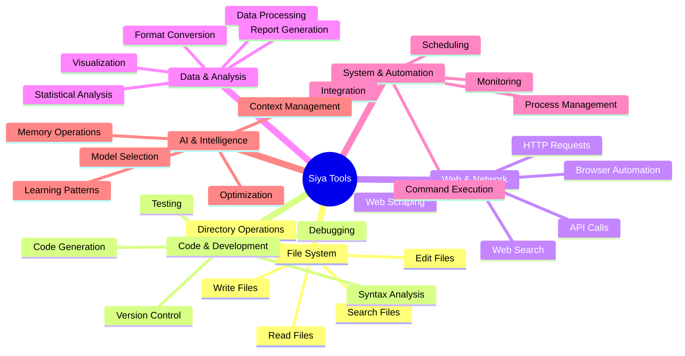

<Card title="Siya's Powerful Toolkit" icon="tools" color="#0000FF">
  Siya comes equipped with a comprehensive set of tools that enable it to interact with files, systems, web services, and more. These tools are what allow Siya's agents to turn ideas into reality.
</Card>

## Tool Categories Overview

<Frame caption="Siya's tools are organized into logical categories for different types of operations">

</Frame>

## File System Tools

<Tabs>
  <Tab title="Read Operations">
    <Card title="File Reading" icon="eye" color="#07C983">
      Powerful file reading capabilities with intelligent format detection
    </Card>
    
    <AccordionGroup>
      <Accordion title="Read Tool" icon="file-alt" defaultOpen>
        <Steps>
          <Step title="Basic Reading">
            Read any text-based file with automatic encoding detection
          </Step>
          <Step title="Large File Handling">
            Smart pagination for files with thousands of lines
          </Step>
          <Step title="Binary Detection">
            Identifies and handles binary files appropriately
          </Step>
          <Step title="Special Formats">
            - **Images**: Extracts metadata and can describe content
            - **Audio**: Transcribes to text using speech recognition
            - **Jupyter**: Reads notebooks as structured JSON
          </Step>
        </Steps>
        
        <CodeGroup>
          ```text Simple Read
          "Read the config.json file"
          ```
          
          ```text With Line Range
          "Read lines 100-200 of app.log"
          ```
          
          ```text Multiple Files
          "Read all Python files in the src directory"
          ```
        </CodeGroup>
      </Accordion>
      
      <Accordion title="Search Tools" icon="search">
        <Columns cols={2}>
          <Card title="Glob" icon="asterisk">
            **Pattern Matching**
            - Find files by name patterns
            - Recursive directory search
            - Multiple pattern support
            - Exclude patterns
          </Card>
          
          <Card title="Grep" icon="filter">
            **Content Search**
            - Regex pattern matching
            - Case sensitivity options
            - Context lines
            - File type filtering
          </Card>
        </Columns>
        
        <Info>
          For complex searches, Siya automatically uses ripgrep (rg) for superior performance
        </Info>
      </Accordion>
      
      <Accordion title="Directory Operations" icon="folder">
        <Table>
          <tr>
            <th>Operation</th>
            <th>Description</th>
            <th>Example</th>
          </tr>
          <tr>
            <td>List (LS)</td>
            <td>Show directory contents</td>
            <td>"List all files in /src"</td>
          </tr>
          <tr>
            <td>Tree View</td>
            <td>Hierarchical structure</td>
            <td>"Show project structure"</td>
          </tr>
          <tr>
            <td>Find</td>
            <td>Locate files/directories</td>
            <td>"Find all test files"</td>
          </tr>
        </Table>
      </Accordion>
    </AccordionGroup>
  </Tab>
  
  <Tab title="Write Operations">
    <Card title="File Writing" icon="pencil" color="#15803D">
      Safe and intelligent file creation and modification
    </Card>
    
    <AccordionGroup>
      <Accordion title="Write Tool" icon="file-plus" defaultOpen>
        <Warning>
          The Write tool always reads existing files first to prevent accidental overwrites
        </Warning>
        
        **Capabilities:**
        - Create new files with any extension
        - Overwrite existing files (with confirmation)
        - Automatic directory creation
        - Encoding specification
        - Permission handling
        
        <Steps>
          <Step title="Safety First">
            Always checks if file exists before writing
          </Step>
          <Step title="Smart Creation">
            Creates parent directories if needed
          </Step>
          <Step title="Format Preservation">
            Maintains proper line endings and encoding
          </Step>
        </Steps>
      </Accordion>
      
      <Accordion title="Edit Tool" icon="edit">
        <Card title="Precise Editing" icon="crosshairs">
          Makes exact string replacements while preserving file structure
        </Card>
        
        **Features:**
        - Exact string matching
        - Indentation preservation
        - Multi-line support
        - Batch replacements
        - Undo capability
        
        <Tip>
          For multiple edits to the same file, use MultiEdit for better performance
        </Tip>
      </Accordion>
      
      <Accordion title="MultiEdit Tool" icon="layer-group">
        ```mermaid
        flowchart LR
            File[Original File] --> Edit1[Edit 1]
            Edit1 --> Edit2[Edit 2]
            Edit2 --> Edit3[Edit 3]
            Edit3 --> Result[Updated File]
            
            style File fill:#f9f,stroke:#333
            style Result fill:#9f9,stroke:#333
        ```
        
        **Advantages:**
        - Atomic operations (all or nothing)
        - Sequential edit application
        - Better performance
        - Reduced error potential
        - Single file read/write
      </Accordion>
    </AccordionGroup>
  </Tab>
  
  <Tab title="Advanced Operations">
    <AccordionGroup>
      <Accordion title="File Manipulation" icon="copy">
        <Columns cols={3}>
          <Card title="Copy" icon="clone">
            - Single files
            - Directories
            - Pattern matching
            - Preserve attributes
          </Card>
          
          <Card title="Move" icon="arrows-alt">
            - Rename files
            - Relocate directories
            - Batch operations
            - Cross-filesystem
          </Card>
          
          <Card title="Delete" icon="trash">
            - Safe deletion
            - Recursive removal
            - Pattern matching
            - Trash support
          </Card>
        </Columns>
      </Accordion>
      
      <Accordion title="Permissions & Metadata" icon="shield">
        <Steps>
          <Step title="Permission Management">
            Change file permissions, ownership, and access controls
          </Step>
          <Step title="Metadata Extraction">
            Read creation dates, modification times, file sizes
          </Step>
          <Step title="Attribute Modification">
            Set executable flags, hidden attributes, system properties
          </Step>
        </Steps>
      </Accordion>
    </AccordionGroup>
  </Tab>
</Tabs>

## Code & Development Tools

<Card title="Professional Development Environment" icon="code" color="#0000FF">
  Comprehensive tools for software development, from code generation to deployment
</Card>

<Tabs>
  <Tab title="Code Generation">
    <AccordionGroup>
      <Accordion title="Language Support" icon="language" defaultOpen>
        <Columns cols={3}>
          <div>
            **Web Technologies**
            - HTML/CSS/JavaScript
            - TypeScript
            - React/Vue/Angular
            - Node.js
            - Next.js/Nuxt
          </div>
          <div>
            **Backend Languages**
            - Python
            - Java/Kotlin
            - C#/.NET
            - Go
            - Rust
            - Ruby
          </div>
          <div>
            **Specialized**
            - SQL/NoSQL queries
            - GraphQL schemas
            - Protocol Buffers
            - Configuration files
            - Shell scripts
          </div>
        </Columns>
      </Accordion>
      
      <Accordion title="Generation Capabilities" icon="magic">
        <Steps>
          <Step title="Boilerplate Creation">
            Generate project structures, starter templates, and scaffolding
          </Step>
          <Step title="Function Implementation">
            Create complete functions with error handling and documentation
          </Step>
          <Step title="Class Design">
            Design and implement classes with proper patterns and principles
          </Step>
          <Step title="API Development">
            Build REST/GraphQL APIs with authentication and validation
          </Step>
          <Step title="Test Generation">
            Create comprehensive test suites with mocks and fixtures
          </Step>
        </Steps>
      </Accordion>
      
      <Accordion title="Code Quality" icon="medal">
        <Columns cols={2}>
          <Card title="Best Practices" icon="star">
            - SOLID principles
            - Design patterns
            - Clean code
            - DRY/KISS
            - Documentation
          </Card>
          
          <Card title="Optimization" icon="gauge">
            - Performance tuning
            - Memory efficiency
            - Algorithm selection
            - Caching strategies
            - Async patterns
          </Card>
        </Columns>
      </Accordion>
    </AccordionGroup>
  </Tab>
  
  <Tab title="Testing & Debugging">
    <AccordionGroup>
      <Accordion title="Testing Tools" icon="flask" defaultOpen>
        <Frame caption="Comprehensive testing across all levels of the application stack">
          ```mermaid
          graph TD
              Tests[Test Suite] --> Unit[Unit Tests]
              Tests --> Integration[Integration Tests]
              Tests --> E2E[End-to-End Tests]
              Tests --> Performance[Performance Tests]
              
              Unit --> Coverage[Code Coverage]
              Integration --> API[API Testing]
              E2E --> UI[UI Testing]
              Performance --> Load[Load Testing]
              
              style Tests fill:#0000FF,stroke:#fff,color:#fff
              style Coverage fill:#4CAF50,stroke:#333
              style API fill:#FF9800,stroke:#333
              style UI fill:#9C27B0,stroke:#333
              style Load fill:#F44336,stroke:#333
          ```
        </Frame>
        
        **Test Frameworks:**
        - **JavaScript**: Jest, Mocha, Cypress, Playwright
        - **Python**: pytest, unittest, nose2
        - **Java**: JUnit, TestNG, Mockito
        - **Go**: testing package, testify
        - **Ruby**: RSpec, Minitest
      </Accordion>
      
      <Accordion title="Debugging Capabilities" icon="bug">
        <Steps>
          <Step title="Error Analysis">
            Parse error messages and stack traces to identify root causes
          </Step>
          <Step title="Code Inspection">
            Analyze code flow and variable states
          </Step>
          <Step title="Fix Suggestions">
            Provide multiple solution approaches with trade-offs
          </Step>
          <Step title="Prevention Strategies">
            Recommend defensive coding practices
          </Step>
        </Steps>
        
        <Note>
          Siya can simulate debugging sessions, walking through code execution step by step
        </Note>
      </Accordion>
      
      <Accordion title="Performance Analysis" icon="chart-line">
        <Columns cols={2}>
          <div>
            **Profiling**
            - Time complexity analysis
            - Memory usage patterns
            - CPU utilization
            - I/O bottlenecks
            - Database query optimization
          </div>
          <div>
            **Optimization**
            - Algorithm improvements
            - Caching implementation
            - Parallel processing
            - Lazy loading
            - Resource pooling
          </div>
        </Columns>
      </Accordion>
    </AccordionGroup>
  </Tab>
  
  <Tab title="Version Control">
    <AccordionGroup>
      <Accordion title="Git Operations" icon="code-branch" defaultOpen>
        <Card title="Full Git Integration" icon="git" color="#F05032">
          Complete version control capabilities without leaving Siya
        </Card>
        
        <Columns cols={2}>
          <div>
            **Basic Operations**
            - Status checking
            - Add/stage files
            - Commit with messages
            - Push/pull changes
            - Branch management
          </div>
          <div>
            **Advanced Features**
            - Interactive rebase
            - Cherry-picking
            - Stash management
            - Submodule handling
            - Hook configuration
          </div>
        </Columns>
        
        <Warning>
          Siya always shows diffs before committing and includes co-author attribution
        </Warning>
      </Accordion>
      
      <Accordion title="GitHub Integration" icon="github">
        <Steps>
          <Step title="Repository Management">
            Create, clone, and configure repositories
          </Step>
          <Step title="Pull Requests">
            Create PRs with detailed descriptions and test plans
          </Step>
          <Step title="Issue Tracking">
            Create and update issues, link to PRs
          </Step>
          <Step title="Actions/Workflows">
            Set up CI/CD pipelines and automation
          </Step>
        </Steps>
        
        <Tip>
          Use `gh` CLI commands for advanced GitHub operations
        </Tip>
      </Accordion>
    </AccordionGroup>
  </Tab>
</Tabs>

## Web & Network Tools

<Card title="Internet-Connected Intelligence" icon="globe" color="#FF9800">
  Access the web, interact with APIs, and automate online tasks
</Card>

<Tabs>
  <Tab title="Web Search">
    <AccordionGroup>
      <Accordion title="Search Capabilities" icon="search" defaultOpen>
        <Columns cols={2}>
          <Card title="General Search" icon="globe">
            - Multi-engine search
            - Result ranking
            - Source verification
            - Date filtering
            - Language support
          </Card>
          
          <Card title="Specialized Search" icon="filter">
            - Academic papers
            - Code repositories
            - Documentation
            - News articles
            - Social media
          </Card>
        </Columns>
        
        <Info>
          Search results are automatically verified and cross-referenced for accuracy
        </Info>
      </Accordion>
      
      <Accordion title="Research Features" icon="microscope">
        ```mermaid
        flowchart LR
            Query[Search Query] --> Engine{Search Engine}
            Engine --> Results[Raw Results]
            Results --> Filter[Filtering]
            Filter --> Verify[Verification]
            Verify --> Rank[Ranking]
            Rank --> Summary[Summarization]
            Summary --> Output[Final Report]
            
            style Query fill:#FF9800,stroke:#333
            style Output fill:#4CAF50,stroke:#333
        ```
        
        **Advanced Features:**
        - Citation tracking
        - Fact verification
        - Trend analysis
        - Competitive intelligence
        - Market research
      </Accordion>
    </AccordionGroup>
  </Tab>
  
  <Tab title="API Integration">
    <AccordionGroup>
      <Accordion title="HTTP Operations" icon="exchange-alt" defaultOpen>
        <CodeGroup>
          ```http GET Request
          GET /api/users
          Headers: Authorization: Bearer token
          ```
          
          ```http POST Request
          POST /api/users
          Content-Type: application/json
          Body: {"name": "John", "email": "john@example.com"}
          ```
          
          ```http Complex Request
          PUT /api/users/123
          Headers: Multiple custom headers
          Body: Multipart form data
          ```
        </CodeGroup>
        
        **Supported Features:**
        - All HTTP methods
        - Header management
        - Authentication (OAuth, JWT, API keys)
        - Request/response transformation
        - Error handling and retries
      </Accordion>
      
      <Accordion title="API Testing" icon="vial">
        <Steps>
          <Step title="Endpoint Testing">
            Test individual endpoints with various parameters
          </Step>
          <Step title="Flow Testing">
            Test complete API workflows and sequences
          </Step>
          <Step title="Load Testing">
            Simulate multiple concurrent requests
          </Step>
          <Step title="Documentation">
            Generate API documentation from tests
          </Step>
        </Steps>
      </Accordion>
      
      <Accordion title="Webhook Handling" icon="link">
        <Columns cols={2}>
          <Card title="Incoming" icon="download">
            - Webhook reception
            - Payload validation
            - Event processing
            - Response generation
          </Card>
          
          <Card title="Outgoing" icon="upload">
            - Event triggers
            - Payload construction
            - Retry logic
            - Delivery tracking
          </Card>
        </Columns>
      </Accordion>
    </AccordionGroup>
  </Tab>
  
  <Tab title="Browser Automation">
    <AccordionGroup>
      <Accordion title="Visual Automation" icon="window-maximize" defaultOpen>
        <Card title="Human-Like Interaction" icon="hand-pointer" color="#9C27B0">
          Browser automation that sees and interacts with pages like a human would
        </Card>
        
        **Capabilities:**
        - Click buttons and links
        - Fill out forms
        - Navigate menus
        - Handle popups
        - Manage cookies
        - Take screenshots
        - Download files
        
        <Note>
          The Browser Agent uses computer vision for reliable element detection
        </Note>
      </Accordion>
      
      <Accordion title="Advanced Scenarios" icon="tasks">
        <Tabs>
          <Tab title="E-Commerce">
            - Product searches
            - Cart management
            - Checkout processes
            - Order tracking
            - Price monitoring
          </Tab>
          
          <Tab title="Data Extraction">
            - Table scraping
            - Pagination handling
            - Dynamic content
            - Image extraction
            - PDF downloads
          </Tab>
          
          <Tab title="Authentication">
            - Login flows
            - 2FA handling
            - Session management
            - Token refresh
            - SSO integration
          </Tab>
        </Tabs>
      </Accordion>
    </AccordionGroup>
  </Tab>
</Tabs>

## Data & Analysis Tools

<Card title="Transform Data into Insights" icon="chart-line" color="#4CAF50">
  Powerful data processing, analysis, and visualization capabilities
</Card>

<Tabs>
  <Tab title="Data Processing">
    <AccordionGroup>
      <Accordion title="Format Support" icon="file-code" defaultOpen>
        <Columns cols={3}>
          <Card title="Structured" icon="table">
            - CSV/TSV
            - Excel (XLSX)
            - JSON
            - XML
            - Parquet
          </Card>
          
          <Card title="Databases" icon="database">
            - SQL queries
            - NoSQL operations
            - Data migration
            - Schema design
            - Indexing
          </Card>
          
          <Card title="Unstructured" icon="file-alt">
            - Text extraction
            - PDF parsing
            - Log analysis
            - Email processing
            - Web scraping
          </Card>
        </Columns>
      </Accordion>
      
      <Accordion title="Transformation" icon="exchange-alt">
        <Steps>
          <Step title="Cleaning">
            Remove duplicates, handle missing values, fix inconsistencies
          </Step>
          <Step title="Normalization">
            Standardize formats, scales, and representations
          </Step>
          <Step title="Aggregation">
            Group, summarize, and calculate statistics
          </Step>
          <Step title="Enrichment">
            Add calculated fields, join datasets, geocoding
          </Step>
        </Steps>
        
        ```python
        # Example transformation pipeline
        df = pd.read_csv('data.csv')
        df = df.drop_duplicates()
        df['date'] = pd.to_datetime(df['date'])
        df['revenue_usd'] = df['revenue'] * exchange_rate
        summary = df.groupby('category').agg({
            'revenue_usd': ['sum', 'mean', 'std'],
            'quantity': 'sum'
        })
        ```
      </Accordion>
    </AccordionGroup>
  </Tab>
  
  <Tab title="Analysis">
    <AccordionGroup>
      <Accordion title="Statistical Analysis" icon="calculator" defaultOpen>
        <Columns cols={2}>
          <div>
            **Descriptive Statistics**
            - Mean, median, mode
            - Standard deviation
            - Percentiles
            - Correlation
            - Distribution analysis
          </div>
          <div>
            **Advanced Analytics**
            - Regression analysis
            - Time series
            - Clustering
            - Classification
            - Anomaly detection
          </div>
        </Columns>
        
        <Info>
          Siya automatically selects appropriate statistical methods based on data characteristics
        </Info>
      </Accordion>
      
      <Accordion title="Machine Learning" icon="brain">
        <Frame caption="ML pipeline from data preparation to model deployment">
          ```mermaid
          graph LR
              Data[Raw Data] --> Prep[Preparation]
              Prep --> Split[Train/Test Split]
              Split --> Train[Model Training]
              Train --> Eval[Evaluation]
              Eval --> Deploy[Deployment]
              
              Train --> Tune[Hyperparameter Tuning]
              Tune --> Train
              
              style Data fill:#f9f,stroke:#333
              style Deploy fill:#9f9,stroke:#333
          ```
        </Frame>
        
        **Supported Algorithms:**
        - Linear/Logistic Regression
        - Decision Trees/Random Forests
        - Neural Networks
        - SVM
        - K-Means/DBSCAN
      </Accordion>
    </AccordionGroup>
  </Tab>
  
  <Tab title="Visualization">
    <AccordionGroup>
      <Accordion title="Chart Types" icon="chart-bar" defaultOpen>
        <Columns cols={3}>
          <Card title="Basic Charts" icon="chart-line">
            - Line plots
            - Bar charts
            - Scatter plots
            - Pie charts
            - Area charts
          </Card>
          
          <Card title="Advanced" icon="chart-area">
            - Heatmaps
            - 3D plots
            - Sankey diagrams
            - Network graphs
            - Geospatial maps
          </Card>
          
          <Card title="Interactive" icon="hand-pointer">
            - Dashboards
            - Drill-down charts
            - Real-time updates
            - Filters/controls
            - Animations
          </Card>
        </Columns>
      </Accordion>
      
      <Accordion title="Visualization Libraries" icon="palette">
        **Python:**
        - Matplotlib
        - Seaborn
        - Plotly
        - Bokeh
        - Altair
        
        **JavaScript:**
        - D3.js
        - Chart.js
        - Highcharts
        - ECharts
        - Recharts
        
        <Tip>
          Siya can generate code for any visualization library or create charts directly
        </Tip>
      </Accordion>
    </AccordionGroup>
  </Tab>
</Tabs>

## System & Automation Tools

<Card title="System Control and Workflow Automation" icon="cogs" color="#9C27B0">
  Powerful system interaction and task automation capabilities
</Card>

<Tabs>
  <Tab title="Command Execution">
    <AccordionGroup>
      <Accordion title="Bash Tool" icon="terminal" defaultOpen>
        <Warning>
          Commands are executed in a persistent shell session with safety checks
        </Warning>
        
        **Features:**
        - Persistent shell state
        - Working directory management
        - Environment variables
        - Output capture (up to 30K chars)
        - Timeout protection (up to 10 min)
        - Sandbox mode for read-only ops
        
        <CodeGroup>
          ```bash Build Project
          npm install && npm run build
          ```
          
          ```bash System Info
          df -h && free -m && uptime
          ```
          
          ```bash Git Operations
          git status && git diff --stat
          ```
        </CodeGroup>
      </Accordion>
      
      <Accordion title="Process Management" icon="tasks">
        <Steps>
          <Step title="Process Control">
            Start, stop, and monitor system processes
          </Step>
          <Step title="Resource Monitoring">
            Track CPU, memory, disk, and network usage
          </Step>
          <Step title="Log Management">
            Tail logs, search patterns, rotate files
          </Step>
          <Step title="Service Control">
            Manage system services and daemons
          </Step>
        </Steps>
      </Accordion>
      
      <Accordion title="Sandbox Mode" icon="shield">
        <Info>
          Sandbox mode runs commands without write access for safety
        </Info>
        
        <Table>
          <tr>
            <th>Operation</th>
            <th>Normal Mode</th>
            <th>Sandbox Mode</th>
          </tr>
          <tr>
            <td>Read files</td>
            <td>✅</td>
            <td>✅</td>
          </tr>
          <tr>
            <td>Write files</td>
            <td>✅</td>
            <td>❌</td>
          </tr>
          <tr>
            <td>Network access</td>
            <td>✅</td>
            <td>❌</td>
          </tr>
          <tr>
            <td>User approval</td>
            <td>Required</td>
            <td>Not needed</td>
          </tr>
        </Table>
      </Accordion>
    </AccordionGroup>
  </Tab>
  
  <Tab title="Task Management">
    <AccordionGroup>
      <Accordion title="Todo System" icon="check-square" defaultOpen>
        <Card title="Intelligent Task Tracking" icon="tasks" color="#07C983">
          Built-in task management for complex multi-step operations
        </Card>
        
        **Features:**
        - Automatic task creation
        - Status tracking (pending/in-progress/completed)
        - Priority levels
        - Dependencies
        - Progress visualization
        
        ```mermaid
        stateDiagram-v2
            [*] --> Pending
            Pending --> InProgress: Start
            InProgress --> Completed: Finish
            InProgress --> Pending: Pause
            Completed --> [*]
            
            InProgress --> InProgress: Update
        ```
      </Accordion>
      
      <Accordion title="Workflow Automation" icon="sitemap">
        <Columns cols={2}>
          <Card title="Triggers" icon="bolt">
            - Time-based
            - File changes
            - Git commits
            - API webhooks
            - System events
          </Card>
          
          <Card title="Actions" icon="play">
            - Run scripts
            - Send notifications
            - Update databases
            - Generate reports
            - Deploy code
          </Card>
        </Columns>
      </Accordion>
    </AccordionGroup>
  </Tab>
  
  <Tab title="Scheduling">
    <AccordionGroup>
      <Accordion title="Schedule Patterns" icon="calendar" defaultOpen>
        <CodeGroup>
          ```text Cron-style
          "0 9 * * 1-5" - Weekdays at 9 AM
          "*/30 * * * *" - Every 30 minutes
          "0 0 1 * *" - First day of month
          ```
          
          ```text Natural Language
          "Every Monday at 10 AM"
          "Daily at sunset"
          "Every 2 hours during business hours"
          ```
          
          ```text Relative
          "In 30 minutes"
          "Tomorrow at noon"
          "Next Friday"
          ```
        </CodeGroup>
        
        <Note>
          Schedules persist across Siya sessions and system restarts
        </Note>
      </Accordion>
      
      <Accordion title="Automation Examples" icon="robot">
        <Tabs>
          <Tab title="Development">
            - Nightly builds
            - Test suite runs
            - Dependency updates
            - Code backups
            - Documentation generation
          </Tab>
          
          <Tab title="Data">
            - Report generation
            - Data syncing
            - Backup creation
            - Cache clearing
            - Log rotation
          </Tab>
          
          <Tab title="Monitoring">
            - Health checks
            - Performance metrics
            - Error alerts
            - Usage reports
            - Trend analysis
          </Tab>
        </Tabs>
      </Accordion>
    </AccordionGroup>
  </Tab>
</Tabs>

## AI & Intelligence Tools

<Card title="Meta-Intelligence Capabilities" icon="brain" color="#0000FF">
  Tools for managing AI models, context, and learning patterns
</Card>

<AccordionGroup>
  <Accordion title="Model Management" icon="microchip" defaultOpen>
    <Columns cols={2}>
      <Card title="Model Selection" icon="list">
        - Dynamic model switching
        - Task-based selection
        - Cost optimization
        - Performance tuning
        - Fallback chains
      </Card>
      
      <Card title="Context Control" icon="compress">
        - Token management
        - Context windowing
        - Memory prioritization
        - Relevance filtering
        - Compression strategies
      </Card>
    </Columns>
  </Accordion>
  
  <Accordion title="Memory Operations" icon="memory">
    ```mermaid
    graph TD
        Input[User Input] --> STM[Short-term Memory]
        STM --> Process[Processing]
        Process --> LTM{Long-term Memory?}
        
        LTM -->|Important| Store[Persistent Storage]
        LTM -->|Temporary| Discard[Auto-cleanup]
        
        Store --> Retrieve[Smart Retrieval]
        Retrieve --> Context[Active Context]
        
        style STM fill:#FFE082,stroke:#333
        style Store fill:#81C784,stroke:#333
        style Context fill:#64B5F6,stroke:#333
    ```
    
    **Memory Features:**
    - Auto-compacting
    - Semantic indexing
    - Priority weighting
    - Cross-session persistence
    - Privacy controls
  </Accordion>
  
  <Accordion title="Learning Patterns" icon="graduation-cap">
    <Steps>
      <Step title="Usage Analysis">
        Track common patterns and preferences
      </Step>
      <Step title="Optimization">
        Improve response time and accuracy
      </Step>
      <Step title="Personalization">
        Adapt to individual working styles
      </Step>
      <Step title="Knowledge Building">
        Accumulate domain expertise
      </Step>
    </Steps>
  </Accordion>
</AccordionGroup>

## Tool Integration Patterns

<Card title="Combining Tools for Maximum Impact" icon="link" color="#0000FF">
  The real power comes from combining tools in intelligent ways
</Card>

<Tabs>
  <Tab title="Common Patterns">
    <AccordionGroup>
      <Accordion title="Search → Process → Save" icon="flow-chart">
        ```mermaid
        graph LR
            Glob[Glob: Find files] --> Read[Read: Load content]
            Read --> Process[Process: Transform]
            Process --> Write[Write: Save results]
            
            style Glob fill:#FF9800,stroke:#333
            style Process fill:#0000FF,stroke:#fff,color:#fff
            style Write fill:#4CAF50,stroke:#333
        ```
        
        **Example Use Cases:**
        - Bulk file processing
        - Code refactoring
        - Data migration
        - Report generation
      </Accordion>
      
      <Accordion title="Research → Analyze → Report" icon="microscope">
        <Steps>
          <Step title="Research Phase">
            Search agent gathers information from multiple sources
          </Step>
          <Step title="Analysis Phase">
            Process and synthesize findings
          </Step>
          <Step title="Reporting Phase">
            Generate formatted reports with visualizations
          </Step>
        </Steps>
      </Accordion>
      
      <Accordion title="Monitor → Alert → Act" icon="bell">
        <Columns cols={3}>
          <Card title="Monitor" icon="eye">
            - File changes
            - API endpoints
            - System metrics
            - Error logs
          </Card>
          
          <Card title="Alert" icon="exclamation">
            - Email notifications
            - Slack messages
            - SMS alerts
            - Dashboard updates
          </Card>
          
          <Card title="Act" icon="bolt">
            - Run scripts
            - Restart services
            - Scale resources
            - Create tickets
          </Card>
        </Columns>
      </Accordion>
    </AccordionGroup>
  </Tab>
  
  <Tab title="Advanced Workflows">
    <AccordionGroup>
      <Accordion title="CI/CD Pipeline" icon="infinity">
        <Frame caption="Complete CI/CD workflow using multiple tools">
          ```mermaid
          graph TD
              Git[Git: Detect Push] --> Test[Bash: Run Tests]
              Test --> Build{Build Success?}
              
              Build -->|Yes| Docker[Bash: Build Image]
              Build -->|No| Notify1[Alert: Build Failed]
              
              Docker --> Deploy[Bash: Deploy]
              Deploy --> Check[HTTP: Health Check]
              
              Check -->|Healthy| Notify2[Alert: Success]
              Check -->|Unhealthy| Rollback[Bash: Rollback]
              
              Rollback --> Notify3[Alert: Rolled Back]
              
              style Git fill:#F05032,stroke:#333
              style Deploy fill:#0000FF,stroke:#fff,color:#fff
              style Notify2 fill:#4CAF50,stroke:#333
          ```
        </Frame>
      </Accordion>
      
      <Accordion title="Data Pipeline" icon="database">
        **Automated ETL Process:**
        
        1. **Extract**: Read from multiple sources (APIs, databases, files)
        2. **Transform**: Clean, normalize, and enrich data
        3. **Load**: Write to data warehouse or generate reports
        4. **Monitor**: Track pipeline health and data quality
        5. **Alert**: Notify on failures or anomalies
      </Accordion>
      
      <Accordion title="Content Generation" icon="newspaper">
        <Steps>
          <Step title="Research">
            Search for relevant information and sources
          </Step>
          <Step title="Outline">
            Create structured content plan
          </Step>
          <Step title="Generate">
            Write content with proper formatting
          </Step>
          <Step title="Enhance">
            Add images, diagrams, and references
          </Step>
          <Step title="Publish">
            Deploy to website or documentation system
          </Step>
        </Steps>
      </Accordion>
    </AccordionGroup>
  </Tab>
</Tabs>

## Tool Safety & Best Practices

<Warning>
  With great power comes great responsibility. Follow these guidelines for safe tool usage.
</Warning>

<AccordionGroup>
  <Accordion title="Safety Features" icon="shield" defaultOpen>
    <Columns cols={2}>
      <Card title="Built-in Protections" icon="lock">
        - Read before write
        - Confirmation prompts
        - Sandbox mode
        - Timeout limits
        - Resource caps
      </Card>
      
      <Card title="User Controls" icon="sliders">
        - Approval requirements
        - Permission settings
        - Audit logging
        - Rollback capability
        - Emergency stop
      </Card>
    </Columns>
  </Accordion>
  
  <Accordion title="Best Practices" icon="star">
    <Steps>
      <Step title="Start Small">
        Test operations on sample data before running on production
      </Step>
      <Step title="Use Sandbox Mode">
        Run exploratory commands in sandbox to prevent accidents
      </Step>
      <Step title="Review Changes">
        Always review diffs and changes before confirming
      </Step>
      <Step title="Backup Important Data">
        Create backups before major operations
      </Step>
      <Step title="Monitor Execution">
        Watch progress and be ready to intervene if needed
      </Step>
    </Steps>
  </Accordion>
  
  <Accordion title="Common Pitfalls" icon="exclamation-triangle">
    <Table>
      <tr>
        <th>Pitfall</th>
        <th>Risk</th>
        <th>Prevention</th>
      </tr>
      <tr>
        <td>Overwriting files</td>
        <td>Data loss</td>
        <td>Always read first, use version control</td>
      </tr>
      <tr>
        <td>Infinite loops</td>
        <td>Resource exhaustion</td>
        <td>Set timeouts, monitor execution</td>
      </tr>
      <tr>
        <td>Large operations</td>
        <td>System overload</td>
        <td>Batch processing, progress tracking</td>
      </tr>
      <tr>
        <td>Credential exposure</td>
        <td>Security breach</td>
        <td>Use environment variables, never commit</td>
      </tr>
    </Table>
  </Accordion>
</AccordionGroup>

## Performance Optimization

<Card title="Get the Most from Siya's Tools" icon="gauge" color="#4CAF50">
  Tips and strategies for optimal tool performance
</Card>

<Columns cols={3}>
  <Card title="Batch Operations" icon="layer-group">
    Group similar operations together for better efficiency
  </Card>
  
  <Card title="Parallel Execution" icon="code-branch">
    Run independent operations simultaneously
  </Card>
  
  <Card title="Smart Caching" icon="database">
    Reuse results and avoid redundant operations
  </Card>
</Columns>

<AccordionGroup>
  <Accordion title="Optimization Strategies" icon="rocket">
    <Tabs>
      <Tab title="File Operations">
        - Use glob patterns instead of individual reads
        - Batch edits with MultiEdit tool
        - Stream large files instead of loading entirely
        - Use efficient search tools (ripgrep)
      </Tab>
      
      <Tab title="Network Operations">
        - Batch API requests when possible
        - Implement retry logic with backoff
        - Cache responses appropriately
        - Use connection pooling
      </Tab>
      
      <Tab title="Data Processing">
        - Process in chunks for large datasets
        - Use appropriate data structures
        - Leverage vectorized operations
        - Implement early filtering
      </Tab>
    </Tabs>
  </Accordion>
</AccordionGroup>

## Tool Troubleshooting

<AccordionGroup>
  <Accordion title="Common Issues" icon="wrench">
    <Table>
      <tr>
        <th>Issue</th>
        <th>Symptoms</th>
        <th>Solution</th>
      </tr>
      <tr>
        <td>Tool timeout</td>
        <td>Operation stops after delay</td>
        <td>Increase timeout or break into smaller operations</td>
      </tr>
      <tr>
        <td>Permission denied</td>
        <td>Cannot read/write files</td>
        <td>Check file permissions, run with appropriate access</td>
      </tr>
      <tr>
        <td>Memory issues</td>
        <td>Slow performance or crashes</td>
        <td>Process data in chunks, clear unused memory</td>
      </tr>
      <tr>
        <td>Network failures</td>
        <td>API calls fail</td>
        <td>Check connectivity, implement retries</td>
      </tr>
    </Table>
  </Accordion>
  
  <Accordion title="Getting Help" icon="question-circle">
    <Steps>
      <Step title="Check Documentation">
        Review tool-specific documentation and examples
      </Step>
      <Step title="Ask Siya">
        "Why did this tool fail?" or "How do I use X tool?"
      </Step>
      <Step title="View Logs">
        Check execution logs for detailed error information
      </Step>
      <Step title="Contact Support">
        Reach out to dev@siya.com for persistent issues
      </Step>
    </Steps>
  </Accordion>
</AccordionGroup>

## Summary

<Card title="Master the Tools, Master the Possibilities" icon="graduation-cap" color="#0000FF">
  Siya's comprehensive toolkit enables you to tackle any challenge. From simple file operations to complex multi-step workflows, these tools work together seamlessly to transform your ideas into reality. Start with basic operations and gradually explore advanced combinations to unlock unprecedented productivity.
</Card>

<Columns cols={2}>
  <Card title="Next: Planning System" icon="sitemap" href="/siya-superagent/planning-system">
    Learn how Siya plans and executes complex tasks
  </Card>
  
  <Card title="Try the Tools" icon="play" href="/siya-superagent/desktop-application">
    Open Siya and experiment with different tools
  </Card>
</Columns>

---

*Powerful tools. Seamless integration. Unlimited potential.*